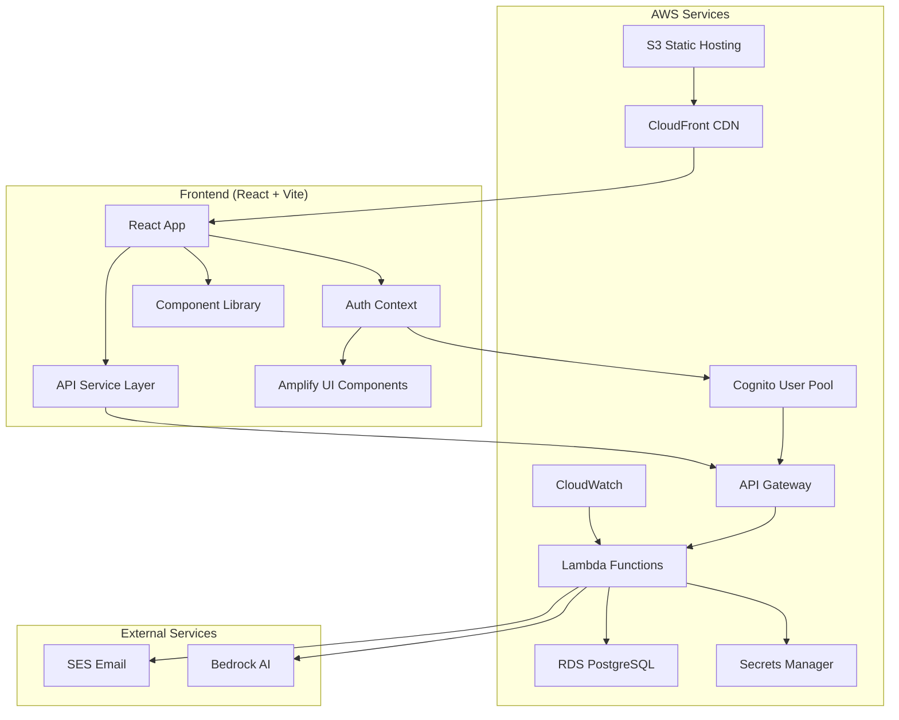
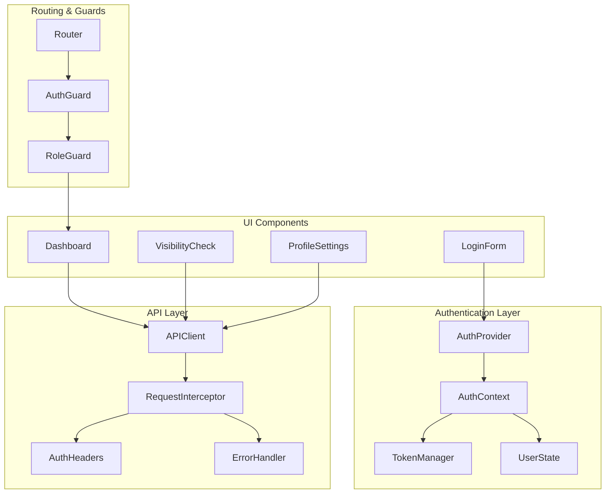

# AWS Frontend Integration - Design Document

## Overview

This design document outlines the technical architecture for integrating the matbakh.app React frontend with AWS services, specifically focusing on the migration from Supabase to AWS Cognito, API Gateway, and RDS. The design ensures seamless user experience while leveraging AWS's scalability and security features.

## Architecture

### High-Level System Architecture



### Component Architecture



## Components and Interfaces

### 1. Authentication Context

```typescript
interface AuthContextType {
  // User state
  user: CognitoUser | null;
  isAuthenticated: boolean;
  isLoading: boolean;
  
  // Authentication methods
  signIn: (email: string, password: string) => Promise<CognitoUser>;
  signUp: (userData: SignUpData) => Promise<void>;
  signOut: () => Promise<void>;
  confirmSignUp: (email: string, code: string) => Promise<void>;
  
  // Token management
  getCurrentSession: () => Promise<CognitoUserSession>;
  refreshTokens: () => Promise<void>;
  
  // Profile management
  updateUserAttributes: (attributes: UserAttributes) => Promise<void>;
  getUserAttributes: () => Promise<UserAttributes>;
}

interface SignUpData {
  email: string;
  password: string;
  given_name?: string;
  family_name?: string;
  locale?: 'de' | 'en';
  user_role?: 'owner' | 'admin' | 'user';
}

interface UserAttributes {
  email: string;
  given_name?: string;
  family_name?: string;
  'custom:user_role'?: string;
  'custom:locale'?: string;
  'custom:profile_complete'?: string;
  'custom:business_id'?: string;
}
```

### 2. API Client Interface

```typescript
interface APIClient {
  // HTTP methods
  get<T>(endpoint: string, config?: RequestConfig): Promise<APIResponse<T>>;
  post<T>(endpoint: string, data?: any, config?: RequestConfig): Promise<APIResponse<T>>;
  put<T>(endpoint: string, data?: any, config?: RequestConfig): Promise<APIResponse<T>>;
  delete<T>(endpoint: string, config?: RequestConfig): Promise<APIResponse<T>>;
  
  // Authentication
  setAuthToken: (token: string) => void;
  clearAuthToken: () => void;
  
  // Error handling
  onError: (handler: ErrorHandler) => void;
  onRetry: (handler: RetryHandler) => void;
}

interface APIResponse<T> {
  data: T;
  success: boolean;
  message?: string;
  errors?: string[];
  meta?: {
    pagination?: PaginationMeta;
    timestamp: string;
  };
}

interface RequestConfig {
  headers?: Record<string, string>;
  timeout?: number;
  retries?: number;
  cache?: boolean;
}
```

### 3. User Profile Interface

```typescript
interface UserProfile {
  id: string;
  email: string;
  displayName: string;
  firstName?: string;
  lastName?: string;
  role: 'owner' | 'admin' | 'user';
  locale: 'de' | 'en';
  profileComplete: boolean;
  onboardingStep: number;
  businessId?: string;
  
  // Timestamps
  createdAt: string;
  updatedAt: string;
  lastLoginAt?: string;
  
  // Preferences
  preferences: {
    notifications: NotificationPreferences;
    dashboard: DashboardPreferences;
    privacy: PrivacyPreferences;
  };
}

interface NotificationPreferences {
  email: boolean;
  sms: boolean;
  push: boolean;
  marketing: boolean;
}
```

## Data Models

### 1. Authentication State

```typescript
interface AuthState {
  // User information
  user: CognitoUser | null;
  profile: UserProfile | null;
  
  // Authentication status
  isAuthenticated: boolean;
  isLoading: boolean;
  isRefreshing: boolean;
  
  // Tokens (stored in memory only)
  tokens: {
    idToken: string | null;
    accessToken: string | null;
    refreshToken: string | null; // Only in secure cookie
  };
  
  // Session information
  session: {
    expiresAt: number | null;
    refreshScheduled: boolean;
    lastActivity: number;
  };
  
  // Error state
  error: AuthError | null;
}

interface AuthError {
  code: string;
  message: string;
  details?: any;
  retryable: boolean;
}
```

### 2. API State Management

```typescript
interface APIState {
  // Request tracking
  loading: Record<string, boolean>;
  errors: Record<string, APIError>;
  cache: Record<string, CacheEntry>;
  
  // Configuration
  baseURL: string;
  timeout: number;
  retryAttempts: number;
  
  // Authentication
  authToken: string | null;
  authExpiry: number | null;
}

interface CacheEntry {
  data: any;
  timestamp: number;
  ttl: number;
  etag?: string;
}
```

## Error Handling

### 1. Authentication Errors

```typescript
enum AuthErrorCode {
  USER_NOT_CONFIRMED = 'UserNotConfirmedException',
  INVALID_CREDENTIALS = 'NotAuthorizedException',
  USER_NOT_FOUND = 'UserNotFoundException',
  TOO_MANY_REQUESTS = 'TooManyRequestsException',
  NETWORK_ERROR = 'NetworkError',
  TOKEN_EXPIRED = 'TokenExpiredError',
  REFRESH_FAILED = 'RefreshTokenError'
}

class AuthErrorHandler {
  handle(error: AuthError): AuthErrorAction {
    switch (error.code) {
      case AuthErrorCode.USER_NOT_CONFIRMED:
        return { type: 'REDIRECT_TO_VERIFICATION', email: error.details.email };
      
      case AuthErrorCode.INVALID_CREDENTIALS:
        return { type: 'SHOW_ERROR', message: 'Invalid email or password' };
      
      case AuthErrorCode.TOKEN_EXPIRED:
        return { type: 'REFRESH_TOKEN' };
      
      case AuthErrorCode.NETWORK_ERROR:
        return { type: 'RETRY_WITH_BACKOFF', delay: 1000 };
      
      default:
        return { type: 'SHOW_GENERIC_ERROR' };
    }
  }
}
```

### 2. API Error Handling

```typescript
interface APIErrorHandler {
  // HTTP status code handlers
  handle401: (error: APIError) => void; // Unauthorized - refresh token
  handle403: (error: APIError) => void; // Forbidden - show access denied
  handle404: (error: APIError) => void; // Not found - show not found
  handle429: (error: APIError) => void; // Rate limit - retry with backoff
  handle500: (error: APIError) => void; // Server error - show error message
  
  // Network error handlers
  handleTimeout: (error: APIError) => void;
  handleNetworkError: (error: APIError) => void;
  
  // Retry logic
  shouldRetry: (error: APIError, attempt: number) => boolean;
  getRetryDelay: (attempt: number) => number;
}
```

## Testing Strategy

### 1. Unit Tests

```typescript
// Authentication service tests
describe('AuthService', () => {
  describe('signIn', () => {
    it('should authenticate user with valid credentials', async () => {
      const mockUser = createMockCognitoUser();
      mockAuth.signIn.mockResolvedValue(mockUser);
      
      const result = await authService.signIn('test@example.com', 'password');
      
      expect(result).toEqual(mockUser);
      expect(mockAuth.signIn).toHaveBeenCalledWith('test@example.com', 'password');
    });
    
    it('should handle invalid credentials error', async () => {
      mockAuth.signIn.mockRejectedValue(new Error('NotAuthorizedException'));
      
      await expect(authService.signIn('test@example.com', 'wrong')).rejects.toThrow();
    });
  });
  
  describe('token refresh', () => {
    it('should refresh tokens automatically before expiry', async () => {
      const mockSession = createMockSession({ expiresIn: 300 }); // 5 minutes
      mockAuth.currentSession.mockResolvedValue(mockSession);
      
      await authService.initializeAuth();
      
      // Fast-forward time to trigger refresh
      jest.advanceTimersByTime(4 * 60 * 1000); // 4 minutes
      
      expect(mockAuth.currentSession).toHaveBeenCalledTimes(2);
    });
  });
});
```

### 2. Integration Tests

```typescript
// API integration tests
describe('API Integration', () => {
  it('should include auth headers in API requests', async () => {
    const mockToken = 'mock-access-token';
    mockAuth.currentSession.mockResolvedValue(createMockSession({ accessToken: mockToken }));
    
    await apiClient.get('/dashboard/data');
    
    expect(fetchMock).toHaveBeenCalledWith(
      expect.any(String),
      expect.objectContaining({
        headers: expect.objectContaining({
          'Authorization': `Bearer ${mockToken}`
        })
      })
    );
  });
  
  it('should refresh token on 401 response', async () => {
    fetchMock.mockResolvedValueOnce(createMockResponse(401));
    fetchMock.mockResolvedValueOnce(createMockResponse(200, { data: 'success' }));
    
    const result = await apiClient.get('/protected-endpoint');
    
    expect(mockAuth.currentSession).toHaveBeenCalledTimes(2); // Initial + refresh
    expect(result.data).toBe('success');
  });
});
```

### 3. E2E Tests

```typescript
// Cypress E2E tests
describe('Authentication Flow', () => {
  it('should complete full registration flow', () => {
    cy.visit('/register');
    
    // Fill registration form
    cy.get('[data-testid=email-input]').type('test@example.com');
    cy.get('[data-testid=password-input]').type('SecurePassword123!');
    cy.get('[data-testid=first-name-input]').type('John');
    cy.get('[data-testid=last-name-input]').type('Doe');
    
    // Submit form
    cy.get('[data-testid=register-button]').click();
    
    // Verify email confirmation page
    cy.url().should('include', '/verify-email');
    cy.contains('Please check your email').should('be.visible');
    
    // Mock email verification (in real test, would use test email service)
    cy.get('[data-testid=verification-code-input]').type('123456');
    cy.get('[data-testid=verify-button]').click();
    
    // Should redirect to dashboard
    cy.url().should('include', '/dashboard');
    cy.contains('Welcome, John').should('be.visible');
  });
  
  it('should handle login with MFA', () => {
    cy.visit('/login');
    
    cy.get('[data-testid=email-input]').type('mfa-user@example.com');
    cy.get('[data-testid=password-input]').type('password');
    cy.get('[data-testid=login-button]').click();
    
    // Should show MFA challenge
    cy.contains('Enter verification code').should('be.visible');
    cy.get('[data-testid=mfa-code-input]').type('123456');
    cy.get('[data-testid=verify-mfa-button]').click();
    
    // Should complete login
    cy.url().should('include', '/dashboard');
  });
});
```

## Performance Considerations

### 1. Token Management Optimization

```typescript
class OptimizedTokenManager {
  private tokenRefreshPromise: Promise<void> | null = null;
  
  async getValidToken(): Promise<string> {
    const session = await this.getCurrentSession();
    
    // Check if token expires within 5 minutes
    if (this.isTokenExpiringSoon(session)) {
      // Prevent multiple simultaneous refresh attempts
      if (!this.tokenRefreshPromise) {
        this.tokenRefreshPromise = this.refreshTokens();
      }
      await this.tokenRefreshPromise;
      this.tokenRefreshPromise = null;
    }
    
    return session.getAccessToken().getJwtToken();
  }
  
  private isTokenExpiringSoon(session: CognitoUserSession): boolean {
    const expiryTime = session.getAccessToken().getExpiration() * 1000;
    const currentTime = Date.now();
    const fiveMinutes = 5 * 60 * 1000;
    
    return (expiryTime - currentTime) < fiveMinutes;
  }
}
```

### 2. API Request Optimization

```typescript
class OptimizedAPIClient {
  private requestCache = new Map<string, Promise<any>>();
  
  async get<T>(endpoint: string, config?: RequestConfig): Promise<APIResponse<T>> {
    const cacheKey = `GET:${endpoint}:${JSON.stringify(config)}`;
    
    // Return cached promise if request is in flight
    if (this.requestCache.has(cacheKey)) {
      return this.requestCache.get(cacheKey);
    }
    
    // Create new request promise
    const requestPromise = this.executeRequest<T>('GET', endpoint, null, config);
    
    // Cache the promise
    this.requestCache.set(cacheKey, requestPromise);
    
    // Clean up cache after request completes
    requestPromise.finally(() => {
      this.requestCache.delete(cacheKey);
    });
    
    return requestPromise;
  }
}
```

### 3. Component Optimization

```typescript
// Memoized authentication context
const AuthProvider: React.FC<{ children: React.ReactNode }> = ({ children }) => {
  const [authState, setAuthState] = useState<AuthState>(initialAuthState);
  
  // Memoize context value to prevent unnecessary re-renders
  const contextValue = useMemo(() => ({
    ...authState,
    signIn: useCallback(async (email: string, password: string) => {
      // Implementation
    }, []),
    signOut: useCallback(async () => {
      // Implementation
    }, []),
    // ... other methods
  }), [authState]);
  
  return (
    <AuthContext.Provider value={contextValue}>
      {children}
    </AuthContext.Provider>
  );
};

// Optimized component with proper memoization
const Dashboard = React.memo(() => {
  const { user, isAuthenticated } = useAuth();
  const [dashboardData, setDashboardData] = useState(null);
  
  // Memoize expensive calculations
  const userDisplayName = useMemo(() => {
    return user?.given_name ? `${user.given_name} ${user.family_name || ''}`.trim() : user?.email;
  }, [user?.given_name, user?.family_name, user?.email]);
  
  // Optimize API calls with proper dependencies
  useEffect(() => {
    if (isAuthenticated && user) {
      loadDashboardData();
    }
  }, [isAuthenticated, user?.sub]); // Only re-run if auth status or user ID changes
  
  return (
    <div>
      <h1>Welcome, {userDisplayName}</h1>
      {/* Dashboard content */}
    </div>
  );
});
```

---

This design provides a comprehensive foundation for the AWS frontend integration, ensuring security, performance, and maintainability while supporting the migration from Supabase to AWS services.