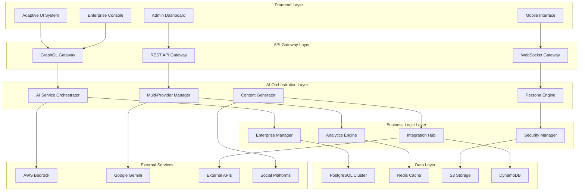

# Matbakh Future Enhancements - Design Document

## Overview

This design document outlines the architecture and implementation approach for the consolidated future enhancements of matbakh.app. The design builds upon the existing Bedrock AI Core foundation and extends it to support advanced AI orchestration, enterprise features, and operational excellence.

## Architecture

### High-Level System Architecture



### AI Service Orchestration Architecture

The AI Service Orchestrator serves as the central hub for all AI operations, managing multiple providers and ensuring optimal service delivery.

```typescript
interface AIServiceOrchestrator {
  // Provider management
  registerProvider(provider: AIProvider): void;
  selectOptimalProvider(request: AIRequest): Promise<AIProvider>;
  
  // Request routing and fallback
  routeRequest(request: AIRequest): Promise<AIResponse>;
  handleProviderFailure(provider: AIProvider, error: Error): Promise<void>;
  
  // Cost and performance optimization
  optimizeCosts(usage: UsageMetrics): Promise<OptimizationPlan>;
  monitorPerformance(metrics: PerformanceMetrics): void;
}

interface AIProvider {
  id: string;
  name: string;
  capabilities: AICapability[];
  costModel: CostModel;
  performanceMetrics: PerformanceMetrics;
  
  invoke(request: AIRequest): Promise<AIResponse>;
  healthCheck(): Promise<HealthStatus>;
}
```

## Components and Interfaces

### 1. Multi-Provider AI Management

#### Provider Abstraction Layer
```typescript
abstract class BaseAIProvider implements AIProvider {
  abstract invoke(request: AIRequest): Promise<AIResponse>;
  abstract healthCheck(): Promise<HealthStatus>;
  
  protected validateRequest(request: AIRequest): ValidationResult {
    // Common validation logic
  }
  
  protected transformResponse(response: any): AIResponse {
    // Common response transformation
  }
}

class ClaudeProvider extends BaseAIProvider {
  async invoke(request: AIRequest): Promise<AIResponse> {
    // Claude-specific implementation
  }
}

class GeminiProvider extends BaseAIProvider {
  async invoke(request: AIRequest): Promise<AIResponse> {
    // Gemini-specific implementation
  }
}
```

#### Intelligent Provider Selection
```typescript
class ProviderSelector {
  selectProvider(
    request: AIRequest,
    availableProviders: AIProvider[],
    constraints: SelectionConstraints
  ): AIProvider {
    const candidates = this.filterByCapabilities(availableProviders, request);
    const scored = this.scoreProviders(candidates, constraints);
    return this.selectOptimal(scored);
  }
  
  private scoreProviders(
    providers: AIProvider[],
    constraints: SelectionConstraints
  ): ScoredProvider[] {
    return providers.map(provider => ({
      provider,
      score: this.calculateScore(provider, constraints)
    }));
  }
  
  private calculateScore(
    provider: AIProvider,
    constraints: SelectionConstraints
  ): number {
    const costScore = this.calculateCostScore(provider, constraints);
    const performanceScore = this.calculatePerformanceScore(provider);
    const reliabilityScore = this.calculateReliabilityScore(provider);
    
    return (costScore * 0.3) + (performanceScore * 0.4) + (reliabilityScore * 0.3);
  }
}
```

### 2. Advanced Persona System

#### Dynamic Persona Detection
```typescript
class AdvancedPersonaDetector {
  private behaviorAnalyzer: BehaviorAnalyzer;
  private mlModel: PersonaClassificationModel;
  
  async detectPersona(
    userBehavior: UserBehavior,
    historicalData: HistoricalData
  ): Promise<PersonaDetectionResult> {
    const behaviorFeatures = this.behaviorAnalyzer.extractFeatures(userBehavior);
    const contextFeatures = this.extractContextFeatures(historicalData);
    
    const prediction = await this.mlModel.predict({
      ...behaviorFeatures,
      ...contextFeatures
    });
    
    return {
      primaryPersona: prediction.primaryPersona,
      confidence: prediction.confidence,
      secondaryPersonas: prediction.alternatives,
      reasoning: this.generateReasoning(prediction)
    };
  }
  
  async adaptPersona(
    currentPersona: Persona,
    newBehavior: UserBehavior
  ): Promise<PersonaAdaptationResult> {
    const drift = this.calculatePersonaDrift(currentPersona, newBehavior);
    
    if (drift.magnitude > this.adaptationThreshold) {
      return {
        shouldAdapt: true,
        newPersona: drift.suggestedPersona,
        adaptationStrategy: this.selectAdaptationStrategy(drift)
      };
    }
    
    return { shouldAdapt: false };
  }
}
```

#### Persona-Adaptive Content Generation
```typescript
class PersonaAdaptiveContentGenerator {
  async generateContent(
    request: ContentRequest,
    persona: Persona
  ): Promise<AdaptiveContent> {
    const template = this.selectTemplate(request.type, persona);
    const adaptedPrompt = this.adaptPromptForPersona(template, persona);
    
    const content = await this.aiOrchestrator.generate({
      prompt: adaptedPrompt,
      constraints: this.getPersonaConstraints(persona),
      optimization: this.getOptimizationStrategy(persona)
    });
    
    return this.postProcessContent(content, persona);
  }
  
  private getPersonaConstraints(persona: Persona): ContentConstraints {
    switch (persona.type) {
      case 'Solo-Sarah':
        return {
          maxLength: 300,
          complexity: 'simple',
          tone: 'encouraging',
          includeActionItems: true
        };
      case 'Bewahrer-Ben':
        return {
          maxLength: 500,
          complexity: 'moderate',
          tone: 'reassuring',
          includeEvidence: true
        };
      case 'Wachstums-Walter':
        return {
          maxLength: 800,
          complexity: 'advanced',
          tone: 'strategic',
          includeMetrics: true
        };
      case 'Ketten-Katrin':
        return {
          maxLength: 1000,
          complexity: 'expert',
          tone: 'analytical',
          includeComparisons: true
        };
    }
  }
}
```

### 3. Enterprise Multi-Location Management

#### Location Hierarchy Management
```typescript
interface LocationHierarchy {
  id: string;
  name: string;
  type: 'brand' | 'region' | 'location';
  parent?: string;
  children: string[];
  settings: LocationSettings;
  permissions: LocationPermissions;
}

class EnterpriseLocationManager {
  async createLocationHierarchy(
    structure: LocationStructure
  ): Promise<LocationHierarchy> {
    const hierarchy = this.buildHierarchy(structure);
    await this.validateHierarchy(hierarchy);
    return this.persistHierarchy(hierarchy);
  }
  
  async aggregateAnalytics(
    locationIds: string[],
    timeRange: TimeRange,
    metrics: MetricType[]
  ): Promise<AggregatedAnalytics> {
    const locationData = await Promise.all(
      locationIds.map(id => this.getLocationAnalytics(id, timeRange, metrics))
    );
    
    return this.aggregateData(locationData, {
      groupBy: ['region', 'category'],
      calculations: ['sum', 'average', 'trend'],
      comparisons: ['peer_group', 'industry_benchmark']
    });
  }
  
  async generateConsolidatedReport(
    hierarchy: LocationHierarchy,
    reportType: ReportType
  ): Promise<ConsolidatedReport> {
    const template = this.getReportTemplate(reportType);
    const data = await this.collectHierarchyData(hierarchy);
    
    return this.generateReport({
      template,
      data,
      visualizations: this.selectVisualizations(reportType),
      exportFormats: ['pdf', 'excel', 'powerpoint']
    });
  }
}
```

### 4. Advanced Security Framework

#### Template Provenance System
```typescript
class TemplateProvenanceManager {
  private kmsClient: KMSClient;
  private signingKeyId: string;
  
  async signTemplate(template: PromptTemplate): Promise<SignedTemplate> {
    const templateHash = this.calculateHash(template);
    const signature = await this.kmsClient.sign({
      KeyId: this.signingKeyId,
      Message: Buffer.from(templateHash),
      MessageType: 'DIGEST',
      SigningAlgorithm: 'RSASSA_PKCS1_V1_5_SHA_256'
    });
    
    return {
      ...template,
      hash: templateHash,
      signature: signature.Signature!.toString('base64'),
      signedAt: new Date().toISOString(),
      signingKeyId: this.signingKeyId
    };
  }
  
  async verifyTemplate(signedTemplate: SignedTemplate): Promise<boolean> {
    try {
      const computedHash = this.calculateHash(signedTemplate);
      
      if (computedHash !== signedTemplate.hash) {
        return false;
      }
      
      await this.kmsClient.verify({
        KeyId: signedTemplate.signingKeyId,
        Message: Buffer.from(signedTemplate.hash),
        MessageType: 'DIGEST',
        Signature: Buffer.from(signedTemplate.signature, 'base64'),
        SigningAlgorithm: 'RSASSA_PKCS1_V1_5_SHA_256'
      });
      
      return true;
    } catch (error) {
      console.error('Template verification failed:', error);
      return false;
    }
  }
}
```

#### Advanced Threat Detection
```typescript
class ThreatDetectionEngine {
  private mlModel: ThreatDetectionModel;
  private ruleEngine: SecurityRuleEngine;
  
  async analyzeRequest(request: AIRequest): Promise<ThreatAssessment> {
    const staticAnalysis = await this.performStaticAnalysis(request);
    const behavioralAnalysis = await this.performBehavioralAnalysis(request);
    const mlAnalysis = await this.performMLAnalysis(request);
    
    const combinedScore = this.combineScores([
      staticAnalysis,
      behavioralAnalysis,
      mlAnalysis
    ]);
    
    return {
      threatLevel: this.calculateThreatLevel(combinedScore),
      confidence: combinedScore.confidence,
      detectedThreats: combinedScore.threats,
      recommendedActions: this.getRecommendedActions(combinedScore)
    };
  }
  
  private async performStaticAnalysis(
    request: AIRequest
  ): Promise<AnalysisResult> {
    const patterns = [
      /ignore\s+previous\s+instructions/i,
      /system\s*:\s*you\s+are\s+now/i,
      /\[INST\]|\[\/INST\]/i,
      /jailbreak|prompt\s+injection/i
    ];
    
    const detectedPatterns = patterns.filter(pattern => 
      pattern.test(request.content)
    );
    
    return {
      score: detectedPatterns.length > 0 ? 0.8 : 0.1,
      confidence: 0.9,
      threats: detectedPatterns.map(p => ({
        type: 'prompt_injection',
        pattern: p.source,
        severity: 'high'
      }))
    };
  }
}
```

### 5. Behavioral Economics Implementation

#### Decoy Effect Pricing System
```typescript
class DecoyEffectPricingManager {
  generatePricingTiers(
    basePrice: number,
    features: Feature[],
    targetTier: 'premium' | 'enterprise'
  ): PricingTier[] {
    const basic = this.createBasicTier(basePrice, features);
    const premium = this.createPremiumTier(basePrice * 3, features);
    const decoy = this.createDecoyTier(basePrice * 2.5, features, premium);
    
    return [basic, decoy, premium].sort((a, b) => a.price - b.price);
  }
  
  private createDecoyTier(
    price: number,
    features: Feature[],
    targetTier: PricingTier
  ): PricingTier {
    // Create intentionally less attractive option
    const decoyFeatures = features.slice(0, Math.floor(features.length * 0.7));
    
    return {
      id: 'decoy',
      name: 'Professional',
      price,
      features: decoyFeatures,
      limitations: [
        'No priority support',
        'Limited integrations',
        'Basic analytics only'
      ],
      highlighted: false,
      decoyFor: targetTier.id
    };
  }
  
  async trackConversionMetrics(
    experiment: PricingExperiment
  ): Promise<ConversionMetrics> {
    const metrics = await this.analyticsService.getConversionData({
      experimentId: experiment.id,
      timeRange: experiment.duration,
      segmentation: ['tier_selected', 'user_persona', 'traffic_source']
    });
    
    return {
      overallConversionRate: metrics.conversions / metrics.visitors,
      tierConversionRates: this.calculateTierConversions(metrics),
      decoyEffectiveness: this.measureDecoyEffect(metrics),
      revenueImpact: this.calculateRevenueImpact(metrics)
    };
  }
}
```

### 6. Real-Time Monitoring & Control

#### Advanced Admin Dashboard
```typescript
class AdminDashboardManager {
  private websocketManager: WebSocketManager;
  private metricsCollector: MetricsCollector;
  
  async initializeRealTimeMonitoring(): Promise<void> {
    // Set up real-time metric streams
    this.metricsCollector.onMetric('ai_service_health', (metric) => {
      this.websocketManager.broadcast('admin', {
        type: 'service_health_update',
        data: metric
      });
    });
    
    this.metricsCollector.onMetric('cost_threshold', (metric) => {
      if (metric.value > metric.threshold * 0.8) {
        this.websocketManager.broadcast('admin', {
          type: 'cost_warning',
          data: metric,
          severity: metric.value > metric.threshold ? 'critical' : 'warning'
        });
      }
    });
  }
  
  async executeServiceControl(
    action: ServiceControlAction,
    adminUser: AdminUser
  ): Promise<ServiceControlResult> {
    // Validate admin permissions
    await this.validateAdminAction(action, adminUser);
    
    // Log the action for audit
    await this.auditLogger.logAdminAction({
      userId: adminUser.id,
      action: action.type,
      target: action.target,
      parameters: action.parameters,
      timestamp: new Date().toISOString()
    });
    
    // Execute the action
    const result = await this.executeAction(action);
    
    // Broadcast the change to all admin clients
    this.websocketManager.broadcast('admin', {
      type: 'service_control_update',
      data: {
        action,
        result,
        executedBy: adminUser.id
      }
    });
    
    return result;
  }
}
```

## Data Models

### AI Service Configuration
```typescript
interface AIServiceConfig {
  id: string;
  name: string;
  provider: string;
  enabled: boolean;
  rolloutPercentage: number;
  costLimits: {
    daily: number;
    monthly: number;
    perRequest: number;
  };
  performanceThresholds: {
    maxResponseTime: number;
    minSuccessRate: number;
    maxErrorRate: number;
  };
  fallbackServices: string[];
}
```

### Enterprise Location Structure
```typescript
interface EnterpriseLocation {
  id: string;
  name: string;
  type: LocationType;
  parentId?: string;
  settings: {
    timezone: string;
    currency: string;
    language: string;
    features: FeatureConfig[];
  };
  analytics: {
    trackingEnabled: boolean;
    retentionDays: number;
    exportFormats: string[];
  };
  permissions: {
    admins: string[];
    viewers: string[];
    editors: string[];
  };
}
```

### Advanced Persona Profile
```typescript
interface AdvancedPersonaProfile {
  id: string;
  type: PersonaType;
  confidence: number;
  characteristics: {
    communicationStyle: CommunicationStyle;
    decisionMakingSpeed: DecisionSpeed;
    riskTolerance: RiskLevel;
    informationPreference: InformationStyle;
    motivationalTriggers: string[];
  };
  adaptations: {
    contentComplexity: ComplexityLevel;
    responseLength: ResponseLength;
    visualPreferences: VisualizationType[];
    interactionPatterns: InteractionPattern[];
  };
  history: {
    detectionEvents: PersonaDetectionEvent[];
    adaptationEvents: PersonaAdaptationEvent[];
    performanceMetrics: PersonaPerformanceMetrics;
  };
}
```

## Error Handling

### Comprehensive Error Management
```typescript
class EnhancedErrorHandler {
  async handleAIServiceError(
    error: AIServiceError,
    context: RequestContext
  ): Promise<ErrorHandlingResult> {
    // Classify the error
    const classification = this.classifyError(error);
    
    // Determine recovery strategy
    const strategy = this.selectRecoveryStrategy(classification, context);
    
    // Execute recovery
    const recovery = await this.executeRecovery(strategy, context);
    
    // Log for analysis
    await this.logError({
      error,
      classification,
      strategy,
      recovery,
      context
    });
    
    return recovery;
  }
  
  private selectRecoveryStrategy(
    classification: ErrorClassification,
    context: RequestContext
  ): RecoveryStrategy {
    switch (classification.type) {
      case 'provider_unavailable':
        return {
          type: 'fallback_provider',
          parameters: { excludeProviders: [classification.provider] }
        };
      case 'rate_limit_exceeded':
        return {
          type: 'exponential_backoff',
          parameters: { maxRetries: 3, baseDelay: 1000 }
        };
      case 'cost_limit_exceeded':
        return {
          type: 'cached_response',
          parameters: { maxAge: 3600 }
        };
      default:
        return {
          type: 'graceful_degradation',
          parameters: { fallbackContent: this.getStaticFallback(context) }
        };
    }
  }
}
```

## Testing Strategy

### Comprehensive Testing Framework
```typescript
class EnhancedTestingFramework {
  async runPersonaAccuracyTests(): Promise<PersonaTestResults> {
    const testCases = await this.loadPersonaTestCases();
    const results = await Promise.all(
      testCases.map(testCase => this.runPersonaTest(testCase))
    );
    
    return this.aggregatePersonaResults(results);
  }
  
  async runSecurityPenetrationTests(): Promise<SecurityTestResults> {
    const attacks = [
      new PromptInjectionAttack(),
      new DataExfiltrationAttack(),
      new ServiceDenialAttack(),
      new PrivilegeEscalationAttack()
    ];
    
    const results = await Promise.all(
      attacks.map(attack => this.executeSecurityTest(attack))
    );
    
    return this.aggregateSecurityResults(results);
  }
  
  async runPerformanceLoadTests(): Promise<PerformanceTestResults> {
    const scenarios = [
      { name: 'normal_load', concurrency: 10, duration: 300 },
      { name: 'peak_load', concurrency: 50, duration: 600 },
      { name: 'stress_test', concurrency: 100, duration: 300 }
    ];
    
    const results = await Promise.all(
      scenarios.map(scenario => this.executeLoadTest(scenario))
    );
    
    return this.aggregatePerformanceResults(results);
  }
}
```

This design provides a comprehensive foundation for implementing all the consolidated future enhancements while maintaining system integrity, security, and performance standards.