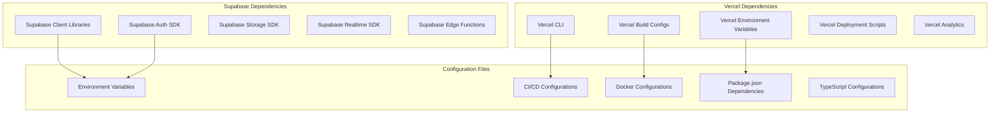
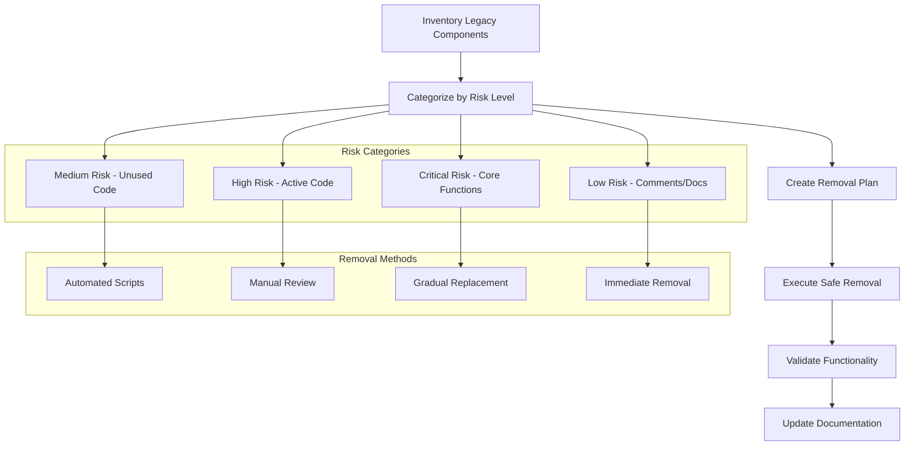
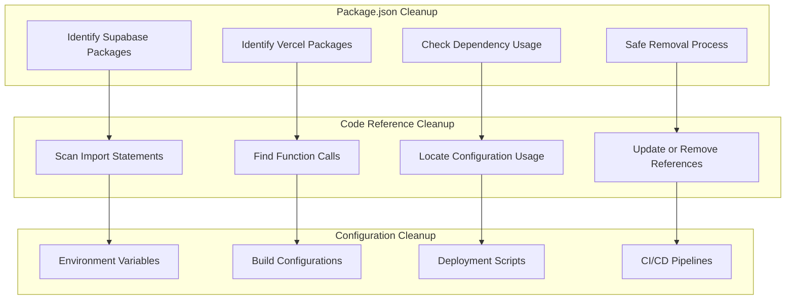
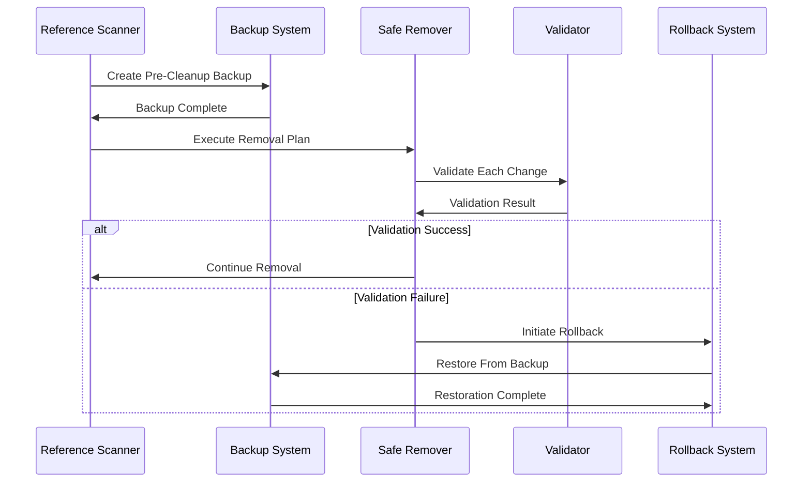
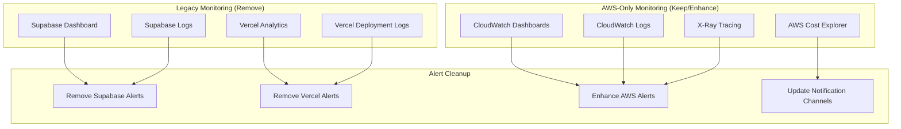
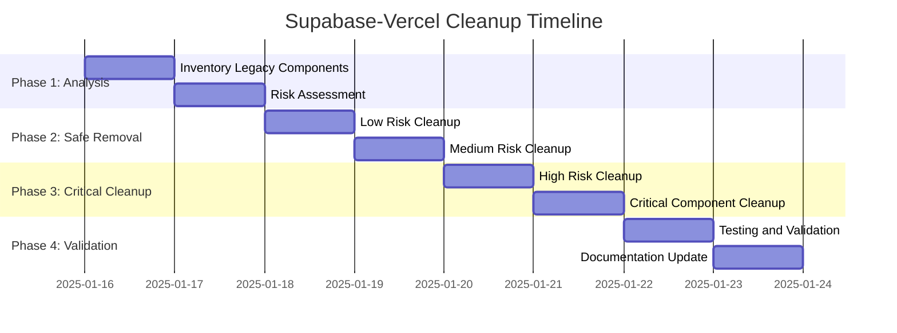
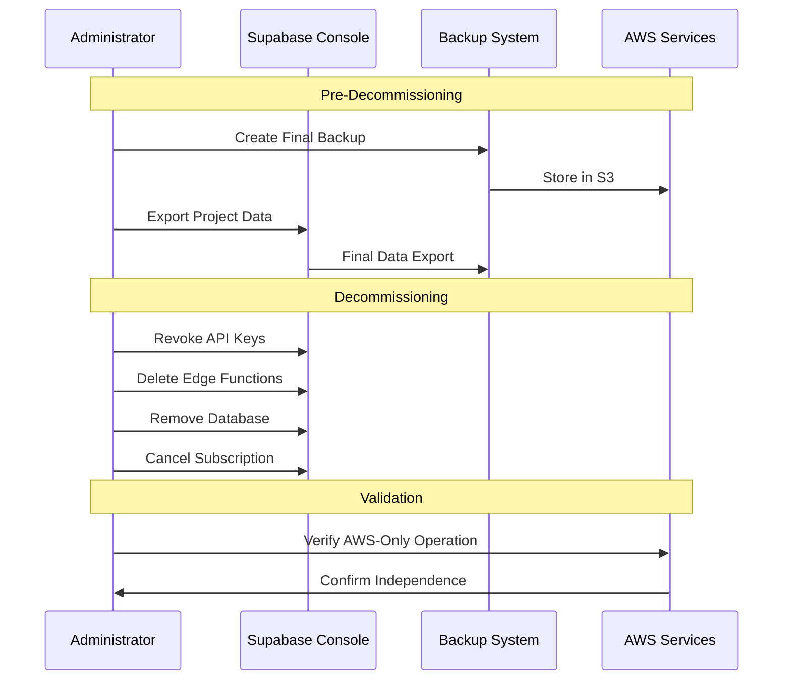
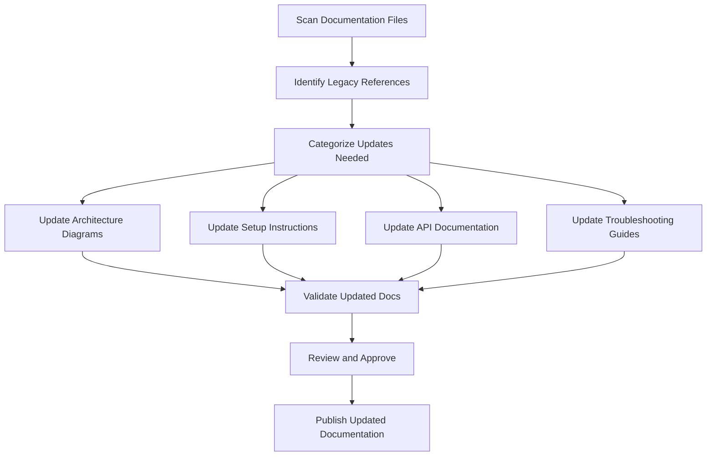
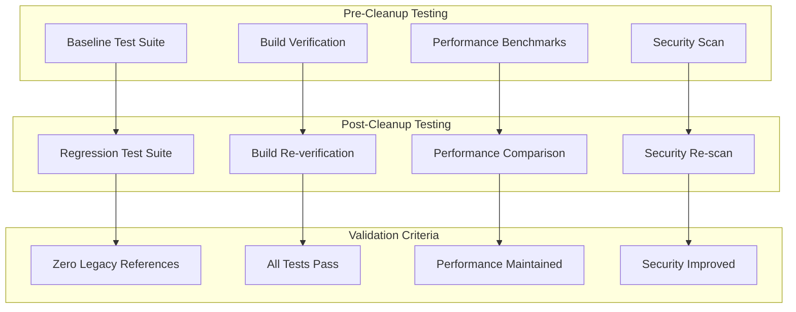

# Supabase-Vercel Cleanup Design

## Overview

This design document outlines the systematic approach to remove all Supabase and Vercel dependencies, configurations, and references from the matbakh.app codebase after successful migration to AWS infrastructure.

## Current State Analysis

### Legacy Dependencies Inventory



### Code Reference Analysis

```typescript
// Current problematic imports and usage
import { createClient } from "@supabase/supabase-js";
import { Auth } from "@supabase/auth-ui-react";
import { Database } from "@supabase/database-js";

// Vercel-specific imports
import { Analytics } from "@vercel/analytics/react";
import { SpeedInsights } from "@vercel/speed-insights/next";

// Environment variable references
const supabaseUrl = process.env.VITE_SUPABASE_URL;
const supabaseKey = process.env.VITE_SUPABASE_ANON_KEY;
const vercelUrl = process.env.VERCEL_URL;
```

## Cleanup Architecture Design

### Systematic Removal Strategy



### Dependency Cleanup Architecture



## Implementation Design

### 1. Automated Scanning and Detection

#### Legacy Reference Scanner

```typescript
interface LegacyReference {
  file: string;
  line: number;
  column: number;
  type: "import" | "function_call" | "config" | "comment";
  content: string;
  riskLevel: "low" | "medium" | "high" | "critical";
  replacementSuggestion?: string;
}

class LegacyReferenceScanner {
  private supabasePatterns = [
    /import.*@supabase/,
    /createClient.*supabase/,
    /supabase\./,
    /SUPABASE_/,
    /\.supabase\./,
  ];

  private vercelPatterns = [
    /import.*@vercel/,
    /vercel\./,
    /VERCEL_/,
    /\.vercel\./,
    /vercel\.json/,
  ];

  async scanCodebase(): Promise<LegacyReference[]> {
    const files = await this.getAllTypeScriptFiles();
    const references: LegacyReference[] = [];

    for (const file of files) {
      const content = await fs.readFile(file, "utf-8");
      references.push(...this.scanFile(file, content));
    }

    return this.categorizeByRisk(references);
  }

  private scanFile(file: string, content: string): LegacyReference[] {
    const lines = content.split("\n");
    const references: LegacyReference[] = [];

    lines.forEach((line, index) => {
      // Check for Supabase patterns
      this.supabasePatterns.forEach((pattern) => {
        if (pattern.test(line)) {
          references.push({
            file,
            line: index + 1,
            column: line.search(pattern),
            type: this.determineType(line),
            content: line.trim(),
            riskLevel: this.assessRisk(line, pattern),
          });
        }
      });

      // Check for Vercel patterns
      this.vercelPatterns.forEach((pattern) => {
        if (pattern.test(line)) {
          references.push({
            file,
            line: index + 1,
            column: line.search(pattern),
            type: this.determineType(line),
            content: line.trim(),
            riskLevel: this.assessRisk(line, pattern),
          });
        }
      });
    });

    return references;
  }
}
```

### 2. Safe Removal Procedures

#### Risk-Based Removal Strategy

```typescript
class SafeRemovalManager {
  async executeRemoval(references: LegacyReference[]): Promise<RemovalReport> {
    const report: RemovalReport = {
      totalReferences: references.length,
      removed: 0,
      failed: 0,
      skipped: 0,
      errors: [],
    };

    // Sort by risk level (low risk first)
    const sortedRefs = this.sortByRisk(references);

    for (const ref of sortedRefs) {
      try {
        await this.removeReference(ref);
        report.removed++;
      } catch (error) {
        report.errors.push({ reference: ref, error: error.message });
        report.failed++;
      }
    }

    return report;
  }

  private async removeReference(ref: LegacyReference): Promise<void> {
    switch (ref.riskLevel) {
      case "low":
        await this.removeImmediately(ref);
        break;
      case "medium":
        await this.removeWithValidation(ref);
        break;
      case "high":
        await this.removeWithTesting(ref);
        break;
      case "critical":
        await this.removeWithFullValidation(ref);
        break;
    }
  }
}
```

#### Backup and Rollback System



### 3. Package.json and Dependency Cleanup

#### Dependency Analysis and Removal

```typescript
interface DependencyAnalysis {
  package: string;
  version: string;
  usageCount: number;
  files: string[];
  riskLevel: "safe" | "caution" | "dangerous";
  replacementAvailable: boolean;
  removalRecommendation: "immediate" | "gradual" | "manual_review";
}

class DependencyCleanupManager {
  private supabaseDependencies = [
    "@supabase/supabase-js",
    "@supabase/auth-ui-react",
    "@supabase/auth-ui-shared",
    "@supabase/gotrue-js",
    "@supabase/postgrest-js",
    "@supabase/realtime-js",
    "@supabase/storage-js",
  ];

  private vercelDependencies = [
    "@vercel/analytics",
    "@vercel/speed-insights",
    "vercel",
    "@vercel/node",
    "@vercel/edge-config",
  ];

  async analyzeDependencies(): Promise<DependencyAnalysis[]> {
    const packageJson = await this.loadPackageJson();
    const allDeps = {
      ...packageJson.dependencies,
      ...packageJson.devDependencies,
    };

    const legacyDeps = Object.keys(allDeps).filter(
      (dep) =>
        this.supabaseDependencies.includes(dep) ||
        this.vercelDependencies.includes(dep)
    );

    const analysis: DependencyAnalysis[] = [];

    for (const dep of legacyDeps) {
      const usage = await this.analyzeUsage(dep);
      analysis.push({
        package: dep,
        version: allDeps[dep],
        usageCount: usage.count,
        files: usage.files,
        riskLevel: this.assessRemovalRisk(dep, usage),
        replacementAvailable: this.hasReplacement(dep),
        removalRecommendation: this.getRemovalStrategy(dep, usage),
      });
    }

    return analysis;
  }
}
```

### 4. Configuration File Cleanup

#### Environment Variable Cleanup

```typescript
// Environment variable cleanup strategy
const legacyEnvVars = [
  // Supabase variables
  "VITE_SUPABASE_URL",
  "VITE_SUPABASE_ANON_KEY",
  "SUPABASE_SERVICE_ROLE_KEY",
  "SUPABASE_JWT_SECRET",
  "SUPABASE_DB_URL",

  // Vercel variables
  "VERCEL_URL",
  "VERCEL_TOKEN",
  "VERCEL_PROJECT_ID",
  "VERCEL_ORG_ID",
  "VERCEL_GIT_COMMIT_SHA",
];

class EnvironmentCleanupManager {
  async cleanupEnvironmentFiles(): Promise<CleanupReport> {
    const envFiles = [
      ".env",
      ".env.local",
      ".env.production",
      ".env.development",
    ];
    const report: CleanupReport = { cleaned: [], errors: [] };

    for (const file of envFiles) {
      try {
        await this.cleanupEnvFile(file);
        report.cleaned.push(file);
      } catch (error) {
        report.errors.push({ file, error: error.message });
      }
    }

    return report;
  }

  private async cleanupEnvFile(filename: string): Promise<void> {
    if (!(await fs.pathExists(filename))) return;

    const content = await fs.readFile(filename, "utf-8");
    const lines = content.split("\n");

    const cleanedLines = lines.filter((line) => {
      const isLegacyVar = legacyEnvVars.some(
        (varName) =>
          line.startsWith(`${varName}=`) || line.includes(`${varName}=`)
      );
      return !isLegacyVar;
    });

    await fs.writeFile(filename, cleanedLines.join("\n"));
  }
}
```

### 5. CI/CD Pipeline Cleanup

#### Pipeline Configuration Updates

```yaml
# Before: Mixed AWS/Supabase/Vercel pipeline
name: Deploy
on: [push]
jobs:
  deploy:
    runs-on: ubuntu-latest
    steps:
      - name: Deploy to Vercel
        uses: amondnet/vercel-action@v20
      - name: Update Supabase
        run: supabase db push
      - name: Deploy to AWS
        run: aws s3 sync dist/ s3://bucket

# After: AWS-only pipeline
name: Deploy
on: [push]
jobs:
  deploy:
    runs-on: ubuntu-latest
    steps:
      - name: Build Application
        run: npm run build
      - name: Deploy to AWS S3
        run: aws s3 sync dist/ s3://matbakh-bucket
      - name: Invalidate CloudFront
        run: aws cloudfront create-invalidation --distribution-id $DISTRIBUTION_ID --paths "/*"
      - name: Update RDS Schema
        run: npm run db:migrate
```

#### Monitoring and Alerting Updates



## Cleanup Implementation Strategy

### Phase-Based Cleanup Approach



### Automated Cleanup Tools

```typescript
class AutomatedCleanupTool {
  private cleanupRules: CleanupRule[] = [
    {
      pattern: /import.*@supabase/,
      action: "remove_line",
      riskLevel: "high",
      validation: "check_usage",
    },
    {
      pattern: /import.*@vercel/,
      action: "remove_line",
      riskLevel: "medium",
      validation: "check_build",
    },
    {
      pattern: /SUPABASE_|VERCEL_/,
      action: "remove_env_var",
      riskLevel: "medium",
      validation: "check_references",
    },
  ];

  async executeCleanup(): Promise<CleanupResult> {
    const result: CleanupResult = {
      filesModified: [],
      linesRemoved: 0,
      dependenciesRemoved: [],
      errors: [],
    };

    for (const rule of this.cleanupRules) {
      try {
        const ruleResult = await this.applyRule(rule);
        this.mergeResults(result, ruleResult);
      } catch (error) {
        result.errors.push({
          rule: rule.pattern.toString(),
          error: error.message,
        });
      }
    }

    return result;
  }
}
```

### 2. Service Decommissioning Design

#### Supabase Project Cleanup



#### Vercel Deployment Cleanup

```typescript
class VercelCleanupManager {
  async decommissionVercelServices(): Promise<DecommissionReport> {
    const report: DecommissionReport = {
      deploymentsRemoved: 0,
      domainsTransferred: 0,
      environmentVariablesCleared: 0,
      projectsDeleted: 0,
    };

    try {
      // Remove all deployments
      const deployments = await this.listVercelDeployments();
      for (const deployment of deployments) {
        await this.removeDeployment(deployment.id);
        report.deploymentsRemoved++;
      }

      // Transfer domains to AWS Route 53
      const domains = await this.listVercelDomains();
      for (const domain of domains) {
        await this.transferDomainToAWS(domain);
        report.domainsTransferred++;
      }

      // Clear environment variables
      await this.clearEnvironmentVariables();
      report.environmentVariablesCleared = await this.countEnvVars();

      // Delete projects
      const projects = await this.listVercelProjects();
      for (const project of projects) {
        await this.deleteProject(project.id);
        report.projectsDeleted++;
      }
    } catch (error) {
      throw new Error(`Vercel cleanup failed: ${error.message}`);
    }

    return report;
  }
}
```

### 3. Documentation and Reference Updates

#### Documentation Cleanup Strategy



#### README and Documentation Updates

```markdown
<!-- Before: Mixed architecture documentation -->

# matbakh.app

## Architecture

- Frontend: React + Vite
- Backend: Supabase + AWS Lambda
- Database: Supabase PostgreSQL
- Storage: Supabase Storage + AWS S3
- Deployment: Vercel + AWS

<!-- After: AWS-only architecture documentation -->

# matbakh.app

## Architecture

- Frontend: React + Vite
- Backend: AWS Lambda + API Gateway
- Database: Amazon RDS PostgreSQL
- Storage: Amazon S3 + CloudFront
- Authentication: Amazon Cognito
- Deployment: AWS S3 + CloudFront
```

## Validation and Testing Design

### Comprehensive Validation Framework

```typescript
class CleanupValidationFramework {
  async validateCleanup(): Promise<ValidationReport> {
    const report: ValidationReport = {
      codebaseClean: false,
      buildSuccessful: false,
      testsPass: false,
      deploymentWorks: false,
      performanceAcceptable: false,
      securityCompliant: false,
    };

    // Validate codebase is clean
    report.codebaseClean = await this.validateNoLegacyReferences();

    // Validate build process
    report.buildSuccessful = await this.validateBuildProcess();

    // Validate tests pass
    report.testsPass = await this.validateTestSuite();

    // Validate deployment
    report.deploymentWorks = await this.validateDeployment();

    // Validate performance
    report.performanceAcceptable = await this.validatePerformance();

    // Validate security
    report.securityCompliant = await this.validateSecurity();

    return report;
  }

  private async validateNoLegacyReferences(): Promise<boolean> {
    const scanner = new LegacyReferenceScanner();
    const references = await scanner.scanCodebase();
    return references.length === 0;
  }
}
```

### Testing Strategy



## Monitoring and Alerting Design

### Cleanup Progress Monitoring

```typescript
interface CleanupMetrics {
  totalReferencesFound: number;
  referencesRemoved: number;
  filesModified: number;
  dependenciesRemoved: number;
  configurationsCleaned: number;
  errorsEncountered: number;
  completionPercentage: number;
  estimatedTimeRemaining: number;
}

class CleanupProgressMonitor {
  private metrics: CleanupMetrics = {
    totalReferencesFound: 0,
    referencesRemoved: 0,
    filesModified: 0,
    dependenciesRemoved: 0,
    configurationsCleaned: 0,
    errorsEncountered: 0,
    completionPercentage: 0,
    estimatedTimeRemaining: 0,
  };

  updateProgress(update: Partial<CleanupMetrics>): void {
    Object.assign(this.metrics, update);
    this.calculateCompletion();
    this.estimateTimeRemaining();
    this.publishMetrics();
  }

  private calculateCompletion(): void {
    if (this.metrics.totalReferencesFound > 0) {
      this.metrics.completionPercentage =
        (this.metrics.referencesRemoved / this.metrics.totalReferencesFound) *
        100;
    }
  }
}
```

This comprehensive design provides a systematic, safe, and thorough approach to removing all Supabase and Vercel dependencies while ensuring system functionality is maintained and improved through the cleanup process.
