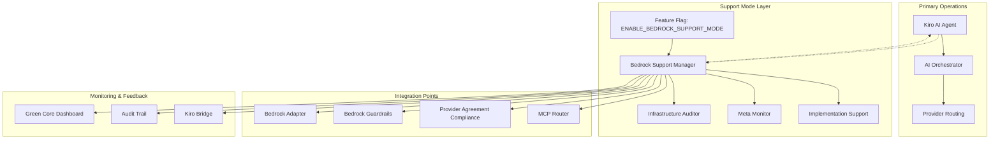
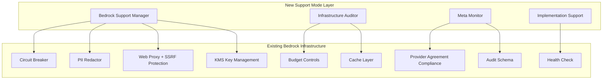
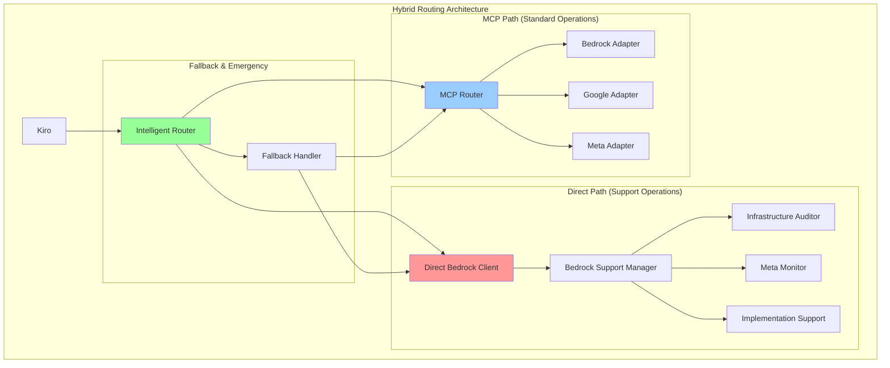

# Bedrock Support Mode - Design Document

## Overview

This design document outlines the technical architecture for activating AWS Bedrock as a secondary AI operator to support infrastructure validation, detect inconsistencies, assist Kiro with pending implementations, and ensure smooth system integration. The design leverages existing Bedrock infrastructure while introducing controlled support mode capabilities.

## Architecture

### High-Level Architecture



### Component Architecture

The Bedrock Support Mode consists of four main components:

1. **Bedrock Support Manager** - Central orchestrator for support operations
2. **Infrastructure Auditor** - Performs system health checks and gap analysis
3. **Meta Monitor** - Monitors Kiro execution and provides diagnostics
4. **Implementation Support** - Assists with incomplete modules and auto-remediation

## Components and Interfaces

### 1. Bedrock Support Manager

**Location**: `src/lib/ai-orchestrator/bedrock-support-manager.ts`

```typescript
interface BedrockSupportManager {
  // Activation Control
  activate(): Promise<BedrockSupportResult>;
  deactivate(): Promise<void>;
  isActive(): boolean;

  // Core Support Operations
  runInfrastructureAudit(): Promise<InfrastructureAuditResult>;
  enableMetaMonitoring(): Promise<void>;
  provideFallbackSupport(context: FailureContext): Promise<SupportResult>;

  // Integration Methods
  sendDiagnosticsToKiro(diagnostics: DiagnosticData): Promise<void>;
  receiveKiroExecutionData(executionData: ExecutionMetadata): Promise<void>;

  // Security & Compliance Integration (from existing Bedrock docs)
  validateComplianceStatus(): Promise<ComplianceValidationResult>;
  enableCircuitBreaker(): Promise<void>;
  checkSecurityPosture(): Promise<SecurityAuditResult>;

  // Cost & Performance Management (from existing Bedrock docs)
  monitorCostThresholds(): Promise<CostAnalysis>;
  optimizePerformance(): Promise<PerformanceOptimization>;
  enableEmergencyMode(): Promise<void>;

  // Template & Prompt Management (from existing Bedrock docs)
  validatePromptTemplates(): Promise<TemplateValidationResult>;
  enablePIIRedaction(): Promise<void>;
  runRedTeamEvaluations(): Promise<SecurityTestResult>;
}
```

### 2. Infrastructure Auditor

**Location**: `src/lib/ai-orchestrator/infrastructure-auditor.ts`

```typescript
interface InfrastructureAuditor {
  // Audit Operations
  performSystemHealthCheck(): Promise<HealthCheckResult>;
  detectImplementationGaps(): Promise<ImplementationGap[]>;
  analyzeSystemConsistency(): Promise<ConsistencyReport>;

  // Gap Analysis
  identifyIncompleteModules(): Promise<IncompleteModule[]>;
  suggestRemediationSteps(gaps: ImplementationGap[]): Promise<RemediationPlan>;

  // Reporting
  generateAuditReport(): Promise<AuditReport>;
}
```

### 3. Meta Monitor

**Location**: `src/lib/ai-orchestrator/meta-monitor.ts`

```typescript
interface MetaMonitor {
  // Execution Monitoring
  analyzeKiroExecution(
    executionStack: ExecutionStack
  ): Promise<ExecutionAnalysis>;
  detectFailurePatterns(failures: FailureData[]): Promise<FailurePattern[]>;
  identifyPerformanceBottlenecks(): Promise<BottleneckAnalysis>;

  // Feedback Generation
  generateExecutionFeedback(
    analysis: ExecutionAnalysis
  ): Promise<ExecutionFeedback>;
  createFailureClusterReport(
    patterns: FailurePattern[]
  ): Promise<ClusterReport>;
}
```

### 4. Implementation Support

**Location**: `src/lib/ai-orchestrator/implementation-support.ts`

```typescript
interface ImplementationSupport {
  // Module Support
  supportIncompleteModule(moduleId: string): Promise<SupportResult>;
  provideRemediationSuggestions(
    issue: ImplementationIssue
  ): Promise<RemediationSuggestion[]>;
  attemptAutoResolution(issue: AutoResolvableIssue): Promise<ResolutionResult>;

  // Backlog Management
  analyzeImplementationBacklog(): Promise<BacklogAnalysis>;
  prioritizeBacklogItems(items: BacklogItem[]): Promise<PrioritizedBacklog>;
}
```

## Data Models

### Core Data Structures

```typescript
// Support Mode Configuration
interface BedrockSupportConfig {
  enabled: boolean;
  environments: ("development" | "staging" | "production")[];
  auditInterval: number;
  monitoringLevel: "basic" | "detailed" | "comprehensive";
  autoResolutionEnabled: boolean;
  notificationChannels: NotificationChannel[];
}

// Infrastructure Audit Result
interface InfrastructureAuditResult {
  timestamp: Date;
  overallHealth: "healthy" | "warning" | "critical";
  detectedIssues: InfrastructureIssue[];
  implementationGaps: ImplementationGap[];
  recommendations: Recommendation[];
  complianceStatus: ComplianceStatus;
}

// Execution Analysis
interface ExecutionAnalysis {
  executionId: string;
  timestamp: Date;
  performanceMetrics: PerformanceMetrics;
  failurePoints: FailurePoint[];
  bottlenecks: Bottleneck[];
  recommendations: ExecutionRecommendation[];
}

// Support Result
interface SupportResult {
  success: boolean;
  supportType: "infrastructure" | "execution" | "implementation";
  actionsPerformed: SupportAction[];
  diagnostics: DiagnosticData;
  nextSteps: string[];
}
```

### Integration Data Models

```typescript
// Kiro Bridge Communication
interface KiroBridgeMessage {
  type: "diagnostics" | "support_request" | "execution_data";
  source: "bedrock_support" | "kiro";
  payload: any;
  timestamp: Date;
  correlationId: string;
}

// MCP Router Integration (Hybrid Approach)
interface MCPSupportRouting {
  supportModeEnabled: boolean;
  fallbackToBedrockEnabled: boolean;
  supportPriority: number;
  routingRules: SupportRoutingRule[];

  // Hybrid approach configuration
  directBedrockForSupport: boolean; // Bypass MCP for support operations
  mcpForStandardOperations: boolean; // Use MCP for normal AI operations
  emergencyDirectAccess: boolean; // Direct access during MCP failures
}

// Support Mode Routing Strategy
interface SupportModeRouting {
  // Primary: Direct Bedrock for support operations
  directBedrock: BedrockSupportClient;

  // Secondary: MCP integration for standard operations
  mcpRouter: MCPRouter;

  // Routing decision logic
  routeRequest(request: SupportRequest): "direct" | "mcp" | "fallback";
}
```

## Error Handling

### Error Categories and Responses

1. **Support Mode Activation Errors**

   - Feature flag service unavailable → Use safe defaults (disabled)
   - Bedrock adapter initialization failure → Log error, disable support mode
   - Compliance check failure → Block activation, maintain audit trail

2. **Infrastructure Audit Errors**

   - Audit execution timeout → Return partial results with warning
   - Access permission errors → Log security event, continue with available checks
   - Data collection failures → Use cached data where available

3. **Meta Monitoring Errors**

   - Kiro execution data unavailable → Continue with historical analysis
   - Analysis processing errors → Provide basic diagnostics
   - Feedback delivery failures → Queue for retry with exponential backoff

4. **Implementation Support Errors**
   - Auto-resolution failures → Log attempt, escalate to manual review
   - Module access errors → Report as implementation gap
   - Remediation suggestion errors → Provide generic recommendations

### Error Recovery Strategies

```typescript
interface ErrorRecoveryStrategy {
  // Graceful Degradation
  fallbackToBasicMode(): void;
  disableProblematiFeatures(): void;
  maintainCoreOperations(): void;

  // Retry Logic
  retryWithBackoff(
    operation: () => Promise<any>,
    maxRetries: number
  ): Promise<any>;
  queueForLaterRetry(operation: Operation): void;

  // Escalation
  escalateToManualReview(error: Error, context: ErrorContext): void;
  notifyOperationsTeam(criticalError: CriticalError): void;
}
```

## Testing Strategy

### Unit Testing

- **Component Isolation**: Each support mode component tested independently
- **Mock Integration**: Mock Bedrock adapter, Kiro bridge, and external dependencies
- **Error Scenarios**: Comprehensive error handling and recovery testing
- **Feature Flag Testing**: Validate behavior with flags enabled/disabled

### Integration Testing

- **End-to-End Support Flow**: Test complete support mode activation to deactivation
- **Kiro Integration**: Validate communication between Bedrock support and Kiro
- **Dashboard Integration**: Test Green Core Dashboard metric reporting
- **Compliance Integration**: Verify all compliance checks pass during support operations

### Performance Testing

- **Support Mode Overhead**: Measure performance impact of support mode activation
- **Audit Performance**: Test infrastructure audit execution times
- **Meta Monitoring Impact**: Validate minimal impact on Kiro execution performance
- **Scalability Testing**: Test support mode under various load conditions

### Security Testing

- **Compliance Validation**: Verify GDPR, DPA, and no-training agreement compliance
- **Access Control**: Test proper permission handling for support operations
- **Audit Trail Integrity**: Validate complete audit logging of support activities
- **Data Protection**: Ensure PII handling compliance in support operations
- **Red Team Evaluations**: Automated security testing including prompt injection resistance
- **SSRF Protection**: Validate web proxy security against server-side request forgery
- **Circuit Breaker Security**: Test security controls during degraded states
- **KMS Integration**: Verify proper encryption of sensitive support data

## Deployment Strategy

### Feature Flag Rollout

1. **Development Environment**

   - Enable `ENABLE_BEDROCK_SUPPORT_MODE` for initial testing
   - Validate basic support mode functionality
   - Test integration with existing development workflows

2. **Staging Environment**

   - Gradual rollout with monitoring
   - Full integration testing with production-like data
   - Performance and compliance validation

3. **Production Environment**
   - Initially disabled by default
   - Controlled activation for specific use cases
   - Comprehensive monitoring and alerting

### Monitoring and Observability

```typescript
interface SupportModeMetrics {
  // Activation Metrics
  activationCount: number;
  activationSuccessRate: number;
  averageActivationTime: number;

  // Operation Metrics
  infrastructureAuditsPerformed: number;
  implementationGapsDetected: number;
  autoResolutionsAttempted: number;
  autoResolutionSuccessRate: number;

  // Performance Metrics
  supportModeOverhead: number;
  auditExecutionTime: number;
  metaMonitoringLatency: number;

  // Integration Metrics
  kiroBridgeMessageCount: number;
  dashboardUpdateCount: number;
  complianceChecksPassed: number;

  // Security & Cost Metrics (from existing Bedrock docs)
  securityScore: number; // Red team evaluation percentage
  circuitBreakerState: "open" | "closed" | "half-open";
  piiDetectionRate: number;
  costPerRequest: number;
  tokenUsage: number;
  budgetUtilization: number;

  // Reliability Metrics (from existing Bedrock docs)
  errorRate: number;
  responseTimeP95: number;
  cacheHitRate: number;
  failoverCount: number;
}
```

### Green Core Dashboard Integration

The support mode will integrate with the existing Green Core Dashboard to provide:

- **Support Mode Status**: Real-time indication of support mode activation state
- **Infrastructure Health**: Visual representation of audit results and system health
- **Implementation Gaps**: Dashboard widgets showing detected gaps and remediation progress
- **Meta Monitoring**: Kiro execution analysis and performance insights
- **Support Operations**: Log of support actions performed and their outcomes

### Rollback and Recovery

- **Immediate Deactivation**: Feature flag can instantly disable support mode
- **Graceful Shutdown**: Support operations complete current tasks before shutdown
- **State Preservation**: Audit results and diagnostics preserved during deactivation
- **Fallback Mode**: System continues normal operation without support mode
- **Recovery Procedures**: Clear steps for re-enabling support mode after issues

## Integration with Existing Bedrock Infrastructure

### Leveraging Existing Components

The Bedrock Support Mode design leverages the comprehensive existing Bedrock infrastructure:

#### 1. Security Framework Integration

- **Circuit Breaker Pattern**: Integrate with existing `circuit-breaker.ts` for automatic failure detection
- **PII Redaction**: Utilize existing `pii-redactor.ts` with deterministic hashing and GDPR compliance
- **SSRF Protection**: Leverage existing web proxy with comprehensive SSRF hardening
- **KMS Integration**: Use existing dedicated CMK for secrets encryption
- **Red Team Evaluations**: Integrate with existing automated security testing framework

#### 2. Cost & Performance Management

- **Budget Controls**: Integrate with existing AWS Budget setup ($100/month limit)
- **Token Usage Tracking**: Leverage existing cost estimation and tracking
- **Response Caching**: Utilize existing caching layer with configurable TTL
- **Performance Monitoring**: Integrate with existing CloudWatch dashboards and alarms

#### 3. Compliance & Audit Integration

- **Provider Agreement Compliance**: Full integration with existing compliance validation
- **Audit Schema**: Use existing structured logging with correlation IDs
- **EU Data Residency**: Leverage existing region restrictions (EU-Central-1 primary)
- **Template Versioning**: Integrate with existing SHA-256 hashing and tamper detection

#### 4. Operational Excellence

- **Health Check Integration**: Extend existing `/ai/health` endpoint for support mode status
- **Emergency Procedures**: Integrate with existing break-glass role and incident response
- **Monitoring Integration**: Extend existing CloudWatch dashboards with support mode metrics
- **Log Management**: Use existing structured logging with fixed retention policies

### Enhanced Architecture with Existing Components



### Configuration Integration

The support mode will extend existing configuration patterns:

```typescript
interface BedrockSupportConfig extends BedrockConfig {
  // Existing Bedrock config properties
  circuitBreaker: CircuitBreakerConfig;
  piiRedaction: PIIRedactionConfig;
  budgetControls: BudgetConfig;

  // New support mode specific config
  supportMode: {
    enabled: boolean;
    auditInterval: number;
    autoResolutionEnabled: boolean;
    metaMonitoringLevel: "basic" | "detailed" | "comprehensive";
  };
}
```

### Emergency Procedures Integration

Support mode will integrate with existing emergency procedures:

1. **Existing Break-Glass Role**: Support mode operations can use existing JIT access
2. **Existing Circuit Breaker**: Automatic failover when support mode encounters issues
3. **Existing Cost Controls**: Support mode respects existing budget limits and throttling
4. **Existing Security Monitoring**: All support operations logged through existing audit trail

This integration approach ensures that Bedrock Support Mode builds upon the robust, production-ready foundation already established, rather than creating parallel systems.

## MCP vs Direct Bedrock Integration Strategy

### Recommended Hybrid Approach

Based on the analysis of both approaches, I recommend a **Hybrid Strategy** that combines the benefits of both:



#### 1. Direct Bedrock for Support Operations

```typescript
// Support-specific operations bypass MCP for optimal performance
class BedrockSupportManager {
  private directBedrockClient: BedrockClient;
  private mcpRouter: MCPRouter;
  private intelligentRouter: IntelligentRouter;

  async runInfrastructureAudit(): Promise<InfrastructureAuditResult> {
    // Use direct Bedrock for time-critical support operations
    const routingDecision = this.intelligentRouter.decide({
      operation: "infrastructure_audit",
      priority: "critical",
      latencyRequirement: 10000, // 10 seconds max
      operationType: "support",
    });

    if (routingDecision.useDirectBedrock) {
      return this.directBedrockClient.analyze({
        operation: "infrastructure_audit",
        priority: "high",
        timeout: 30000,
        context: "support_mode",
      });
    }

    // Fallback to MCP if direct access fails
    return this.mcpRouter.route({
      provider: "bedrock",
      operation: "infrastructure_audit",
      priority: "high",
    });
  }

  async provideFallbackSupport(
    context: FailureContext
  ): Promise<SupportResult> {
    // Emergency operations always use direct access
    return this.directBedrockClient.emergencySupport({
      ...context,
      bypassMCP: true,
      emergencyMode: true,
    });
  }
}
```

#### 2. MCP Integration for Standard Operations

```typescript
// Standard AI operations continue through MCP for consistency
class BedrockSupportManager {
  async sendDiagnosticsToKiro(diagnostics: DiagnosticData): Promise<void> {
    // Use MCP router for standard communication with Kiro
    await this.mcpRouter.route({
      provider: "bedrock",
      operation: "send_diagnostics",
      data: diagnostics,
      target: "kiro",
      priority: "medium",
    });
  }

  async analyzeKiroExecution(
    executionData: ExecutionMetadata
  ): Promise<ExecutionAnalysis> {
    // Standard analysis operations go through MCP
    return this.mcpRouter.route({
      provider: "bedrock",
      operation: "analyze_execution",
      data: executionData,
      timeout: 30000,
    });
  }
}
```

#### 3. Intelligent Routing Logic

```typescript
interface RoutingDecision {
  operationType: "standard" | "support" | "emergency";
  priority: "low" | "medium" | "high" | "critical";
  latencyRequirement: number; // milliseconds
  useDirectBedrock: boolean;
  fallbackStrategy: "mcp" | "direct" | "none";
}

class IntelligentRouter {
  private mcpHealthChecker: MCPHealthChecker;
  private directBedrockHealthChecker: BedrockHealthChecker;

  decide(operation: SupportOperation): RoutingDecision {
    // Emergency operations always use direct Bedrock
    if (
      operation.priority === "emergency" ||
      operation.operationType === "emergency"
    ) {
      return {
        operationType: "emergency",
        priority: "critical",
        latencyRequirement: 5000,
        useDirectBedrock: true,
        fallbackStrategy: "none",
      };
    }

    // Critical support operations with tight latency requirements
    if (
      operation.operationType === "support" &&
      operation.latencyRequirement < 10000
    ) {
      return {
        operationType: "support",
        priority: "critical",
        latencyRequirement: operation.latencyRequirement,
        useDirectBedrock: true,
        fallbackStrategy: "mcp",
      };
    }

    // Infrastructure audits and meta monitoring
    if (
      operation.operation === "infrastructure_audit" ||
      operation.operation === "meta_monitor"
    ) {
      return {
        operationType: "support",
        priority: "high",
        latencyRequirement: 15000,
        useDirectBedrock: true,
        fallbackStrategy: "mcp",
      };
    }

    // MCP unavailable → Force direct access
    if (!this.mcpHealthChecker.isHealthy()) {
      return {
        operationType: "standard",
        priority: operation.priority || "medium",
        latencyRequirement: 30000,
        useDirectBedrock: true,
        fallbackStrategy: "none",
      };
    }

    // Standard operations use MCP
    return {
      operationType: "standard",
      priority: operation.priority || "medium",
      latencyRequirement: 30000,
      useDirectBedrock: false,
      fallbackStrategy: "direct",
    };
  }

  async executeWithFallback<T>(
    operation: SupportOperation,
    primaryExecution: () => Promise<T>,
    fallbackExecution: () => Promise<T>
  ): Promise<T> {
    const decision = this.decide(operation);

    try {
      return await primaryExecution();
    } catch (error) {
      if (decision.fallbackStrategy !== "none") {
        console.warn(
          `Primary execution failed, falling back to ${decision.fallbackStrategy}`,
          error
        );
        return await fallbackExecution();
      }
      throw error;
    }
  }
}
```

#### 4. Health Monitoring Integration

```typescript
interface HybridHealthMonitor {
  // MCP Health Monitoring
  checkMCPHealth(): Promise<MCPHealthStatus>;
  monitorMCPLatency(): Promise<LatencyMetrics>;

  // Direct Bedrock Health Monitoring
  checkDirectBedrockHealth(): Promise<BedrockHealthStatus>;
  monitorDirectBedrockLatency(): Promise<LatencyMetrics>;

  // Routing Decision Health
  analyzeRoutingEfficiency(): Promise<RoutingEfficiencyReport>;
  optimizeRoutingRules(): Promise<OptimizationResult>;
}

class HybridHealthMonitor implements HybridHealthMonitor {
  async checkMCPHealth(): Promise<MCPHealthStatus> {
    return {
      status: 'healthy' | 'degraded' | 'unhealthy',
      latency: number,
      errorRate: number,
      lastSuccessfulRequest: Date
    };
  }

  async analyzeRoutingEfficiency(): Promise<RoutingEfficiencyReport> {
    return {
      mcpSuccessRate: number,
      directBedrockSuccessRate: number,
      averageLatencyMCP: number,
      averageLatencyDirect: number,
      recommendedRoutingChanges: RoutingRecommendation[]
    };
  }
}
```

### Benefits of Hybrid Approach

1. **Performance Optimization**: Critical support operations get direct access (<10s latency)
2. **Consistency**: Standard operations maintain MCP routing consistency
3. **Resilience**: Automatic fallback to direct access if MCP fails
4. **Observability**: Both paths monitored with comprehensive metrics
5. **Flexibility**: Dynamic routing based on operational needs and health status
6. **Cost Efficiency**: MCP routing for standard operations, direct for critical only
7. **Gradual Migration**: Can shift more operations to direct access over time

### Implementation Strategy

#### Phase 1: Foundation (Week 1)

- Implement direct Bedrock client for support operations
- Create intelligent routing decision logic
- Add basic health monitoring for both paths

#### Phase 2: Integration (Week 2)

- Add MCP integration for standard operations
- Implement fallback mechanisms
- Create comprehensive monitoring and alerting

#### Phase 3: Optimization (Week 3)

- Implement intelligent routing optimization
- Add performance analytics and reporting
- Fine-tune routing rules based on operational data

#### Phase 4: Production Readiness (Week 4)

- Add comprehensive error handling and recovery
- Implement emergency procedures and break-glass access
- Complete testing and documentation

### Configuration Management

```typescript
interface HybridRoutingConfig {
  // Routing Preferences
  preferDirectForSupport: boolean;
  preferMCPForStandard: boolean;

  // Latency Thresholds
  emergencyLatencyThreshold: number; // 5000ms
  criticalLatencyThreshold: number; // 10000ms
  standardLatencyThreshold: number; // 30000ms

  // Health Check Configuration
  mcpHealthCheckInterval: number;
  directBedrockHealthCheckInterval: number;

  // Fallback Configuration
  enableAutomaticFallback: boolean;
  fallbackRetryAttempts: number;
  fallbackRetryDelay: number;

  // Feature Flags
  enableIntelligentRouting: boolean;
  enableRoutingOptimization: boolean;
  enableEmergencyDirectAccess: boolean;
}
```

This hybrid approach provides the optimal balance between leveraging your existing MCP infrastructure and ensuring critical support operations have the direct access they need for optimal performance. **Soll ich mit der Implementierung beginnen oder möchtest du noch Anpassungen am Design?**
