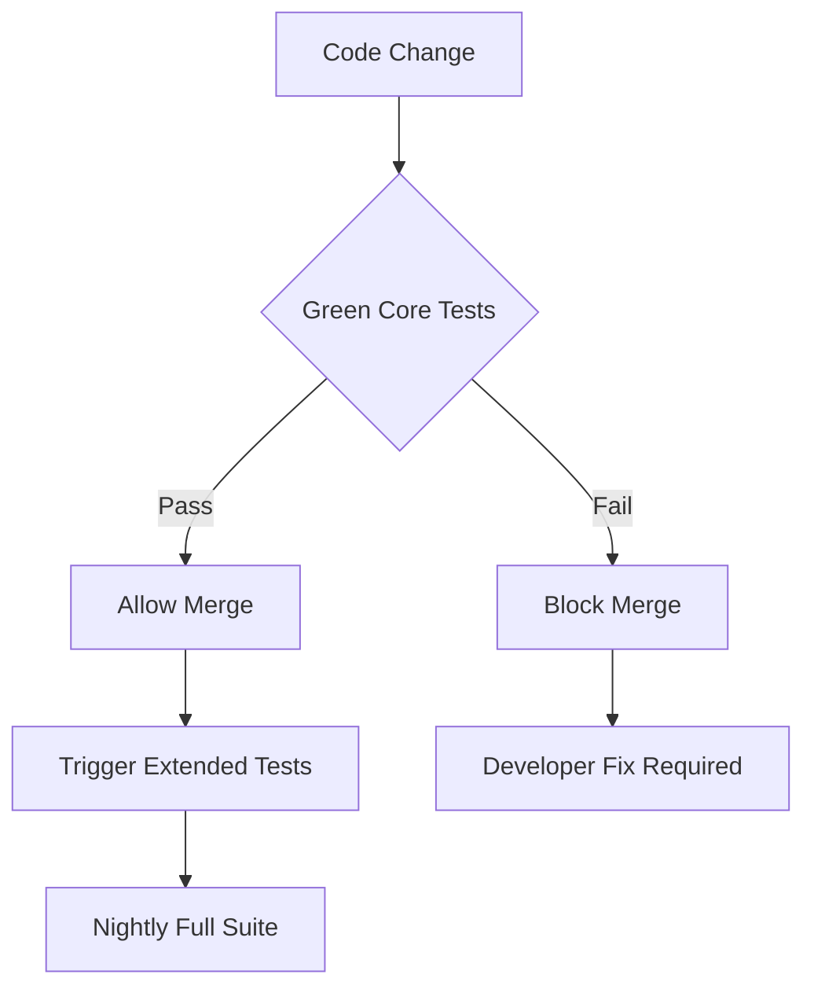
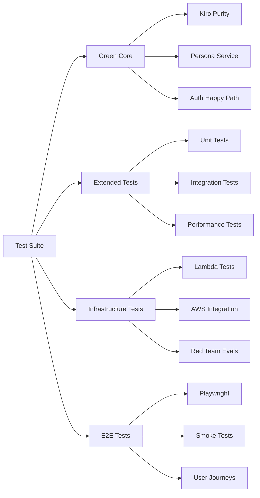

# Comprehensive Testing Strategy - Design Document

## Overview

This design implements a multi-tiered testing strategy that prioritizes system stability through a "Green Core" approach while maintaining development velocity. The strategy builds upon the successful Task 13 completion and integrates lessons learned from the comprehensive system testing phase.

## Architecture

### Green Core Testing Framework

The Green Core represents the minimal set of tests that must always pass to ensure system stability and production readiness.



### Test Segmentation Architecture



## Components and Interfaces

### 1. Green Core Test Suite

**Purpose:** Critical tests that must always pass for system stability.

**Components:**
- **KiroSystemPurityValidator:** Ensures architectural integrity
- **PersonaService Core Functions:** Validates business logic
- **Auth Happy Path:** Confirms authentication works
- **Basic Compilation:** TypeScript and build validation

**Interface:**
```typescript
interface GreenCoreResult {
  passed: boolean;
  executionTime: number;
  failedTests: string[];
  systemPurityScore: number;
  blocksMerge: boolean;
}
```

**Execution Criteria:**
- Must complete in under 5 minutes
- Must have 99.9% reliability
- Must cover production-critical paths only
- Must be deterministic (no flaky tests)

### 2. Test Segmentation System

**Jest Application Tests:**
```bash
# Green Core (CI-blocking)
npm run test:green-core

# Full Jest Suite (non-blocking)
npm run test:jest -- --maxWorkers=50%

# Coverage Analysis
npm run test:coverage
```

**Infrastructure Tests:**
```bash
# Deno Tests (separate runtime)
npm run test:deno

# Lambda Tests (AWS integration)
npm run test:lambda

# Red Team Security Evaluations
npm run test:security
```

**End-to-End Tests:**
```bash
# Playwright Browser Tests
npm run test:e2e

# Smoke Tests (production validation)
npm run test:smoke
```

### 3. Intelligent Test Selection Engine

**Purpose:** Execute only relevant tests based on code changes.

**Algorithm:**
1. Analyze changed files using git diff
2. Map files to test dependencies
3. Include transitive dependencies
4. Execute minimal test set
5. Fall back to full suite if mapping uncertain

**Interface:**
```typescript
interface TestSelectionResult {
  selectedTests: string[];
  estimatedDuration: number;
  coverageImpact: number;
  riskLevel: 'low' | 'medium' | 'high';
}
```

### 4. Error Classification and Recovery System

**PII Redaction Test Fixes:**
```typescript
// Fixed: Test for proper redaction, not absence of @
const rawEmailPattern = /(?<!redacted-)[\w.+-]+@[\w.-]+\.\w{2,}/i;
expect(redactionResult.redactedText).not.toMatch(rawEmailPattern);
expect(redactionResult.redactedText).toMatch(/redacted-[a-f0-9]{8}@example\.com/i);

// Fixed: Phone number redaction validation
const rawPhoneDE = /\+49[\s-]?(?:\d[\s-]?){8,}/;
expect(redactionResult.redactedText).not.toMatch(rawPhoneDE);
expect(redactionResult.redactedText).toMatch(/\+49-XXX-[a-f0-9]{8}/);
```

**Jest Worker Exception Handling:**
```typescript
// Configuration for heavy test suites
module.exports = {
  maxWorkers: process.env.CI ? '25%' : '50%',
  testTimeout: 20000, // Increased for IO-heavy tests
  workerIdleMemoryLimit: '512MB'
};
```

**React act() Warning Resolution:**
```typescript
// Proper async state update handling
await act(async () => {
  await userEvent.click(button);
});

// Or using Testing Library's waitFor
await waitFor(() => {
  expect(screen.getByText('Expected Result')).toBeInTheDocument();
});
```

## Data Models

### Test Configuration Model

```typescript
interface TestConfiguration {
  greenCore: {
    tests: string[];
    maxDuration: number;
    requiredPassRate: number;
    blocksMerge: boolean;
  };
  
  segmentation: {
    jest: TestSegment;
    deno: TestSegment;
    playwright: TestSegment;
    infrastructure: TestSegment;
  };
  
  quarantine: {
    flakyTests: string[];
    temporarySkips: TemporarySkip[];
    resolutionDeadlines: Date[];
  };
}

interface TestSegment {
  pattern: string;
  maxWorkers: string;
  timeout: number;
  required: boolean;
  schedule: 'on-demand' | 'nightly' | 'pr' | 'merge';
}

interface TemporarySkip {
  testName: string;
  reason: string;
  ticketId: string;
  deadline: Date;
  reviewer: string;
}
```

### Test Result Model

```typescript
interface TestExecutionResult {
  suite: string;
  status: 'passed' | 'failed' | 'skipped' | 'quarantined';
  duration: number;
  coverage: CoverageReport;
  errors: TestError[];
  metrics: TestMetrics;
}

interface TestMetrics {
  systemPurityScore?: number;
  performanceRegression?: number;
  memoryUsage?: number;
  flakinessScore?: number;
}
```

## Error Handling

### 1. Test Failure Classification

```typescript
enum FailureType {
  EXPECTED = 'expected',           // Known issues, documented
  REGRESSION = 'regression',       // New failures in existing code
  FLAKY = 'flaky',                // Intermittent failures
  INFRASTRUCTURE = 'infrastructure', // CI/CD environment issues
  CONFIGURATION = 'configuration'   // Test setup problems
}
```

### 2. Automatic Recovery Procedures

**Green Core Failure Response:**
1. Block merge immediately
2. Notify development team via Slack/email
3. Provide diagnostic information
4. Suggest fix based on failure pattern
5. Track resolution time

**Infrastructure Test Failure Response:**
1. Retry with exponential backoff
2. Check service health endpoints
3. Fall back to cached results if available
4. Schedule retry for next build
5. Alert DevOps team if persistent

### 3. Quarantine Management

```typescript
interface QuarantineManager {
  quarantineTest(testName: string, reason: string, deadline: Date): void;
  reviewQuarantined(): QuarantinedTest[];
  restoreTest(testName: string): boolean;
  escalateOverdue(): void;
}
```

## Testing Strategy

### Green Core Test Definition

Based on the successful Task 13 completion, the Green Core consists of:

**1. Kiro System Purity Validation**
```bash
# Critical architectural integrity test
jest --testPathPattern="kiro-system-purity-validator\.test\.ts$" \
     --testNamePattern="should validate a pure Kiro system"
```

**2. Persona Service Core Functionality**
```bash
# Business logic validation
jest --testPathPattern="persona-api\.test\.ts$" \
     --testNamePattern="should complete full persona workflow|should handle API errors gracefully|should work in mock mode when enabled"
```

**3. Basic System Compilation**
```bash
# TypeScript compilation check
npx tsc --noEmit --skipLibCheck

# Build validation
npm run build
```

**Execution Command:**
```bash
#!/bin/bash
# Green Core Test Runner
set -e

echo "🟢 Running Green Core Tests..."

# 1. TypeScript Compilation (30 seconds max)
timeout 30 npx tsc --noEmit --skipLibCheck

# 2. Kiro Purity Validation (2 minutes max)
timeout 120 jest --verbose --maxWorkers=50% \
  --testPathPattern="kiro-system-purity-validator\.test\.ts$" \
  --testNamePattern="should validate a pure Kiro system"

# 3. Persona Service Validation (2 minutes max)
timeout 120 jest --verbose --maxWorkers=50% \
  --testPathPattern="persona-api\.test\.ts$" \
  --testNamePattern="should complete full persona workflow|should handle API errors gracefully|should work in mock mode when enabled"

echo "✅ Green Core Tests Passed - System Ready for Merge"
```

### Extended Test Strategy

**Non-Blocking Test Categories:**

1. **Unit Tests (Jest):** All application logic tests
2. **Integration Tests:** Service interaction validation
3. **Performance Tests:** Response time and memory usage
4. **Infrastructure Tests (Deno):** Lambda and AWS integration
5. **Security Tests:** Red team evaluations and PII handling
6. **E2E Tests (Playwright):** Full user journey validation

**Scheduling:**
- **PR Creation:** Green Core only
- **Merge to Main:** Green Core + Extended Tests
- **Nightly:** All test categories including infrastructure
- **Release:** Full suite + manual validation

### Quarantine and Recovery Procedures

**Automatic Quarantine Triggers:**
- Test fails 3 times in 24 hours
- Test shows >10% flakiness over 7 days
- Test execution time exceeds 2x baseline
- Test causes worker crashes

**Recovery Process:**
1. Create ticket with failure analysis
2. Assign to component owner
3. Set resolution deadline (max 2 sprints)
4. Track progress in weekly reviews
5. Escalate if deadline missed

## Performance Considerations

### Test Execution Optimization

**Parallel Execution:**
```javascript
// Jest configuration for optimal performance
module.exports = {
  maxWorkers: process.env.CI ? '25%' : '50%',
  testTimeout: 10000,
  setupFilesAfterEnv: ['<rootDir>/src/setupTests.ts'],
  
  // Optimize for Green Core speed
  testPathIgnorePatterns: [
    '<rootDir>/infra/',           // Infrastructure tests
    '<rootDir>/test/e2e/',        // Playwright tests
    '<rootDir>/src/archive/',     // Archived components
  ]
};
```

**Resource Management:**
- Memory limits per worker: 512MB
- CPU throttling in CI: 25% max workers
- Timeout escalation: 10s → 20s → 60s
- Cache optimization for repeated runs

### Monitoring and Alerting

**Key Metrics:**
- Green Core pass rate (target: 99.9%)
- Average execution time (target: <5 minutes)
- Flakiness percentage (target: <1%)
- Coverage maintenance (target: >80%)

**Alert Thresholds:**
- Green Core failure: Immediate Slack notification
- Execution time >10 minutes: Warning alert
- Flakiness >5%: Daily summary report
- Coverage drop >5%: Weekly review trigger

## Security Considerations

### Test Data Management

**PII Handling in Tests:**
- Use synthetic data generators
- Implement proper redaction validation
- Avoid real customer data in test fixtures
- Regular audit of test data sources

**Security Test Integration:**
- Red team evaluations in nightly builds
- Dependency vulnerability scanning
- Code injection prevention testing
- Authentication and authorization validation

### Access Control

**Test Environment Security:**
- Separate test AWS accounts
- Limited IAM permissions for test execution
- Encrypted test data storage
- Audit logging for test infrastructure access

## Deployment Strategy

### CI/CD Integration

**GitHub Actions Workflow:**
```yaml
name: Green Core Validation
on: [pull_request]

jobs:
  green-core:
    runs-on: ubuntu-latest
    steps:
      - uses: actions/checkout@v3
      - name: Setup Node.js
        uses: actions/setup-node@v3
        with:
          node-version: '20'
      - name: Install dependencies
        run: npm ci
      - name: Run Green Core Tests
        run: ./scripts/run-green-core-tests.sh
      - name: Block merge on failure
        if: failure()
        run: exit 1

  extended-tests:
    runs-on: ubuntu-latest
    needs: green-core
    if: github.event_name == 'push' && github.ref == 'refs/heads/main'
    steps:
      - name: Run Extended Test Suite
        run: npm run test:ci
```

### Rollout Plan

**Phase 1: Green Core Implementation (Week 1)**
- Implement Green Core test runner
- Configure CI/CD integration
- Train team on new workflow

**Phase 2: Test Segmentation (Week 2)**
- Separate Jest/Deno/Playwright execution
- Implement quarantine system
- Set up monitoring and alerting

**Phase 3: Optimization (Week 3)**
- Fine-tune performance settings
- Implement intelligent test selection
- Add comprehensive documentation

**Phase 4: Full Deployment (Week 4)**
- Enable for all repositories
- Monitor and adjust thresholds
- Gather team feedback and iterate

## Success Metrics

### Quantitative Metrics

- **Green Core Reliability:** 99.9% pass rate
- **Feedback Speed:** <5 minutes for core validation
- **Development Velocity:** 40% reduction in test-related delays
- **System Stability:** Zero production incidents from test gaps
- **Resource Efficiency:** 50% reduction in CI/CD resource usage

### Qualitative Metrics

- **Developer Satisfaction:** Survey scores >4.5/5
- **Test Maintainability:** Reduced time spent on flaky test fixes
- **Confidence Level:** Increased deployment confidence
- **Knowledge Sharing:** Improved test strategy understanding across team

This comprehensive testing strategy ensures system stability while maintaining development velocity through intelligent test segmentation and a robust Green Core approach.