# Supabase-to-AWS Migration Design

## Architecture Overview

### Current Architecture (Supabase)

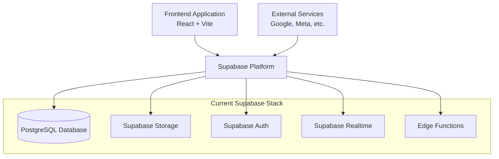

### Target Architecture (AWS)

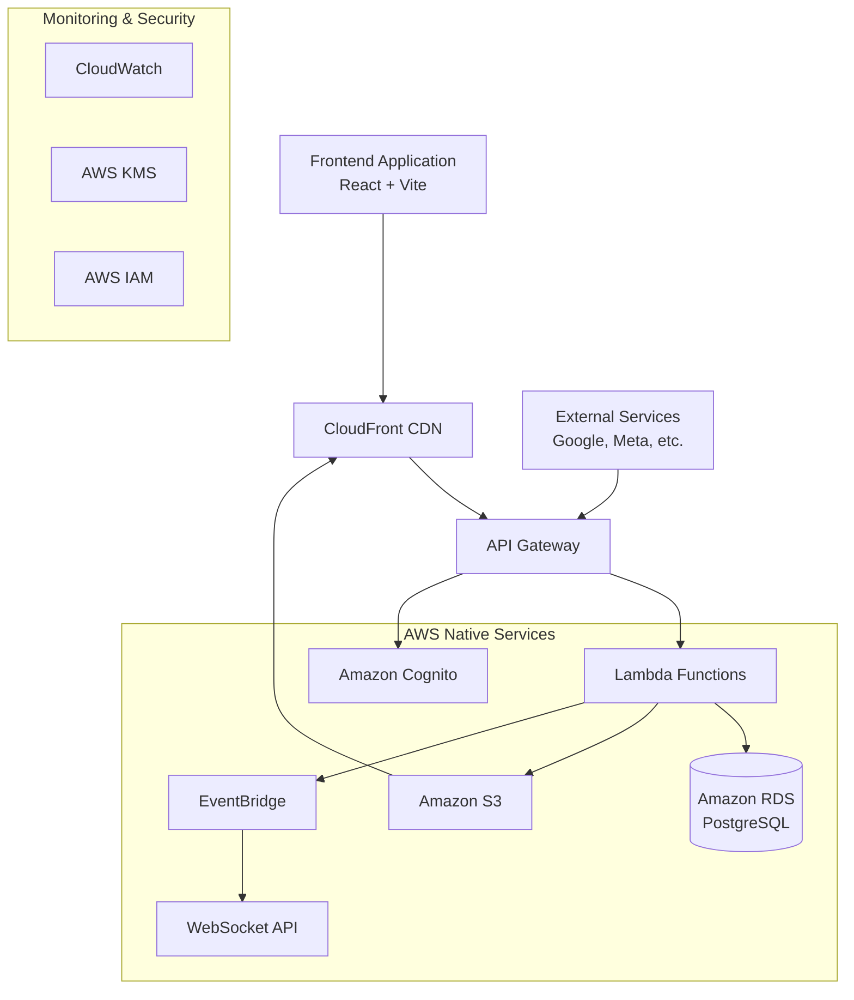

## Component Migration Design

### 1. Database Migration Design

#### Current State Analysis

- **Service:** Supabase PostgreSQL (managed)
- **Data Volume:** ~50GB structured data
- **Tables:** ~45 tables with complex relationships
- **Features:** Row Level Security (RLS), real-time subscriptions, JSONB columns
- **Performance:** ~100ms average query response time
- **Connections:** ~200 concurrent connections peak

#### Target State Specification

- **Service:** Amazon RDS PostgreSQL 15.x
- **Instance Type:** db.r6g.large (initial), scalable to db.r6g.xlarge
- **Configuration:**
  - Multi-AZ deployment for high availability
  - Read replicas in eu-central-1a and eu-central-1b
  - Automated backups with 7-day retention
  - Performance Insights enabled
  - Enhanced monitoring activated

#### Migration Strategy

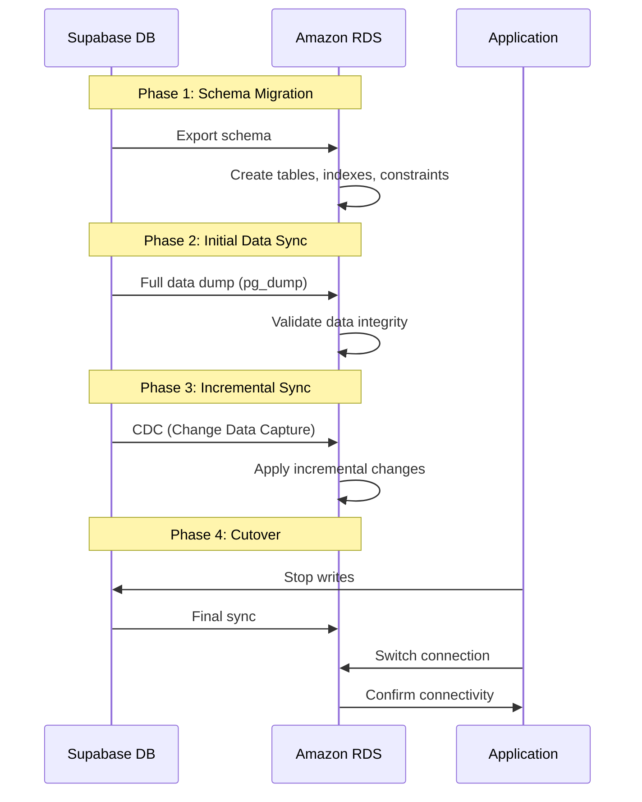

### 2. Authentication Migration Design

#### Current State Analysis

- **Service:** Supabase Auth
- **Users:** ~10,000 registered users
- **Features:** Email/password, OAuth (Google, Facebook), JWT tokens
- **Sessions:** ~1,000 concurrent sessions
- **MFA:** Enabled for ~15% of users

#### Target State Specification

- **Service:** Amazon Cognito User Pools
- **Configuration:**
  - Custom attributes for user metadata
  - Password policies matching current requirements
  - OAuth 2.0 integration with existing providers
  - MFA support (SMS, TOTP)
  - Lambda triggers for custom authentication flows

#### Migration Strategy

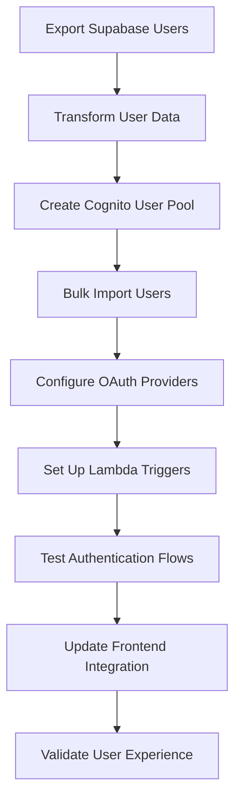

### 3. Storage Migration Design

#### Current State Analysis

- **Service:** Supabase Storage
- **Data Volume:** ~500GB files (images, documents, media)
- **Features:** Image transformations, access control, CDN
- **Performance:** ~2s upload time for 10MB files
- **Access Patterns:** 70% read, 30% write operations

#### Target State Specification

- **Primary Storage:** Amazon S3 with intelligent tiering
- **CDN:** CloudFront with global edge locations
- **Processing:** Lambda@Edge for image transformations
- **Configuration:**
  - Versioning enabled for critical files
  - Lifecycle policies for cost optimization
  - Cross-region replication for disaster recovery
  - Server-side encryption with KMS

#### Migration Strategy

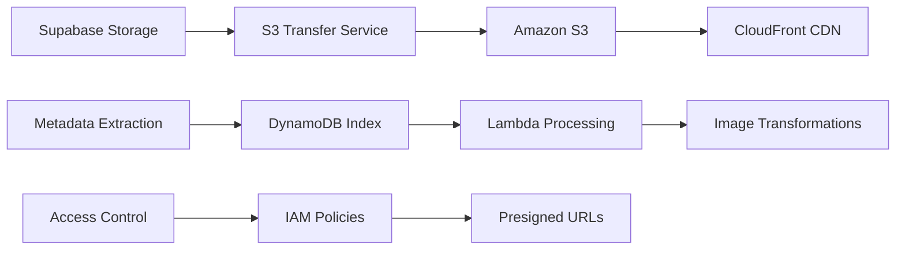

### 4. Real-time Migration Design

#### Current State Analysis

- **Service:** Supabase Realtime
- **Features:** Database change streams, presence, broadcast
- **Connections:** ~500 concurrent WebSocket connections
- **Message Volume:** ~10,000 messages/hour
- **Latency:** ~200ms average message delivery

#### Target State Specification

- **Event Bus:** Amazon EventBridge for event routing
- **WebSocket:** API Gateway WebSocket API
- **Processing:** Lambda functions for message handling
- **Storage:** DynamoDB for connection management
- **Configuration:**
  - Auto-scaling for Lambda functions
  - Dead letter queues for failed messages
  - CloudWatch monitoring for performance

#### Migration Strategy

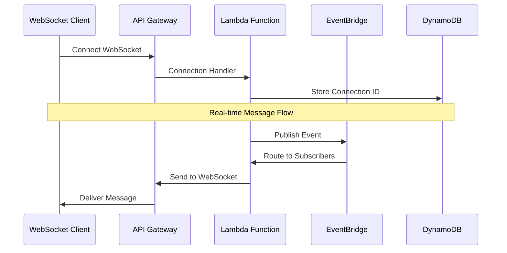

### 5. Edge Functions Migration Design

#### Current State Analysis

- **Service:** Supabase Edge Functions (Deno runtime)
- **Functions:** ~20 serverless functions
- **Use Cases:** API endpoints, scheduled tasks, webhooks
- **Performance:** ~300ms average execution time
- **Triggers:** HTTP requests, database events, scheduled

#### Target State Specification

- **Service:** AWS Lambda (Node.js 20.x runtime)
- **Integration:** API Gateway for HTTP triggers
- **Scheduling:** EventBridge rules for cron jobs
- **Configuration:**
  - Memory allocation optimized per function
  - Environment variables for configuration
  - VPC integration where needed
  - X-Ray tracing enabled

#### Migration Strategy

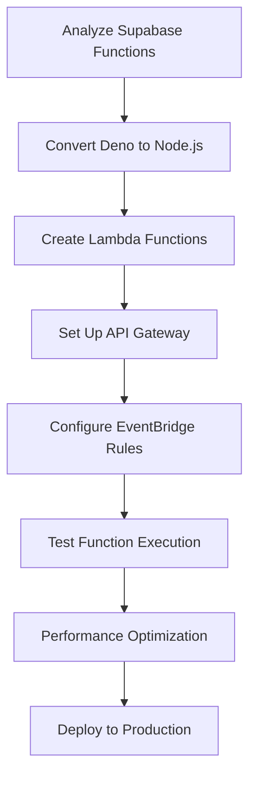

## Data Flow Design

### Authentication Flow

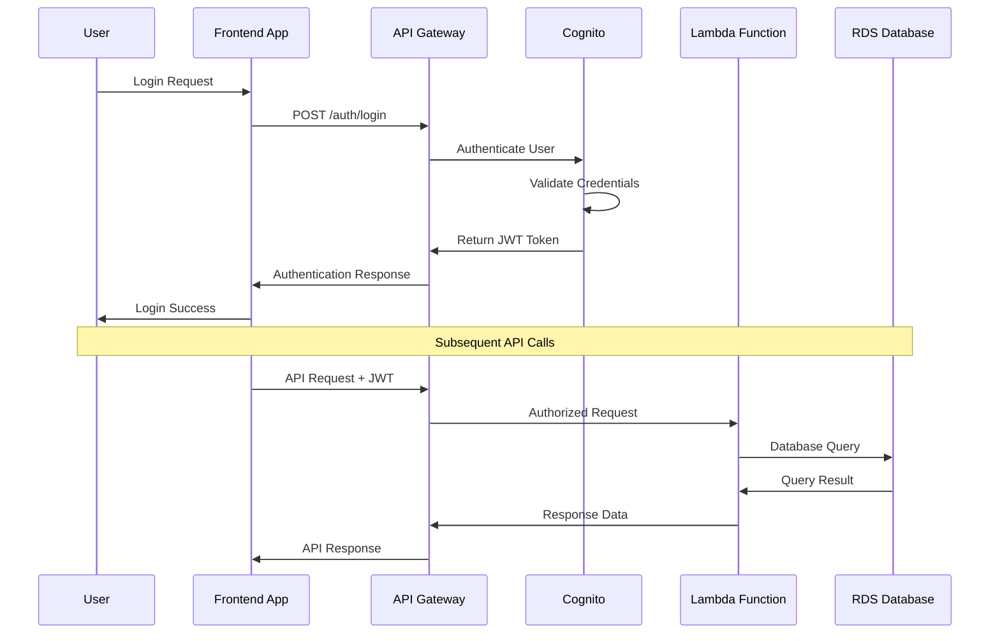

### File Upload Flow

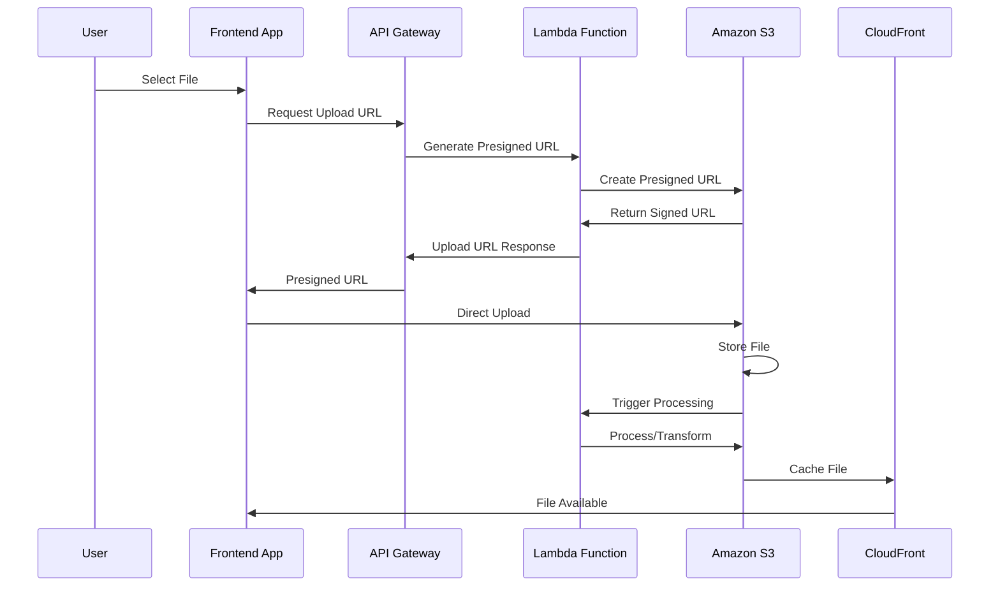

### Real-time Event Flow

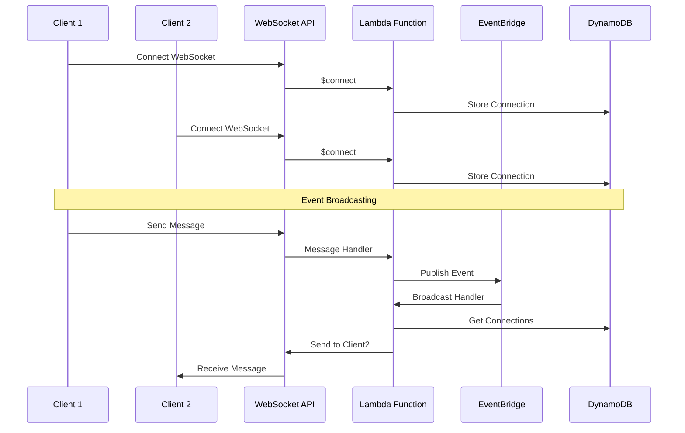

## Security Design

### Network Security Architecture

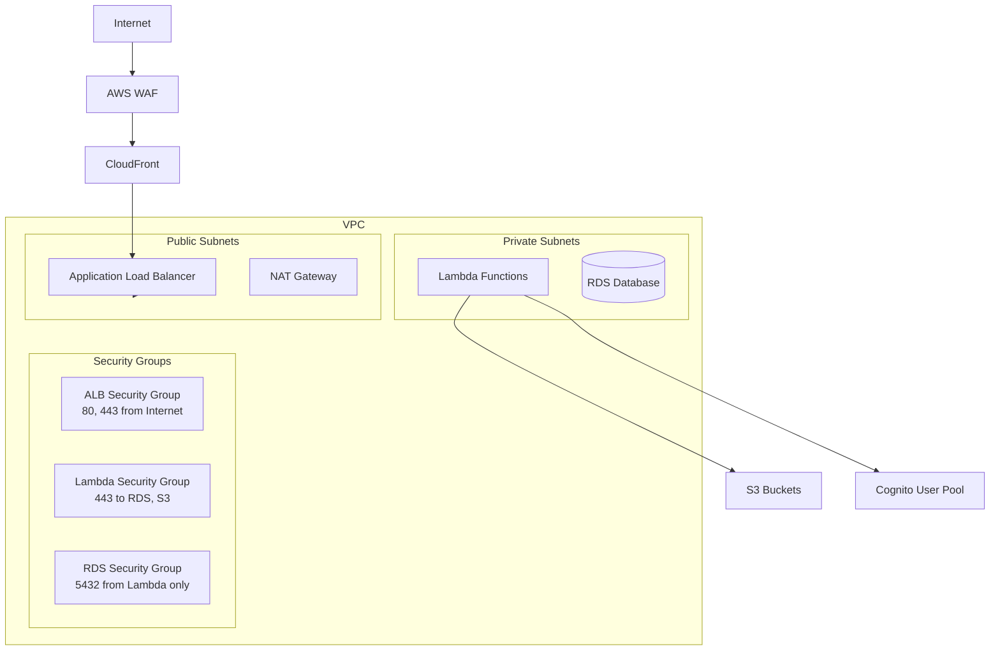

### Data Encryption Strategy

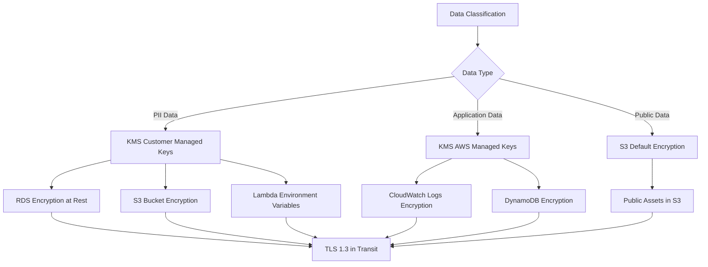

### Access Control Design

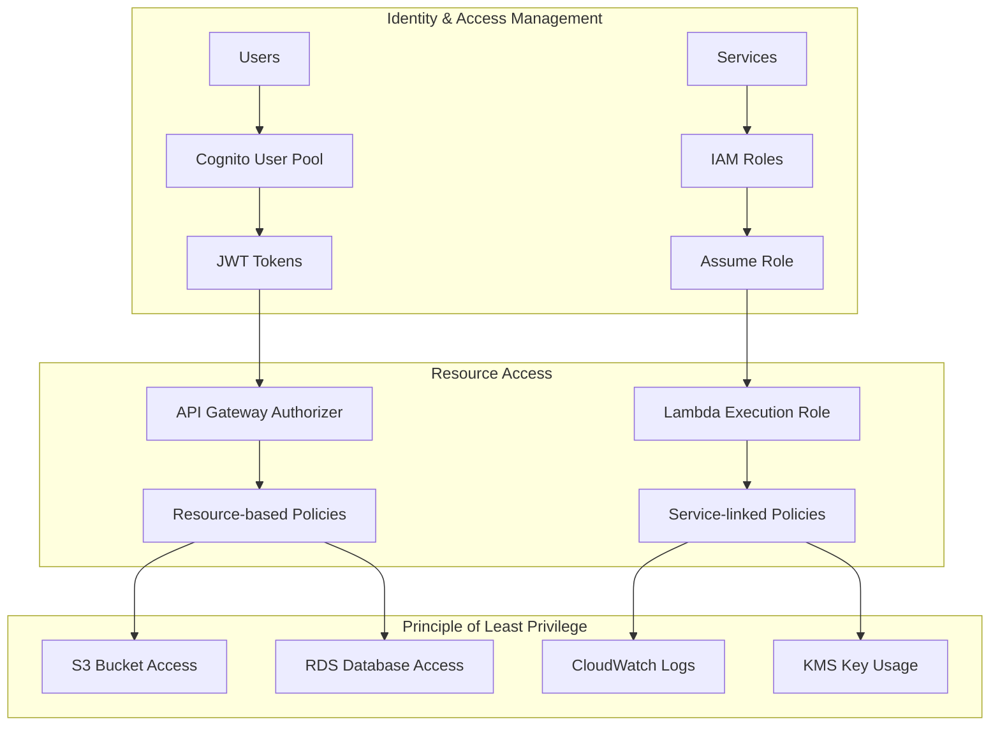

## Monitoring and Observability Design

### Comprehensive Monitoring Stack

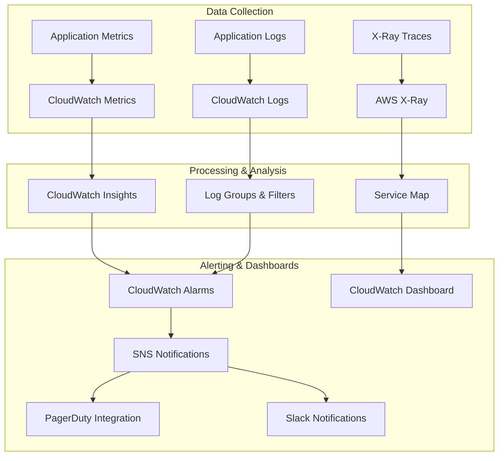

### Key Performance Indicators (KPIs)

```yaml
Database Performance:
  - Query Response Time P95: < 100ms
  - Connection Pool Utilization: < 80%
  - Read Replica Lag: < 5 seconds
  - Database CPU Utilization: < 70%

API Performance:
  - API Gateway Latency P95: < 200ms
  - Lambda Cold Start Rate: < 5%
  - Lambda Duration P95: < 1000ms
  - API Error Rate: < 1%

Storage Performance:
  - S3 Upload Success Rate: > 99.9%
  - CloudFront Cache Hit Rate: > 80%
  - File Processing Time P95: < 5 seconds
  - Storage Cost per GB: < $0.025

Real-time Performance:
  - WebSocket Connection Success Rate: > 99%
  - Message Delivery Latency P95: < 500ms
  - Concurrent Connection Capacity: > 1000
  - Event Processing Rate: > 100/second

Security Metrics:
  - Authentication Success Rate: > 99%
  - Failed Login Attempts: < 100/hour
  - Security Scan Results: 0 critical vulnerabilities
  - Compliance Score: 100%
```

## Disaster Recovery Design

### Multi-Region Backup Strategy

```mermaid
graph TB
    subgraph "Primary Region (eu-central-1)"
        RDS1[(RDS Primary)]
        S3Primary[S3 Primary Bucket]
        Lambda1[Lambda Functions]
    end

    subgraph "Secondary Region (eu-west-1)"
        RDS2[(RDS Read Replica)]
        S3Secondary[S3 Cross-Region Replica]
        Lambda2[Lambda Functions (Standby)]
    end

    RDS1 -->|Automated Backups| RDS2
    S3Primary -->|Cross-Region Replication| S3Secondary
    Lambda1 -->|Code Deployment| Lambda2

    subgraph "Recovery Procedures"
        Route53[Route 53 Health Checks]
        Route53 -->|Failover| DNS[DNS Failover]
        DNS --> LoadBalancer[Load Balancer Switch]
    end
```

### Recovery Time Objectives (RTO) and Recovery Point Objectives (RPO)

```yaml
Service Recovery Targets:
  Database:
    RTO: 15 minutes
    RPO: 1 minute
    Method: Automated failover to read replica

  File Storage:
    RTO: 5 minutes
    RPO: 15 minutes
    Method: CloudFront origin failover

  API Services:
    RTO: 10 minutes
    RPO: 0 minutes (stateless)
    Method: Multi-region Lambda deployment

  Authentication:
    RTO: 5 minutes
    RPO: 0 minutes
    Method: Cognito global service

  Real-time Services:
    RTO: 20 minutes
    RPO: 5 minutes
    Method: EventBridge cross-region replication
```

## Cost Optimization Design

### Resource Right-Sizing Strategy

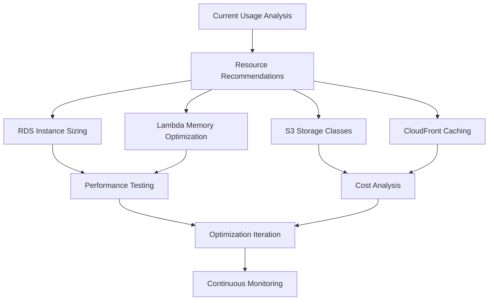

### Cost Monitoring and Alerts

```yaml
Cost Controls:
  Budget Alerts:
    - Monthly Budget: €5,000
    - Warning Threshold: 80% (€4,000)
    - Critical Threshold: 95% (€4,750)

  Service-Level Budgets:
    - RDS: €2,000/month
    - Lambda: €1,000/month
    - S3 + CloudFront: €1,500/month
    - Other Services: €500/month

  Optimization Triggers:
    - Cost increase > 20% month-over-month
    - Unused resources detected
    - Performance degradation with cost increase

  Automated Actions:
    - Scale down non-production environments
    - Archive old data to cheaper storage classes
    - Optimize Lambda memory allocation
    - Review and remove unused resources
```

## Implementation Phases

### Phase 1: Foundation Setup (Week 1)

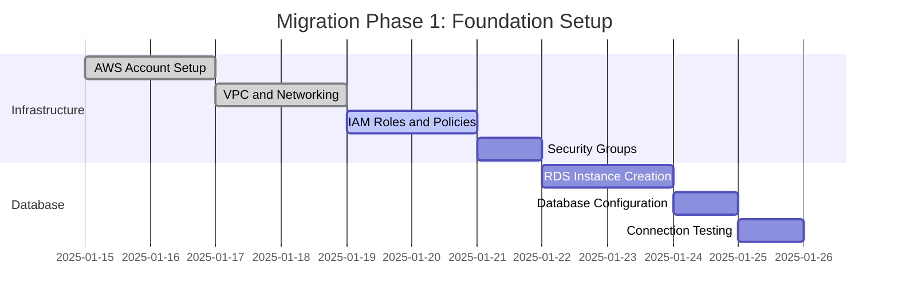

### Phase 2: Data Migration (Week 2)

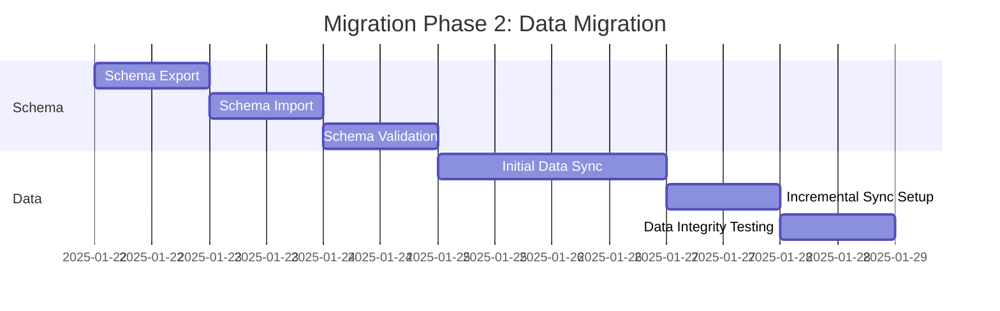

### Phase 3: Service Migration (Week 3-4)

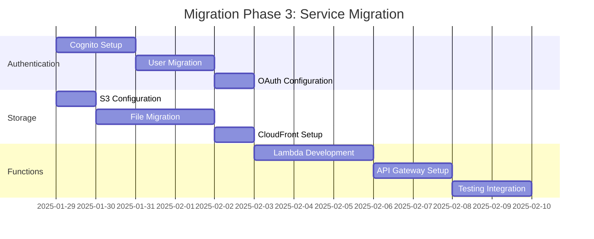

This comprehensive design document provides the architectural foundation for migrating from Supabase to AWS while ensuring zero data loss, minimal downtime, and improved performance. The design emphasizes security, scalability, and cost optimization while maintaining compliance with GDPR and other regulatory requirements.
