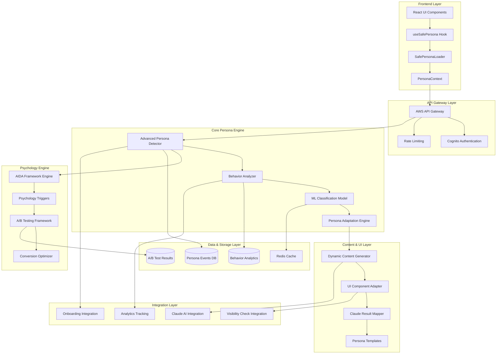

# Advanced Persona System Design

## Architecture Overview

Das Advanced Persona System ist als modulare, skalierbare Architektur konzipiert, die nahtlos in die bestehende matbakh.app Infrastruktur integriert wird. Das System basiert auf einem Event-driven Architecture Pattern mit Real-time Persona Detection und Adaptive Content Delivery.

### High-Level Architecture



## Core Components

### 1. Advanced Persona Detector

**Zweck**: Zentrale Engine für Persona-Erkennung und -Anpassung

**Komponenten**:
- `BehaviorAnalyzer`: Analysiert User-Verhalten in Echtzeit
- `PersonaClassificationModel`: ML-basierte Klassifikation
- `PersonaAdaptationEngine`: Kontinuierliche Anpassung basierend auf neuen Daten

**Algorithmus**:
```typescript
interface PersonaDetectionAlgorithm {
  // 1. Behavior Collection
  collectBehavior(userId: string): UserBehavior;
  
  // 2. Feature Extraction
  extractFeatures(behavior: UserBehavior): FeatureVector;
  
  // 3. ML Classification
  classifyPersona(features: FeatureVector): PersonaClassification;
  
  // 4. Confidence Scoring
  calculateConfidence(classification: PersonaClassification): number;
  
  // 5. Adaptation Logic
  adaptPersona(current: PersonaType, newBehavior: UserBehavior): AdaptationResult;
}
```

### 2. Psychology Engine

**Zweck**: Implementierung von Behavioral Economics und Psychology Triggers

**AIDA Framework Integration**:
```typescript
interface AidaOptimization {
  attention: {
    headline: string;
    visualElements: string[];
    curiosityTriggers: string[];
  };
  interest: {
    socialProof: string[];
    trustSignals: string[];
    valueProposition: string;
  };
  desire: {
    lossAversion: string[];
    decoyEffect: PricingTier[];
    urgencyTriggers: string[];
  };
  action: {
    cta: string;
    frictionReduction: string[];
    commitmentDevices: string[];
  };
}
```

**Psychology Triggers**:
- **Social Proof**: Testimonials, Nutzerzahlen, Reviews
- **Loss Aversion**: "Verpassen Sie nicht...", Limited Time Offers
- **Decoy Effect**: Strategische Preisgestaltung mit 3 Optionen
- **Anchoring**: Hohe Referenzwerte als Ausgangspunkt
- **Reciprocity**: Kostenlose Werte vor Kaufaufforderung
- **Authority**: Expertenmeinungen und Zertifizierungen
- **Commitment**: Kleine Commitments führen zu größeren
- **Scarcity**: Begrenzte Verfügbarkeit und Exklusivität

### 3. Behavioral Analysis Engine

**Zweck**: Kontinuierliche Analyse und Interpretation von Nutzerverhalten

**Tracking Dimensionen**:
```typescript
interface BehaviorTracking {
  clickPatterns: {
    frequency: number;
    hesitation: number;
    precision: number;
  };
  navigationFlow: {
    pathComplexity: number;
    backtrackingRate: number;
    explorationDepth: number;
  };
  contentInteraction: {
    readingSpeed: number;
    scrollBehavior: 'fast' | 'moderate' | 'thorough';
    engagementLevel: number;
  };
  decisionMaking: {
    speed: 'impulsive' | 'moderate' | 'deliberate';
    informationSeeking: number;
    comparisonBehavior: number;
  };
}
```

### 4. Onboarding Integration System

**Zweck**: Persona-spezifische Onboarding-Flows

**Adaptive Onboarding Paths**:
```typescript
interface OnboardingPersonaProfile {
  detected_persona: PersonaType;
  confidence: number;
  onboarding_stage: 'discovery' | 'setup' | 'first_success' | 'adoption';
  completion_rate: number;
  personalized_path: OnboardingStep[];
  success_indicators: {
    feature_discovery: number;
    task_completion: number;
    engagement_level: number;
    satisfaction_score: number;
  };
}
```

**Persona-spezifische Onboarding-Strategien**:

- **Solo-Sarah (Zeitknappe)**:
  - 2-Minuten Quick Setup
  - Sofortige Ergebnisse
  - Ein-Klick Verbesserungen
  - Minimal viable onboarding

- **Bewahrer-Ben (Überforderte)**:
  - Persönliche Einführung
  - Schritt-für-Schritt Anleitung
  - Sicherheit & Datenschutz Erklärung
  - Umfassende Unterstützung

- **Wachstums-Walter (Profi)**:
  - Strategische Standortbestimmung
  - Individueller Wachstumsplan
  - ROI-Tracking Setup
  - Datenbasierte Entscheidungen

- **Ketten-Katrin (Enterprise)**:
  - Enterprise Beratungsgespräch
  - System-Integration & Setup
  - Team-Schulung & Rollout
  - Multi-Location Management

## Data Models

### Persona Events Schema

```sql
-- Persona Events Tracking
CREATE TABLE persona_events (
    id UUID PRIMARY KEY DEFAULT gen_random_uuid(),
    user_id UUID NOT NULL REFERENCES auth.users(id),
    session_id VARCHAR(255) NOT NULL,
    event_type VARCHAR(50) NOT NULL, -- 'detection', 'adaptation', 'override'
    persona_before VARCHAR(50),
    persona_after VARCHAR(50) NOT NULL,
    confidence_score DECIMAL(3,2) NOT NULL,
    behavior_data JSONB NOT NULL,
    trigger_reason VARCHAR(255),
    created_at TIMESTAMPTZ DEFAULT NOW(),
    
    -- Indexes for performance
    INDEX idx_persona_events_user_id (user_id),
    INDEX idx_persona_events_session (session_id),
    INDEX idx_persona_events_created (created_at),
    INDEX idx_persona_events_persona (persona_after)
);

-- A/B Test Variants for Persona Optimization
CREATE TABLE ab_test_variants (
    id UUID PRIMARY KEY DEFAULT gen_random_uuid(),
    test_name VARCHAR(255) NOT NULL,
    variant_name VARCHAR(100) NOT NULL,
    persona_type VARCHAR(50) NOT NULL,
    configuration JSONB NOT NULL,
    traffic_allocation DECIMAL(3,2) NOT NULL DEFAULT 0.5,
    is_active BOOLEAN DEFAULT true,
    created_at TIMESTAMPTZ DEFAULT NOW(),
    
    UNIQUE(test_name, variant_name, persona_type)
);

-- Conversion Tracking per Persona
CREATE TABLE persona_conversions (
    id UUID PRIMARY KEY DEFAULT gen_random_uuid(),
    user_id UUID NOT NULL REFERENCES auth.users(id),
    persona_type VARCHAR(50) NOT NULL,
    conversion_type VARCHAR(100) NOT NULL, -- 'signup', 'upgrade', 'feature_adoption'
    conversion_value DECIMAL(10,2),
    ab_test_variant VARCHAR(100),
    psychology_triggers JSONB,
    aida_phase VARCHAR(20), -- 'attention', 'interest', 'desire', 'action'
    created_at TIMESTAMPTZ DEFAULT NOW(),
    
    INDEX idx_conversions_persona (persona_type),
    INDEX idx_conversions_type (conversion_type),
    INDEX idx_conversions_created (created_at)
);

-- Testimonials with Persona Targeting
CREATE TABLE testimonials (
    id UUID PRIMARY KEY DEFAULT gen_random_uuid(),
    content TEXT NOT NULL,
    author_name VARCHAR(255) NOT NULL,
    author_title VARCHAR(255),
    author_company VARCHAR(255),
    target_personas VARCHAR(50)[] NOT NULL,
    credibility_score INTEGER DEFAULT 5,
    usage_context VARCHAR(100), -- 'onboarding', 'pricing', 'features'
    is_approved BOOLEAN DEFAULT false,
    created_at TIMESTAMPTZ DEFAULT NOW(),
    
    INDEX idx_testimonials_personas (target_personas),
    INDEX idx_testimonials_context (usage_context),
    INDEX idx_testimonials_approved (is_approved)
);
```

### Behavior Analytics Schema

```sql
-- User Behavior Sessions
CREATE TABLE behavior_sessions (
    id UUID PRIMARY KEY DEFAULT gen_random_uuid(),
    user_id UUID NOT NULL REFERENCES auth.users(id),
    session_id VARCHAR(255) NOT NULL,
    device_type VARCHAR(50) NOT NULL,
    user_agent TEXT,
    ip_address INET,
    session_start TIMESTAMPTZ DEFAULT NOW(),
    session_end TIMESTAMPTZ,
    total_duration INTEGER, -- seconds
    page_views INTEGER DEFAULT 0,
    interactions INTEGER DEFAULT 0,
    
    INDEX idx_behavior_sessions_user (user_id),
    INDEX idx_behavior_sessions_start (session_start)
);

-- Detailed Interaction Events
CREATE TABLE interaction_events (
    id UUID PRIMARY KEY DEFAULT gen_random_uuid(),
    session_id UUID NOT NULL REFERENCES behavior_sessions(id),
    event_type VARCHAR(50) NOT NULL, -- 'click', 'scroll', 'hover', 'form_input'
    element_id VARCHAR(255),
    element_type VARCHAR(100),
    page_path VARCHAR(500),
    timestamp TIMESTAMPTZ DEFAULT NOW(),
    event_data JSONB,
    
    INDEX idx_interaction_events_session (session_id),
    INDEX idx_interaction_events_type (event_type),
    INDEX idx_interaction_events_timestamp (timestamp)
);
```

## Integration Architecture

### Frontend Integration

**Safe Provider Pattern**:
```typescript
// Integration in AppProviders.tsx
export function AppProviders({ children }: { children: ReactNode }) {
  return (
    <ErrorBoundary>
      <AuthProvider>
        <TranslationProvider>
          <PersonaProviderIntegration>
            <QueryClient>
              {children}
            </QueryClient>
          </PersonaProviderIntegration>
        </TranslationProvider>
      </AuthProvider>
    </ErrorBoundary>
  );
}
```

**Component Usage Pattern**:
```typescript
// Persona-aware component
function VCResultPage() {
  return (
    <SafePersonaLoader
      requirePersona={false}
      enableBehaviorTracking={true}
      onPersonaDetected={(persona, confidence) => {
        // Track persona detection
        analytics.track('persona_detected', { persona, confidence });
      }}
    >
      {(persona) => (
        <VCResultContent 
          persona={persona.currentPersona}
          confidence={persona.confidence}
          onboardingProfile={persona.onboardingProfile}
        />
      )}
    </SafePersonaLoader>
  );
}
```

### Backend Integration

**Lambda Function Architecture**:
```typescript
// Main Lambda Handler
export const handler = async (event: APIGatewayProxyEvent): Promise<APIGatewayProxyResult> => {
  try {
    const detector = new AdvancedPersonaDetector();
    const behaviorEngine = new BehaviorAnalysisEngine();
    const psychologyEngine = new PsychologyOptimizationEngine();
    
    // Extract user behavior from request
    const behavior = await behaviorEngine.extractBehavior(event);
    
    // Detect or adapt persona
    const personaResult = await detector.detectPersona(behavior);
    
    // Generate psychology-optimized response
    const optimizedResponse = await psychologyEngine.optimize(personaResult);
    
    return {
      statusCode: 200,
      headers: {
        'Content-Type': 'application/json',
        'Access-Control-Allow-Origin': '*'
      },
      body: JSON.stringify({
        success: true,
        data: {
          ...personaResult,
          aidaRecommendations: optimizedResponse.aida,
          psychologyTriggers: optimizedResponse.triggers,
          onboardingProfile: optimizedResponse.onboarding
        }
      })
    };
  } catch (error) {
    console.error('Persona detection error:', error);
    return {
      statusCode: 500,
      body: JSON.stringify({
        success: false,
        error: {
          code: 'PERSONA_DETECTION_ERROR',
          message: error.message
        }
      })
    };
  }
};
```

## Security & Privacy Design

### Data Protection

**Privacy by Design Principles**:
1. **Data Minimization**: Nur notwendige Daten sammeln
2. **Purpose Limitation**: Daten nur für definierte Zwecke verwenden
3. **Storage Limitation**: Automatische Löschung nach Retention-Period
4. **Transparency**: Klare Kommunikation über Datenverwendung
5. **User Control**: Nutzer können Datensammlung kontrollieren

**Consent Management**:
```typescript
interface PersonaConsent {
  userId: string;
  consentType: 'behavioral_tracking' | 'persona_detection' | 'content_personalization';
  granted: boolean;
  timestamp: string;
  version: string;
  source: 'web' | 'mobile' | 'api';
}
```

### Security Measures

**Authentication & Authorization**:
- JWT-basierte Authentifizierung über AWS Cognito
- Role-based Access Control für Admin-Funktionen
- API Rate Limiting pro User und IP
- Request Validation und Sanitization

**Data Encryption**:
- End-to-End Verschlüsselung für sensitive Persona-Daten
- KMS-basierte Schlüsselverwaltung
- Verschlüsselte Datenübertragung (TLS 1.3)
- Encrypted-at-Rest für alle Datenbanken

## Performance & Scalability

### Performance Targets

- **Persona Detection**: <2 Sekunden
- **UI Adaptation**: <500ms
- **API Response**: <1 Sekunde
- **Throughput**: 1000+ concurrent requests
- **Availability**: 99.9% uptime

### Scalability Strategy

**Horizontal Scaling**:
- Auto-scaling Lambda functions
- Multi-AZ database deployment
- CDN für statische Assets
- Load balancing für API endpoints

**Caching Strategy**:
```typescript
interface CachingLayers {
  // L1: In-Memory Cache (Lambda)
  memoryCache: Map<string, PersonaDetectionResult>;
  
  // L2: Redis Cache (Cross-Lambda)
  redisCache: {
    ttl: 3600; // 1 hour
    keyPattern: 'persona:{userId}:{sessionId}';
  };
  
  // L3: Database Cache (Persistent)
  dbCache: {
    ttl: 86400; // 24 hours
    table: 'persona_cache';
  };
}
```

### Cost Optimization

**Resource Management**:
- Intelligent provider selection (Claude vs. Gemini)
- Request batching für ML-Inferenz
- Lazy loading für UI-Komponenten
- Efficient database queries mit Indexing

**Monitoring & Alerting**:
- CloudWatch Metrics für alle Services
- Cost tracking pro Feature und Persona
- Performance monitoring mit X-Ray
- Automated alerting bei Anomalien

## Testing Strategy

### Test Pyramid

**Unit Tests (70%)**:
- Persona detection algorithms
- Behavior analysis functions
- Psychology trigger logic
- UI component rendering

**Integration Tests (20%)**:
- API endpoint testing
- Database integration
- External service mocking
- End-to-end persona flows

**E2E Tests (10%)**:
- Complete user journeys
- Cross-browser compatibility
- Performance testing
- Security penetration testing

### Test Data Strategy

**Synthetic Data Generation**:
```typescript
interface TestPersonaProfiles {
  'Solo-Sarah': {
    behaviorPatterns: SyntheticBehavior[];
    expectedOutcomes: PersonaDetectionResult[];
    edgeCases: EdgeCaseScenario[];
  };
  // ... other personas
}
```

**A/B Testing Framework**:
- Statistical significance calculation
- Automated test result analysis
- Gradual rollout mechanisms
- Rollback capabilities

## Deployment & Operations

### CI/CD Pipeline

```yaml
# GitHub Actions Workflow
name: Advanced Persona System Deployment
on:
  push:
    branches: [main]
    paths: ['infra/lambdas/advanced-persona-system/**']

jobs:
  test:
    runs-on: ubuntu-latest
    steps:
      - name: Run Unit Tests
        run: npm test
      - name: Run Integration Tests
        run: npm run test:integration
      - name: Security Scan
        run: npm audit

  deploy:
    needs: test
    runs-on: ubuntu-latest
    steps:
      - name: Deploy Lambda Functions
        run: ./deploy.sh
      - name: Update Database Schema
        run: npm run migrate
      - name: Smoke Tests
        run: npm run test:smoke
```

### Monitoring & Observability

**Metrics Collection**:
- Persona detection accuracy
- Response time percentiles
- Error rates per endpoint
- User satisfaction scores
- Conversion rate improvements

**Alerting Rules**:
- Persona detection accuracy <85%
- API response time >2 seconds
- Error rate >1%
- Cost threshold exceeded
- Security anomalies detected

### Rollback Strategy

**Blue-Green Deployment**:
- Zero-downtime deployments
- Automated health checks
- Instant rollback capabilities
- Canary releases für neue Features

**Data Migration Safety**:
- Backward-compatible schema changes
- Data validation before migration
- Rollback scripts für alle Änderungen
- Backup verification procedures