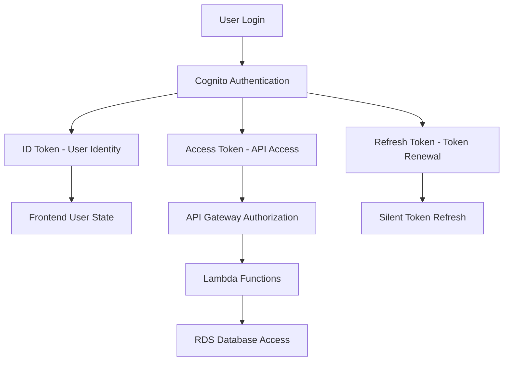

# Cognito Authentication Design Specification
**Spec ID:** AWS-FRONTEND-COGNITO-AUTH  
**Version:** 1.0  
**Date:** 2025-08-30  
**Owner:** CTO  
**Status:** Design Phase  

## Executive Summary

This specification defines the complete authentication architecture for matbakh.app using Amazon Cognito as the identity provider. The design covers frontend integration (React), backend authorization (API Gateway + Lambda), and database synchronization (RDS PostgreSQL) to replace the existing Supabase Auth system.

## 1. Authentication Method Decision

### 1.1 Hosted UI vs. Embedded Login Analysis

| Aspect | Hosted UI | Embedded Login |
|--------|-----------|----------------|
| **Development Speed** | ⚡ Fast (AWS managed) | 🐌 Slower (custom implementation) |
| **Brand Consistency** | 🟡 Limited customization | ✅ Full brand control |
| **Security** | ✅ AWS managed, SOC2 compliant | 🟡 Custom implementation risks |
| **User Experience** | 🟡 Redirect flow | ✅ Seamless single-page experience |
| **Maintenance** | ✅ AWS handles updates | 🔧 Manual maintenance required |
| **OAuth Integration** | ✅ Built-in Google/Facebook | 🔧 Manual OAuth implementation |
| **Mobile Support** | ✅ Responsive out-of-box | 🔧 Custom responsive design |

### 1.2 Recommendation: **Embedded Login with Amplify UI**

**Decision:** Use AWS Amplify UI Components for embedded authentication

**Rationale:**
- **Brand Consistency:** matbakh.app needs consistent branding throughout the user journey
- **User Experience:** Single-page flow reduces friction for restaurant owners
- **Customization:** Full control over styling and user flow
- **Security:** Amplify UI provides secure, tested components
- **Future-Proof:** Easy to extend with custom features

```typescript
// Implementation approach
import { Authenticator } from '@aws-amplify/ui-react';
import { Amplify } from 'aws-amplify';

// Custom theme for matbakh.app branding
const theme = {
  name: 'matbakh-theme',
  tokens: {
    colors: {
      brand: {
        primary: { 10: '#2563eb', 80: '#1d4ed8', 90: '#1e40af' }
      }
    }
  }
};
```

## 2. Token Management Architecture

### 2.1 Token Types and Usage



### 2.2 Token Specifications

#### ID Token (JWT)
- **Purpose:** User identity and profile information
- **Expiry:** 1 hour
- **Storage:** Memory only (React state)
- **Claims:**
  ```json
  {
    "sub": "cognito-user-id",
    "email": "user@example.com",
    "given_name": "John",
    "family_name": "Doe",
    "custom:user_role": "owner",
    "custom:locale": "de",
    "custom:profile_complete": "true",
    "custom:business_id": "uuid",
    "aud": "cognito-app-client-id",
    "exp": 1693440000,
    "iat": 1693436400
  }
  ```

#### Access Token
- **Purpose:** API Gateway authorization
- **Expiry:** 1 hour
- **Storage:** Memory only (React state)
- **Scope:** `aws.cognito.signin.user.admin`

#### Refresh Token
- **Purpose:** Silent token renewal
- **Expiry:** 30 days
- **Storage:** Secure HttpOnly cookie (production) or localStorage (development)
- **Rotation:** New refresh token issued on each use

### 2.3 Token Security Implementation

```typescript
// Token storage strategy
class TokenManager {
  private idToken: string | null = null;
  private accessToken: string | null = null;
  
  // Store tokens in memory only
  setTokens(tokens: CognitoTokens) {
    this.idToken = tokens.idToken;
    this.accessToken = tokens.accessToken;
    
    // Refresh token in secure cookie (production)
    if (process.env.NODE_ENV === 'production') {
      document.cookie = `refreshToken=${tokens.refreshToken}; Secure; HttpOnly; SameSite=Strict; Max-Age=2592000`;
    } else {
      localStorage.setItem('refreshToken', tokens.refreshToken);
    }
  }
  
  // Clear all tokens on logout
  clearTokens() {
    this.idToken = null;
    this.accessToken = null;
    document.cookie = 'refreshToken=; expires=Thu, 01 Jan 1970 00:00:00 UTC; path=/;';
    localStorage.removeItem('refreshToken');
  }
}
```

## 3. API Gateway Integration

### 3.1 Authorization Strategy

**Chosen Method:** Cognito User Pool Authorizer (built-in)

**Configuration:**
```json
{
  "authorizerType": "COGNITO_USER_POOLS",
  "userPoolArn": "arn:aws:cognito-idp:eu-central-1:ACCOUNT:userpool/eu-central-1_POOLID",
  "identitySource": "method.request.header.Authorization",
  "authorizerCredentials": null
}
```

### 3.2 JWT Claims Validation

API Gateway automatically validates:
- ✅ Token signature (RSA256)
- ✅ Token expiration (`exp` claim)
- ✅ Token audience (`aud` claim)
- ✅ Token issuer (`iss` claim)

Lambda functions receive validated claims in `event.requestContext.authorizer.claims`:

```typescript
// Lambda function receives validated user context
export const handler = async (event: APIGatewayProxyEvent) => {
  const userClaims = event.requestContext.authorizer?.claims;
  
  const userId = userClaims?.sub;
  const userEmail = userClaims?.email;
  const userRole = userClaims?.['custom:user_role'];
  
  // Use claims for business logic
  if (userRole === 'admin') {
    // Admin-specific logic
  }
};
```

### 3.3 API Request Flow

```typescript
// Frontend API call with authentication
const apiCall = async (endpoint: string, options: RequestInit = {}) => {
  const accessToken = await Auth.currentSession().then(session => 
    session.getAccessToken().getJwtToken()
  );
  
  return fetch(`${API_BASE_URL}${endpoint}`, {
    ...options,
    headers: {
      'Authorization': `Bearer ${accessToken}`,
      'Content-Type': 'application/json',
      ...options.headers
    }
  });
};
```

## 4. User Attribute Mapping

### 4.1 Cognito User Pool Schema

Based on existing configuration in `cognito-user-pool.json`:

```json
{
  "standardAttributes": [
    "email",           // Primary identifier
    "given_name",      // First name
    "family_name",     // Last name  
    "phone_number",    // Phone (optional)
    "picture"          // Avatar URL (optional)
  ],
  "customAttributes": [
    "custom:user_role",        // owner|admin|user
    "custom:locale",           // de|en
    "custom:profile_complete", // true|false
    "custom:onboarding_step",  // 0-5
    "custom:business_id",      // UUID reference
    "custom:supabase_id"       // Migration reference (read-only)
  ]
}
```

### 4.2 Database Synchronization Strategy

**Trigger-Based Synchronization:**
- **Post-Confirmation:** Create initial profile in RDS
- **Post-Authentication:** Update last login timestamp
- **Pre-Token-Generation:** Add custom claims from RDS

```typescript
// Post-Confirmation Lambda (existing implementation enhanced)
export const postConfirmationHandler = async (event: PostConfirmationTriggerEvent) => {
  const { userAttributes, userName } = event.request;
  
  // Create profile in RDS
  await createUserProfile({
    cognitoUserId: userName,
    email: userAttributes.email,
    firstName: userAttributes.given_name,
    lastName: userAttributes.family_name,
    role: userAttributes['custom:user_role'] || 'owner',
    locale: userAttributes['custom:locale'] || 'de',
    businessId: userAttributes['custom:business_id']
  });
  
  // Send welcome email
  await sendWelcomeEmail(userAttributes.email, userAttributes.given_name);
  
  return event;
};
```

### 4.3 Profile Update Synchronization

```typescript
// Bidirectional sync: Cognito ↔ RDS
class ProfileSyncService {
  // Update Cognito attributes from RDS
  async syncTocognito(userId: string, profileData: ProfileData) {
    await cognitoIdentityServiceProvider.adminUpdateUserAttributes({
      UserPoolId: USER_POOL_ID,
      Username: userId,
      UserAttributes: [
        { Name: 'custom:profile_complete', Value: profileData.isComplete.toString() },
        { Name: 'custom:business_id', Value: profileData.businessId },
        { Name: 'custom:onboarding_step', Value: profileData.onboardingStep.toString() }
      ]
    }).promise();
  }
  
  // Update RDS from Cognito attributes
  async syncToDatabase(cognitoUser: CognitoUser) {
    await db.query(`
      UPDATE profiles SET 
        display_name = $1,
        role = $2,
        locale = $3,
        updated_at = NOW()
      WHERE cognito_user_id = $4
    `, [
      cognitoUser.displayName,
      cognitoUser.customAttributes['custom:user_role'],
      cognitoUser.customAttributes['custom:locale'],
      cognitoUser.username
    ]);
  }
}
```

## 5. Session Handling & Timeout

### 5.1 Session Configuration

```typescript
// Amplify configuration
const amplifyConfig = {
  Auth: {
    region: 'eu-central-1',
    userPoolId: 'eu-central-1_POOLID',
    userPoolWebClientId: 'CLIENT_ID',
    
    // Session settings
    cookieStorage: {
      domain: process.env.NODE_ENV === 'production' ? '.matbakh.app' : 'localhost',
      path: '/',
      expires: 30, // 30 days
      secure: process.env.NODE_ENV === 'production',
      sameSite: 'strict'
    },
    
    // Token refresh settings
    refreshHandlers: {
      'custom': async () => {
        // Custom refresh logic if needed
      }
    }
  }
};
```

### 5.2 Session Timeout Strategy

| Token Type | Expiry | Refresh Strategy |
|------------|--------|------------------|
| **ID Token** | 1 hour | Automatic refresh 5 minutes before expiry |
| **Access Token** | 1 hour | Automatic refresh 5 minutes before expiry |
| **Refresh Token** | 30 days | Rotated on each use |

### 5.3 Silent Refresh Implementation

```typescript
// Automatic token refresh
class AuthService {
  private refreshTimer: NodeJS.Timeout | null = null;
  
  async initializeAuth() {
    try {
      const session = await Auth.currentSession();
      this.scheduleTokenRefresh(session);
      return session;
    } catch (error) {
      // Redirect to login if no valid session
      this.redirectToLogin();
    }
  }
  
  private scheduleTokenRefresh(session: CognitoUserSession) {
    const expiresIn = session.getAccessToken().getExpiration() * 1000 - Date.now();
    const refreshTime = Math.max(expiresIn - 5 * 60 * 1000, 0); // 5 minutes before expiry
    
    this.refreshTimer = setTimeout(async () => {
      try {
        const newSession = await Auth.currentSession();
        this.scheduleTokenRefresh(newSession);
      } catch (error) {
        this.redirectToLogin();
      }
    }, refreshTime);
  }
  
  private redirectToLogin() {
    window.location.href = '/login';
  }
}
```

## 6. Multi-Environment Configuration

### 6.1 Environment Separation

```typescript
// Environment-specific configuration
interface EnvironmentConfig {
  cognito: {
    region: string;
    userPoolId: string;
    userPoolWebClientId: string;
    domain?: string; // For hosted UI if needed later
  };
  api: {
    baseUrl: string;
    region: string;
  };
  features: {
    mfaEnabled: boolean;
    socialProvidersEnabled: boolean;
  };
}

const configs: Record<string, EnvironmentConfig> = {
  development: {
    cognito: {
      region: 'eu-central-1',
      userPoolId: 'eu-central-1_DEV_POOL',
      userPoolWebClientId: 'dev-client-id'
    },
    api: {
      baseUrl: 'https://dev-api.matbakh.app',
      region: 'eu-central-1'
    },
    features: {
      mfaEnabled: false,
      socialProvidersEnabled: false
    }
  },
  production: {
    cognito: {
      region: 'eu-central-1',
      userPoolId: 'eu-central-1_PROD_POOL',
      userPoolWebClientId: 'prod-client-id'
    },
    api: {
      baseUrl: 'https://api.matbakh.app',
      region: 'eu-central-1'
    },
    features: {
      mfaEnabled: true,
      socialProvidersEnabled: true
    }
  }
};
```

### 6.2 Environment Variables Template

```json
{
  "development": {
    "VITE_AWS_REGION": "eu-central-1",
    "VITE_COGNITO_USER_POOL_ID": "eu-central-1_DEV_POOL",
    "VITE_COGNITO_USER_POOL_WEB_CLIENT_ID": "dev-client-id",
    "VITE_API_BASE_URL": "https://dev-api.matbakh.app",
    "VITE_ENVIRONMENT": "development"
  },
  "production": {
    "VITE_AWS_REGION": "eu-central-1",
    "VITE_COGNITO_USER_POOL_ID": "eu-central-1_PROD_POOL",
    "VITE_COGNITO_USER_POOL_WEB_CLIENT_ID": "prod-client-id",
    "VITE_API_BASE_URL": "https://api.matbakh.app",
    "VITE_ENVIRONMENT": "production"
  }
}
```

## 7. Future-Proofing & Extensibility

### 7.1 RBAC Integration Preparation

```typescript
// Role-based access control structure
interface UserRole {
  name: 'owner' | 'admin' | 'manager' | 'staff';
  permissions: Permission[];
  businessScopes: string[]; // Business IDs user can access
}

interface Permission {
  resource: string; // 'visibility_check', 'dashboard', 'settings'
  actions: ('read' | 'write' | 'delete')[];
}

// JWT token will include role information
interface MatbakhJWTClaims {
  sub: string;
  email: string;
  'custom:user_role': string;
  'custom:business_id': string;
  'custom:permissions': string; // JSON-encoded permissions
}
```

### 7.2 OAuth Provider Integration

```typescript
// Social provider configuration (future)
const socialProviders = {
  Google: {
    clientId: 'google-client-id',
    scopes: ['email', 'profile'],
    attributeMapping: {
      email: 'email',
      given_name: 'given_name',
      family_name: 'family_name',
      picture: 'picture'
    }
  },
  Facebook: {
    clientId: 'facebook-app-id',
    scopes: ['email', 'public_profile'],
    attributeMapping: {
      email: 'email',
      given_name: 'first_name',
      family_name: 'last_name'
    }
  }
};
```

### 7.3 Migration Support

```typescript
// Supabase to Cognito migration helper
class MigrationService {
  async migrateUser(supabaseUser: SupabaseUser): Promise<CognitoUser> {
    // Create Cognito user with migration flag
    const cognitoUser = await cognitoIdentityServiceProvider.adminCreateUser({
      UserPoolId: USER_POOL_ID,
      Username: supabaseUser.email,
      UserAttributes: [
        { Name: 'email', Value: supabaseUser.email },
        { Name: 'email_verified', Value: 'true' },
        { Name: 'custom:supabase_id', Value: supabaseUser.id },
        { Name: 'custom:user_role', Value: supabaseUser.role || 'owner' }
      ],
      MessageAction: 'SUPPRESS', // Don't send welcome email
      TemporaryPassword: generateSecurePassword()
    }).promise();
    
    // Force password reset on first login
    await cognitoIdentityServiceProvider.adminSetUserPassword({
      UserPoolId: USER_POOL_ID,
      Username: supabaseUser.email,
      Password: generateSecurePassword(),
      Permanent: false
    }).promise();
    
    return cognitoUser;
  }
}
```

## 8. Implementation Phases

### Phase 1: Core Authentication (Week 1)
- [ ] Set up Amplify UI components
- [ ] Implement token management
- [ ] Create authentication context
- [ ] Basic login/logout functionality

### Phase 2: API Integration (Week 1-2)
- [ ] Configure API Gateway authorizer
- [ ] Update all API calls to use Cognito tokens
- [ ] Implement error handling for auth failures
- [ ] Test token refresh flows

### Phase 3: Profile Synchronization (Week 2)
- [ ] Enhance Cognito Lambda triggers
- [ ] Implement bidirectional sync
- [ ] Create profile update workflows
- [ ] Test data consistency

### Phase 4: Advanced Features (Week 3)
- [ ] Implement MFA support
- [ ] Add password reset flows
- [ ] Create admin user management
- [ ] Performance optimization

## 9. Security Considerations

### 9.1 Security Checklist
- ✅ Tokens stored in memory only (no localStorage for sensitive tokens)
- ✅ Refresh tokens in secure HttpOnly cookies (production)
- ✅ HTTPS enforcement for all authentication flows
- ✅ CSRF protection via SameSite cookies
- ✅ XSS protection via Content Security Policy
- ✅ Token expiration and automatic refresh
- ✅ Secure password policies (8+ chars, mixed case, numbers)
- ✅ MFA support for admin users

### 9.2 Compliance Requirements
- **GDPR:** User consent for data processing, right to deletion
- **SOC2:** AWS Cognito provides SOC2 Type II compliance
- **ISO 27001:** AWS infrastructure compliance
- **Data Residency:** EU-Central-1 region for GDPR compliance

## 10. Testing Strategy

### 10.1 Unit Tests
```typescript
// Authentication service tests
describe('AuthService', () => {
  test('should authenticate user with valid credentials', async () => {
    const result = await authService.signIn('user@example.com', 'password');
    expect(result.isAuthenticated).toBe(true);
  });
  
  test('should refresh tokens automatically', async () => {
    const session = await authService.getCurrentSession();
    expect(session.isValid()).toBe(true);
  });
});
```

### 10.2 Integration Tests
- API Gateway authorization with Cognito tokens
- Database synchronization after user registration
- Token refresh flows
- Error handling scenarios

### 10.3 E2E Tests
- Complete user registration flow
- Login/logout cycles
- Password reset process
- Profile update synchronization

---

## Conclusion

This authentication architecture provides a secure, scalable, and maintainable foundation for matbakh.app's migration to AWS. The embedded login approach with Amplify UI components offers the best balance of security, user experience, and development efficiency while maintaining full brand control and future extensibility.

**Next Steps:**
1. Review and approve this specification
2. Begin Phase 1 implementation
3. Set up development environment with Cognito integration
4. Create authentication components and context providers

**Success Criteria:**
- Seamless user authentication experience
- Zero data loss during migration
- Improved security posture
- Reduced authentication-related support tickets
- Foundation for future RBAC implementation