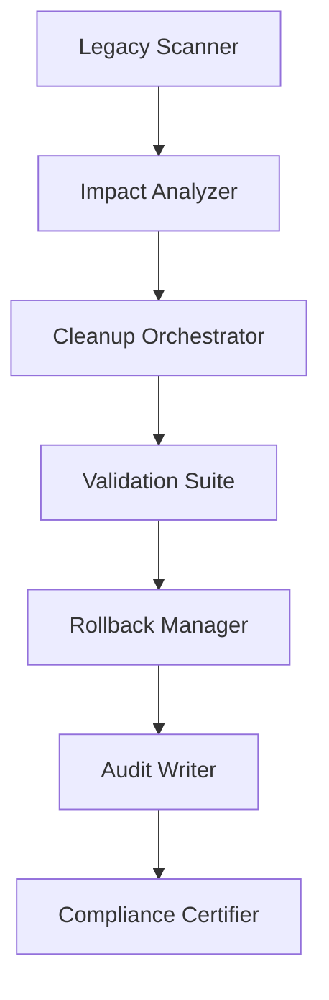

# 🧹 Cleanup 2 – Design Document

**Date:** 2025-01-15  
**Priority:** P1 – Code Quality & Maintenance  
**Status:** 🟡 ACTIVE  
**Predecessor:** supabase-vercel-cleanup (✅ COMPLETED)  
**Successor:** deep-legacy-dereference (spec ID cleanup-r2-spec)

---

## 📋 **OVERVIEW**

### **Design Objective**

Perform a deep, structured cleanup of all residual legacy references (~630 entries), deprecated code, and non-functional artifacts while preserving production stability and measurable performance improvement.

### **Architecture Principles**

- **Safe Cleanup Pipeline** – validation & rollback after each phase
- **Automated Detection & Audit** – machine-generated reports in `/reports/`
- **Rollback Safety** – Git + file-level restore ≤ 30 min
- **CI/CD Compliance** – integrated legacy-guard in build pipeline
- **Bundle Efficiency** – target 5-10% bundle reduction

---

## 🏗️ **ARCHITECTURE**

### **Cleanup Pipeline Flow**



### **Component Hierarchy**

1. **Detection Layer** – scanner, dependency analyzer, bundle assessor
2. **Processing Layer** – safe cleanup engine, archiver, import optimizer
3. **Validation Layer** – build + test verification suite
4. **Recovery Layer** – rollback manager + state restoration

---

## 🔧 **COMPONENTS & INTERFACES**

_(alle Interfaces sind mit Bedrock / Kiro kompatibel)_

### **LegacyReferenceScanner ⚙️**

```typescript
interface LegacyReferenceScanner {
  scanDirectory(path: string): Promise<LegacyReference[]>;
  detectExternalServices(): Promise<ExternalServiceReference[]>; // ⚙️ erweitert um Twilio/Resend/Lovable
  exportForBedrock(): Promise<void>; // ⚙️ exportiert JSON für Bedrock-Hook validate-legacy-drift
}
```

### **SafeCleanupEngine ⚙️**

```typescript
interface SafeCleanupEngine {
  createPhaseRollbackTag(phase: string): Promise<string>; // ⚙️ erzeugt per-phase rollback tags
  validateBuild(): Promise<boolean>; // ⚙️ validiert Build via ci-test-runner.cjs --suite=integration
  executeCleanup(plan: CleanupPlan): Promise<CleanupResult>;
}
```

### **BundleOptimizer ⚙️**

```typescript
interface BundleOptimizer {
  analyzeBundle(): Promise<BundleAnalysis>;
  integrateViteAnalyzer(): Promise<void>; // ⚙️ integriert vite-bundle-analyzer und esbuild-analyze
  exportBundleReport(): Promise<void>; // ⚙️ exportiert bundle-report.json für VC Performance Dashboard
}
```

---

## 📊 **DATA MODELS & PHASES**

### **External Services Category ⚙️**

```typescript
enum ExternalServices {
  TWILIO = "twilio",
  RESEND = "resend",
  LOVABLE = "lovable",
}

interface CleanupPhase {
  id: string;
  name: string;
  validationCriteria: {
    buildPass: boolean; // ⚙️ jede Phase hat validationCriteria.buildPass = true
    coverage: number; // ⚙️ und coverage >= 85%
  };
}
```

---

## 🛡️ **ERROR HANDLING & RECOVERY ⚙️**

### **Enhanced Error Handling**

```typescript
class SecurityViolation extends Error {
  // ⚙️ Fehlerklasse für gefährdete API-Keys
  constructor(message: string, public apiKey: string) {
    super(message);
    this.name = "SecurityViolation";
  }
}

interface RollbackManager {
  rollbackSoft(): Promise<void>; // ⚙️ automatische rollback --soft bei Build- oder Coverage-Fail
  auditTrail(error: Error): Promise<void>; // ⚙️ Bedrock führt Audit Trail in /reports/errors/*.json
}
```

---

## 🧪 **TESTING STRATEGY (aktualisiert)**

| Layer       | Tool                    | Responsibility            |
| ----------- | ----------------------- | ------------------------- |
| Unit        | Jest ESM                | Scanner + Engine          |
| Integration | Jest + Kiro Bridge      | E2E Cleanup Pipeline      |
| Performance | Lighthouse CI           | Bundle Size Regression    |
| Security    | Trivy + Snyk            | Credential Leak Detection |
| Rollback    | Custom rollback.test.ts | State Integrity           |

---

## 📈 **PERFORMANCE TARGETS**

- **Bundle Size** ↓ ≥ 5%
- **Build Time** ≤ previous baseline
- **P95 Latency** ≤ 1.5s (generation)
- **Coverage** ≥ 85% all suites

---

## 🔄 **ROLLBACK STRATEGY**

### **Git Tagging Strategy**

- **Tag Format**: `cleanup-r2-phaseX-<timestamp>`
- **S3 Snapshot**: optional artifact backup per phase
- **Trigger Policy**: rollback bei `buildFailure || testFailure || securityAlert`

---

## 🚀 **DEPLOYMENT STRATEGY (ergänzt)**

### **Four-Phase Deployment**

1. **Phase A – Preparation**: scan + backup
2. **Phase B – Execution**: cleanup + validation
3. **Phase C – Deployment**: safe S3 sync (no `--delete` before verify)
4. **Phase D – Post-Monitoring**: CloudWatch + Audit Log

### **Validation Gates**

- ✅ Build success
- ✅ Tests green
- ✅ Coverage ≥ 85%
- ✅ Bundle optimized

---

## 🔐 **SECURITY & COMPLIANCE ENHANCEMENTS**

- **Legacy API keys** revoked and documented in `secrets-rotation-proof.md`
- **All secrets** migrated to AWS Secrets Manager
- **Legacy domains** removed from DNS + CSP headers
- **"Certificate of Clean"** PDF generated via `audit-writer.ts`
- **Audit Trail Retention Policy**: Audit logs and detection reports are retained for 12 months in S3 (eu-central-1) under `matbakh-audit-logs/cleanup-r2/`

---

## � **MOONITORING & REPORTING INTEGRATION**

All cleanup events are streamed to CloudWatch Logs and surfaced in the Meta Monitor Dashboard for continuous observability.

---

## 📚 **DOCUMENTATION DELIVERABLES**

- `cleanup-r2-playbook.md` – execution steps + rollback
- `legacy-audit-report.json` – detected references
- `deployment-policy.md` – safe deploy rules (Kiro/Bedrock)
- `compliance-certificate.pdf` – final audit output
- `legacy-guard.yml` – CI policy for preventing re-introduction of legacy references

---

## 🎯 **SUCCESS METRICS**

| Metric           | Target | Tool            |
| ---------------- | ------ | --------------- |
| Legacy Refs      | < 50   | Kiro Audit      |
| Bundle Reduction | ≥ 5%   | Analyzer Report |
| Coverage         | ≥ 85%  | Jest Summary    |
| Performance P95  | ≤ 1.5s | Meta Monitor    |
| Security Alerts  | 0      | Trivy/Snyk Scan |

---

## ✅ **CONCLUSION**

This design integrates:

- **Deep legacy removal** (Supabase → Twilio → Resend → Lovable)
- **Verified AWS-only architecture**
- **CI/CD guards + rollback safety**
- **Bedrock + Kiro task handoff compatibility**
- **Secure deployment policy**

**Result**: matbakh.app is fully ready for **Phase 6 – UX and Visibility Launch** once Cleanup 2 completes.
