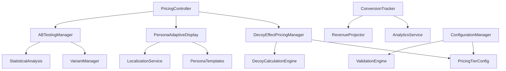

# Design Document - Decoy Effect Pricing System

## Overview

The Decoy Effect Pricing System implements behavioral economics principles to optimize conversion rates through strategic pricing presentation. The system uses the decoy effect (asymmetric dominance) where a strategically inferior option makes the target option appear more attractive.

## Architecture

### System Components



### Data Flow

1. **User Request** → PricingController receives pricing request with persona context
2. **Persona Detection** → System identifies user persona from existing detection service
3. **A/B Assignment** → ABTestingManager assigns user to test variant
4. **Pricing Calculation** → DecoyEffectPricingManager calculates optimal pricing display
5. **Persona Adaptation** → PersonaAdaptiveDisplay customizes presentation
6. **Response Generation** → System returns personalized pricing with tracking
7. **Interaction Tracking** → ConversionTracker logs all user interactions
8. **Analytics Processing** → AnalyticsService processes conversion data

## Components and Interfaces

### DecoyEffectPricingManager

```typescript
interface DecoyEffectPricingManager {
  calculateOptimalPricing(
    persona: PersonaType,
    variant: ABTestVariant,
    context: PricingContext
  ): Promise<PricingDisplay>;
  
  validateDecoyEffectiveness(
    tiers: PricingTier[]
  ): DecoyValidationResult;
  
  generateRevenueProjections(
    tier: PricingTier,
    businessContext: BusinessContext
  ): RevenueProjection;
}
```

### PricingTier Configuration

```typescript
interface PricingTier {
  id: string;
  name: string;
  price: number;
  currency: 'EUR' | 'USD';
  billingPeriod: 'monthly' | 'yearly';
  features: Feature[];
  limitations: Limitation[];
  isDecoy: boolean;
  targetTier?: string; // Which tier this decoy should promote
  revenueProjection: RevenueProjection;
  personaAppeal: PersonaAppealScore;
}
```

### PersonaAdaptiveDisplay

```typescript
interface PersonaAdaptiveDisplay {
  adaptForPersona(
    pricing: PricingDisplay,
    persona: PersonaType
  ): AdaptedPricingDisplay;
  
  generatePersonaSpecificCTA(
    persona: PersonaType,
    tier: PricingTier
  ): CallToAction;
  
  calculatePersonaRelevance(
    feature: Feature,
    persona: PersonaType
  ): RelevanceScore;
}
```

### ABTestingManager

```typescript
interface ABTestingManager {
  assignVariant(userId: string, testId: string): ABTestVariant;
  trackConversion(userId: string, variant: ABTestVariant, tier: PricingTier): void;
  calculateStatisticalSignificance(testId: string): SignificanceResult;
  getWinningVariant(testId: string): ABTestVariant | null;
}
```

### ConversionTracker

```typescript
interface ConversionTracker {
  trackPricingImpression(
    userId: string,
    persona: PersonaType,
    variant: ABTestVariant,
    tiersShown: PricingTier[]
  ): void;
  
  trackTierSelection(
    userId: string,
    selectedTier: PricingTier,
    context: SelectionContext
  ): void;
  
  trackDecoyInteraction(
    userId: string,
    decoyTier: PricingTier,
    interactionType: InteractionType
  ): void;
}
```

## Data Models

### PricingDisplay

```typescript
interface PricingDisplay {
  tiers: PricingTier[];
  recommendedTier: string;
  decoyTier?: string;
  personaAdaptations: PersonaAdaptation[];
  abTestVariant: ABTestVariant;
  displayMetadata: {
    generatedAt: Date;
    expiresAt: Date;
    configVersion: string;
  };
}
```

### PersonaAdaptation

```typescript
interface PersonaAdaptation {
  persona: PersonaType;
  headline: string;
  subheadline: string;
  ctaText: string;
  emphasizedFeatures: string[];
  socialProof: string[];
  urgencyIndicators: UrgencyIndicator[];
}
```

### RevenueProjection

```typescript
interface RevenueProjection {
  monthlyRevenue: {
    conservative: number;
    realistic: number;
    optimistic: number;
  };
  yearlyRevenue: {
    conservative: number;
    realistic: number;
    optimistic: number;
  };
  roi: {
    timeToBreakeven: number; // months
    yearOneROI: number; // percentage
  };
  disclaimer: string; // "Unverbindliche Schätzung"
  calculationBasis: CalculationBasis;
}
```

### ABTestVariant

```typescript
interface ABTestVariant {
  id: string;
  name: string;
  testId: string;
  configuration: {
    decoyPosition: 'first' | 'middle' | 'last';
    decoyDiscount: number; // percentage
    emphasizedTier: 'basic' | 'premium' | 'enterprise';
    displayStyle: 'cards' | 'table' | 'comparison';
  };
  trafficAllocation: number; // percentage
  isActive: boolean;
}
```

## Error Handling

### Pricing Calculation Errors

```typescript
class PricingCalculationError extends Error {
  constructor(
    message: string,
    public code: PricingErrorCode,
    public context: PricingContext
  ) {
    super(message);
    this.name = 'PricingCalculationError';
  }
}

enum PricingErrorCode {
  INVALID_PERSONA = 'INVALID_PERSONA',
  MISSING_CONFIGURATION = 'MISSING_CONFIGURATION',
  DECOY_VALIDATION_FAILED = 'DECOY_VALIDATION_FAILED',
  REVENUE_CALCULATION_ERROR = 'REVENUE_CALCULATION_ERROR'
}
```

### Fallback Strategies

1. **Configuration Errors** → Fall back to default pricing configuration
2. **Persona Detection Failure** → Use generic pricing display
3. **A/B Test Assignment Error** → Assign to control variant
4. **Revenue Calculation Error** → Show pricing without projections
5. **Localization Error** → Fall back to English with currency conversion

## Testing Strategy

### Unit Tests

1. **DecoyEffectPricingManager**
   - Test decoy positioning algorithms
   - Validate revenue projection calculations
   - Test persona-specific adaptations

2. **ABTestingManager**
   - Test variant assignment logic
   - Validate statistical significance calculations
   - Test conversion tracking accuracy

3. **ConversionTracker**
   - Test event logging functionality
   - Validate data integrity
   - Test analytics integration

### Integration Tests

1. **End-to-End Pricing Flow**
   - User requests pricing → receives personalized display
   - User selects tier → conversion is tracked
   - Analytics data → appears in reporting

2. **Persona Integration**
   - Existing persona detection → influences pricing display
   - Different personas → receive different presentations
   - Persona changes → update pricing accordingly

3. **A/B Testing Integration**
   - Users → assigned to variants consistently
   - Conversions → tracked with variant information
   - Statistical analysis → produces valid results

### Performance Tests

1. **Load Testing**
   - 1000 concurrent pricing requests
   - Response time < 500ms
   - Memory usage within limits

2. **Configuration Updates**
   - Pricing changes → propagate within 1 minute
   - No downtime during updates
   - Rollback capability functional

### Behavioral Economics Validation

1. **Decoy Effect Measurement**
   - A/B test with and without decoy
   - Measure conversion rate differences
   - Validate statistical significance

2. **Persona Response Analysis**
   - Track conversion rates by persona
   - Measure engagement with different presentations
   - Optimize persona-specific messaging

## Security Considerations

### Data Protection

1. **User Privacy**
   - No PII in pricing logs
   - GDPR-compliant data retention
   - Anonymized analytics data

2. **Configuration Security**
   - Encrypted pricing configuration
   - Access control for pricing updates
   - Audit trail for all changes

### Business Logic Protection

1. **Pricing Integrity**
   - Validate all pricing calculations
   - Prevent negative pricing
   - Ensure currency consistency

2. **A/B Test Integrity**
   - Prevent variant manipulation
   - Secure random assignment
   - Tamper-proof conversion tracking

## Deployment Strategy

### Phased Rollout

1. **Phase 1: Core Implementation** (Week 1)
   - DecoyEffectPricingManager
   - Basic pricing tiers
   - Simple conversion tracking

2. **Phase 2: Persona Integration** (Week 2)
   - PersonaAdaptiveDisplay
   - Persona-specific presentations
   - Enhanced analytics

3. **Phase 3: A/B Testing** (Week 3)
   - ABTestingManager
   - Statistical analysis
   - Automated optimization

4. **Phase 4: Advanced Features** (Week 4)
   - Revenue projections
   - Advanced analytics
   - Configuration management

### Monitoring and Alerting

1. **Performance Monitoring**
   - Response time alerts
   - Error rate monitoring
   - Conversion rate tracking

2. **Business Metrics**
   - Daily conversion reports
   - A/B test progress alerts
   - Revenue impact analysis

3. **System Health**
   - Configuration validation
   - Data integrity checks
   - Fallback activation alerts