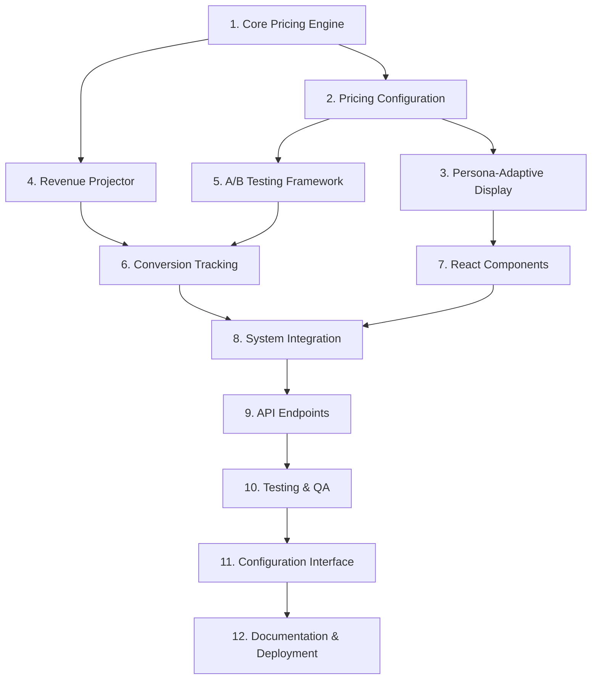

# Implementation Plan - Decoy Effect Pricing System

## Task Overview

Convert the Decoy Effect Pricing System design into a series of implementation tasks for systematic development with test-driven approach and incremental progress.

## Implementation Tasks

- [ ] **1. Core Pricing Engine Setup**
  - Create `src/lib/pricing/DecoyEffectPricingManager.ts` with core pricing logic
  - Implement pricing tier configuration system
  - Add basic decoy effect calculation algorithms
  - Create comprehensive unit tests for pricing calculations
  - _Requirements: 1, 10_

- [ ] **2. Pricing Configuration System**
  - Create `src/lib/pricing/pricingTiers.ts` with tier definitions
  - Implement configuration validation and error handling
  - Add support for dynamic pricing updates
  - Create configuration management utilities
  - _Requirements: 10, 8_

- [ ] **3. Persona-Adaptive Display Engine**
  - Create `src/lib/pricing/PersonaAdaptiveDisplay.ts` for persona customization
  - Implement persona-specific pricing presentations
  - Add localization support for German/English
  - Create persona template system for messaging
  - _Requirements: 2, 9_

- [ ] **4. Revenue Projection Calculator**
  - Create `src/lib/pricing/RevenueProjector.ts` for ROI calculations
  - Implement industry benchmark integration
  - Add "unverbindlich" disclaimer system
  - Create detailed calculation methodology display
  - _Requirements: 6_

- [ ] **5. A/B Testing Framework**
  - Create `src/lib/pricing/ABTestingManager.ts` for variant management
  - Implement statistical significance calculations
  - Add user assignment and tracking logic
  - Create test configuration and management system
  - _Requirements: 3_

- [ ] **6. Conversion Tracking System**
  - Create `src/lib/pricing/ConversionTracker.ts` for analytics
  - Implement event logging with AWS RDS integration
  - Add real-time conversion rate calculations
  - Create analytics dashboard data preparation
  - _Requirements: 4, 7_

- [ ] **7. React Components Implementation**
  - Create `src/components/pricing/PricingDisplay.tsx` main component
  - Implement `src/components/pricing/PricingTier.tsx` individual tier cards
  - Add `src/components/pricing/PersonaAdaptedContent.tsx` for customization
  - Create responsive design with Tailwind CSS styling
  - _Requirements: 2, 9_

- [ ] **8. Integration with Existing Systems**
  - Integrate with existing persona detection service
  - Connect to AWS RDS for data persistence
  - Add AWS Cognito authentication integration
  - Implement existing analytics pipeline connection
  - _Requirements: 7_

- [ ] **9. API Endpoints and Services**
  - Create `/api/pricing/tiers` endpoint for pricing data
  - Implement `/api/pricing/track` for conversion tracking
  - Add `/api/pricing/analytics` for reporting data
  - Create service layer for pricing operations
  - _Requirements: 4, 8_

- [ ] **10. Testing and Quality Assurance**
  - Create comprehensive unit tests for all pricing logic
  - Implement integration tests for persona and A/B testing
  - Add performance tests for response time requirements
  - Create behavioral economics validation tests
  - _Requirements: 8, 3_

- [ ] **11. Configuration Management Interface**
  - Create admin interface for pricing configuration
  - Implement A/B test management dashboard
  - Add real-time analytics and conversion monitoring
  - Create configuration validation and rollback system
  - _Requirements: 10, 3_

- [ ] **12. Documentation and Deployment**
  - Create comprehensive API documentation
  - Write behavioral economics implementation guide
  - Add deployment scripts and configuration
  - Create monitoring and alerting setup
  - _Requirements: All_

## Task Dependencies



## Success Criteria

### Phase 1 Completion (Tasks 1-4)
- [ ] Core pricing engine calculates decoy effects correctly
- [ ] Configuration system validates pricing tiers
- [ ] Persona adaptations display different content per persona type
- [ ] Revenue projections include "unverbindlich" disclaimers

### Phase 2 Completion (Tasks 5-8)
- [ ] A/B testing assigns users to variants consistently
- [ ] Conversion tracking logs all pricing interactions
- [ ] React components render responsive pricing displays
- [ ] Integration with existing persona detection works

### Phase 3 Completion (Tasks 9-12)
- [ ] API endpoints respond within 500ms
- [ ] All tests pass with >90% coverage
- [ ] Admin interface allows configuration updates
- [ ] System deployed and monitoring active

## Implementation Guidelines

### Code Organization
```
src/lib/pricing/
├── DecoyEffectPricingManager.ts    # Core pricing logic
├── pricingTiers.ts                 # Configuration
├── PersonaAdaptiveDisplay.ts       # Persona customization
├── RevenueProjector.ts             # ROI calculations
├── ABTestingManager.ts             # A/B testing
├── ConversionTracker.ts            # Analytics
└── __tests__/                      # Test files
    ├── DecoyEffectPricingManager.test.ts
    ├── PersonaAdaptiveDisplay.test.ts
    └── ...

src/components/pricing/
├── PricingDisplay.tsx              # Main component
├── PricingTier.tsx                 # Individual tier
├── PersonaAdaptedContent.tsx       # Persona content
└── __tests__/                      # Component tests
```

### Testing Strategy
- **Unit Tests**: Test each pricing calculation and logic component
- **Integration Tests**: Test persona detection and A/B testing integration
- **Performance Tests**: Validate 500ms response time requirement
- **Behavioral Tests**: Measure actual decoy effect performance

### Behavioral Economics Validation
- **A/B Test Setup**: Control (no decoy) vs Treatment (with decoy)
- **Conversion Metrics**: Track tier selection rates and revenue impact
- **Statistical Analysis**: Ensure statistically significant results
- **Persona Analysis**: Measure effectiveness per persona type

### Ethical Guidelines
- **Transparency**: All pricing and features clearly displayed
- **No Dark Patterns**: Avoid deceptive or manipulative practices
- **Clear Disclaimers**: Revenue projections marked as estimates
- **User Choice**: Genuine value in all pricing tiers

## Risk Mitigation

### Technical Risks
- **Performance**: Implement caching for pricing calculations
- **Configuration Errors**: Add comprehensive validation and fallbacks
- **Integration Issues**: Create mock services for testing
- **Data Integrity**: Implement audit trails for all pricing changes

### Business Risks
- **Conversion Impact**: Monitor conversion rates during rollout
- **User Experience**: A/B test different presentation styles
- **Revenue Cannibalization**: Track revenue per tier changes
- **Competitive Response**: Monitor market pricing changes

### Compliance Risks
- **GDPR**: Ensure no PII in pricing analytics
- **Transparency**: Clear feature comparisons and limitations
- **Advertising Standards**: Honest revenue projections with disclaimers
- **Accessibility**: WCAG 2.1 AA compliant pricing displays