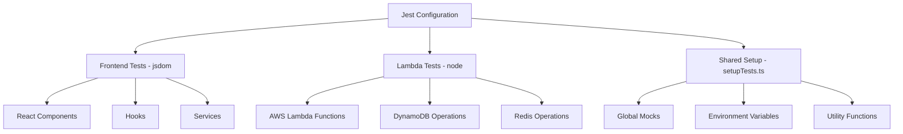
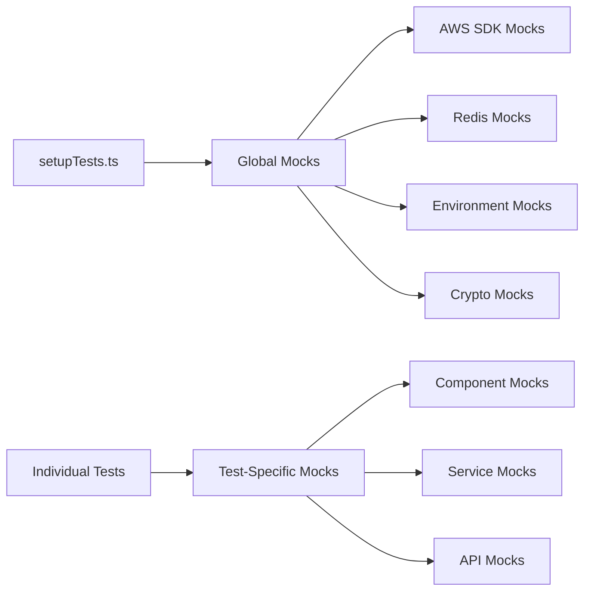

# Jest Test Infrastructure Fix - Design Document

## Overview

This design document outlines the systematic approach to fix the Jest test infrastructure issues across the matbakh.app codebase. The solution addresses mock configuration, module resolution, environment setup, and migration from Vitest to Jest.

**Context:** This is an emergency spec created to resolve critical test infrastructure failures that were blocking all development work. The original work on the Decoy Effect Pricing System has been paused until this infrastructure is stable.

**Impact:** 53 out of 62 test suites were failing, preventing reliable code validation and deployment.

## Architecture

### Test Environment Strategy



### Mock Architecture



## Components and Interfaces

### 1. Jest Configuration (jest.config.cjs)

**Purpose:** Central configuration for Jest test runner

**Key Features:**
- Dual environment support (jsdom/node)
- TypeScript transformation via ts-jest
- ESM module transformation
- Path aliases and module mapping
- Coverage collection configuration

**Configuration Structure:**
```javascript
{
  testEnvironment: 'jsdom', // Default for React
  preset: 'ts-jest',
  setupFilesAfterEnv: ['<rootDir>/src/setupTests.ts'],
  moduleNameMapper: { '^@/(.*)$': '<rootDir>/src/$1' },
  transformIgnorePatterns: ['/node_modules/(?!(@sparticuz|cheerio|jose)/)'],
  testMatch: ['<rootDir>/src/**/*.test.{ts,tsx}', '<rootDir>/infra/**/*.test.{ts,tsx}']
}
```

### 2. Global Test Setup (setupTests.ts)

**Purpose:** Initialize global mocks and utilities for all tests

**Key Components:**
- Environment variable mocking
- AWS SDK client mocking
- Redis client mocking
- Crypto API mocking
- Global utility functions
- Mock cleanup automation

**Interface:**
```typescript
interface GlobalTestSetup {
  // Environment mocking
  mockEnvironmentVariables(): void;
  
  // AWS SDK mocking
  mockAWSClients(): void;
  
  // Redis mocking
  mockRedisClient(): void;
  
  // Utility functions
  createMockFile(name: string, type: string, content?: string): File;
  createMockResponse(data: any, ok?: boolean): Response;
  createMockMemoryContext(overrides?: Record<string, any>): MemoryContext;
  
  // Cleanup
  resetAllMocks(): void;
}
```

### 3. Test Environment Detection

**Purpose:** Automatically set appropriate test environment based on test location

**Strategy:**
- Frontend tests (src/**): jsdom environment
- Lambda tests (infra/lambdas/**): node environment
- Integration tests: configurable per test file

**Implementation:**
```javascript
// For Lambda tests - add to top of test file
/**
 * @jest-environment node
 */
```

### 4. Mock Management System

**Purpose:** Centralized mock configuration and cleanup

**Components:**

#### AWS SDK Mocks
```typescript
interface AWSMockConfig {
  DynamoDBDocumentClient: {
    from: jest.MockedFunction;
    send: jest.MockedFunction;
  };
  SecretsManagerClient: {
    send: jest.MockedFunction;
  };
}
```

#### Redis Mocks
```typescript
interface RedisMockConfig {
  createClient: jest.MockedFunction;
  client: {
    connect: jest.MockedFunction;
    quit: jest.MockedFunction;
    get: jest.MockedFunction;
    set: jest.MockedFunction;
  };
}
```

### 5. Migration Utilities

**Purpose:** Automated migration from Vitest to Jest

**Tools:**
- Import statement replacement
- API method mapping
- Mock function conversion
- Assertion method updates

**Mapping:**
```typescript
const VitestToJestMapping = {
  imports: {
    'vitest': '@jest/globals',
    'vi': 'jest'
  },
  methods: {
    'vi.fn()': 'jest.fn()',
    'vi.spyOn()': 'jest.spyOn()',
    'vi.mock()': 'jest.mock()'
  }
};
```

## Data Models

### Test Configuration Model

```typescript
interface TestConfig {
  environment: 'jsdom' | 'node';
  setupFiles: string[];
  mocks: {
    aws: boolean;
    redis: boolean;
    crypto: boolean;
    fetch: boolean;
  };
  coverage: {
    enabled: boolean;
    threshold: number;
    excludePatterns: string[];
  };
}
```

### Mock State Model

```typescript
interface MockState {
  aws: {
    dynamodb: MockClient;
    secretsManager: MockClient;
  };
  redis: MockClient;
  environment: Record<string, string>;
  utilities: {
    createMockFile: Function;
    createMockResponse: Function;
    createMockMemoryContext: Function;
  };
}
```

## Error Handling

### Mock Resolution Errors

**Strategy:** Provide clear error messages when mocks fail to initialize

```typescript
class MockInitializationError extends Error {
  constructor(mockType: string, originalError: Error) {
    super(`Failed to initialize ${mockType} mock: ${originalError.message}`);
    this.name = 'MockInitializationError';
  }
}
```

### Module Resolution Errors

**Strategy:** Enhanced error reporting for missing modules

```typescript
class ModuleResolutionError extends Error {
  constructor(moduleName: string, testFile: string) {
    super(`Cannot resolve module '${moduleName}' in test file '${testFile}'`);
    this.name = 'ModuleResolutionError';
  }
}
```

### Environment Configuration Errors

**Strategy:** Validate test environment setup

```typescript
class EnvironmentConfigError extends Error {
  constructor(expectedEnv: string, actualEnv: string) {
    super(`Expected test environment '${expectedEnv}' but got '${actualEnv}'`);
    this.name = 'EnvironmentConfigError';
  }
}
```

## Testing Strategy

### Unit Test Coverage

**Target:** 95% coverage for test infrastructure components

**Key Areas:**
- Mock initialization functions
- Environment variable setup
- Utility function behavior
- Error handling scenarios

### Integration Test Coverage

**Target:** End-to-end test execution validation

**Scenarios:**
- Frontend component tests with mocked APIs
- Lambda function tests with mocked AWS services
- Cross-environment test execution
- Mock cleanup between test suites

### Performance Testing

**Targets:**
- Total test suite execution < 2 minutes
- Individual test execution < 5 seconds
- Mock initialization < 100ms
- Memory usage < 512MB during test execution

## Implementation Phases

### Phase 1: Foundation (Days 1-2)
- Install required AWS SDK packages
- Fix setupTests.ts mock configuration
- Implement global mock cleanup

### Phase 2: Migration (Days 3-4)
- Convert all Vitest imports to Jest
- Update API method calls
- Fix assertion methods

### Phase 3: Environment Setup (Day 5)
- Configure dual environment support
- Add environment annotations to Lambda tests
- Validate environment-specific behavior

### Phase 4: Optimization (Day 6)
- Implement performance optimizations
- Add comprehensive error handling
- Validate coverage collection

### Phase 5: Validation (Day 7)
- Run full test suite validation
- Performance benchmarking
- CI/CD pipeline integration

## Monitoring and Maintenance

### Test Execution Monitoring

**Metrics:**
- Test execution time per suite
- Mock initialization performance
- Memory usage during tests
- Error rates by test category

### Mock Health Monitoring

**Validation:**
- Mock function call counts
- Mock reset verification
- Memory leak detection
- Mock configuration drift

### Continuous Integration

**Pipeline Integration:**
- Automated test execution on PR
- Coverage reporting
- Performance regression detection
- Mock validation checks

## Security Considerations

### Mock Data Security

**Principles:**
- No real credentials in test mocks
- Sanitized test data only
- Isolated test environments
- Secure mock cleanup

### Environment Isolation

**Requirements:**
- Test environment separation
- Mock data containment
- Credential isolation
- Network access restrictions

## Performance Optimization

### Mock Caching Strategy

**Approach:**
- Cache frequently used mocks
- Lazy initialization for expensive mocks
- Memory-efficient mock storage
- Automatic cache invalidation

### Parallel Test Execution

**Configuration:**
- Optimal worker count based on system resources
- Test isolation for parallel execution
- Shared mock state management
- Resource contention prevention

## Rollback Strategy

### Incremental Deployment

**Approach:**
- Phase-by-phase implementation
- Rollback points at each phase
- Validation gates between phases
- Automated rollback triggers

### Fallback Mechanisms

**Safety Nets:**
- Legacy test configuration backup
- Mock fallback implementations
- Environment detection fallbacks
- Error recovery procedures