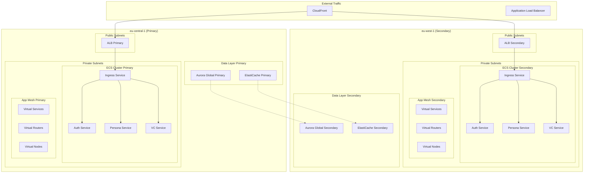
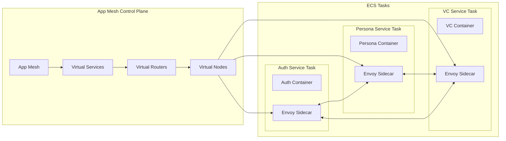

# Task 12: Microservices Foundation - Design Document

**Created**: 2025-09-22  
**Status**: Draft  
**Version**: 1.0.0

## Overview

Task 12 implementiert eine enterprise-grade Microservices Foundation basierend auf AWS ECS Fargate, AWS App Mesh Service Mesh und umfassender Multi-Region Architektur. Das Design baut auf den erfolgreichen Implementierungen von Task 9 (Deployment Automation), Task 10 (Auto-Scaling) und Task 11 (Multi-Region Infrastructure) auf.

## Architecture

### High-Level Architecture



### Service Mesh Architecture



## Components and Interfaces

### 1. Infrastructure Components

#### VPC and Networking
```typescript
interface VPCConfiguration {
  cidr: string; // 10.0.0.0/16
  availabilityZones: string[]; // 3 AZs per region
  publicSubnets: SubnetConfiguration[];
  privateSubnets: SubnetConfiguration[];
  vpcEndpoints: VPCEndpointConfiguration[];
}

interface VPCEndpointConfiguration {
  service: 'ecr.api' | 'ecr.dkr' | 'logs' | 'ssm' | 'secretsmanager';
  type: 'Interface' | 'Gateway';
  subnets: string[];
}
```

#### ECS Cluster Configuration
```typescript
interface ECSClusterConfiguration {
  name: string;
  capacityProviders: ['FARGATE', 'FARGATE_SPOT'];
  defaultCapacityProviderStrategy: CapacityProviderStrategy[];
  containerInsights: boolean;
  executeCommandConfiguration: ExecuteCommandConfiguration;
}

interface ServiceConfiguration {
  serviceName: string;
  taskDefinition: TaskDefinitionConfiguration;
  desiredCount: number;
  subnets: string[];
  securityGroups: string[];
  serviceRegistries: ServiceRegistryConfiguration[];
  loadBalancers?: LoadBalancerConfiguration[];
}
```

#### App Mesh Configuration
```typescript
interface AppMeshConfiguration {
  meshName: string;
  virtualServices: VirtualServiceConfiguration[];
  virtualRouters: VirtualRouterConfiguration[];
  virtualNodes: VirtualNodeConfiguration[];
}

interface VirtualServiceConfiguration {
  virtualServiceName: string;
  spec: {
    provider: {
      virtualRouter: {
        virtualRouterName: string;
      };
    };
  };
}

interface VirtualRouterConfiguration {
  virtualRouterName: string;
  spec: {
    listeners: RouterListener[];
  };
}

interface VirtualNodeConfiguration {
  virtualNodeName: string;
  spec: {
    listeners: NodeListener[];
    serviceDiscovery: ServiceDiscoveryConfiguration;
    backends?: BackendConfiguration[];
  };
}
```

### 2. Service Components

#### Service Template
```typescript
interface MicroserviceTemplate {
  serviceName: string;
  containerConfiguration: ContainerConfiguration;
  envoyConfiguration: EnvoyConfiguration;
  healthCheck: HealthCheckConfiguration;
  scaling: ScalingConfiguration;
  observability: ObservabilityConfiguration;
}

interface ContainerConfiguration {
  image: string;
  cpu: number; // mCPU
  memory: number; // MB
  environment: EnvironmentVariable[];
  secrets: SecretConfiguration[];
  logging: LoggingConfiguration;
}

interface EnvoyConfiguration {
  cpu: 256; // mCPU for Envoy sidecar
  memory: 256; // MB for Envoy sidecar
  logLevel: 'trace' | 'debug' | 'info' | 'warn' | 'error';
  adminPort: 9901;
  statsPort: 9902;
}
```

#### Service Discovery
```typescript
interface ServiceDiscoveryConfiguration {
  cloudMap: {
    namespaceName: string; // svc.local
    serviceName: string;
    dnsConfig: {
      dnsRecords: DNSRecord[];
      routingPolicy: 'WEIGHTED' | 'MULTIVALUE';
    };
    healthCheckCustomConfig: {
      failureThreshold: number;
    };
  };
}

interface DNSRecord {
  type: 'A' | 'AAAA' | 'SRV';
  ttl: number; // 5-10 seconds
}
```

### 3. Observability Components

#### Logging Configuration
```typescript
interface LoggingConfiguration {
  driver: 'awslogs';
  options: {
    'awslogs-group': string;
    'awslogs-region': string;
    'awslogs-stream-prefix': string;
    'awslogs-create-group': 'true';
  };
  logFormat: 'json';
  structuredLogging: {
    correlationId: boolean;
    traceId: boolean;
    spanId: boolean;
    serviceName: boolean;
    timestamp: boolean;
  };
}
```

#### Tracing Configuration
```typescript
interface TracingConfiguration {
  collector: 'adot'; // AWS Distro for OpenTelemetry
  endpoint: string;
  samplingRate: number; // 0.1 for 10% sampling
  propagation: 'w3c-traceparent';
  exporters: ['xray', 'otlp'];
}

interface MetricsConfiguration {
  namespace: string; // matbakh/microservices
  dimensions: {
    ServiceName: string;
    Environment: string;
    Region: string;
  };
  metrics: {
    red: REDMetrics;
    use: USEMetrics;
    custom: CustomMetrics[];
  };
}
```

## Data Models

### Service Registry Model
```typescript
interface ServiceRegistration {
  serviceName: string;
  serviceId: string;
  address: string;
  port: number;
  tags: string[];
  meta: {
    version: string;
    environment: string;
    region: string;
  };
  check: {
    http: string;
    interval: string;
    timeout: string;
  };
}
```

### Mesh Configuration Model
```typescript
interface MeshRoute {
  routeName: string;
  match: {
    prefix: string;
    headers?: HeaderMatch[];
  };
  action: {
    weightedTargets: WeightedTarget[];
  };
  timeout: {
    idle: string;
    perRequest: string;
  };
  retryPolicy: {
    maxRetries: number;
    perRetryTimeout: string;
    retryEvents: string[];
  };
}

interface WeightedTarget {
  virtualNode: string;
  weight: number; // 0-100 for canary deployments
}
```

### Deployment Model
```typescript
interface DeploymentConfiguration {
  serviceName: string;
  version: string;
  strategy: 'blue-green' | 'canary' | 'rolling';
  canaryConfig?: {
    initialWeight: number; // 1-5%
    promoteWeight: number; // 100%
    promoteInterval: string; // 5m
    rollbackThreshold: {
      errorRate: number; // 5%
      latencyP95: number; // 200ms
    };
  };
  healthGates: HealthGate[];
}

interface HealthGate {
  type: 'smoke' | 'integration' | 'performance';
  timeout: string;
  retries: number;
  criteria: HealthCriteria;
}
```

## Error Handling

### Circuit Breaker Configuration
```typescript
interface CircuitBreakerConfiguration {
  outlierDetection: {
    consecutiveGatewayErrors: number; // 5
    consecutive5xxErrors: number; // 5
    interval: string; // 30s
    baseEjectionTime: string; // 30s
    maxEjectionTime: string; // 300s
    maxEjectionPercent: number; // 50
  };
  connectionPool: {
    tcp: {
      maxConnections: number; // 1024
      connectTimeout: string; // 10s
    };
    http: {
      http1MaxPendingRequests: number; // 1024
      maxRequestsPerConnection: number; // 2
      maxRetries: number; // 3
    };
  };
}
```

### Retry Configuration
```typescript
interface RetryConfiguration {
  retryPolicy: {
    retryOn: string[]; // ['5xx', 'connect-failure', 'gateway-error']
    numRetries: number; // 3
    perTryTimeout: string; // 2s
    retryBackOff: {
      baseInterval: string; // 25ms
      maxInterval: string; // 250ms
    };
  };
}
```

## Testing Strategy

### Test Pyramid
```typescript
interface TestingStrategy {
  unit: {
    framework: 'jest';
    coverage: number; // 80%
    types: ['service-logic', 'retry-timeout', 'circuit-breaker'];
  };
  contract: {
    framework: 'pact' | 'protobuf';
    validation: 'breaking-change-detection';
    pipeline: 'fail-on-incompatible-changes';
  };
  integration: {
    environment: 'localstack' | 'docker-compose';
    services: 'all-dependencies';
    scenarios: ['happy-path', 'error-cases', 'timeout-scenarios'];
  };
  resilience: {
    framework: 'chaos-engineering';
    faultInjection: 'envoy-http-faults';
    scenarios: ['service-down', 'network-partition', 'high-latency'];
  };
  performance: {
    framework: 'k6' | 'artillery';
    target: 'mesh-canary';
    slo: {
      p95Latency: '200ms';
      errorRate: '1%';
      throughput: 'baseline + 10%';
    };
  };
}
```

### Security Testing
```typescript
interface SecurityTesting {
  containerScanning: {
    tool: 'trivy';
    pipeline: 'build-time';
    failOn: 'high-severity';
  };
  iamAnalysis: {
    tool: 'iam-access-analyzer';
    validation: 'least-privilege';
  };
  mtlsVerification: {
    tool: 'custom-tests';
    validation: 'certificate-rotation';
  };
  secretsManagement: {
    validation: 'no-plaintext-secrets';
    rotation: 'automated';
  };
}
```

## Integration Points

### Task 9 Integration (Deployment Automation)
- Extend existing blue/green deployment to support App Mesh traffic splitting
- Integrate container builds with existing CI/CD pipeline
- Leverage existing health gates and smoke tests
- Use existing rollback mechanisms with mesh route weights

### Task 10 Integration (Auto-Scaling)
- Extend ECS Service Auto Scaling with existing policies
- Integrate with existing budget management and cost tracking
- Leverage existing CloudWatch metrics and alarms
- Maintain existing cost optimization strategies

### Task 11 Integration (Multi-Region Infrastructure)
- Build upon existing multi-region setup (eu-central-1/eu-west-1)
- Integrate with existing health checking and failover mechanisms
- Leverage existing Aurora Global Database and cross-region replication
- Maintain existing RTO/RPO targets and disaster recovery procedures

## Performance Considerations

### Resource Allocation
- **Application Container**: Service-specific CPU/memory requirements
- **Envoy Sidecar**: Additional 256 mCPU / 256 MB per task
- **ADOT Collector**: 128 mCPU / 128 MB per task (if sidecar mode)
- **Total Overhead**: ~30% additional resources for mesh and observability

### Network Performance
- **Service-to-Service**: Target <50ms P95 latency within region
- **Cross-Region**: Target <200ms P95 latency between regions
- **External API**: Target <200ms P95 latency for client requests
- **DNS Resolution**: 5-10s TTL for service discovery balance

### Cost Optimization
- **VPC Endpoints**: Minimize NAT Gateway costs for AWS service access
- **Fargate Spot**: Use for non-critical workloads (development, testing)
- **Right-Sizing**: Monitor and adjust CPU/memory based on actual usage
- **Reserved Capacity**: Consider for predictable workloads in production