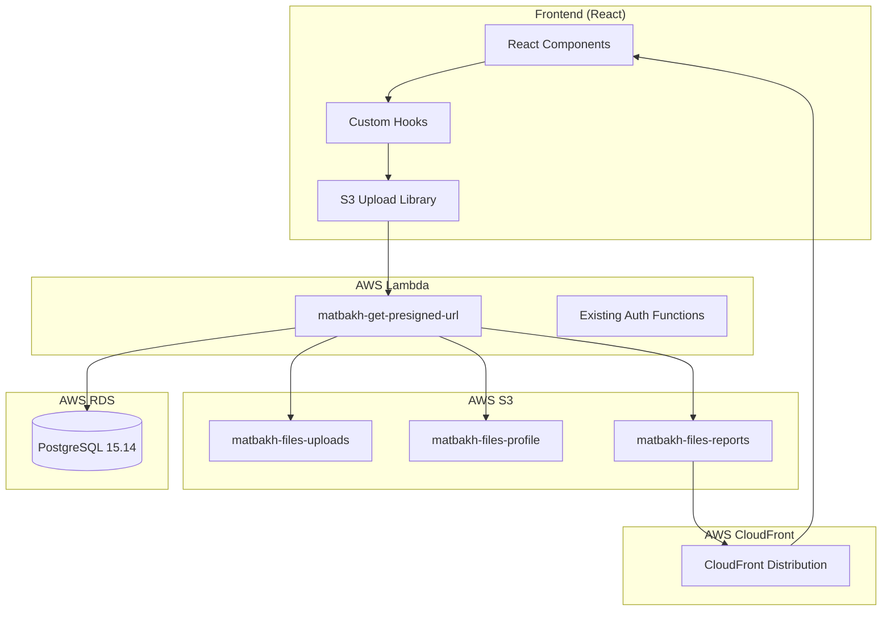
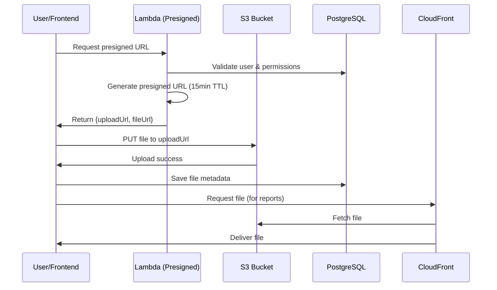

# Design Document - S3 File Storage Migration (Phase A4)

## Overview

Dieses Design-Dokument spezifiziert die vollständige Migration aller Dateispeicher-Funktionalitäten von Supabase Storage zu AWS S3. Das System wird eine saubere, zukunftsfähige und DSGVO-konforme Datei-Upload-Infrastruktur bereitstellen, die vollständig auf AWS basiert.

## Architecture

### High-Level Architecture



### Data Flow Architecture



## Components and Interfaces

### 1. S3 Bucket Structure

#### Bucket Configuration

| Bucket Name | Purpose | Access Level | Lifecycle | CORS |
|-------------|---------|--------------|-----------|------|
| `matbakh-files-uploads` | User uploads, AI content | Private | Permanent | ✅ |
| `matbakh-files-profile` | Avatars, logos, CM images | Semi-public | Permanent | ✅ |
| `matbakh-files-reports` | VC reports, PDFs, snapshots | Public via link | 30 days | ✅ |

#### Folder Structure

```
matbakh-files-uploads/
├── user-uploads/{user_id}/
├── ai-generated/{type}/
└── temp/{session_id}/

matbakh-files-profile/
├── avatars/{user_id}/
├── logos/{partner_id}/
└── cm-images/{category}/

matbakh-files-reports/
├── vc-reports/{lead_id}/
├── pdf-exports/{report_id}/
└── tmp/{temp_id}/          # 7 days lifecycle
```

### 2. Lambda Function: matbakh-get-presigned-url

#### Function Specification

```typescript
// Input Interface
interface PresignedUrlRequest {
  bucket: 'matbakh-files-uploads' | 'matbakh-files-profile' | 'matbakh-files-reports';
  filename: string;
  contentType: string;
  folder?: string;
  userId?: string;
  partnerId?: string;
}

// Output Interface
interface PresignedUrlResponse {
  uploadUrl: string;      // Presigned PUT URL (15min TTL)
  fileUrl: string;        // S3 object URL
  publicUrl?: string;     // CloudFront URL (for reports)
  expiresAt: string;      // ISO timestamp
}
```

#### Lambda Configuration

```yaml
Function: matbakh-get-presigned-url
Runtime: nodejs20.x
Memory: 256MB
Timeout: 30s
VPC: vpc-0c72fab3273a1be4f
Layer: pg-client-layer:1
Environment:
  - DB_SECRET_NAME: matbakh-db-postgres
  - CLOUDFRONT_DOMAIN: d1234567890.cloudfront.net
```

### 3. Frontend Integration

#### S3 Upload Library (`src/lib/s3-upload.ts`)

```typescript
export interface UploadOptions {
  file: File;
  bucket: BucketType;
  folder?: string;
  onProgress?: (progress: number) => void;
  onSuccess?: (fileUrl: string) => void;
  onError?: (error: Error) => void;
}

export interface UploadResult {
  fileUrl: string;
  publicUrl?: string;
  uploadId: string;
}

// Main upload function
export async function uploadToS3(options: UploadOptions): Promise<UploadResult>

// Validation functions
export function validateFile(file: File, maxSize: number): boolean
export function validateMimeType(file: File, allowedTypes: string[]): boolean
```

#### Custom Hooks

```typescript
// useS3Upload Hook
export function useS3Upload() {
  return {
    upload: (options: UploadOptions) => Promise<UploadResult>,
    isUploading: boolean,
    progress: number,
    error: Error | null
  };
}

// useAvatar Hook
export function useAvatar(userId: string) {
  return {
    avatarUrl: string | null,
    uploadAvatar: (file: File) => Promise<string>,
    deleteAvatar: () => Promise<void>,
    isLoading: boolean
  };
}
```

#### React Components

```typescript
// ImageUpload Component
interface ImageUploadProps {
  onUpload: (fileUrl: string) => void;
  maxSize?: number;
  acceptedTypes?: string[];
  bucket: BucketType;
  folder?: string;
}

// FileInput Component  
interface FileInputProps {
  onUpload: (fileUrl: string) => void;
  multiple?: boolean;
  maxSize?: number;
  bucket: BucketType;
}
```

## Data Models

### RDS Schema Updates

#### New Table: user_uploads

```sql
CREATE TABLE user_uploads (
  id UUID PRIMARY KEY DEFAULT gen_random_uuid(),
  user_id UUID NOT NULL,
  partner_id UUID,
  filename TEXT NOT NULL,
  original_filename TEXT NOT NULL,
  s3_url TEXT NOT NULL,
  s3_bucket TEXT NOT NULL,
  s3_key TEXT NOT NULL,
  content_type TEXT NOT NULL,
  file_size BIGINT NOT NULL,
  upload_type TEXT NOT NULL, -- 'avatar', 'document', 'image', 'report'
  is_public BOOLEAN DEFAULT false,
  uploaded_at TIMESTAMPTZ DEFAULT now(),
  expires_at TIMESTAMPTZ,
  metadata JSONB DEFAULT '{}',
  
  -- Indexes
  INDEX idx_user_uploads_user_id (user_id),
  INDEX idx_user_uploads_partner_id (partner_id),
  INDEX idx_user_uploads_type (upload_type),
  INDEX idx_user_uploads_expires (expires_at)
);
```

#### Updated Tables

```sql
-- Add S3 columns to existing tables
ALTER TABLE business_profiles 
ADD COLUMN avatar_s3_url TEXT,
ADD COLUMN logo_s3_url TEXT;

ALTER TABLE visibility_check_leads
ADD COLUMN report_s3_url TEXT,
ADD COLUMN report_expires_at TIMESTAMPTZ;

-- Migration script for existing data
UPDATE business_profiles 
SET avatar_s3_url = CASE 
  WHEN avatar_url IS NOT NULL 
  THEN 'https://matbakh-files-profile.s3.eu-central-1.amazonaws.com/avatars/' || id || '/avatar.jpg'
  ELSE NULL 
END;
```

## Security & IAM Configuration

### IAM Policies

#### Lambda Execution Role

```json
{
  "Version": "2012-10-17",
  "Statement": [
    {
      "Effect": "Allow",
      "Action": [
        "s3:PutObject",
        "s3:PutObjectAcl",
        "s3:GetObject"
      ],
      "Resource": [
        "arn:aws:s3:::matbakh-files-uploads/*",
        "arn:aws:s3:::matbakh-files-profile/*", 
        "arn:aws:s3:::matbakh-files-reports/*"
      ]
    },
    {
      "Effect": "Allow",
      "Action": [
        "secretsmanager:GetSecretValue"
      ],
      "Resource": "arn:aws:secretsmanager:eu-central-1:*:secret:matbakh-db-postgres-*"
    }
  ]
}
```

#### S3 Bucket Policies

```json
{
  "Version": "2012-10-17",
  "Statement": [
    {
      "Sid": "DenyDirectPublicAccess",
      "Effect": "Deny",
      "Principal": "*",
      "Action": "s3:GetObject",
      "Resource": [
        "arn:aws:s3:::matbakh-files-uploads/*",
        "arn:aws:s3:::matbakh-files-profile/*"
      ],
      "Condition": {
        "StringNotEquals": {
          "aws:PrincipalServiceName": "cloudfront.amazonaws.com"
        }
      }
    }
  ]
}
```

### CORS Configuration

```json
[
  {
    "AllowedOrigins": ["https://matbakh.app", "http://localhost:5173"],
    "AllowedMethods": ["GET", "PUT", "HEAD"],
    "AllowedHeaders": ["*"],
    "MaxAgeSeconds": 3000,
    "ExposeHeaders": ["ETag", "x-amz-meta-*"]
  }
]
```

### Lifecycle Rules

```json
{
  "Rules": [
    {
      "ID": "expire-reports",
      "Status": "Enabled",
      "Filter": {
        "Prefix": ""
      },
      "Expiration": {
        "Days": 30
      },
      "Transitions": [
        {
          "Days": 7,
          "StorageClass": "STANDARD_IA"
        }
      ]
    },
    {
      "ID": "expire-temp-files",
      "Status": "Enabled", 
      "Filter": {
        "Prefix": "tmp/"
      },
      "Expiration": {
        "Days": 7
      }
    }
  ]
}
```

## Error Handling

### Lambda Error Responses

```typescript
interface ErrorResponse {
  error: string;
  code: 'INVALID_FILE' | 'PERMISSION_DENIED' | 'QUOTA_EXCEEDED' | 'INTERNAL_ERROR';
  message: string;
  details?: any;
}

// Error handling patterns
try {
  // Validate request
  if (!isValidFileType(contentType)) {
    return {
      statusCode: 400,
      body: JSON.stringify({
        error: 'INVALID_FILE',
        message: 'File type not allowed',
        details: { allowedTypes: ALLOWED_MIME_TYPES }
      })
    };
  }
  
  // Check user permissions
  if (!await hasUploadPermission(userId, bucket)) {
    return {
      statusCode: 403,
      body: JSON.stringify({
        error: 'PERMISSION_DENIED',
        message: 'User not authorized for this bucket'
      })
    };
  }
  
} catch (error) {
  console.error('Upload error:', error);
  return {
    statusCode: 500,
    body: JSON.stringify({
      error: 'INTERNAL_ERROR',
      message: 'Upload service temporarily unavailable'
    })
  };
}
```

### Frontend Error Handling

```typescript
// Error boundary for upload components
export class UploadErrorBoundary extends React.Component {
  handleError(error: Error, errorInfo: ErrorInfo) {
    // Log to monitoring service
    console.error('Upload error:', error, errorInfo);
    
    // Show user-friendly message
    toast.error('Upload failed. Please try again.');
  }
}

// Retry logic
export async function uploadWithRetry(
  options: UploadOptions, 
  maxRetries: number = 3
): Promise<UploadResult> {
  for (let attempt = 1; attempt <= maxRetries; attempt++) {
    try {
      return await uploadToS3(options);
    } catch (error) {
      if (attempt === maxRetries) throw error;
      
      // Exponential backoff
      await new Promise(resolve => 
        setTimeout(resolve, Math.pow(2, attempt) * 1000)
      );
    }
  }
}
```

## Testing Strategy

### Unit Tests

```typescript
// Lambda function tests
describe('matbakh-get-presigned-url', () => {
  test('generates valid presigned URL for uploads bucket', async () => {
    const event = {
      body: JSON.stringify({
        bucket: 'matbakh-files-uploads',
        filename: 'test.jpg',
        contentType: 'image/jpeg'
      })
    };
    
    const result = await handler(event);
    expect(result.statusCode).toBe(200);
    
    const body = JSON.parse(result.body);
    expect(body.uploadUrl).toMatch(/^https:\/\/matbakh-files-uploads\.s3/);
    expect(body.fileUrl).toBeDefined();
  });
  
  test('rejects invalid file types', async () => {
    const event = {
      body: JSON.stringify({
        bucket: 'matbakh-files-uploads',
        filename: 'malware.exe',
        contentType: 'application/x-executable'
      })
    };
    
    const result = await handler(event);
    expect(result.statusCode).toBe(400);
  });
});

// Frontend hook tests
describe('useS3Upload', () => {
  test('uploads file successfully', async () => {
    const { result } = renderHook(() => useS3Upload());
    const file = new File(['test'], 'test.jpg', { type: 'image/jpeg' });
    
    await act(async () => {
      const uploadResult = await result.current.upload({
        file,
        bucket: 'matbakh-files-uploads'
      });
      
      expect(uploadResult.fileUrl).toBeDefined();
    });
  });
});
```

### Integration Tests

```typescript
// End-to-end upload test
describe('S3 Upload Integration', () => {
  test('complete upload workflow', async () => {
    // 1. Request presigned URL
    const presignedResponse = await fetch('/api/get-presigned-url', {
      method: 'POST',
      body: JSON.stringify({
        bucket: 'matbakh-files-uploads',
        filename: 'integration-test.jpg',
        contentType: 'image/jpeg'
      })
    });
    
    const { uploadUrl, fileUrl } = await presignedResponse.json();
    
    // 2. Upload file to S3
    const file = new File(['test data'], 'test.jpg', { type: 'image/jpeg' });
    const uploadResponse = await fetch(uploadUrl, {
      method: 'PUT',
      body: file
    });
    
    expect(uploadResponse.status).toBe(200);
    
    // 3. Verify file is accessible
    const verifyResponse = await fetch(fileUrl);
    expect(verifyResponse.status).toBe(200);
  });
});
```

## Performance Considerations

### Optimization Strategies

1. **Multipart Upload** für Dateien > 5MB
2. **Parallel Uploads** für mehrere Dateien
3. **Image Compression** vor Upload
4. **CloudFront Caching** für häufig abgerufene Dateien
5. **S3 Transfer Acceleration** für globale Nutzer

### Monitoring & Metrics

```typescript
// CloudWatch Custom Metrics
const metrics = {
  'Upload.Success': 1,
  'Upload.Duration': uploadTime,
  'Upload.FileSize': file.size,
  'Upload.Bucket': bucket
};

await cloudWatch.putMetricData({
  Namespace: 'Matbakh/S3Upload',
  MetricData: Object.entries(metrics).map(([name, value]) => ({
    MetricName: name,
    Value: value,
    Unit: name.includes('Duration') ? 'Milliseconds' : 'Count'
  }))
}).promise();
```

## Deployment Strategy

### Infrastructure as Code

```yaml
# CloudFormation Template
Resources:
  MatbakhFilesUploads:
    Type: AWS::S3::Bucket
    Properties:
      BucketName: matbakh-files-uploads
      BucketEncryption:
        ServerSideEncryptionConfiguration:
          - ServerSideEncryptionByDefault:
              SSEAlgorithm: AES256
      PublicAccessBlockConfiguration:
        BlockPublicAcls: true
        BlockPublicPolicy: true
        IgnorePublicAcls: true
        RestrictPublicBuckets: true
      LifecycleConfiguration:
        Rules:
          - Id: DeleteTempFiles
            Status: Enabled
            Filter:
              Prefix: temp/
            ExpirationInDays: 7
      CorsConfiguration:
        CorsRules:
          - AllowedOrigins: ['https://matbakh.app']
            AllowedMethods: [GET, PUT, HEAD]
            AllowedHeaders: ['*']
            MaxAge: 3000
```

### Deployment Steps

1. **S3 Buckets** erstellen mit CloudFormation
2. **Lambda Function** deployen mit Layer
3. **IAM Policies** konfigurieren
4. **CloudFront Distribution** für Reports-Bucket
5. **Frontend** mit neuen S3-Komponenten deployen
6. **Database Migration** für Schema-Updates
7. **Monitoring** und Alerts konfigurieren

## Migration Plan

### Phase 1: Infrastructure Setup
- S3 Buckets erstellen
- Lambda Function deployen
- IAM Policies konfigurieren

### Phase 2: Frontend Integration
- S3 Upload Library implementieren
- Custom Hooks entwickeln
- UI Komponenten aktualisieren

### Phase 3: Database Migration
- Schema Updates durchführen
- Bestehende Daten migrieren
- Supabase Storage Calls entfernen

### Phase 4: Testing & Validation
- Unit Tests ausführen
- Integration Tests durchführen
- Performance Tests validieren

### Phase 5: Production Deployment
- Staged Rollout
- Monitoring aktivieren
- Supabase Storage deaktivieren