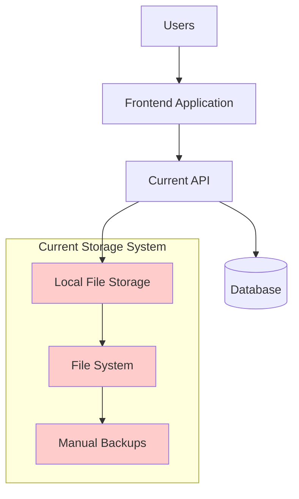
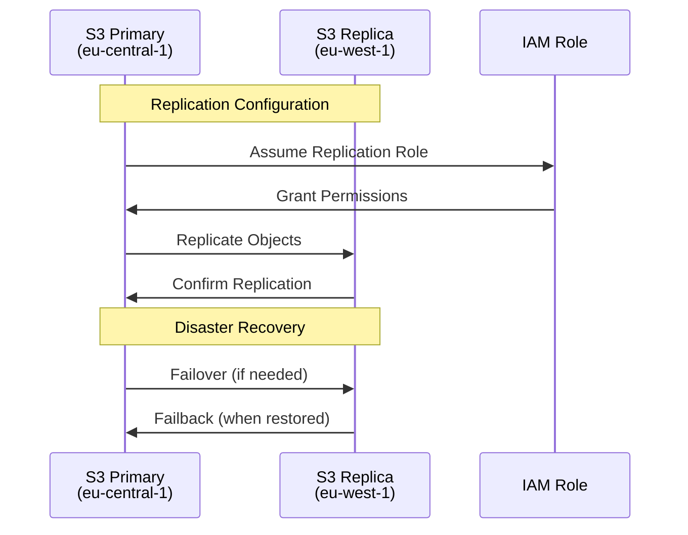
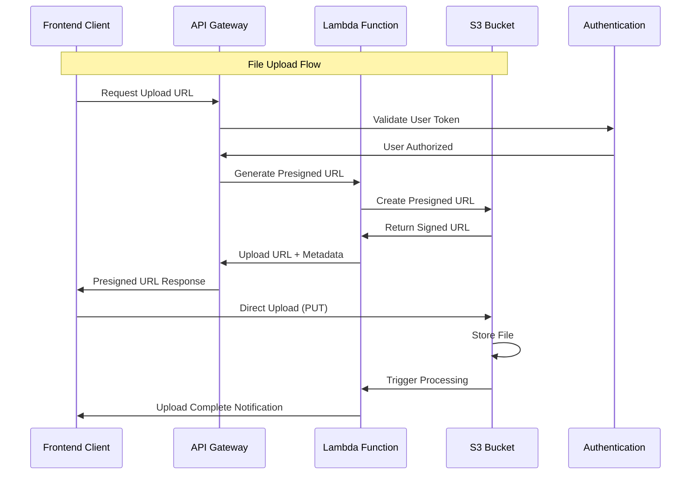
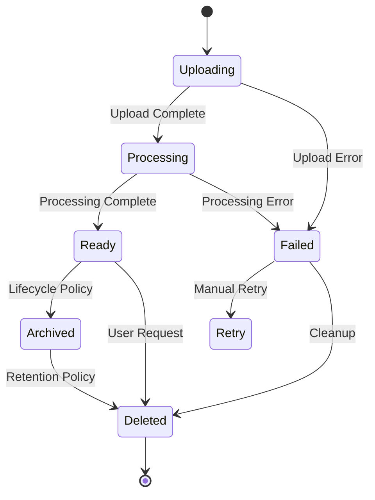
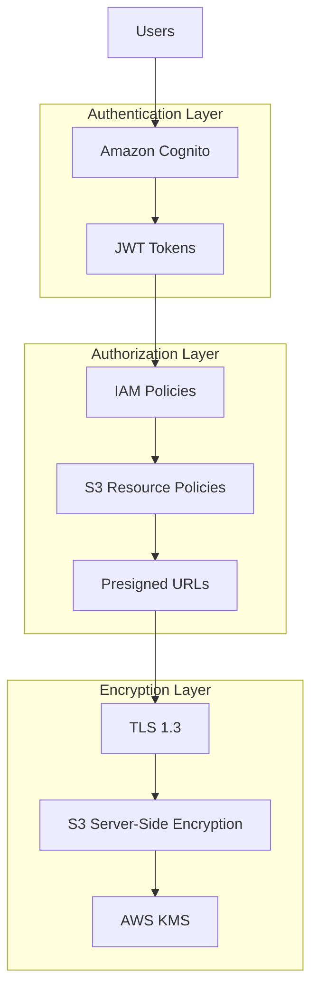
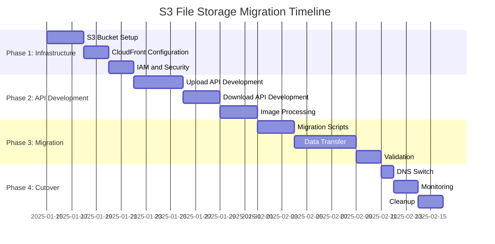
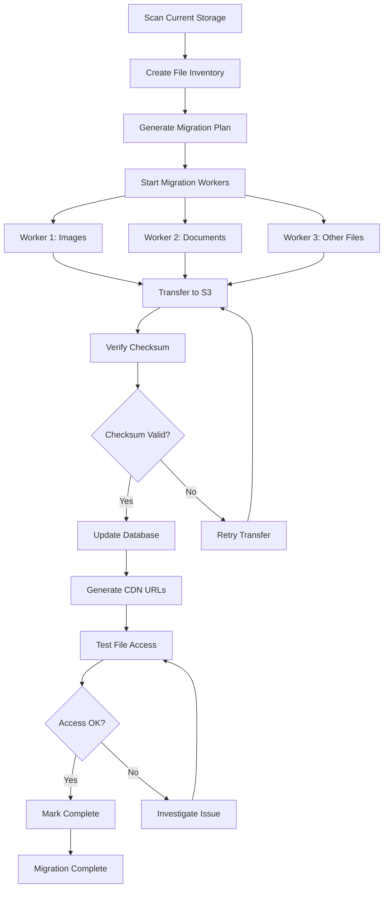
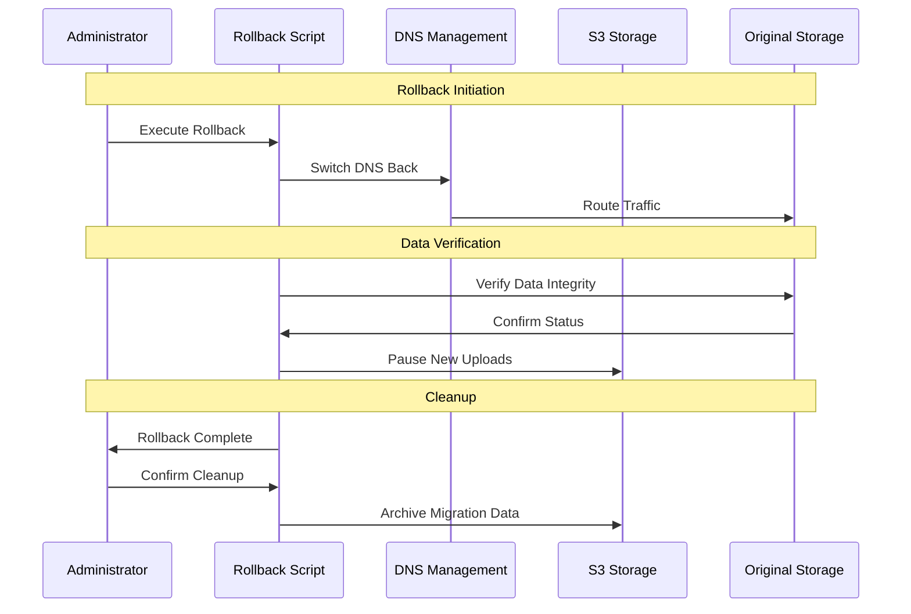
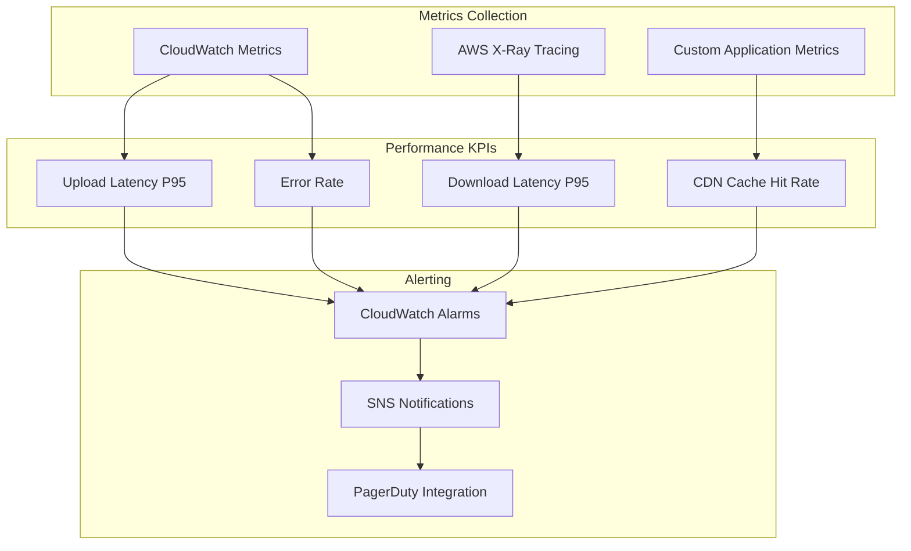
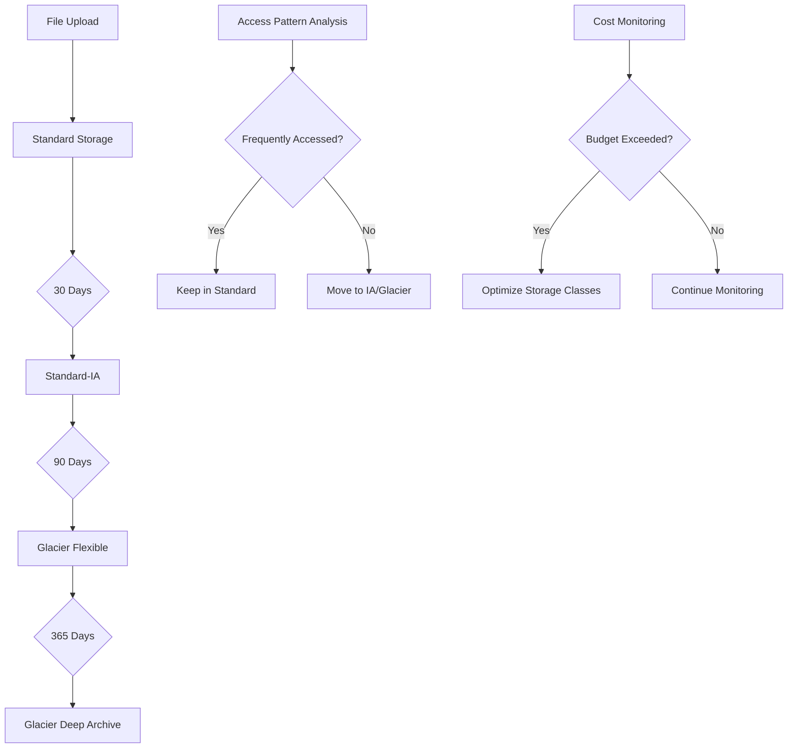

# S3 File Storage Migration Design

## Architecture Overview

### Current File Storage Architecture



### Target S3 + CloudFront Architecture

```mermaid
graph TB
    Frontend[Frontend Application] --> APIGateway[API Gateway]
    APIGateway --> Lambda[Lambda Functions]

    Lambda --> S3Primary[S3 Primary Bucket<br/>eu-central-1]
    Lambda --> DynamoDB[(DynamoDB<br/>File Metadata)]

    S3Primary --> CloudFront[CloudFront CDN]
    S3Primary --> S3Replica[S3 Replica Bucket<br/>eu-west-1]

    CloudFront --> EdgeLocations[Global Edge Locations]
    EdgeLocations --> Users[Global Users]

    subgraph "Image Processing"
        Lambda --> LambdaEdge[Lambda@Edge]
        LambdaEdge --> ImageOptimization[Image Optimization]
    end

    subgraph "Monitoring & Security"
        CloudWatch[CloudWatch Logs]
        KMS[AWS KMS Encryption]
        IAM[IAM Access Control]
    end

    style S3Primary fill:#ccffcc
    style CloudFront fill:#ccffcc
    style EdgeLocations fill:#ccffcc
```

## Component Design Specifications

### 1. S3 Storage Configuration Design

#### Primary Bucket Configuration

```yaml
Bucket Configuration:
  Name: matbakh-files-primary-eu-central-1
  Region: eu-central-1
  Versioning: Enabled
  Encryption:
    Type: SSE-KMS
    Key: Customer Managed Key
    KeyRotation: Annual

  Lifecycle Policies:
    - Rule: "Optimize Storage Classes"
      Transitions:
        - Days: 30, StorageClass: IA
        - Days: 90, StorageClass: Glacier
        - Days: 365, StorageClass: Deep Archive

    - Rule: "Delete Incomplete Multipart Uploads"
      AbortIncompleteMultipartUpload: 7 days

    - Rule: "Delete Old Versions"
      NoncurrentVersionExpiration: 90 days

  CORS Configuration:
    AllowedOrigins: ["https://matbakh.app", "https://*.matbakh.app"]
    AllowedMethods: [GET, PUT, POST, DELETE, HEAD]
    AllowedHeaders: ["*"]
    ExposeHeaders: ["ETag", "x-amz-meta-*"]
    MaxAgeSeconds: 3600

  Notification Configuration:
    CloudWatchEvents:
      - Event: s3:ObjectCreated:*
        Target: Lambda Function (ProcessUpload)
      - Event: s3:ObjectRemoved:*
        Target: Lambda Function (ProcessDeletion)
```

#### Cross-Region Replication Setup



### 2. CloudFront CDN Design

#### Distribution Configuration

```yaml
CloudFront Distribution:
  Origins:
    - DomainName: matbakh-files-primary-eu-central-1.s3.eu-central-1.amazonaws.com
      OriginPath: ""
      CustomOriginConfig:
        HTTPPort: 443
        OriginProtocolPolicy: https-only
        OriginSSLProtocols: [TLSv1.2]

  DefaultCacheBehavior:
    TargetOriginId: S3-matbakh-files-primary
    ViewerProtocolPolicy: redirect-to-https
    CachePolicyId: 4135ea2d-6df8-44a3-9df3-4b5a84be39ad # Managed-CachingOptimized
    OriginRequestPolicyId: 88a5eaf4-2fd4-4709-b370-b4c650ea3fcf # Managed-S3Origin

  CacheBehaviors:
    - PathPattern: "/images/*"
      CachePolicyId: 4135ea2d-6df8-44a3-9df3-4b5a84be39ad
      TTL: 86400 # 24 hours

    - PathPattern: "/documents/*"
      CachePolicyId: 4135ea2d-6df8-44a3-9df3-4b5a84be39ad
      TTL: 3600 # 1 hour

    - PathPattern: "/temp/*"
      CachePolicyId: 4135ea2d-6df8-44a3-9df3-4b5a84be39ad
      TTL: 300 # 5 minutes

  CustomErrorResponses:
    - ErrorCode: 403
      ResponseCode: 404
      ResponsePagePath: "/404.html"
    - ErrorCode: 404
      ResponseCode: 404
      ResponsePagePath: "/404.html"

  Aliases:
    - files.matbakh.app
    - cdn.matbakh.app

  ViewerCertificate:
    AcmCertificateArn: "arn:aws:acm:us-east-1:ACCOUNT:certificate/CERT-ID"
    SslSupportMethod: sni-only
    MinimumProtocolVersion: TLSv1.2_2021
```

#### Edge Location Optimization

```mermaid
graph TB
    subgraph "Global Edge Network"
        Frankfurt[Frankfurt Edge]
        London[London Edge]
        Paris[Paris Edge]
        NewYork[New York Edge]
        Tokyo[Tokyo Edge]
    end

    subgraph "Origin Infrastructure"
        S3[S3 eu-central-1]
        LambdaEdge[Lambda@Edge]
    end

    Frankfurt --> S3
    London --> S3
    Paris --> S3
    NewYork --> S3
    Tokyo --> S3

    Frankfurt --> LambdaEdge
    London --> LambdaEdge
    Paris --> LambdaEdge

    Users1[EU Users] --> Frankfurt
    Users2[UK Users] --> London
    Users3[US Users] --> NewYork
    Users4[Asia Users] --> Tokyo
```

### 3. File Upload/Download API Design

#### Presigned URL Generation



#### Multipart Upload Implementation

```typescript
interface MultipartUploadConfig {
  bucketName: string;
  keyName: string;
  partSize: number; // Default: 5MB
  maxConcurrency: number; // Default: 3
  retryAttempts: number; // Default: 3
}

interface UploadProgress {
  uploadId: string;
  totalParts: number;
  completedParts: number;
  bytesUploaded: number;
  totalBytes: number;
  percentage: number;
  estimatedTimeRemaining: number;
}

class MultipartUploadManager {
  async initiateUpload(config: MultipartUploadConfig): Promise<string>;
  async uploadPart(
    uploadId: string,
    partNumber: number,
    data: Buffer
  ): Promise<string>;
  async completeUpload(
    uploadId: string,
    parts: CompletedPart[]
  ): Promise<string>;
  async abortUpload(uploadId: string): Promise<void>;
  async getProgress(uploadId: string): Promise<UploadProgress>;
}
```

### 4. Image Processing Pipeline Design

#### Lambda@Edge Processing

```mermaid
flowchart TD
    A[Image Request] --> B{Cache Hit?}
    B -->|Yes| C[Return Cached Image]
    B -->|No| D[Lambda@Edge Trigger]

    D --> E[Parse Request Parameters]
    E --> F{Valid Parameters?}
    F -->|No| G[Return Original]
    F -->|Yes| H[Generate Optimized Image]

    H --> I[Resize/Crop]
    I --> J[Format Conversion]
    J --> K[Quality Optimization]
    K --> L[Cache Result]
    L --> M[Return Optimized Image]

    subgraph "Processing Options"
        N[WebP/AVIF Conversion]
        O[Responsive Sizes]
        P[Quality Adjustment]
        Q[Watermark Addition]
    end

    H --> N
    H --> O
    H --> P
    H --> Q
```

#### Image Processing Configuration

```yaml
Image Processing Rules:
  Formats:
    Input: [JPEG, PNG, GIF, WebP, AVIF, TIFF]
    Output: [JPEG, PNG, WebP, AVIF]

  Quality Settings:
    JPEG: 85
    WebP: 80
    AVIF: 75

  Resize Options:
    MaxWidth: 2048
    MaxHeight: 2048
    Sizes: [150, 300, 600, 1200, 1920]

  Optimization:
    Progressive: true
    Strip: true # Remove metadata
    Interlace: true

  Caching:
    TTL: 31536000 # 1 year
    Vary: ["Accept", "User-Agent"]
```

### 5. File Metadata Management

#### DynamoDB Schema Design

```yaml
FileMetadata Table:
  TableName: matbakh-file-metadata
  PartitionKey: fileId (String)
  SortKey: version (Number)

  Attributes:
    fileId: String # UUID v4
    version: Number # Version number
    originalName: String # User-provided filename
    mimeType: String # MIME type
    size: Number # File size in bytes
    checksum: String # SHA-256 checksum
    s3Key: String # S3 object key
    s3Bucket: String # S3 bucket name
    uploadedBy: String # User ID
    uploadedAt: String # ISO timestamp
    tags: Map # User-defined tags
    metadata: Map # System metadata
    status: String # processing, ready, error

  GlobalSecondaryIndexes:
    - IndexName: UserFilesIndex
      PartitionKey: uploadedBy
      SortKey: uploadedAt

    - IndexName: StatusIndex
      PartitionKey: status
      SortKey: uploadedAt

  LocalSecondaryIndexes:
    - IndexName: SizeIndex
      PartitionKey: fileId
      SortKey: size

  TTL:
    AttributeName: expiresAt
    Enabled: true
```

#### File Lifecycle Management



## Security Design

### Access Control Architecture



### IAM Policy Design

```json
{
  "Version": "2012-10-17",
  "Statement": [
    {
      "Sid": "AllowUserFileAccess",
      "Effect": "Allow",
      "Principal": {
        "AWS": "arn:aws:iam::ACCOUNT:role/MatbakhUserRole"
      },
      "Action": ["s3:GetObject", "s3:PutObject", "s3:DeleteObject"],
      "Resource": "arn:aws:s3:::matbakh-files-primary-eu-central-1/users/${cognito-identity.amazonaws.com:sub}/*",
      "Condition": {
        "StringEquals": {
          "s3:x-amz-server-side-encryption": "aws:kms"
        },
        "StringLike": {
          "s3:x-amz-server-side-encryption-aws-kms-key-id": "arn:aws:kms:eu-central-1:ACCOUNT:key/*"
        }
      }
    },
    {
      "Sid": "AllowPublicFileRead",
      "Effect": "Allow",
      "Principal": "*",
      "Action": "s3:GetObject",
      "Resource": "arn:aws:s3:::matbakh-files-primary-eu-central-1/public/*",
      "Condition": {
        "StringEquals": {
          "aws:Referer": ["https://matbakh.app/*", "https://*.matbakh.app/*"]
        }
      }
    }
  ]
}
```

## Migration Strategy Design

### Phase-Based Migration Approach



### Data Migration Pipeline



### Rollback Strategy



## Performance Optimization Design

### Caching Strategy

```yaml
Caching Layers:
  Browser Cache:
    Static Assets: 1 year
    Images: 30 days
    Documents: 7 days

  CloudFront Cache:
    Images: 24 hours
    Documents: 1 hour
    API Responses: 5 minutes

  Application Cache:
    File Metadata: 15 minutes
    User Permissions: 5 minutes
    Presigned URLs: 1 hour
```

### Performance Monitoring



## Cost Optimization Design

### Storage Class Optimization



### Cost Monitoring Dashboard

```yaml
Cost Metrics:
  Storage Costs:
    - Standard Storage: $0.023/GB/month
    - Standard-IA: $0.0125/GB/month
    - Glacier Flexible: $0.004/GB/month
    - Glacier Deep Archive: $0.00099/GB/month

  Transfer Costs:
    - CloudFront: $0.085/GB (first 10TB)
    - S3 Transfer: $0.09/GB
    - Cross-Region Replication: $0.02/GB

  Request Costs:
    - PUT/POST: $0.005/1000 requests
    - GET/HEAD: $0.0004/1000 requests
    - DELETE: Free

  Processing Costs:
    - Lambda@Edge: $0.0000006/request
    - Image Processing: $0.0017/GB-second
```

This comprehensive design provides the technical foundation for migrating to S3 file storage while ensuring performance, security, scalability, and cost optimization. The design emphasizes zero data loss, improved global performance through CDN, and automated cost optimization through intelligent storage tiering.
