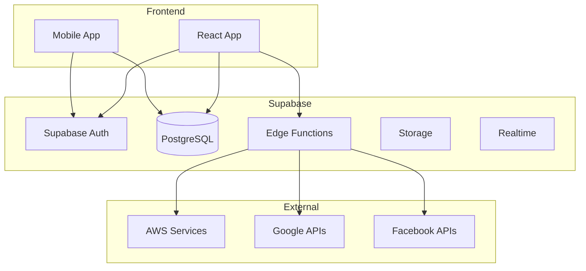
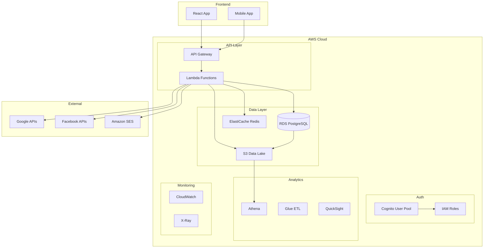

# Supabase → AWS Migration - Technical Design

**SPEC_ID:** SUPABASE-AWS-MIGRATION-DESIGN  
**STATUS:** ✅ COMPLETED  
**OWNER:** CTO  
**DEPENDENCIES:** requirements.md  
**COMPLETION_DATE:** September 18, 2025  

## 1. Architecture Overview

### Current State (Supabase)


### Target State (AWS)


## 2. Database Design

### RDS PostgreSQL Configuration
```yaml
Engine: PostgreSQL 15.4
Instance Class: db.r6g.xlarge
  - vCPUs: 4
  - Memory: 32 GiB
  - Network: Up to 10 Gbps
  - EBS Bandwidth: Up to 4,750 Mbps

Storage:
  Type: GP3
  Size: 500 GB (auto-scaling to 1000 GB)
  IOPS: 3000 (baseline)
  Throughput: 125 MiB/s

Multi-AZ: Enabled
Backup:
  Retention: 7 days automated, 35 days manual
  Window: 03:00-04:00 UTC
  
Encryption:
  At Rest: KMS Customer Managed Key
  In Transit: SSL/TLS 1.3

Monitoring:
  Enhanced Monitoring: 60 seconds
  Performance Insights: 7 days retention
```

### Database Schema Optimization
```sql
-- Partitioning Strategy für große Tabellen
CREATE TABLE visibility_check_leads (
    id UUID DEFAULT gen_random_uuid(),
    email TEXT NOT NULL,
    business_name TEXT NOT NULL,
    created_at TIMESTAMPTZ NOT NULL DEFAULT NOW(),
    -- ... andere Spalten
) PARTITION BY RANGE (created_at);

-- Monatliche Partitionen
CREATE TABLE visibility_check_leads_y2025m01 
PARTITION OF visibility_check_leads 
FOR VALUES FROM ('2025-01-01') TO ('2025-02-01');

CREATE TABLE visibility_check_leads_y2025m02 
PARTITION OF visibility_check_leads 
FOR VALUES FROM ('2025-02-01') TO ('2025-03-01');

-- Optimierte Indizes
CREATE INDEX CONCURRENTLY idx_business_partners_status_created 
ON business_partners(status, created_at DESC) 
WHERE status IN ('active', 'pending');

CREATE INDEX CONCURRENTLY idx_visibility_leads_email_status 
ON visibility_check_leads(email, status) 
WHERE status != 'deleted';

-- Materialized Views für Analytics
CREATE MATERIALIZED VIEW mv_daily_kpis AS
SELECT 
    DATE(created_at) as date,
    COUNT(*) as total_leads,
    COUNT(*) FILTER (WHERE status = 'completed') as completed_leads,
    AVG(overall_score) FILTER (WHERE overall_score IS NOT NULL) as avg_score
FROM visibility_check_leads vcl
LEFT JOIN visibility_check_results vcr ON vcl.id = vcr.lead_id
GROUP BY DATE(created_at)
ORDER BY date DESC;

-- Automatische Refresh
CREATE OR REPLACE FUNCTION refresh_daily_kpis()
RETURNS void AS $$
BEGIN
    REFRESH MATERIALIZED VIEW CONCURRENTLY mv_daily_kpis;
END;
$$ LANGUAGE plpgsql;

-- Cron Job für tägliche Aktualisierung
SELECT cron.schedule('refresh-kpis', '0 1 * * *', 'SELECT refresh_daily_kpis();');
```

### Read Replicas Configuration
```yaml
Primary: eu-central-1a
Read Replica 1: eu-central-1b (Analytics Workloads)
Read Replica 2: eu-central-1c (Reporting & Backups)

Connection Routing:
  Write Operations: Primary
  Analytics Queries: Read Replica 1
  Dashboard Queries: Read Replica 2
  Backup Operations: Read Replica 2

Lag Monitoring:
  Target: < 1 second
  Alert Threshold: > 5 seconds
  Auto-Failover: Enabled
```

## 3. Authentication & Authorization

### Cognito User Pool Design
```json
{
  "UserPool": {
    "PoolName": "matbakh-users-prod",
    "Policies": {
      "PasswordPolicy": {
        "MinimumLength": 8,
        "RequireUppercase": true,
        "RequireLowercase": true,
        "RequireNumbers": true,
        "RequireSymbols": false
      }
    },
    "AutoVerifiedAttributes": ["email"],
    "AliasAttributes": ["email"],
    "MfaConfiguration": "OPTIONAL",
    "EnabledMfas": ["SMS_MFA", "SOFTWARE_TOKEN_MFA"],
    "UserAttributeUpdateSettings": {
      "AttributesRequireVerificationBeforeUpdate": ["email"]
    },
    "Schema": [
      {
        "Name": "email",
        "AttributeDataType": "String",
        "Required": true,
        "Mutable": true
      },
      {
        "Name": "persona",
        "AttributeDataType": "String",
        "Required": false,
        "Mutable": true
      },
      {
        "Name": "business_id",
        "AttributeDataType": "String",
        "Required": false,
        "Mutable": true
      }
    ]
  }
}
```

### Lambda Triggers
```javascript
// Pre Sign-up Trigger
exports.preSignUp = async (event) => {
    // Auto-confirm email for trusted domains
    if (event.request.userAttributes.email.endsWith('@matbakh.app')) {
        event.response.autoConfirmUser = true;
        event.response.autoVerifyEmail = true;
    }
    
    // Validate business email format
    const email = event.request.userAttributes.email;
    if (!isValidBusinessEmail(email)) {
        throw new Error('Please use a business email address');
    }
    
    return event;
};

// Post Confirmation Trigger
exports.postConfirmation = async (event) => {
    const { userAttributes, userName } = event.request;
    
    // Create user profile in RDS
    await createUserProfile({
        cognitoId: userName,
        email: userAttributes.email,
        persona: userAttributes.persona || 'unknown'
    });
    
    // Send welcome email
    await sendWelcomeEmail(userAttributes.email);
    
    return event;
};

// Pre Authentication Trigger
exports.preAuthentication = async (event) => {
    // Check for suspicious login patterns
    const loginAttempts = await getRecentLoginAttempts(event.userName);
    if (loginAttempts > 5) {
        throw new Error('Too many login attempts. Please try again later.');
    }
    
    return event;
};
```

### RBAC Implementation
```sql
-- Roles Tabelle
CREATE TABLE user_roles (
    user_id UUID PRIMARY KEY,
    role TEXT NOT NULL DEFAULT 'user',
    permissions JSONB DEFAULT '[]'::jsonb,
    created_at TIMESTAMPTZ DEFAULT NOW(),
    updated_at TIMESTAMPTZ DEFAULT NOW(),
    CONSTRAINT valid_role CHECK (role IN ('user', 'admin', 'super_admin'))
);

-- RLS Policies
CREATE POLICY "Users can read own data" ON business_partners
    FOR SELECT USING (user_id = current_setting('app.current_user_id')::uuid);

CREATE POLICY "Admins can read all data" ON business_partners
    FOR SELECT USING (
        EXISTS (
            SELECT 1 FROM user_roles 
            WHERE user_id = current_setting('app.current_user_id')::uuid 
            AND role IN ('admin', 'super_admin')
        )
    );

-- Helper Function
CREATE OR REPLACE FUNCTION set_current_user(user_id UUID)
RETURNS void AS $$
BEGIN
    PERFORM set_config('app.current_user_id', user_id::text, true);
END;
$$ LANGUAGE plpgsql;
```

## 4. API Gateway Design

### REST API Configuration
```yaml
API Gateway Type: REST API
Endpoint Type: Regional
Custom Domain: api.matbakh.app
Certificate: ACM Certificate (*.matbakh.app)

Throttling:
  Burst Limit: 5000
  Rate Limit: 2000 requests/second
  
Per-Client Throttling:
  Authenticated Users: 1000 req/min
  Anonymous Users: 100 req/min

Caching:
  TTL: 300 seconds (5 minutes)
  Cache Key Parameters: 
    - Authorization header
    - Query parameters
  Cache Invalidation: Manual + TTL

CORS:
  Allow Origins: 
    - https://matbakh.app
    - https://app.matbakh.app
    - http://localhost:3000 (dev only)
  Allow Methods: GET, POST, PUT, DELETE, OPTIONS
  Allow Headers: Content-Type, Authorization, X-Requested-With
```

### API Routes Structure
```yaml
/api/v1:
  /auth:
    /login: POST
    /logout: POST
    /refresh: POST
    /forgot-password: POST
    /reset-password: POST
    
  /users:
    /profile: GET, PUT
    /preferences: GET, PUT
    /delete-account: DELETE
    
  /business:
    /partners: GET, POST
    /partners/{id}: GET, PUT, DELETE
    /profiles: GET, POST
    /profiles/{id}: GET, PUT, DELETE
    
  /vc:
    /start: POST
    /verify: POST
    /result/{token}: GET
    /results: GET (authenticated)
    
  /admin:
    /overview: GET
    /leads: GET
    /partners: GET
    /analytics: GET
    
  /integrations:
    /google/oauth: GET, POST
    /facebook/oauth: GET, POST
    /gmb/sync: POST
```

### Request/Response Schemas
```json
{
  "VCStartRequest": {
    "type": "object",
    "required": ["email", "business_name"],
    "properties": {
      "email": {
        "type": "string",
        "format": "email",
        "maxLength": 255
      },
      "business_name": {
        "type": "string",
        "minLength": 2,
        "maxLength": 100
      },
      "website": {
        "type": "string",
        "format": "uri",
        "maxLength": 255
      },
      "consent": {
        "type": "object",
        "required": ["analytics"],
        "properties": {
          "analytics": {"type": "boolean"},
          "marketing": {"type": "boolean"}
        }
      }
    }
  },
  
  "VCStartResponse": {
    "type": "object",
    "properties": {
      "success": {"type": "boolean"},
      "lead_id": {"type": "string", "format": "uuid"},
      "message": {"type": "string"},
      "verification_required": {"type": "boolean"}
    }
  },
  
  "ErrorResponse": {
    "type": "object",
    "required": ["error", "message"],
    "properties": {
      "error": {"type": "string"},
      "message": {"type": "string"},
      "details": {"type": "object"},
      "request_id": {"type": "string"}
    }
  }
}
```

## 5. Lambda Functions Architecture

### Function Organization
```
src/
├── shared/
│   ├── database/
│   │   ├── connection.js
│   │   ├── models/
│   │   └── migrations/
│   ├── auth/
│   │   ├── cognito.js
│   │   └── rbac.js
│   ├── utils/
│   │   ├── validation.js
│   │   ├── encryption.js
│   │   └── logging.js
│   └── external/
│       ├── google.js
│       ├── facebook.js
│       └── ses.js
├── functions/
│   ├── vc-start/
│   │   ├── index.js
│   │   ├── handler.js
│   │   └── package.json
│   ├── vc-bedrock-run/
│   │   ├── index.js
│   │   ├── bedrock.js
│   │   └── package.json
│   └── admin-overview/
│       ├── index.js
│       ├── queries.js
│       └── package.json
└── layers/
    ├── shared-layer/
    │   └── nodejs/
    │       └── node_modules/
    └── database-layer/
        └── nodejs/
            └── node_modules/
```

### Lambda Configuration
```yaml
Runtime: nodejs20.x
Architecture: arm64
Memory: 1024 MB (adjustable per function)
Timeout: 30 seconds (API functions), 15 minutes (background jobs)
Environment Variables:
  - NODE_ENV: production
  - RDS_ENDPOINT: matbakh-prod.cluster-xyz.eu-central-1.rds.amazonaws.com
  - REDIS_ENDPOINT: matbakh-cache.abc123.cache.amazonaws.com
  - COGNITO_USER_POOL_ID: eu-central-1_ABC123DEF
  
VPC Configuration:
  SecurityGroupIds: [sg-lambda-rds-access]
  SubnetIds: [subnet-private-1a, subnet-private-1b]
  
Layers:
  - arn:aws:lambda:eu-central-1:ACCOUNT:layer:shared-utils:1
  - arn:aws:lambda:eu-central-1:ACCOUNT:layer:database-client:1
  
Reserved Concurrency: 100 (per function)
Provisioned Concurrency: 10 (for critical functions)
```

### Error Handling & Retry Logic
```javascript
// Centralized Error Handler
class AppError extends Error {
    constructor(message, statusCode, isOperational = true) {
        super(message);
        this.statusCode = statusCode;
        this.isOperational = isOperational;
        this.timestamp = new Date().toISOString();
        Error.captureStackTrace(this, this.constructor);
    }
}

// Lambda Wrapper with Error Handling
const lambdaWrapper = (handler) => {
    return async (event, context) => {
        const requestId = context.awsRequestId;
        
        try {
            // Set correlation ID for tracing
            process.env.CORRELATION_ID = requestId;
            
            // Validate input
            const validatedEvent = await validateInput(event);
            
            // Execute handler
            const result = await handler(validatedEvent, context);
            
            // Log success
            console.log(`[${requestId}] Success:`, { result });
            
            return {
                statusCode: 200,
                headers: {
                    'Content-Type': 'application/json',
                    'X-Request-ID': requestId
                },
                body: JSON.stringify(result)
            };
            
        } catch (error) {
            console.error(`[${requestId}] Error:`, error);
            
            // Determine status code
            let statusCode = 500;
            if (error instanceof AppError) {
                statusCode = error.statusCode;
            } else if (error.name === 'ValidationError') {
                statusCode = 400;
            }
            
            return {
                statusCode,
                headers: {
                    'Content-Type': 'application/json',
                    'X-Request-ID': requestId
                },
                body: JSON.stringify({
                    error: error.name || 'InternalServerError',
                    message: error.message,
                    requestId
                })
            };
        }
    };
};

// Database Connection with Retry
const connectWithRetry = async (maxRetries = 3) => {
    for (let i = 0; i < maxRetries; i++) {
        try {
            const client = new Client({
                host: process.env.RDS_ENDPOINT,
                database: 'matbakh',
                user: process.env.DB_USER,
                password: process.env.DB_PASSWORD,
                ssl: { rejectUnauthorized: false },
                connectionTimeoutMillis: 5000,
                idleTimeoutMillis: 30000
            });
            
            await client.connect();
            return client;
            
        } catch (error) {
            console.warn(`Database connection attempt ${i + 1} failed:`, error.message);
            
            if (i === maxRetries - 1) {
                throw new AppError('Database connection failed', 503);
            }
            
            // Exponential backoff
            await new Promise(resolve => setTimeout(resolve, Math.pow(2, i) * 1000));
        }
    }
};
```

## 6. Caching Strategy

### ElastiCache Redis Configuration
```yaml
Engine: Redis 7.0
Node Type: cache.r6g.large
  - vCPUs: 2
  - Memory: 13.07 GiB
  - Network: Up to 10 Gbps

Cluster Mode: Enabled
Shards: 3
Replicas per Shard: 1
Multi-AZ: Enabled

Security:
  Encryption at Rest: Enabled
  Encryption in Transit: Enabled
  Auth Token: Enabled
  
Backup:
  Automatic Backup: Enabled
  Backup Retention: 5 days
  Backup Window: 03:00-05:00 UTC

Parameter Group:
  maxmemory-policy: allkeys-lru
  timeout: 300
  tcp-keepalive: 60
```

### Cache Patterns
```javascript
// Cache-Aside Pattern
class CacheService {
    constructor() {
        this.redis = new Redis({
            host: process.env.REDIS_ENDPOINT,
            port: 6379,
            password: process.env.REDIS_AUTH_TOKEN,
            retryDelayOnFailover: 100,
            maxRetriesPerRequest: 3,
            lazyConnect: true
        });
    }
    
    async get(key, fallbackFn, ttl = 300) {
        try {
            // Try cache first
            const cached = await this.redis.get(key);
            if (cached) {
                return JSON.parse(cached);
            }
            
            // Fallback to source
            const data = await fallbackFn();
            
            // Cache the result
            await this.redis.setex(key, ttl, JSON.stringify(data));
            
            return data;
            
        } catch (error) {
            console.warn('Cache error, falling back to source:', error.message);
            return await fallbackFn();
        }
    }
    
    async invalidate(pattern) {
        try {
            const keys = await this.redis.keys(pattern);
            if (keys.length > 0) {
                await this.redis.del(...keys);
            }
        } catch (error) {
            console.warn('Cache invalidation error:', error.message);
        }
    }
    
    async warmup(key, data, ttl = 300) {
        try {
            await this.redis.setex(key, ttl, JSON.stringify(data));
        } catch (error) {
            console.warn('Cache warmup error:', error.message);
        }
    }
}

// Usage Examples
const cache = new CacheService();

// Business Profile Caching
async function getBusinessProfile(partnerId) {
    return await cache.get(
        `business_profile:${partnerId}`,
        async () => {
            const result = await db.query(
                'SELECT * FROM business_partners WHERE id = $1',
                [partnerId]
            );
            return result.rows[0];
        },
        300 // 5 minutes
    );
}

// GMB Categories Caching (long-lived)
async function getGMBCategories() {
    return await cache.get(
        'gmb_categories:all',
        async () => {
            const result = await db.query(
                'SELECT * FROM gmb_categories WHERE is_active = true ORDER BY sort_order'
            );
            return result.rows;
        },
        3600 // 1 hour
    );
}

// Session Caching
async function getUserSession(sessionId) {
    return await cache.get(
        `session:${sessionId}`,
        async () => {
            // Fallback to Cognito if not in cache
            return await cognito.getUser(sessionId);
        },
        1800 // 30 minutes
    );
}
```

### Cache Invalidation Strategy
```javascript
// Event-driven Cache Invalidation
const invalidateCache = async (event) => {
    const { eventName, tableName, recordId } = event;
    
    switch (tableName) {
        case 'business_partners':
            await cache.invalidate(`business_profile:${recordId}`);
            await cache.invalidate(`partner_kpis:${recordId}`);
            break;
            
        case 'visibility_check_results':
            await cache.invalidate(`vc_result:${recordId}`);
            await cache.invalidate(`dashboard:*`);
            break;
            
        case 'gmb_categories':
            await cache.invalidate('gmb_categories:*');
            break;
    }
};

// Database Trigger for Cache Invalidation
CREATE OR REPLACE FUNCTION notify_cache_invalidation()
RETURNS trigger AS $$
BEGIN
    PERFORM pg_notify('cache_invalidation', json_build_object(
        'table', TG_TABLE_NAME,
        'operation', TG_OP,
        'record_id', COALESCE(NEW.id, OLD.id)
    )::text);
    
    RETURN COALESCE(NEW, OLD);
END;
$$ LANGUAGE plpgsql;

-- Apply to relevant tables
CREATE TRIGGER cache_invalidation_trigger
    AFTER INSERT OR UPDATE OR DELETE ON business_partners
    FOR EACH ROW EXECUTE FUNCTION notify_cache_invalidation();
```

## 7. Data Lake & Analytics

### S3 Data Lake Structure
```
s3://matbakh-data-lake-prod/
├── raw/                          # Raw data ingestion
│   ├── rds-exports/             # Daily PostgreSQL exports
│   │   ├── year=2025/
│   │   │   ├── month=01/
│   │   │   │   ├── day=15/
│   │   │   │   │   ├── business_partners.parquet
│   │   │   │   │   ├── visibility_check_leads.parquet
│   │   │   │   │   └── ...
│   ├── api-logs/                # API Gateway logs
│   ├── lambda-logs/             # Lambda function logs
│   └── external-apis/           # Google, Facebook API responses
│       ├── google-business/
│       ├── facebook-insights/
│       └── ga4-exports/
├── curated/                     # Processed, clean data
│   ├── facts/                   # Fact tables (Star Schema)
│   │   ├── fact_onboarding_steps/
│   │   ├── fact_visibility_checks/
│   │   ├── fact_email_events/
│   │   └── fact_api_requests/
│   ├── dimensions/              # Dimension tables
│   │   ├── dim_users/
│   │   ├── dim_businesses/
│   │   ├── dim_locations/
│   │   └── dim_time/
│   └── aggregates/              # Pre-computed aggregations
│       ├── daily_kpis/
│       ├── monthly_cohorts/
│       └── user_segments/
├── ml/                          # Machine Learning datasets
│   ├── features/                # Feature store
│   ├── training/                # Training datasets
│   ├── models/                  # Trained models
│   └── predictions/             # Model outputs
└── archive/                     # Long-term storage
    ├── year=2024/
    └── year=2023/
```

### ETL Pipeline with AWS Glue
```python
# Glue ETL Job: RDS to S3 Export
import sys
from awsglue.transforms import *
from awsglue.utils import getResolvedOptions
from pyspark.context import SparkContext
from awsglue.context import GlueContext
from awsglue.job import Job
from awsglue.dynamicframe import DynamicFrame

args = getResolvedOptions(sys.argv, ['JOB_NAME', 'DATABASE_URL', 'S3_BUCKET'])
sc = SparkContext()
glueContext = GlueContext(sc)
spark = glueContext.spark_session
job = Job(glueContext)
job.init(args['JOB_NAME'], args)

# Read from RDS
business_partners_df = glueContext.create_dynamic_frame.from_options(
    connection_type="postgresql",
    connection_options={
        "url": args['DATABASE_URL'],
        "dbtable": "business_partners",
        "user": "etl_user",
        "password": "{{resolve:secretsmanager:rds-password:SecretString:password}}"
    }
)

# Data Quality Checks
def validate_data_quality(df):
    # Check for null values in required fields
    null_count = df.filter(df.id.isNull()).count()
    if null_count > 0:
        raise Exception(f"Found {null_count} null IDs in business_partners")
    
    # Check for duplicate IDs
    total_count = df.count()
    distinct_count = df.select("id").distinct().count()
    if total_count != distinct_count:
        raise Exception(f"Found duplicate IDs: {total_count} total vs {distinct_count} distinct")
    
    return True

# Convert to Spark DataFrame for validation
spark_df = business_partners_df.toDF()
validate_data_quality(spark_df)

# Transform data
transformed_df = business_partners_df.apply_mapping([
    ("id", "string", "business_id", "string"),
    ("user_id", "string", "user_id", "string"),
    ("company_name", "string", "business_name", "string"),
    ("status", "string", "status", "string"),
    ("created_at", "timestamp", "created_date", "timestamp"),
    ("updated_at", "timestamp", "last_modified", "timestamp")
])

# Add partition columns
from pyspark.sql.functions import year, month, dayofmonth
spark_transformed = transformed_df.toDF()
spark_partitioned = spark_transformed.withColumn("year", year("created_date")) \
                                   .withColumn("month", month("created_date")) \
                                   .withColumn("day", dayofmonth("created_date"))

final_df = DynamicFrame.fromDF(spark_partitioned, glueContext, "final_df")

# Write to S3 with partitioning
glueContext.write_dynamic_frame.from_options(
    frame=final_df,
    connection_type="s3",
    connection_options={
        "path": f"s3://{args['S3_BUCKET']}/curated/business_partners/",
        "partitionKeys": ["year", "month", "day"]
    },
    format="parquet",
    format_options={
        "compression": "snappy"
    }
)

job.commit()
```

### Athena Query Optimization
```sql
-- Optimized table creation with partitioning
CREATE EXTERNAL TABLE business_partners_curated (
    business_id string,
    user_id string,
    business_name string,
    status string,
    created_date timestamp,
    last_modified timestamp
)
PARTITIONED BY (
    year int,
    month int,
    day int
)
STORED AS PARQUET
LOCATION 's3://matbakh-data-lake-prod/curated/business_partners/'
TBLPROPERTIES (
    'projection.enabled' = 'true',
    'projection.year.type' = 'integer',
    'projection.year.range' = '2024,2030',
    'projection.month.type' = 'integer',
    'projection.month.range' = '1,12',
    'projection.day.type' = 'integer',
    'projection.day.range' = '1,31',
    'storage.location.template' = 's3://matbakh-data-lake-prod/curated/business_partners/year=${year}/month=${month}/day=${day}/'
);

-- Efficient queries with partition pruning
SELECT 
    business_name,
    status,
    COUNT(*) as count
FROM business_partners_curated
WHERE year = 2025 
  AND month = 1
  AND status = 'active'
GROUP BY business_name, status
ORDER BY count DESC
LIMIT 100;

-- Complex analytics query
WITH monthly_cohorts AS (
    SELECT 
        DATE_TRUNC('month', created_date) as cohort_month,
        COUNT(DISTINCT business_id) as new_businesses
    FROM business_partners_curated
    WHERE year >= 2024
    GROUP BY DATE_TRUNC('month', created_date)
),
retention_analysis AS (
    SELECT 
        bp.cohort_month,
        DATE_TRUNC('month', vc.created_date) as activity_month,
        COUNT(DISTINCT bp.business_id) as active_businesses
    FROM monthly_cohorts bp
    JOIN visibility_check_results_curated vc 
        ON bp.business_id = vc.business_id
    WHERE vc.year >= 2024
    GROUP BY bp.cohort_month, DATE_TRUNC('month', vc.created_date)
)
SELECT 
    cohort_month,
    activity_month,
    active_businesses,
    ROUND(
        100.0 * active_businesses / 
        FIRST_VALUE(active_businesses) OVER (
            PARTITION BY cohort_month 
            ORDER BY activity_month
        ), 2
    ) as retention_rate
FROM retention_analysis
ORDER BY cohort_month, activity_month;
```

## 8. Monitoring & Observability

### CloudWatch Dashboards
```json
{
  "widgets": [
    {
      "type": "metric",
      "properties": {
        "metrics": [
          ["AWS/ApiGateway", "Count", "ApiName", "matbakh-api"],
          ["AWS/ApiGateway", "Latency", "ApiName", "matbakh-api"],
          ["AWS/ApiGateway", "4XXError", "ApiName", "matbakh-api"],
          ["AWS/ApiGateway", "5XXError", "ApiName", "matbakh-api"]
        ],
        "period": 300,
        "stat": "Average",
        "region": "eu-central-1",
        "title": "API Gateway Metrics"
      }
    },
    {
      "type": "metric",
      "properties": {
        "metrics": [
          ["AWS/Lambda", "Duration", "FunctionName", "vc-start"],
          ["AWS/Lambda", "Errors", "FunctionName", "vc-start"],
          ["AWS/Lambda", "Throttles", "FunctionName", "vc-start"],
          ["AWS/Lambda", "ConcurrentExecutions", "FunctionName", "vc-start"]
        ],
        "period": 300,
        "stat": "Average",
        "region": "eu-central-1",
        "title": "Lambda Function Metrics"
      }
    },
    {
      "type": "metric",
      "properties": {
        "metrics": [
          ["AWS/RDS", "CPUUtilization", "DBClusterIdentifier", "matbakh-prod"],
          ["AWS/RDS", "DatabaseConnections", "DBClusterIdentifier", "matbakh-prod"],
          ["AWS/RDS", "ReadLatency", "DBClusterIdentifier", "matbakh-prod"],
          ["AWS/RDS", "WriteLatency", "DBClusterIdentifier", "matbakh-prod"]
        ],
        "period": 300,
        "stat": "Average",
        "region": "eu-central-1",
        "title": "RDS Cluster Metrics"
      }
    }
  ]
}
```

### Custom Metrics & Alarms
```javascript
// Custom CloudWatch Metrics
const AWS = require('aws-sdk');
const cloudwatch = new AWS.CloudWatch();

class MetricsService {
    async putMetric(metricName, value, unit = 'Count', dimensions = []) {
        const params = {
            Namespace: 'Matbakh/Application',
            MetricData: [{
                MetricName: metricName,
                Value: value,
                Unit: unit,
                Dimensions: dimensions,
                Timestamp: new Date()
            }]
        };
        
        try {
            await cloudwatch.putMetricData(params).promise();
        } catch (error) {
            console.error('Failed to put metric:', error);
        }
    }
    
    async recordBusinessMetric(metricName, value, businessId) {
        await this.putMetric(metricName, value, 'Count', [
            { Name: 'BusinessId', Value: businessId }
        ]);
    }
    
    async recordAPIMetric(endpoint, duration, statusCode) {
        await this.putMetric('APILatency', duration, 'Milliseconds', [
            { Name: 'Endpoint', Value: endpoint },
            { Name: 'StatusCode', Value: statusCode.toString() }
        ]);
    }
}

// Usage in Lambda functions
const metrics = new MetricsService();

exports.handler = async (event) => {
    const startTime = Date.now();
    
    try {
        // Business logic here
        const result = await processVCRequest(event);
        
        // Record success metrics
        await metrics.recordAPIMetric('/vc/start', Date.now() - startTime, 200);
        await metrics.putMetric('VCRequestsSuccessful', 1);
        
        return result;
        
    } catch (error) {
        // Record error metrics
        await metrics.recordAPIMetric('/vc/start', Date.now() - startTime, 500);
        await metrics.putMetric('VCRequestsFailed', 1);
        
        throw error;
    }
};
```

### Alerting Configuration
```yaml
Alarms:
  HighAPILatency:
    MetricName: AWS/ApiGateway/Latency
    Threshold: 1000  # milliseconds
    ComparisonOperator: GreaterThanThreshold
    EvaluationPeriods: 2
    Period: 300
    Statistic: Average
    AlarmActions:
      - arn:aws:sns:eu-central-1:ACCOUNT:alerts-critical
      
  HighErrorRate:
    MetricName: AWS/ApiGateway/5XXError
    Threshold: 5  # percent
    ComparisonOperator: GreaterThanThreshold
    EvaluationPeriods: 2
    Period: 300
    Statistic: Average
    TreatMissingData: notBreaching
    
  DatabaseConnections:
    MetricName: AWS/RDS/DatabaseConnections
    Threshold: 80  # connections
    ComparisonOperator: GreaterThanThreshold
    EvaluationPeriods: 3
    Period: 300
    Statistic: Average
    
  LambdaErrors:
    MetricName: AWS/Lambda/Errors
    Threshold: 10
    ComparisonOperator: GreaterThanThreshold
    EvaluationPeriods: 2
    Period: 300
    Statistic: Sum
    Dimensions:
      - Name: FunctionName
        Value: vc-start

SNS Topics:
  alerts-critical:
    Subscriptions:
      - Protocol: email
        Endpoint: alerts@matbakh.app
      - Protocol: sms
        Endpoint: +49123456789
      - Protocol: https
        Endpoint: https://hooks.slack.com/services/...
        
  alerts-warning:
    Subscriptions:
      - Protocol: email
        Endpoint: dev-team@matbakh.app
```

### X-Ray Tracing
```javascript
// X-Ray Integration
const AWSXRay = require('aws-xray-sdk-core');
const AWS = AWSXRay.captureAWS(require('aws-sdk'));

// Trace database operations
const traceDatabase = (operation, query) => {
    const subsegment = AWSXRay.getSegment().addNewSubsegment('database');
    subsegment.addAnnotation('operation', operation);
    subsegment.addMetadata('query', query);
    
    return {
        close: (error = null) => {
            if (error) {
                subsegment.addError(error);
            }
            subsegment.close();
        }
    };
};

// Usage
exports.handler = AWSXRay.captureAsyncFunc('vc-start', async (event) => {
    const segment = AWSXRay.getSegment();
    segment.addAnnotation('userId', event.requestContext.authorizer?.claims?.sub);
    
    const dbTrace = traceDatabase('INSERT', 'INSERT INTO visibility_check_leads...');
    
    try {
        const result = await db.query('INSERT INTO visibility_check_leads...');
        dbTrace.close();
        
        return {
            statusCode: 200,
            body: JSON.stringify(result)
        };
        
    } catch (error) {
        dbTrace.close(error);
        throw error;
    }
});
```

## 9. Security Implementation

### Network Security
```yaml
VPC Configuration:
  CIDR: 10.0.0.0/16
  
  Public Subnets:
    - 10.0.1.0/24 (eu-central-1a) - NAT Gateway, ALB
    - 10.0.2.0/24 (eu-central-1b) - NAT Gateway, ALB
    
  Private Subnets:
    - 10.0.10.0/24 (eu-central-1a) - Lambda, RDS
    - 10.0.11.0/24 (eu-central-1b) - Lambda, RDS
    - 10.0.12.0/24 (eu-central-1c) - RDS Read Replica
    
  Database Subnets:
    - 10.0.20.0/24 (eu-central-1a) - RDS Primary
    - 10.0.21.0/24 (eu-central-1b) - RDS Standby
    - 10.0.22.0/24 (eu-central-1c) - RDS Read Replica

Security Groups:
  ALB-SG:
    Inbound:
      - Port 443 from 0.0.0.0/0 (HTTPS)
      - Port 80 from 0.0.0.0/0 (HTTP redirect)
    Outbound:
      - All traffic to Lambda-SG
      
  Lambda-SG:
    Inbound:
      - Port 443 from ALB-SG
    Outbound:
      - Port 5432 to RDS-SG
      - Port 6379 to Redis-SG
      - Port 443 to 0.0.0.0/0 (external APIs)
      
  RDS-SG:
    Inbound:
      - Port 5432 from Lambda-SG
      - Port 5432 from Bastion-SG (admin access)
    Outbound: None
    
  Redis-SG:
    Inbound:
      - Port 6379 from Lambda-SG
    Outbound: None
```

### WAF Configuration
```json
{
  "Name": "matbakh-api-waf",
  "Scope": "REGIONAL",
  "DefaultAction": {
    "Type": "ALLOW"
  },
  "Rules": [
    {
      "Name": "AWSManagedRulesCommonRuleSet",
      "Priority": 1,
      "Statement": {
        "ManagedRuleGroupStatement": {
          "VendorName": "AWS",
          "Name": "AWSManagedRulesCommonRuleSet"
        }
      },
      "Action": {
        "Block": {}
      }
    },
    {
      "Name": "AWSManagedRulesKnownBadInputsRuleSet",
      "Priority": 2,
      "Statement": {
        "ManagedRuleGroupStatement": {
          "VendorName": "AWS",
          "Name": "AWSManagedRulesKnownBadInputsRuleSet"
        }
      },
      "Action": {
        "Block": {}
      }
    },
    {
      "Name": "RateLimitRule",
      "Priority": 3,
      "Statement": {
        "RateBasedStatement": {
          "Limit": 2000,
          "AggregateKeyType": "IP"
        }
      },
      "Action": {
        "Block": {}
      }
    },
    {
      "Name": "GeoBlockRule",
      "Priority": 4,
      "Statement": {
        "GeoMatchStatement": {
          "CountryCodes": ["CN", "RU", "KP"]
        }
      },
      "Action": {
        "Block": {}
      }
    }
  ]
}
```

### Encryption & Secrets Management
```yaml
KMS Keys:
  RDS-Key:
    Description: "Encryption key for RDS databases"
    KeyPolicy:
      - Effect: Allow
        Principal: 
          AWS: "arn:aws:iam::ACCOUNT:root"
        Action: "kms:*"
        Resource: "*"
      - Effect: Allow
        Principal:
          AWS: "arn:aws:iam::ACCOUNT:role/RDSRole"
        Action:
          - "kms:Decrypt"
          - "kms:GenerateDataKey"
        Resource: "*"
        
  Lambda-Key:
    Description: "Encryption key for Lambda environment variables"
    KeyPolicy:
      - Effect: Allow
        Principal:
          AWS: "arn:aws:iam::ACCOUNT:role/LambdaExecutionRole"
        Action:
          - "kms:Decrypt"
        Resource: "*"

Secrets Manager:
  rds-credentials:
    SecretString:
      username: "matbakh_app"
      password: "{{generate-random-password}}"
      engine: "postgres"
      host: "matbakh-prod.cluster-xyz.eu-central-1.rds.amazonaws.com"
      port: 5432
      dbname: "matbakh"
    KmsKeyId: "alias/rds-key"
    
  external-api-keys:
    SecretString:
      google_client_id: "{{google-oauth-client-id}}"
      google_client_secret: "{{google-oauth-client-secret}}"
      facebook_app_id: "{{facebook-app-id}}"
      facebook_app_secret: "{{facebook-app-secret}}"
    KmsKeyId: "alias/lambda-key"
```

---

**NEXT PHASE:** Implementation Planning & Resource Allocation