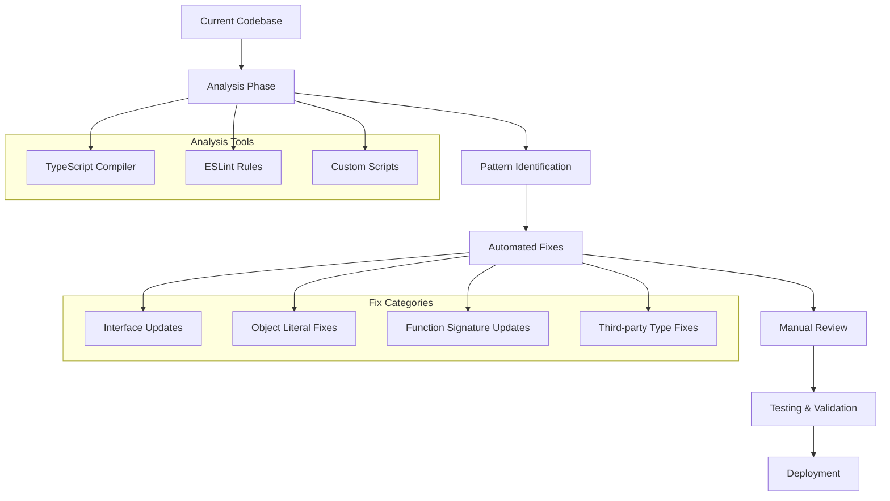
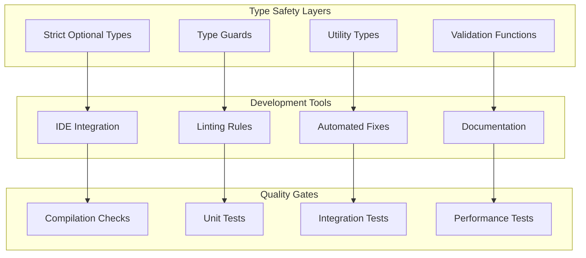
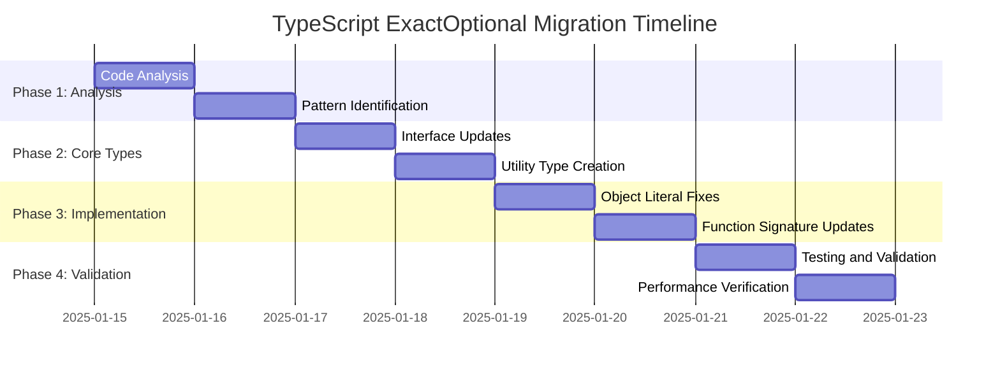

# TypeScript ExactOptional Compliance Design

## Overview

This design document outlines the systematic approach to implement `exactOptionalPropertyTypes: true` compliance across the matbakh.app codebase, ensuring strict type safety while maintaining code functionality and developer productivity.

## Current State Analysis

### TypeScript Configuration Status

```typescript
// Current tsconfig.json (problematic)
{
  "compilerOptions": {
    "strict": true,
    "exactOptionalPropertyTypes": false  // Currently disabled
  }
}

// Target tsconfig.json (compliant)
{
  "compilerOptions": {
    "strict": true,
    "exactOptionalPropertyTypes": true   // Enable strict optional types
  }
}
```

### Common Type Issues Identified

```typescript
// ❌ Current problematic patterns
interface User {
  name: string;
  email?: string; // Allows undefined assignment
  age?: number; // Allows undefined assignment
}

const user: User = {
  name: "John",
  email: undefined, // This will fail with exactOptionalPropertyTypes
  age: undefined, // This will fail with exactOptionalPropertyTypes
};

// ✅ Target compliant patterns
interface User {
  name: string;
  email?: string | undefined; // Explicitly allow undefined
  age?: number | undefined; // Explicitly allow undefined
}

const user: User = {
  name: "John",
  // Optional properties can be omitted entirely
  // or explicitly set to undefined if needed
  ...(someCondition ? { email: "john@example.com" } : {}),
  ...(hasAge ? { age: 25 } : {}),
};
```

## Architecture Design

### Migration Strategy Architecture



### Type System Enhancement Design



## Implementation Design

### 1. Interface and Type Definition Updates

#### Pattern Transformation Rules

```typescript
// Rule 1: Optional properties with explicit undefined
// Before
interface ApiResponse {
  data?: any;
  error?: string;
}

// After
interface ApiResponse {
  data?: any | undefined;
  error?: string | undefined;
}

// Rule 2: Conditional object properties
// Before
const config = {
  apiUrl: baseUrl,
  timeout: hasTimeout ? timeoutValue : undefined,
};

// After
const config = {
  apiUrl: baseUrl,
  ...(hasTimeout ? { timeout: timeoutValue } : {}),
};

// Rule 3: Function parameters with defaults
// Before
function processUser(user: User, options?: ProcessOptions) {
  const opts = options || {};
  // ...
}

// After
function processUser(user: User, options?: ProcessOptions | undefined) {
  const opts = options ?? {};
  // ...
}
```

#### Utility Type Definitions

```typescript
// Utility types for common patterns
type OptionalUndefined<T> = {
  [K in keyof T]: T[K] | undefined;
};

type StrictOptional<T, K extends keyof T> = Omit<T, K> & {
  [P in K]?: T[P] | undefined;
};

type RequiredFields<T, K extends keyof T> = T & Required<Pick<T, K>>;

// Helper for conditional object properties
type ConditionalProperty<T, K extends keyof T> = T[K] extends undefined
  ? {}
  : Pick<T, K>;

// Safe property access
type SafeAccess<T, K extends keyof T> = T[K] extends undefined
  ? T[K] | undefined
  : T[K];
```

### 2. Object Literal and Assignment Patterns

#### Conditional Property Assignment

```typescript
// Pattern: Conditional object construction
class ConfigBuilder {
  private config: Partial<Config> = {};

  // ❌ Problematic approach
  setOptionalValue(key: keyof Config, value: any) {
    this.config[key] = value || undefined; // Fails with exactOptionalPropertyTypes
  }

  // ✅ Compliant approach
  setOptionalValue<K extends keyof Config>(
    key: K,
    value: Config[K] | undefined
  ) {
    if (value !== undefined) {
      this.config[key] = value;
    }
  }

  // ✅ Alternative approach with spread
  addConditionalProperty<K extends keyof Config>(
    key: K,
    value: Config[K] | undefined
  ) {
    this.config = {
      ...this.config,
      ...(value !== undefined ? { [key]: value } : {}),
    };
  }
}
```

#### Safe Object Merging

```typescript
// Utility for safe object merging with optional properties
function mergeWithOptionals<T extends Record<string, any>>(
  base: T,
  updates: Partial<T>
): T {
  const result = { ...base };

  for (const [key, value] of Object.entries(updates)) {
    if (value !== undefined) {
      (result as any)[key] = value;
    }
  }

  return result;
}

// Usage example
const userConfig = mergeWithOptionals(defaultConfig, {
  theme: userPreferences.theme,
  language: userPreferences.language,
  // undefined values are automatically filtered out
});
```

### 3. Function Signature and Parameter Handling

#### Optional Parameter Patterns

```typescript
// Pattern: Function with optional parameters
interface FunctionOptions {
  timeout?: number | undefined;
  retries?: number | undefined;
  callback?: ((result: any) => void) | undefined;
}

// ✅ Compliant function signature
async function apiCall(
  url: string,
  options?: FunctionOptions | undefined
): Promise<ApiResponse> {
  const { timeout = 5000, retries = 3, callback } = options ?? {};

  // Implementation with proper undefined handling
  try {
    const result = await fetch(url, {
      signal: timeout ? AbortSignal.timeout(timeout) : undefined,
    });

    if (callback) {
      callback(result);
    }

    return result;
  } catch (error) {
    if (retries > 0) {
      return apiCall(url, { ...options, retries: retries - 1 });
    }
    throw error;
  }
}
```

#### Return Type Handling

```typescript
// Pattern: Functions returning optional values
class DataService {
  // ✅ Explicit undefined in return type
  async findUser(id: string): Promise<User | undefined> {
    const user = await this.repository.findById(id);
    return user ?? undefined; // Explicit undefined return
  }

  // ✅ Optional property access with type guards
  getUserEmail(user: User): string | undefined {
    return user.email ?? undefined;
  }

  // ✅ Safe property access with validation
  getOptionalProperty<T, K extends keyof T>(obj: T, key: K): T[K] | undefined {
    return obj[key] ?? undefined;
  }
}
```

### 4. Type Guard and Validation Implementation

#### Comprehensive Type Guards

```typescript
// Type guard utilities for optional properties
function isDefined<T>(value: T | undefined): value is T {
  return value !== undefined;
}

function isOptionalDefined<T, K extends keyof T>(
  obj: T,
  key: K
): obj is T & Required<Pick<T, K>> {
  return obj[key] !== undefined;
}

// Usage in application code
function processUserData(user: User) {
  // Safe access to optional properties
  if (isOptionalDefined(user, "email")) {
    // TypeScript knows user.email is defined here
    sendEmail(user.email);
  }

  if (isDefined(user.preferences)) {
    // TypeScript knows user.preferences is defined here
    applyPreferences(user.preferences);
  }
}
```

#### Validation Schema Integration

```typescript
// Integration with validation libraries (e.g., Zod)
import { z } from "zod";

const UserSchema = z.object({
  name: z.string(),
  email: z.string().optional(),
  age: z.number().optional(),
  preferences: z
    .object({
      theme: z.string(),
      language: z.string(),
    })
    .optional(),
});

type User = z.infer<typeof UserSchema>;

// Type-safe validation with proper optional handling
function validateUser(data: unknown): User | undefined {
  const result = UserSchema.safeParse(data);
  return result.success ? result.data : undefined;
}
```

## Migration Implementation Strategy

### Phase-Based Migration Approach



### Automated Migration Tools

```typescript
// Custom ESLint rule for detecting exactOptionalPropertyTypes issues
const exactOptionalRule = {
  meta: {
    type: "problem",
    docs: {
      description: "Enforce explicit undefined for optional properties",
    },
    fixable: "code",
  },

  create(context) {
    return {
      TSPropertySignature(node) {
        if (node.optional && !hasExplicitUndefined(node.typeAnnotation)) {
          context.report({
            node,
            message:
              "Optional property should explicitly include undefined type",
            fix(fixer) {
              return fixer.replaceText(
                node.typeAnnotation,
                addUndefinedToType(node.typeAnnotation)
              );
            },
          });
        }
      },
    };
  },
};
```

### Migration Script Architecture

```typescript
// Automated migration script structure
class TypeScriptMigrationTool {
  private sourceFiles: ts.SourceFile[] = [];
  private transformations: Transformation[] = [];

  async analyzeCodebase(): Promise<AnalysisReport> {
    // Scan all TypeScript files
    // Identify problematic patterns
    // Generate transformation plan
  }

  async applyTransformations(): Promise<TransformationResult> {
    // Apply automated fixes
    // Generate manual review items
    // Create backup of original files
  }

  async validateChanges(): Promise<ValidationReport> {
    // Run TypeScript compiler
    // Execute test suite
    // Check performance impact
  }
}
```

## Testing and Validation Design

### Comprehensive Test Strategy

```typescript
// Test utilities for type compliance
describe("TypeScript ExactOptional Compliance", () => {
  describe("Interface Compliance", () => {
    it("should handle optional properties correctly", () => {
      interface TestInterface {
        required: string;
        optional?: string | undefined;
      }

      // These should all be valid
      const valid1: TestInterface = { required: "test" };
      const valid2: TestInterface = {
        required: "test",
        optional: "value",
      };

      // This should compile without errors
      const conditionalObject: TestInterface = {
        required: "test",
        ...(Math.random() > 0.5 ? { optional: "maybe" } : {}),
      };

      expect(valid1).toBeDefined();
      expect(valid2).toBeDefined();
      expect(conditionalObject).toBeDefined();
    });
  });

  describe("Type Guard Functionality", () => {
    it("should properly narrow types with guards", () => {
      interface User {
        name: string;
        email?: string | undefined;
      }

      const user: User = { name: "Test" };

      if (isDefined(user.email)) {
        // TypeScript should know email is string here
        expect(typeof user.email).toBe("string");
      }
    });
  });
});
```

### Performance Impact Monitoring

```typescript
// Performance monitoring for type checking impact
class TypeCheckingPerformanceMonitor {
  private compilationTimes: number[] = [];
  private memoryUsage: number[] = [];

  async measureCompilationPerformance(): Promise<PerformanceMetrics> {
    const startTime = performance.now();
    const startMemory = process.memoryUsage().heapUsed;

    // Run TypeScript compilation
    await this.runTypeScriptCompilation();

    const endTime = performance.now();
    const endMemory = process.memoryUsage().heapUsed;

    return {
      compilationTime: endTime - startTime,
      memoryDelta: endMemory - startMemory,
      timestamp: new Date(),
    };
  }

  generatePerformanceReport(): PerformanceReport {
    return {
      averageCompilationTime: this.calculateAverage(this.compilationTimes),
      peakMemoryUsage: Math.max(...this.memoryUsage),
      performanceRegression: this.detectRegression(),
    };
  }
}
```

## Integration with Development Workflow

### IDE Configuration

```json
// VS Code settings for enhanced TypeScript support
{
  "typescript.preferences.strictOptionalPropertyTypes": true,
  "typescript.suggest.autoImports": true,
  "typescript.preferences.includePackageJsonAutoImports": "auto",
  "editor.codeActionsOnSave": {
    "source.fixAll.eslint": true,
    "source.organizeImports": true
  }
}
```

### CI/CD Integration

```yaml
# GitHub Actions workflow for type checking
name: TypeScript Compliance Check
on: [push, pull_request]

jobs:
  type-check:
    runs-on: ubuntu-latest
    steps:
      - uses: actions/checkout@v3
      - uses: actions/setup-node@v3
        with:
          node-version: "18"

      - name: Install dependencies
        run: npm ci

      - name: TypeScript compilation check
        run: npx tsc --noEmit --exactOptionalPropertyTypes

      - name: ESLint type checking
        run: npx eslint . --ext .ts,.tsx --max-warnings 0

      - name: Run type-specific tests
        run: npm run test:types
```

This comprehensive design provides a systematic approach to implementing TypeScript `exactOptionalPropertyTypes` compliance while maintaining code functionality, developer productivity, and system performance.
