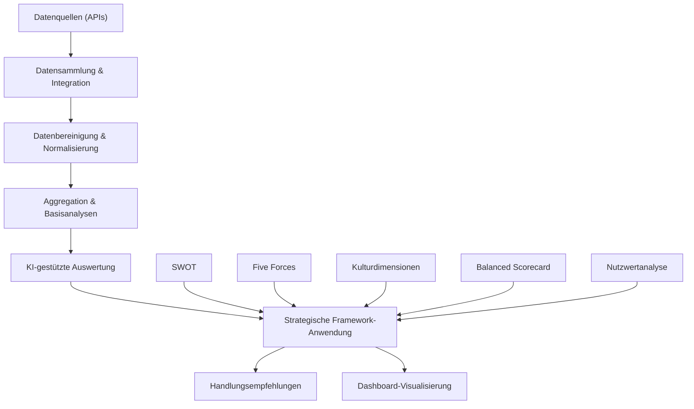

# Dashboard Entwicklung

Übergeordnetes Thema: Information Architecture & Navigation
Datum & Uhrzeit: August 2, 2025
Status: Backlog
Teil des Gesamtkonzepts: No

## Dashboard-Konzept für matbakh.app

---

## 1. Dashboard-Übersicht & Architektur

Das matbakh.app Dashboard folgt einer nutzerzentrierten Gestaltung mit klarem Fokus auf die Gastronomieindustrie. Es bietet einen umfassenden Überblick über die digitale Präsenz eines gastronomischen Betriebs, ermöglicht datengesteuerte Entscheidungen und stellt automatisierte Handlungsempfehlungen bereit.

### Dashboard-Bereiche

- **Visibility Hub:** Zentraler Bereich mit Sichtbarkeits-Score und Hauptkennzahlen
- **Plattform-Monitoring:** Status und Performance aller verbundenen Dienste
- **Action Center:** Personalisierte Handlungsempfehlungen und Tasks
- **Analyse & Insights:** Tiefergehende Datenanalysen und Benchmarking
- **Ressourcen & Tools:** Export-Funktionen, Support, Templates

### Kernfunktionen

- **Monitoring & Tracking:** Echtzeit-Überwachung aller relevanten Präsenz-Kanäle
- **Strategische Analyse:** Datenauswertung basierend auf etablierten Frameworks
- **Handlungsempfehlungen:** KI-gestützte, umsetzbare Vorschläge
- **One-Click-Actions:** Direkte Umsetzung von Maßnahmen aus dem Dashboard
- **Reporting & Sharing:** Flexible Berichterstellung und Exportmöglichkeiten

## 2. Hauptkomponenten im Detail

### Visibility Hub - Das Herzstück des Dashboards

Der Visibility Hub visualisiert den aktuellen Status der digitalen Sichtbarkeit mit einem zentralen Visibility Score, der sich aus verschiedenen Kennzahlen zusammensetzt.

### Kerninhalte:

- Gesamtscore (0-100) mit Trend-Indikator
- Betriebsinformationen auf einen Blick
- Top-3 Handlungsempfehlungen
- Performance-Übersicht nach Kanälen

### Wow-Faktoren:

- Interaktives Radarchart der Visibility-Dimensionen
- Zeitreihenanalyse mit Prognose
- Branchenspezifisches Benchmarking
- Dynamische Erfolgs-Milestones

### Implementierungsdetails:

```json
{
  "visibilityScore": {
    "calculation": "weightedAverage",
    "components": [
      {"platform": "Google", "weight": 0.4},
      {"platform": "Social", "weight": 0.3},
      {"platform": "Website", "weight": 0.2},
      {"platform": "Other", "weight": 0.1}
    ],
    "visualization": "gaugeChart"
  }
}
```

### Plattform-Monitoring - Überblick aller digitalen Touchpoints

Diese Komponente zeigt den Status und die Performance aller verbundenen Plattformen und digitalen Präsenzen. Sie ermöglicht eine schnelle Identifikation von Problemen oder Optimierungspotentialen.

### Integrierte Plattformen:

- **Google Business Profile:** Bewertungen, Fotos, Infos, Posts
- **Social Media:** Facebook, Instagram, TikTok, etc.
- **Webpräsenz:** Website, Blog, Online-Menü
- **Branchenportale:** Tripadvisor, Yelp, TheFork, etc.
- **Lokale Verzeichnisse:** Gelbe Seiten, regionale Portale

### Tracking-Parameter:

- **Vollständigkeit:** Profile-Completion-Score
- **Aktualität:** Last-Update-Tracking
- **Konsistenz:** Cross-Platform-Datenabgleich
- **Engagement:** Interaktionsraten, Reichweite
- **Bewertungen:** Durchschnitt, Anzahl, Sentiment

### Status-Indikatoren und Alerts:

- **🟢 Optimal:** Plattform voll ausgeschöpft, keine Handlungsempfehlungen
- **🟠 Verbesserungspotential:** Funktioniert, aber mit Optimierungsbedarf
- **🔴 Kritisch:** Sofortige Aufmerksamkeit erforderlich (z.B. negative Bewertungen)
- **⚪ Nicht verbunden:** Plattform noch nicht integriert

### Action Center - Personalisierte Handlungsempfehlungen

Das Action Center transformiert Daten in umsetzbare Maßnahmen. Es priorisiert Empfehlungen basierend auf Impact, Aufwand und aktuellen Branchentrends.

### Arten von Empfehlungen:

- **Quick Wins:** Schnell umsetzbare Maßnahmen mit sofortigem Effekt
- **Saisonale Aktionen:** Zeitlich relevante Empfehlungen (Feiertage, Events)
- **Strategische Initiativen:** Langfristige Verbesserungen mit höherem Impact
- **Problemlösungen:** Reaktive Maßnahmen bei erkannten Defiziten

### Strategische Frameworks:

- **SWOT-Analyse:** Identifikation von Stärken, Schwächen, Chancen und Risiken
- **Porter's Five Forces:** Wettbewerbsanalyse im Gastronomiemarkt
- **Balanced Scorecard:** Kennzahlen-basierte Strategieentwicklung
- **Nutzwertanalyse:** Priorisierung von Maßnahmen nach Kosten-Nutzen

### Beispiele für Handlungsempfehlungen:

- [ ]  **Fotos aktualisieren:** Lade neue Bilder von Speisen mit Menschen hoch, um die Engagement-Rate zu steigern (+18% höhere Interaktion laut Benchmark)
- [ ]  **Saisonale Aktion:** Erstelle einen Social-Media-Post zum bevorstehenden Muttertag mit speziellen Angeboten
- [ ]  **Bewertungs-Management:** Beantworte die 3 unbeantworteten Google-Bewertungen innerhalb von 24 Stunden
- [ ]  **Menü-Optimierung:** Füge die Top-5 Gerichte mit Fotos zu deinem Google Business Profil hinzu

### One-Click-Actions:

Bei vielen Handlungsempfehlungen kann der Nutzer mit einem Klick direkt Maßnahmen umsetzen oder Assistenten starten, die bei der Umsetzung helfen. Beispiele:

- **Social-Post-Generator:** KI-gestützte Erstellung von thematischen Posts
- **Antwort-Assistent:** Vorformulierte Antworten auf Bewertungen
- **Update-Wizard:** Gleichzeitiges Aktualisieren von Informationen auf allen Plattformen

### Analyse & Insights - Tiefergehende Datenauswertung

Dieser Bereich bietet detaillierte Analysen und Benchmarking-Funktionen, um tiefere Einblicke in die Performance zu gewinnen und Trends zu erkennen.

### Analyse-Bereiche:

- **Sichtbarkeits-Trends:** Zeitliche Entwicklung der Visibility
- **Kundenfeedback-Analyse:** Sentiment und Themen aus Bewertungen
- **Wettbewerbsvergleich:** Benchmarking mit ähnlichen Betrieben
- **Kanalperformance:** Welche Plattformen liefern den besten ROI

### Visualisierungen:

- **Heatmaps:** Zeitliche und thematische Cluster
- **Correlation Charts:** Zusammenhänge zwischen Maßnahmen und Ergebnissen
- **Radar-Diagramme:** Multi-dimensionale Performance-Darstellung
- **Sentiment-Timeline:** Entwicklung der Kundenstimmung

### KI-gestützte Insights:

> **Trend-Erkennung:** "Deine Bewertungen zu Hauptgerichten sind um 23% besser als für Desserts. Die Analyse von Bewertungstexten zeigt, dass Kunden besonders die hausgemachten Nudeln schätzen, während die Auswahl an Nachspeisen als zu klein empfunden wird."
> 

### Benchmark-Funktionalität:

Vergleiche mit:

- Ähnlichen Betrieben in der gleichen Region
- Direkten Wettbewerbern (manuell ausgewählt)
- Branchendurchschnitt (nach Gastronomietyp)
- Eigener historischer Performance

### Ressourcen & Tools - Export und Unterstützung

Dieser Bereich stellt Tools zur Verfügung, um Daten zu exportieren, Support zu erhalten und weitere Ressourcen zu nutzen.

### Export-Optionen:

- **PDF-Reports:** Fertige Berichte für verschiedene Zwecke
- **CSV/Excel-Export:** Rohdaten für eigene Analysen
- **Präsentationsfolien:** Fertige PowerPoint/Keynote-Templates
- **Bildexport:** Hochwertige Grafiken für Meetings

### Support & Hilfe:

- **Direkter Support-Chat:** Sofortige Hilfe bei Fragen
- **Wissensbasen:** Best Practices und Anleitungen
- **Community:** Austausch mit anderen Gastronomen
- **Expertenberatung:** Buchung von Beratungsterminen

### Berichtsfilter und Anpassungsoptionen:

- **Zeitraum:** Letzte Woche, Monat, Quartal, Jahr, benutzerdefiniert
- **Plattformen:** Alle oder spezifische Kanäle
- **Kennzahlen:** Individuelle Auswahl relevanter Metriken
- **Empfänger:** Anpassung je nach Zielgruppe (Management, Marketing, Investor)

## 3. Benutzeroberfläche & User Experience

Die Benutzeroberfläche des Dashboards folgt einem modularen, anpassbaren Design, das sich an die Bedürfnisse und Präferenzen des Nutzers anpasst.

### UI-Prinzipien:

- **Klarheit vor Komplexität:** Intuitive Bedienung ohne Informationsüberflutung
- **Aktionsorientierung:** Jede Anzeige führt zu möglichen Handlungen
- **Personalisierung:** Anpassbare Widgets und Layout-Optionen
- **Progressive Disclosure:** Details nur bei Bedarf anzeigen

### Navigation & Layout:

- **Modulares Widget-System:** Drag & Drop zur Anpassung
- **Responsive Design:** Optimiert für Desktop, Tablet und Mobile
- **Kontextuelle Hilfe:** Inline-Erklärungen und Tooltips
- **Suchfunktion:** Schnellzugriff auf alle Dashboard-Bereiche

### Wow-Effekte und Customer Centrification:

- **Personalisierte Begrüßung:** "Guten Morgen, [Name]! Dein Restaurant '[Restaurantname]' hat heute bereits 3 neue 5-Sterne-Bewertungen erhalten."
- **Erfolgsmomente feiern:** Animationen und Konfetti-Effekt bei Erreichen von Meilensteinen
- **Kontext-sensitivität:** Dashboard passt sich an Tageszeit, saisonale Besonderheiten und aktuelle Events an
- **Proaktive Alerts:** "Achtung: Morgen ist Vatertag - hier sind 3 Vorschläge für Last-Minute-Aktionen"
- **KI-gestützte Prognosen:** "Basierend auf deinen Daten erwarten wir einen Anstieg der Suchvolumen für 'Biergarten' um 43% in den nächsten 2 Wochen"

### Dashboard-Mock-Up (Konzeptskizze):

```html
<!-- Dashboard-Layout Konzept -->
<div class="dashboard-container">
  <!-- Header mit Gesamtscore und Schnellzugriff -->
  <header class="dashboard-header">
    <div class="business-info">
      <h1>Restaurant Olivia</h1>
      <p>Italienische Küche | München</p>
    </div>
    <div class="visibility-score">
      <div class="score-circle">78</div>
      <div class="trend">+6 ↑</div>
    </div>
    <div class="quick-actions">
      <!-- Schnellzugriffsbuttons -->
    </div>
  </header>
  
  <!-- Hauptbereich mit Widgets -->
  <main class="dashboard-content">
    <!-- Plattform-Monitoring Widget -->
    <section class="widget platform-status">
      <h2>Plattform-Status</h2>
      <div class="platforms">
        <div class="platform google">
          <span class="status-indicator good"></span>
          <span class="platform-name">Google</span>
          <span class="platform-score">92%</span>
        </div>
        <!-- Weitere Plattformen -->
      </div>
    </section>
    
    <!-- Action Center Widget -->
    <section class="widget action-center">
      <h2>Empfohlene Maßnahmen</h2>
      <ul class="action-list">
        <!-- Aktionen mit Priorität und One-Click-Buttons -->
      </ul>
    </section>
    
    <!-- Weitere Widgets -->
  </main>
</div>

```

## 4. Datenmodell & Integrationen

Das Dashboard basiert auf einem robusten Datenmodell, das verschiedene Quellen integriert und eine einheitliche Sicht auf alle relevanten Informationen bietet.

### Datenquellen & Integrationen

### Primäre Integrationen (Phase 1-2):

- **Google Business Profile API:** Vollständige Integration aller Profildaten
- **Google Analytics:** Website-Traffic und Nutzerverhalten
- **Bewertungsplattformen:** Google, Tripadvisor, Yelp
- **Basis-Suchmaschinenmetriken:** Rankings, Sichtbarkeit

### Erweiterte Integrationen (Phase 3-4):

- **Social Media APIs:** Facebook, Instagram, Twitter, TikTok
- **Branchenspezifische Portale:** TheFork, Deliveroo, etc.
- **Lokale Verzeichnisse:** Gelbe Seiten, lokale Listings
- **Wettbewerbsdaten:** Anonymisierte Benchmarks

### Datenaktualisierung & Frequenz:

- **Echtzeit-Updates:** Bewertungen, Social Media Engagement
- **Tägliche Updates:** Sichtbarkeits-Scores, Rankings
- **Wöchentliche Updates:** Benchmarking-Daten, Trendanalysen
- **Monatliche Updates:** Tiefgehende Branchenanalysen, Markttrends

### Datensicherheit & Compliance:

- DSGVO-konforme Datenspeicherung und -verarbeitung
- Verschlüsselte Übertragung aller API-Daten
- Granulare Zugriffsberechtigungen innerhalb von Teams
- Transparente Datenschutzrichtlinien und Nutzerkontrolle

### Datenverarbeitungslogik

Die Datenverarbeitung folgt einem mehrstufigen Prozess, der Rohdaten in aussagekräftige Informationen und umsetzbare Empfehlungen transformiert.

### Verarbeitungsstufen:

1. **Datenerfassung:** Integration verschiedener APIs und Datenquellen
2. **Datenbereinigung:** Normalisierung, Deduplizierung, Fehlererkennung
3. **Aggregation:** Zusammenfassung über Zeiträume und Plattformen
4. **Analyse:** Statistische Auswertung, Trendbewertung, Mustererkennung
5. **KI-Verarbeitung:** Anwendung von ML-Modellen für Prognosen und Empfehlungen
6. **Visualisierung:** Aufbereitung für verschiedene Dashboard-Komponenten

### Strategische Framework-Integration:

Die Datenverarbeitung nutzt etablierte Frameworks, um aus Daten strategische Empfehlungen abzuleiten:

- **SWOT-Analyse:** Automatische Identifikation von Stärken, Schwächen, Chancen und Risiken basierend auf Performance-Daten
- **Porter's Five Forces:** Bewertung der Wettbewerbsposition im lokalen Markt
- **Kulturdimensionen:** Anpassung von Kommunikationsempfehlungen an regionale Kulturspezifika
- **Balanced Scorecard:** Ausgewogene Kennzahlenbetrachtung für ganzheitliche Strategie
- **Nutzwertanalyse:** Priorisierung von Empfehlungen nach Impact und Aufwand



## 5. Implementation & Priorisierung

Die Umsetzung des Dashboard-Konzepts erfolgt in mehreren Phasen, um schnell einen Mehrwert zu liefern und gleichzeitig die Plattform kontinuierlich zu erweitern.

### Phase 1: Core Dashboard (MVP)

- **Basis-Dashboard-Struktur:** Layout, Navigation, Widgets
- **Google Business Profile Integration:** Vollständige Anbindung
- **Visibility Score:** Grundlegende Metriken und Berechnung
- **Einfache Handlungsempfehlungen:** Top-3 Quick Wins
- **Onboarding-Prozess:** Grundlegende Betriebsdaten erfassen

### Phase 2: Erweitertes Dashboard

- **Social Media Integration:** Facebook, Instagram
- **Erweiterte Analysen:** Trends, Benchmarking
- **Verbessertes Action Center:** Mehr Empfehlungstypen
- **Export-Funktionen:** PDF-Berichte, Grafiken
- **Zusätzliche Widgets:** Kalender, Aufgabenmanagement

### Phase 3: Advanced Features

- **KI-gestützte Prognosen:** Vorhersagemodelle
- **One-Click-Actions:** Direkte Maßnahmenumsetzung
- **Erweiterte Integrationen:** Branchenportale, lokale Verzeichnisse
- **Personalisierung:** Anpassbare Dashboards
- **Team-Funktionen:** Mehrbenutzer-Zugang, Rollen

### Phase 4: Branchenerweiterung

- **Spezifische Features für Hotellerie:** Buchungsportale, Zimmerauslastung
- **Erweiterung für Events:** Veranstaltungskalender, Ticketing
- **Tourismus-Spezifika:** Saisonalität, Attraktionen
- **Multi-Location-Management:** Für Ketten und Franchises
- **API für Drittanbieter:** Ecosystem-Entwicklung

### Erfolgsmetriken für die Dashboard-Implementierung:

- **Nutzungsintensität:** Regelmäßige Logins, Seitenaufrufe, Verweildauer
- **Maßnahmen-Umsetzung:** Abgeschlossene Empfehlungen, Conversion-Rate
- **Sichtbarkeitsverbesserung:** Messbare Steigerung der Scores über Zeit
- **Kundenzufriedenheit:** NPS, Feedback, Support-Anfragen
- **Geschäftsimpact:** Korrelation mit Umsatzsteigerung, Neukunden

## 6. Fazit & Next Steps

Das vorgestellte Dashboard-Konzept für matbakh.app bietet eine umfassende Lösung für Gastronomiebetriebe, um ihre digitale Sichtbarkeit zu überwachen, zu analysieren und strategisch zu verbessern.

### Kernvorteile des Konzepts:

- **Ganzheitlicher Ansatz:** Integration aller relevanten digitalen Touchpoints
- **Aktionsorientierung:** Daten werden in konkrete Handlungen übersetzt
- **Strategische Tiefe:** Nutzung etablierter Frameworks für fundierte Empfehlungen
- **Skalierbarkeit:** Modulare Struktur ermöglicht einfache Erweiterung
- **Branchenspezifisch:** Maßgeschneidert für die Bedürfnisse der Gastronomie

### Unmittelbare nächste Schritte:

- [ ]  **Detailliertes Wireframing:** Erstellung von UI-Mockups für alle Kernkomponenten
- [ ]  **User Stories definieren:** Ausarbeitung konkreter Anwendungsfälle für verschiedene Nutzertypen
- [ ]  **MVP-Scope finalisieren:** Festlegung der exakten Features für die erste Release-Version
- [ ]  **Technische Spezifikation:** Definition der benötigten APIs, Datenstrukturen und Integrationen
- [ ]  **Nutzertests planen:** Vorbereitung von Usability-Tests mit potenziellen Kunden

> Das matbakh.app Dashboard wird zum zentralen Steuerungsinstrument für die digitale Präsenz von Gastronomiebetrieben, indem es Komplexität reduziert, klare Handlungsempfehlungen gibt und messbare Verbesserungen der Sichtbarkeit ermöglicht. Mit seiner branchenspezifischen Ausrichtung und der strategischen Tiefe setzt es neue Maßstäbe für Visibility-Management-Tools im Hospitality-Sektor.
>