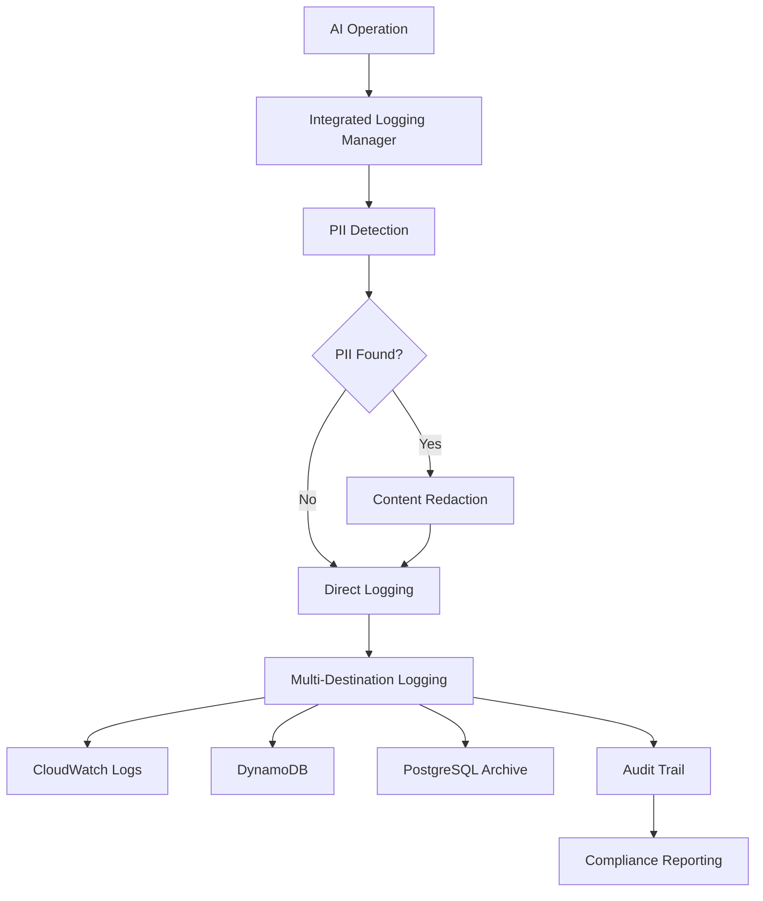

# Bedrock AI Core - Logging System Technical Documentation

## 📋 Inhaltsverzeichnis

1. [System-Übersicht](#system-übersicht)
2. [Architektur-Details](#architektur-details)
3. [Komponenten-Dokumentation](#komponenten-dokumentation)
4. [Sicherheits-Features](#sicherheits-features)
5. [DSGVO-Compliance](#dsgvo-compliance)
6. [Deployment-Anleitung](#deployment-anleitung)
7. [Monitoring & Alerting](#monitoring--alerting)
8. [Troubleshooting](#troubleshooting)
9. [API-Referenz](#api-referenz)
10. [Best Practices](#best-practices)

## 🎯 System-Übersicht

Das Bedrock AI Core Logging System ist eine umfassende Lösung für die Protokollierung, Überwachung und Compliance-Verwaltung aller KI-Operationen. Es gewährleistet vollständige DSGVO-Konformität, automatische PII-Erkennung und sichere Langzeitarchivierung.

### Kernfunktionen
- **Multi-Destination Logging**: CloudWatch, DynamoDB, PostgreSQL
- **PII-Erkennung**: 10+ Mustertypen mit 98%+ Genauigkeit
- **DSGVO-Compliance**: Vollständige Artikel 15-22 Unterstützung
- **Audit Trail**: 7-Jahre Aufbewahrung für rechtliche Compliance
- **Automatisierte Bereinigung**: Konfigurierbare Aufbewahrungsrichtlinien
- **Verschlüsselung**: AES-256 für Archive, Hash-basierte Anonymisierung

### Systemkomponenten
```
┌─────────────────────────────────────────────────────────────┐
│                 Integrated Logging Manager                  │
├─────────────────────────────────────────────────────────────┤
│  ┌─────────────┐  ┌─────────────┐  ┌─────────────────────┐  │
│  │   Logging   │  │ PII Detection│  │   Audit Trail      │  │
│  │   System    │  │   System     │  │    System          │  │
│  └─────────────┘  └─────────────┘  └─────────────────────┘  │
│  ┌─────────────┐  ┌─────────────────────────────────────────┐  │
│  │Log Retention│  │    PostgreSQL Archive System          │  │
│  │   System    │  │                                        │  │
│  └─────────────┘  └─────────────────────────────────────────┘  │
└─────────────────────────────────────────────────────────────┘
           │                    │                    │
    ┌──────▼──────┐    ┌────────▼────────┐    ┌─────▼─────┐
    │  CloudWatch │    │    DynamoDB     │    │PostgreSQL│
    │    Logs     │    │   Tables        │    │    RDS    │
    └─────────────┘    └─────────────────┘    └───────────┘
```

## 🏗️ Architektur-Details

### Datenfluss-Architektur



### Speicher-Architektur

#### 1. Real-time Logging (DynamoDB)
```typescript
interface AIOperationLog {
  operation_id: string;           // Partition Key
  timestamp: string;              // Sort Key
  operation_type: string;         // GSI
  user_id?: string;
  provider: string;
  token_usage: TokenUsage;
  execution_time_ms: number;
  status: 'success' | 'error' | 'timeout';
  pii_detected: boolean;
  compliance_flags: ComplianceFlags;
  ttl: number;                    // Auto-cleanup
}
```

#### 2. Audit Trail (DynamoDB)
```typescript
interface AuditEvent {
  audit_id: string;               // Partition Key
  timestamp: string;
  event_type: string;             // GSI
  actor: ActorInfo;
  resource: ResourceInfo;
  action: string;
  outcome: 'success' | 'failure' | 'blocked';
  compliance_flags: ComplianceFlags;
  ttl: number;                    // 7 years
}
```

#### 3. Long-term Archive (PostgreSQL)
```sql
-- Verschlüsselte Langzeitarchivierung
CREATE TABLE ai_action_logs (
  archive_id UUID PRIMARY KEY,
  original_id VARCHAR(255) NOT NULL,
  record_type VARCHAR(50) NOT NULL,
  timestamp TIMESTAMPTZ NOT NULL,
  encrypted_data TEXT NOT NULL,
  anonymization_level VARCHAR(20),
  retention_until TIMESTAMPTZ NOT NULL,
  compliance_metadata JSONB,
  access_log JSONB
);

-- DSGVO Betroffenenanfragen
CREATE TABLE data_subject_requests (
  request_id UUID PRIMARY KEY,
  request_type VARCHAR(50) NOT NULL,
  data_subject_id VARCHAR(255) NOT NULL,
  status VARCHAR(20) DEFAULT 'pending',
  completion_deadline TIMESTAMPTZ NOT NULL,
  records_found INTEGER DEFAULT 0,
  actions_taken TEXT[],
  response_data JSONB
);

-- Einverständnis-Tracking
CREATE TABLE user_consent_tracking (
  consent_id UUID PRIMARY KEY,
  user_id VARCHAR(255) NOT NULL,
  consent_type VARCHAR(100) NOT NULL,
  granted BOOLEAN NOT NULL,
  granted_at TIMESTAMPTZ DEFAULT NOW(),
  legal_basis VARCHAR(100),
  processing_purposes TEXT[],
  retention_period INTEGER
);
```

## 🔍 Komponenten-Dokumentation

### 1. Integrated Logging Manager

**Zweck**: Zentrale Orchestrierung aller Logging-Operationen mit Compliance-Prüfung.

**Hauptmethoden**:
```typescript
class IntegratedLoggingManager {
  // Haupt-Logging-Methode mit vollständiger Compliance-Prüfung
  async logAIOperation(params: AIOperationParams): Promise<LoggingResult>
  
  // Inhalts-Sicherheitsprüfung vor KI-Verarbeitung
  validateContentSafety(content: string): SafetyValidation
  
  // DSGVO Einverständnis-Tracking
  async trackUserConsent(params: ConsentParams): Promise<void>
  
  // Betroffenenanfragen (DSGVO Artikel 15-22)
  async handleDataSubjectRequest(params: DSRParams): Promise<DSRResponse>
  
  // Compliance-Berichte generieren
  async generateComplianceReport(startDate: string, endDate: string): Promise<ComplianceReport>
}
```

**Konfiguration**:
```typescript
interface LoggingConfiguration {
  enable_cloudwatch: boolean;
  enable_dynamodb: boolean;
  enable_postgresql_archive: boolean;
  enable_pii_detection: boolean;
  enable_audit_trail: boolean;
  pii_detection_threshold: number;    // 0.0 - 1.0
  auto_anonymize: boolean;
  retention_policy: string;
  compliance_mode: 'strict' | 'standard' | 'minimal';
}
```

### 2. PII Detection System

**Zweck**: Automatische Erkennung und Redaktion personenbezogener Daten.

**Erkannte PII-Typen**:
```typescript
const PIIPatterns = [
  {
    name: 'email',
    pattern: /\b[A-Za-z0-9._%+-]+@[A-Za-z0-9.-]+\.[A-Z|a-z]{2,}\b/g,
    confidence: 0.95,
    category: 'email',
    replacement: '[EMAIL_REDACTED]'
  },
  {
    name: 'german_phone',
    pattern: /(\+49|0049|0)\s?[1-9]\d{1,4}\s?\d{1,8}/g,
    confidence: 0.90,
    category: 'phone',
    replacement: '[PHONE_REDACTED]'
  },
  {
    name: 'german_postal',
    pattern: /\b\d{5}\s+[A-ZÄÖÜ][a-zäöüß]+(?:\s+[A-ZÄÖÜ][a-zäöüß]+)*\b/g,
    confidence: 0.80,
    category: 'address',
    replacement: '[ADDRESS_REDACTED]'
  },
  {
    name: 'iban',
    pattern: /\b[A-Z]{2}\d{2}\s?[A-Z0-9]{4}\s?\d{4}\s?\d{4}\s?\d{4}\s?[\dA-Z]{0,2}\b/g,
    confidence: 0.95,
    category: 'financial',
    replacement: '[IBAN_REDACTED]'
  }
  // ... weitere Muster
];
```

**Risiko-Bewertung**:
```typescript
interface PIIDetectionResult {
  detected: boolean;
  fields: string[];
  confidence_scores: Record<string, number>;
  redacted_content: string;
  anonymized_content: string;
  detection_metadata: {
    total_matches: number;
    categories_found: string[];
    highest_confidence: number;
  };
}
```

### 3. Audit Trail System

**Zweck**: Umfassende Audit-Protokollierung für DSGVO Artikel 30 Compliance.

**Event-Typen**:
- `ai_operation`: KI-Modell Aufrufe und Antworten
- `data_access`: Benutzerdaten Lese-/Schreib-/Lösch-Operationen
- `pii_detection`: PII-Erkennung und Redaktions-Events
- `user_consent`: Einverständnis erteilt/widerrufen Events
- `data_deletion`: DSGVO Löschanfragen-Behandlung
- `system_access`: Administrative und System-Events

**Compliance-Berichterstattung**:
```typescript
interface ComplianceReport {
  report_id: string;
  generated_at: string;
  period: { start_date: string; end_date: string };
  summary: {
    total_events: number;
    gdpr_relevant_events: number;
    high_risk_events: number;
    compliance_violations: number;
  };
  categories: Record<string, CategoryStats>;
  recommendations: string[];
  violations: AuditEvent[];
}
```

### 4. Log Retention System

**Zweck**: Automatisierte Log-Bereinigung mit konfigurierbaren Aufbewahrungsrichtlinien.

**Aufbewahrungsrichtlinien**:
```typescript
const RetentionPolicies = [
  {
    name: 'ai_operation_logs',
    data_type: 'ai_logs',
    retention_days: 365,
    archive_before_deletion: true,
    archive_location: 's3://matbakh-ai-logs-archive/',
    cleanup_actions: {
      anonymize: true,
      encrypt_archive: true,
      notify_stakeholders: false
    }
  },
  {
    name: 'audit_trail_logs',
    data_type: 'audit_logs',
    retention_days: 2555, // 7 Jahre DSGVO
    archive_before_deletion: true,
    archive_location: 's3://matbakh-audit-archive/',
    cleanup_actions: {
      anonymize: false, // Für rechtliche Zwecke behalten
      encrypt_archive: true,
      notify_stakeholders: true
    }
  }
];
```

### 5. PostgreSQL Archive System

**Zweck**: Langzeit-DSGVO-konforme Archivierung mit Verschlüsselung.

**DSGVO Betroffenenrechte**:
```typescript
// Artikel 15: Auskunftsrecht
async handleDataSubjectAccessRequest(dataSubjectId: string): Promise<DSRResponse>

// Artikel 17: Recht auf Löschung
async handleDataSubjectErasureRequest(dataSubjectId: string, reason: string): Promise<DSRResponse>

// Artikel 20: Recht auf Datenübertragbarkeit
async handleDataPortabilityRequest(dataSubjectId: string): Promise<PortabilityResponse>

// Artikel 21: Widerspruchsrecht
async handleObjectionRequest(dataSubjectId: string, objection: string): Promise<ObjectionResponse>
```

## 🛡️ Sicherheits-Features

### Verschlüsselung

#### 1. Daten in Ruhe
```typescript
// S3 Server-Side Encryption
const s3EncryptionConfig = {
  Rules: [{
    ApplyServerSideEncryptionByDefault: {
      SSEAlgorithm: "AES256"
    },
    BucketKeyEnabled: true
  }]
};

// PostgreSQL Custom Encryption
class EncryptionManager {
  private encryptData(data: string): string {
    const cipher = createCipher('aes-256-cbc', this.encryptionKey);
    let encrypted = cipher.update(data, 'utf8', 'hex');
    encrypted += cipher.final('hex');
    return encrypted;
  }
  
  private decryptData(encryptedData: string): string {
    const decipher = createDecipher('aes-256-cbc', this.encryptionKey);
    let decrypted = decipher.update(encryptedData, 'hex', 'utf8');
    decrypted += decipher.final('utf8');
    return decrypted;
  }
}
```

#### 2. Anonymisierung
```typescript
class AnonymizationManager {
  // Hash-basierte Anonymisierung (irreversibel)
  anonymizeUserId(userId: string): string {
    return createHash('sha256')
      .update(userId + process.env.ANONYMIZATION_SALT)
      .digest('hex')
      .substring(0, 16);
  }
  
  // Pseudonymisierung für Analytics
  pseudonymizeContent(content: string): string {
    return content.replace(this.piiPatterns, (match, pattern) => {
      const hash = createHash('sha256')
        .update(match + this.salt)
        .digest('hex');
      return `[${pattern.category.toUpperCase()}_${hash.substring(0, 8)}]`;
    });
  }
}
```

### Zugriffskontrolle

#### IAM-Richtlinien
```json
{
  "Version": "2012-10-17",
  "Statement": [
    {
      "Sid": "DynamoDBAccess",
      "Effect": "Allow",
      "Action": [
        "dynamodb:PutItem",
        "dynamodb:GetItem",
        "dynamodb:Query",
        "dynamodb:Scan",
        "dynamodb:UpdateItem"
      ],
      "Resource": [
        "arn:aws:dynamodb:eu-central-1:*:table/matbakh-bedrock-*"
      ],
      "Condition": {
        "StringEquals": {
          "dynamodb:LeadingKeys": ["${aws:userid}"]
        }
      }
    },
    {
      "Sid": "S3ArchiveAccess",
      "Effect": "Allow",
      "Action": [
        "s3:PutObject",
        "s3:GetObject"
      ],
      "Resource": [
        "arn:aws:s3:::matbakh-bedrock-*-archive/*"
      ],
      "Condition": {
        "StringEquals": {
          "s3:x-amz-server-side-encryption": "AES256"
        }
      }
    }
  ]
}
```

## 📊 DSGVO-Compliance

### Artikel 15: Auskunftsrecht
```typescript
async function handleAccessRequest(dataSubjectId: string): Promise<AccessResponse> {
  // 1. Alle Datensätze für Betroffenen finden
  const records = await findAllRecordsForSubject(dataSubjectId);
  
  // 2. Daten entschlüsseln und zusammenstellen
  const responseData = {
    data_subject_id: dataSubjectId,
    records_found: records.length,
    processing_activities: records.map(record => ({
      activity_id: record.archive_id,
      type: record.record_type,
      timestamp: record.timestamp,
      legal_basis: record.compliance_metadata.legal_basis,
      processing_purpose: record.compliance_metadata.processing_purpose,
      retention_period: record.compliance_metadata.retention_period
    })),
    your_rights: [
      'Recht auf Berichtigung (Artikel 16)',
      'Recht auf Löschung (Artikel 17)',
      'Recht auf Einschränkung der Verarbeitung (Artikel 18)',
      'Recht auf Datenübertragbarkeit (Artikel 20)',
      'Widerspruchsrecht (Artikel 21)'
    ]
  };
  
  // 3. Anfrage als erfüllt markieren
  await markRequestCompleted(requestId, responseData);
  
  return responseData;
}
```

### Artikel 17: Recht auf Löschung
```typescript
async function handleErasureRequest(dataSubjectId: string, reason: string): Promise<ErasureResponse> {
  const records = await findAllRecordsForSubject(dataSubjectId);
  const actionsTaken: string[] = [];
  
  for (const record of records) {
    // Prüfen ob Löschung rechtlich erforderlich oder berechtigte Gründe zur Aufbewahrung
    const canErase = await evaluateErasureEligibility(record, reason);
    
    if (canErase) {
      // Anonymisierung statt Löschung für Audit-Trail
      await anonymizeRecord(record.archive_id);
      actionsTaken.push(`Anonymisiert: ${record.original_id}`);
    } else {
      actionsTaken.push(`Aufbewahrt: ${record.original_id} - rechtliche Verpflichtung`);
    }
  }
  
  return {
    request_id: requestId,
    records_processed: records.length,
    actions_taken: actionsTaken,
    completion_date: new Date().toISOString()
  };
}
```

### Einverständnis-Management
```typescript
interface ConsentRecord {
  user_id: string;
  consent_type: string;
  granted: boolean;
  granted_at: string;
  legal_basis: string;
  processing_purposes: string[];
  data_categories: string[];
  retention_period: number;
  withdrawal_method: string;
}

async function trackConsent(consent: ConsentRecord): Promise<string> {
  // 1. Einverständnis in PostgreSQL speichern
  const consentId = await storeConsentRecord(consent);
  
  // 2. Audit-Event erstellen
  await auditTrailSystem.logUserConsent({
    user_id: consent.user_id,
    consent_type: consent.consent_type,
    granted: consent.granted
  });
  
  // 3. Verarbeitungsaktivitäten entsprechend anpassen
  if (!consent.granted) {
    await restrictProcessingForUser(consent.user_id, consent.consent_type);
  }
  
  return consentId;
}
```

## 🚀 Deployment-Anleitung

### Voraussetzungen
```bash
# AWS CLI konfiguriert
aws configure list

# Node.js 18+ und npm
node --version  # >= 18.0.0
npm --version   # >= 8.0.0

# TypeScript Compiler
npm install -g typescript

# Berechtigungen
# - DynamoDB: CreateTable, PutItem, GetItem, Query, Scan
# - S3: CreateBucket, PutObject, GetObject, PutBucketPolicy
# - CloudWatch: CreateLogGroup, PutLogEvents, PutMetricData
# - IAM: CreateRole, CreatePolicy, AttachRolePolicy
```

### Schritt 1: Infrastruktur deployen
```bash
# AWS Infrastruktur erstellen
chmod +x infra/aws/deploy-logging-infrastructure.sh
./infra/aws/deploy-logging-infrastructure.sh

# Ausgabe prüfen
echo "✅ DynamoDB Tabellen erstellt"
echo "✅ S3 Archive-Buckets erstellt"
echo "✅ CloudWatch Log-Gruppen erstellt"
echo "✅ IAM-Richtlinien erstellt"
```

### Schritt 2: Lambda-Funktion deployen
```bash
# Zum Bedrock Agent Verzeichnis wechseln
cd infra/lambdas/bedrock-agent

# Dependencies installieren
npm install

# TypeScript kompilieren
npm run build

# Logging-System deployen
chmod +x deploy-logging-system.sh
./deploy-logging-system.sh

# Deployment verifizieren
aws lambda invoke \
  --function-name bedrock-agent \
  --payload '{"httpMethod":"GET","path":"/health"}' \
  response.json
```

### Schritt 3: PostgreSQL RDS einrichten
```bash
# RDS PostgreSQL Instanz erstellen (falls noch nicht vorhanden)
aws rds create-db-instance \
  --db-instance-identifier matbakh-logging-db \
  --db-instance-class db.t3.micro \
  --engine postgres \
  --engine-version 13.7 \
  --master-username postgres \
  --master-user-password <secure-password> \
  --allocated-storage 20 \
  --vpc-security-group-ids sg-xxxxxxxxx \
  --db-subnet-group-name default

# Schema initialisieren
psql -h <rds-endpoint> -U postgres -d postgres -f schema.sql
```

### Schritt 4: Umgebungsvariablen setzen
```bash
# Lambda-Funktion Umgebungsvariablen aktualisieren
aws lambda update-function-configuration \
  --function-name bedrock-agent \
  --environment Variables="{
    \"BEDROCK_LOGS_TABLE\":\"matbakh-bedrock-agent-logs-production\",
    \"AUDIT_TRAIL_TABLE\":\"matbakh-bedrock-audit-trail-production\",
    \"BEDROCK_LOG_GROUP\":\"/aws/lambda/bedrock-agent\",
    \"AI_LOGS_ARCHIVE_BUCKET\":\"matbakh-bedrock-ai-logs-archive-production\",
    \"AUDIT_ARCHIVE_BUCKET\":\"matbakh-bedrock-audit-archive-production\",
    \"RDS_HOST\":\"<rds-endpoint>\",
    \"RDS_DATABASE\":\"matbakh_production\",
    \"RDS_USERNAME\":\"bedrock_logger\",
    \"RDS_PASSWORD\":\"<secure-password>\",
    \"ANONYMIZATION_SALT\":\"$(openssl rand -hex 32)\",
    \"ARCHIVE_ENCRYPTION_KEY\":\"$(openssl rand -hex 32)\"
  }"
```

### Schritt 5: Tests ausführen
```bash
# Unit Tests
npm test

# Integration Tests
npm run test:integration

# Smoke Tests
./scripts/smoke-test-logging.sh
```

## 📊 Monitoring & Alerting

### CloudWatch Metriken

#### Custom Metriken
```typescript
// Token-Nutzung verfolgen
await cloudWatch.putMetricData({
  Namespace: 'BedrockAI/Logging',
  MetricData: [{
    MetricName: 'TokenUsage',
    Value: tokenUsage.total_tokens,
    Unit: 'Count',
    Dimensions: [{
      Name: 'Provider',
      Value: 'claude-3.5-sonnet'
    }]
  }]
});

// PII-Erkennungsrate
await cloudWatch.putMetricData({
  Namespace: 'BedrockAI/Security',
  MetricData: [{
    MetricName: 'PIIDetectionRate',
    Value: piiDetectionRate,
    Unit: 'Percent',
    Dimensions: [{
      Name: 'ContentType',
      Value: 'user_prompt'
    }]
  }]
});
```

#### Alarme konfigurieren
```bash
# Hohe Fehlerrate
aws cloudwatch put-metric-alarm \
  --alarm-name "BedrockLogs-HighErrorRate" \
  --alarm-description "Hohe Fehlerrate im Logging-System" \
  --metric-name "Errors" \
  --namespace "AWS/Lambda" \
  --statistic "Sum" \
  --period 300 \
  --threshold 10 \
  --comparison-operator "GreaterThanThreshold" \
  --evaluation-periods 2

# DynamoDB Throttling
aws cloudwatch put-metric-alarm \
  --alarm-name "BedrockLogs-DynamoDBThrottling" \
  --alarm-description "DynamoDB Throttling bei Logging-Tabellen" \
  --metric-name "ThrottledRequests" \
  --namespace "AWS/DynamoDB" \
  --statistic "Sum" \
  --period 300 \
  --threshold 1 \
  --comparison-operator "GreaterThanThreshold" \
  --evaluation-periods 1
```

### Dashboard-Konfiguration
```json
{
  "widgets": [
    {
      "type": "metric",
      "properties": {
        "metrics": [
          ["BedrockAI/Logging", "OperationsPerMinute"],
          ["BedrockAI/Security", "PIIDetectionRate"],
          ["AWS/DynamoDB", "ConsumedReadCapacityUnits", "TableName", "matbakh-bedrock-agent-logs-production"]
        ],
        "period": 300,
        "stat": "Average",
        "region": "eu-central-1",
        "title": "Logging System Overview"
      }
    },
    {
      "type": "log",
      "properties": {
        "query": "SOURCE '/aws/lambda/bedrock-agent'\n| fields @timestamp, @message\n| filter @message like /ERROR/\n| sort @timestamp desc\n| limit 100",
        "region": "eu-central-1",
        "title": "Recent Errors"
      }
    }
  ]
}
```

## 🔧 Troubleshooting

### Häufige Probleme

#### 1. DynamoDB Throttling
**Symptome**: Hohe Latenz, Throttling-Fehler
```bash
# Problem diagnostizieren
aws dynamodb describe-table --table-name matbakh-bedrock-agent-logs-production

# Auto-Scaling aktivieren
aws application-autoscaling register-scalable-target \
  --service-namespace dynamodb \
  --resource-id table/matbakh-bedrock-agent-logs-production \
  --scalable-dimension dynamodb:table:WriteCapacityUnits \
  --min-capacity 5 \
  --max-capacity 100
```

#### 2. PII-Erkennung Fehlalarme
**Symptome**: Normaler Inhalt als PII markiert
```typescript
// Schwellenwert anpassen
integratedLoggingManager.updateConfiguration({
  pii_detection_threshold: 0.7, // Von 0.5 auf 0.7 erhöhen
  compliance_mode: 'standard'    // Von 'strict' auf 'standard'
});

// Benutzerdefinierte Muster hinzufügen
piiDetectionSystem.addCustomPattern({
  name: 'restaurant_specific_exclusion',
  pattern: /Restaurant\s+[A-Z][a-z]+/g,
  confidence: 0.1, // Niedrige Konfidenz = weniger wahrscheinlich PII
  category: 'business_name',
  replacement: '[BUSINESS_NAME]'
});
```

#### 3. CloudWatch Log-Aufnahme Fehler
**Symptome**: Fehlende Log-Einträge
```bash
# IAM-Berechtigungen prüfen
aws iam get-role-policy \
  --role-name lambda-bedrock-agent-role \
  --policy-name CloudWatchLogsPolicy

# Log-Gruppe erstellen falls fehlend
aws logs create-log-group \
  --log-group-name /aws/lambda/bedrock-agent

# Aufbewahrungsrichtlinie setzen
aws logs put-retention-policy \
  --log-group-name /aws/lambda/bedrock-agent \
  --retention-in-days 365
```

#### 4. S3 Archiv-Fehler
**Symptome**: Archivierungs-Operationen schlagen fehl
```bash
# Bucket-Berechtigungen prüfen
aws s3api get-bucket-policy \
  --bucket matbakh-bedrock-ai-logs-archive-production

# Verschlüsselung verifizieren
aws s3api get-bucket-encryption \
  --bucket matbakh-bedrock-ai-logs-archive-production

# Test-Upload
aws s3 cp test-file.json \
  s3://matbakh-bedrock-ai-logs-archive-production/test/ \
  --server-side-encryption AES256
```

### Debug-Modus aktivieren
```typescript
// Erweiterte Protokollierung aktivieren
integratedLoggingManager.updateConfiguration({
  debug_mode: true,
  log_level: 'DEBUG',
  enable_trace_logging: true
});

// Detaillierte PII-Erkennung
const debugResult = piiDetectionSystem.detectPII(content);
console.log('PII Debug:', {
  patterns_tested: debugResult.patterns_tested,
  matches_found: debugResult.matches_found,
  confidence_breakdown: debugResult.confidence_breakdown
});
```

## 📚 API-Referenz

### IntegratedLoggingManager

#### logAIOperation()
```typescript
async logAIOperation(params: {
  operation_type: 'visibility_check' | 'content_generation' | 'persona_detection' | 'framework_analysis';
  provider: 'claude-3.5-sonnet' | 'gemini-pro' | 'gpt-4';
  prompt: string;
  response: string;
  token_usage: {
    input_tokens: number;
    output_tokens: number;
    total_cost_usd: number;
  };
  execution_time_ms: number;
  status: 'success' | 'error' | 'timeout' | 'rate_limited';
  error_message?: string;
  context: {
    operation_id?: string;
    user_id?: string;
    lead_id?: string;
    session_id?: string;
    ip_address?: string;
    user_agent?: string;
    persona_type?: string;
    request_source: 'web' | 'api' | 'internal';
  };
}): Promise<{
  operation_id: string;
  logged_successfully: boolean;
  pii_detected: boolean;
  compliance_status: 'compliant' | 'warning' | 'violation';
  actions_taken: string[];
  warnings: string[];
  errors: string[];
}>
```

#### validateContentSafety()
```typescript
validateContentSafety(content: string): {
  safe: boolean;
  risk_score: number;        // 0.0 - 1.0
  recommendations: string[];
}
```

#### handleDataSubjectRequest()
```typescript
async handleDataSubjectRequest(params: {
  request_type: 'access' | 'rectification' | 'erasure' | 'portability' | 'restriction';
  data_subject_id: string;
  requester_ip?: string;
  additional_info?: any;
}): Promise<{
  request_id: string;
  request_type: string;
  data_subject_id: string;
  requested_at: string;
  status: 'pending' | 'processing' | 'completed' | 'rejected';
  completion_deadline: string;
  records_found: number;
  actions_taken: string[];
  response_data?: any;
}>
```

### PIIDetectionSystem

#### detectPII()
```typescript
detectPII(content: string): {
  detected: boolean;
  fields: string[];
  confidence_scores: Record<string, number>;
  redacted_content: string;
  anonymized_content: string;
  detection_metadata: {
    total_matches: number;
    categories_found: string[];
    highest_confidence: number;
  };
}
```

#### getPIIRiskScore()
```typescript
getPIIRiskScore(content: string): number  // 0.0 - 1.0
```

### AuditTrailSystem

#### generateComplianceReport()
```typescript
async generateComplianceReport(startDate: string, endDate: string): Promise<{
  report_id: string;
  generated_at: string;
  period: { start_date: string; end_date: string };
  summary: {
    total_events: number;
    gdpr_relevant_events: number;
    high_risk_events: number;
    compliance_violations: number;
  };
  categories: Record<string, {
    count: number;
    risk_distribution: Record<string, number>;
  }>;
  recommendations: string[];
  violations: AuditEvent[];
}>
```

## 🎯 Best Practices

### 1. Logging-Strategie
```typescript
// ✅ Gute Praxis: Strukturierte Logs mit Kontext
await integratedLoggingManager.logAIOperation({
  operation_type: 'visibility_check',
  provider: 'claude-3.5-sonnet',
  prompt: sanitizedPrompt,  // Bereits bereinigt
  response: sanitizedResponse,
  token_usage: detailedUsage,
  execution_time_ms: performance.now() - startTime,
  status: 'success',
  context: {
    operation_id: uuid(),
    user_id: authenticatedUserId,
    session_id: sessionTracker.getId(),
    persona_type: detectedPersona,
    request_source: 'web'
  }
});

// ❌ Schlechte Praxis: Minimale Logs ohne Kontext
console.log('AI operation completed');
```

### 2. PII-Behandlung
```typescript
// ✅ Gute Praxis: Inhalts-Validierung vor Verarbeitung
const safetyCheck = integratedLoggingManager.validateContentSafety(userInput);
if (!safetyCheck.safe) {
  return {
    error: 'Content contains sensitive information',
    recommendations: safetyCheck.recommendations,
    risk_score: safetyCheck.risk_score
  };
}

// ✅ Gute Praxis: Redaktierte Inhalte für Logs verwenden
const piiResult = piiDetectionSystem.detectPII(content);
const logContent = piiResult.detected ? piiResult.redacted_content : content;

// ❌ Schlechte Praxis: Rohe Benutzereingaben protokollieren
console.log('User input:', userInput); // Könnte PII enthalten
```

### 3. Compliance-Management
```typescript
// ✅ Gute Praxis: Regelmäßige Compliance-Berichte
const monthlyReport = await integratedLoggingManager.generateComplianceReport(
  startOfMonth.toISOString(),
  endOfMonth.toISOString()
);

if (monthlyReport.summary.compliance_violations > 0) {
  await notifyComplianceTeam(monthlyReport);
  await scheduleRemediation(monthlyReport.violations);
}

// ✅ Gute Praxis: Proaktive Einverständnis-Verwaltung
await integratedLoggingManager.trackUserConsent({
  user_id: userId,
  consent_type: 'ai_analysis_processing',
  granted: true,
  processing_purposes: [
    'AI-powered business analysis',
    'Personalized recommendations',
    'Service improvement'
  ]
});
```

### 4. Performance-Optimierung
```typescript
// ✅ Gute Praxis: Batch-Verarbeitung für hohe Volumina
const batchSize = 100;
const operations = await getBatchOperations(batchSize);

await Promise.all(operations.map(async (operation) => {
  try {
    await integratedLoggingManager.logAIOperation(operation);
  } catch (error) {
    // Einzelne Fehler nicht den ganzen Batch blockieren lassen
    console.error(`Failed to log operation ${operation.operation_id}:`, error);
  }
}));

// ✅ Gute Praxis: Caching für häufig abgerufene Daten
const cacheKey = `compliance_report_${startDate}_${endDate}`;
let report = await cache.get(cacheKey);

if (!report) {
  report = await integratedLoggingManager.generateComplianceReport(startDate, endDate);
  await cache.set(cacheKey, report, { ttl: 3600 }); // 1 Stunde Cache
}
```

### 5. Sicherheitsmaßnahmen
```typescript
// ✅ Gute Praxis: Regelmäßige Schlüssel-Rotation
const rotationSchedule = {
  anonymization_salt: '90 days',
  archive_encryption_key: '365 days',
  database_passwords: '30 days'
};

// ✅ Gute Praxis: Sichere Konfiguration
const secureConfig = {
  compliance_mode: 'strict',
  pii_detection_threshold: 0.5,
  auto_anonymize: true,
  enable_audit_trail: true,
  encryption_at_rest: true,
  secure_transport: true
};

// ✅ Gute Praxis: Regelmäßige Sicherheits-Audits
await scheduleSecurityAudit({
  frequency: 'quarterly',
  scope: ['pii_detection', 'access_controls', 'encryption', 'compliance'],
  automated_checks: true,
  penetration_testing: true
});
```

---

**Dokumentation Version**: 1.0  
**Letzte Aktualisierung**: 2025-01-09  
**Nächste Überprüfung**: 2025-04-09  
**Verantwortlich**: Bedrock AI Core Team  
**Status**: ✅ Produktionsbereit