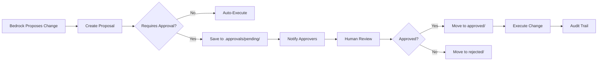

# Governance Systems - Comprehensive Documentation

**Version**: 1.0.0  
**Last Updated**: 2025-01-14  
**Status**: ✅ PRODUCTION-READY

## Table of Contents

1. [Executive Summary](#executive-summary)
2. [Bedrock Approval Policy](#bedrock-approval-policy)
3. [AI Communication Governance](#ai-communication-governance)
4. [Integration Architecture](#integration-architecture)
5. [Operational Procedures](#operational-procedures)
6. [Compliance & Audit](#compliance--audit)
7. [Troubleshooting](#troubleshooting)

---

## Executive Summary

Matbakh.app has implemented two comprehensive governance systems to ensure legal compliance, ethical AI communication, and controlled system changes:

1. **Bedrock Approval Policy**: Controls all Bedrock-initiated changes (architecture, infrastructure, code)
2. **AI Communication Governance**: Controls AI communication channels (voice, chat, external APIs)

### Key Benefits

- ✅ **Legal Protection**: GDPR, EU AI Act, UWG §5 compliance
- ✅ **Risk Mitigation**: Human oversight for critical changes
- ✅ **Audit Trail**: Complete logging for compliance reporting
- ✅ **Ethical AI**: Transparent communication standards
- ✅ **Controlled Activation**: Prevents unauthorized changes

### Quick Stats

| Metric                     | Value                                                          |
| -------------------------- | -------------------------------------------------------------- |
| **Governance Systems**     | 2 (Bedrock Approval + AI Communication)                        |
| **Policy Files**           | 2 YAML configurations                                          |
| **Manager Classes**        | 2 (450+ LOC, 550+ LOC)                                         |
| **Action Categories**      | 4 (Architecture, Infrastructure, Code, Documentation)          |
| **Communication Channels** | 6 (Text Chat, Voice, Recommendations, APIs, Content, Customer) |
| **Legal Foundations**      | 4 (GDPR, EU AI Act, UWG, Copyright)                            |
| **Approval Workflows**     | Proposal → Review → Approval → Execution                       |

---

## Bedrock Approval Policy

### Overview

The Bedrock Approval Policy ensures human oversight for all Bedrock-initiated actions related to architecture, code, and infrastructure changes.

### Policy Configuration

**File**: `.kiro/policies/bedrock-approval-policy.yaml`

**Key Settings**:

```yaml
general:
  approval_required: true
  auto_execute_allowed: false
  require_signed_approvals: true
  require_two_approvals: true
```

### Action Categories

#### 1. Architecture Changes

**Requires Approval**: ✅ Yes  
**Approvers**: CTO, Lead Engineer

**Examples**:

- Modify service layer structure
- Change routing topology (direct ↔ mcp)
- Alter database schema or migration plan

**Workflow**:

```typescript
const proposalId = await createBedrockProposal(
  "architecture",
  "Refactor service layer for better scalability",
  ["src/lib/services/"],
  "high",
  "Revert to previous architecture if issues arise",
  "lead-engineer"
);
```

#### 2. Infrastructure Modifications

**Requires Approval**: ✅ Yes  
**Approvers**: CTO, DevOps Lead

**Examples**:

- Create or delete AWS resources
- Modify IAM roles or security groups
- Change VPC, subnet, or region configuration

**Conditions**:

- Always require approval in production
- Allow auto-provisioning in sandbox environments only

#### 3. Code Changes

**Requires Approval**: ✅ Yes  
**Approvers**: CTO, Tech Lead

**Examples**:

- Modify TypeScript logic
- Refactor core orchestration functions
- Update hooks or validation systems

**Process**:

- Bedrock creates proposal with diff
- Stored under `.approvals/pending/`
- Structured changelog and rationale required

#### 4. Documentation Changes

**Requires Approval**: ❌ No (Auto-approved)  
**Approvers**: PO, Doc Manager

**Examples**:

- Auto-sync README and task documentation
- Generate completion reports and changelogs

### Approval Workflow



### Commands

```bash
# List pending proposals
npx kiro approve list

# Approve proposal
npx kiro approve .approvals/pending/2025-01-14T10-00-00-000Z_bedrock-code-proposal.yaml cto

# Reject proposal
npx kiro approve reject .approvals/pending/2025-01-14T10-00-00-000Z_bedrock-code-proposal.yaml cto "Needs more testing"

# Show proposal details
npx kiro approve show .approvals/pending/2025-01-14T10-00-00-000Z_bedrock-code-proposal.yaml
```

### Security Controls

1. **Encryption**: AES-256 for all proposal files
2. **Signature Verification**: Digital signatures for all approvals
3. **Data Residency**: eu-central-1 (Frankfurt)
4. **Retention**: 180 days for proposals, indefinite for audit logs

### Integration Points

```typescript
// Bedrock Support Manager Integration
class BedrockSupportManager {
  private approvalManager: BedrockApprovalPolicyManager;

  async proposeChange(change: ChangeProposal): Promise<string> {
    if (this.approvalManager.requiresApproval(change.type)) {
      return await this.approvalManager.createProposal({
        type: change.type,
        rationale: change.rationale,
        affectedComponents: change.components,
        riskLevel: change.riskLevel,
        rollbackPlan: change.rollbackPlan,
        reviewer: change.reviewer,
      });
    }
    return await this.executeChange(change);
  }
}
```

---

## AI Communication Governance

### Overview

The AI Communication Governance Framework controls when and how AI communication modules can interact with users and external services, ensuring GDPR, EU AI Act, and UWG compliance.

### Policy Configuration

**File**: `.kiro/policies/ki-communication-activation-policy.yaml`

**Key Settings**:

```yaml
general:
  activation_required: true
  default_state: "inactive"
  approval_required_for_new_channels: true
```

### Communication Channels

#### 1. Text Chat ✅ Auto-Enabled

**Status**: Active  
**Requires Approval**: No  
**Requires Consent**: Yes

**Compliance**:

- GDPR Article 7 - Consent
- Log all user messages
- No personal data persistence

**First Interaction Disclosure**:

> "Ich bin die Matbakh KI-Assistentin. Ich helfe dir, dein Restaurant zu analysieren, Inhalte zu erstellen und dein Geschäft zu optimieren."

#### 2. Voice Assistant ⏳ Requires Approval

**Status**: Inactive  
**Requires Approval**: Yes (CTO, Legal, PO)  
**Requires Consent**: Yes

**Compliance**:

- EU AI Act - High-Risk System
- Store transcripts <24h
- Anonymize audio metadata

**Restrictions**:

- No voice recording without explicit consent
- Transcripts must be encrypted
- Audio data deleted after processing

#### 3. AI Recommendations ✅ Auto-Enabled

**Status**: Active  
**Requires Approval**: No  
**Requires Consent**: No

**Restrictions**:

- No financial or legal advice
- Include disclaimer: "Unverbindliche Empfehlung"
- User can disable recommendations

#### 4. External APIs ⏳ Requires Approval

**Status**: Inactive  
**Requires Approval**: Yes (CTO, Security Officer)

**Compliance**:

- GDPR Article 44 - International Data Transfers
- Only EU-based API endpoints
- Log all external API calls

#### 5. Content Generation ✅ Auto-Enabled

**Status**: Active  
**Requires Approval**: No

**Compliance**:

- Watermark AI-generated images
- Disclose AI-generated content
- Respect copyright laws

#### 6. Customer Communication ⏳ Requires Approval

**Status**: Inactive  
**Requires Approval**: Yes (CTO, Legal, PO, Customer Success)

**Compliance**:

- EU AI Act - High-Risk System
- GDPR Article 22 - Automated Decision-Making
- UWG §5 - No Misleading Practices

### Legal Foundations

#### GDPR Compliance

1. **Article 5 - Data Minimization**

   - Only collect necessary data
   - No excessive retention

2. **Article 7 - Consent**

   - Explicit user consent for voice/customer communication
   - Clear opt-out mechanisms

3. **Article 22 - Automated Decision-Making**

   - No automated decisions without human oversight
   - Human escalation option

4. **Article 44 - International Data Transfers**
   - Only EU-based API endpoints
   - Data residency in eu-central-1

#### EU AI Act Compliance

1. **Transparency Obligations**

   - Disclose AI identity in first interaction
   - Clear labeling of AI-generated content

2. **High-Risk System Classification**

   - Voice assistant requires approval
   - Customer communication requires approval

3. **Human Oversight**
   - Human escalation for customer interactions
   - No fully automated customer decisions

#### German Law (UWG)

1. **§5 - No Misleading Practices**
   - No false claims or guarantees
   - Transparent about AI capabilities

### Identity & Self-Reference Rules

**✅ Allowed**:

- "Matbakh KI"
- "Matbakh Voice Assistant"
- "Matbakh AI System"

**🚫 Forbidden**:

- "Ich bin ein Mensch"
- "Ich wurde von OpenAI entwickelt"
- "Ich denke wie ein Mensch"

### Brand Voice Principles

1. **Klarheit** - Einfach, direkt, ohne Fachjargon
2. **Empathie** - Unterstützend, lösungsorientiert
3. **Selbstbewusst** - Fachlich fundiert, nicht überheblich
4. **Hilfsbereit** - Immer mit Handlungsempfehlung
5. **Multilingual** - Kulturelle Sensibilität

### Activation Workflow

```typescript
// Request channel activation
const proposalId = await requestCommunicationChannelActivation(
  "voice_assistant",
  "Enable multilingual voice interface",
  "GDPR + EU AI Act compliant",
  "high",
  "Voice data in eu-central-1, <24h retention",
  "Explicit microphone + voice recording consent"
);

// After approval
if (manager.isChannelActive("voice_assistant")) {
  await initializeVoiceAssistant();
}
```

---

## Integration Architecture

### System Overview

```
┌─────────────────────────────────────────────────────────────┐
│                    Bedrock Support Manager                   │
├─────────────────────────────────────────────────────────────┤
│                                                               │
│  ┌──────────────────────┐    ┌──────────────────────────┐  │
│  │ Bedrock Approval     │    │ AI Communication         │  │
│  │ Policy Manager       │    │ Governance Manager       │  │
│  ├──────────────────────┤    ├──────────────────────────┤  │
│  │ - Code Changes       │    │ - Text Chat              │  │
│  │ - Infrastructure     │    │ - Voice Assistant        │  │
│  │ - Architecture       │    │ - External APIs          │  │
│  │ - Documentation      │    │ - Content Generation     │  │
│  └──────────────────────┘    └──────────────────────────┘  │
│           │                            │                     │
│           ├────────────────────────────┤                     │
│           │                            │                     │
│  ┌────────▼────────────────────────────▼──────────┐         │
│  │         Audit Trail System                     │         │
│  │  - All proposals logged                        │         │
│  │  - Approval decisions tracked                  │         │
│  │  - Execution results recorded                  │         │
│  └────────────────────────────────────────────────┘         │
│                                                               │
└─────────────────────────────────────────────────────────────┘
```

### Data Flow

1. **Proposal Creation**

   - Bedrock/AI module creates proposal
   - Validation checks performed
   - Saved to `.approvals/pending/`

2. **Review Process**

   - Designated approvers notified
   - Human review and decision
   - Comments and signatures recorded

3. **Execution**

   - Approved proposals executed
   - Results logged to audit trail
   - Notifications sent to stakeholders

4. **Audit Trail**
   - Complete history maintained
   - Compliance reporting enabled
   - Searchable and exportable

---

## Operational Procedures

### Daily Operations

#### Morning Checklist

```bash
# Check pending proposals
npx kiro approve list
npx kiro approve-communication list

# Review overnight changes
cat .audit/auto-sync-logs/$(date +%Y-%m-%d)*.md

# Verify system health
npm test -- governance
```

#### Approval Process

1. **Receive Notification**

   - Slack/Email notification
   - Proposal ID and summary

2. **Review Proposal**

   ```bash
   npx kiro approve show <proposal-file>
   ```

3. **Make Decision**

   ```bash
   # Approve
   npx kiro approve <proposal-file> <your-role>

   # Reject
   npx kiro approve reject <proposal-file> <your-role> "<reason>"
   ```

4. **Verify Execution**
   - Check audit logs
   - Verify system state
   - Monitor for issues

### Emergency Procedures

#### Suspend Communication Channel

```typescript
const manager = new AICommunicationGovernanceManager();
await manager.initialize();

manager.suspendChannel("voice_assistant", "Security incident detected");
```

#### Emergency Rollback

```bash
# Rollback approved change
./scripts/comprehensive-rollback.sh <proposal-id>

# Verify rollback
npm test -- --testPathPattern=governance
```

---

## Compliance & Audit

### Audit Trail Structure

```
.audit/
├── auto-sync-logs/
│   ├── bedrock-approval-2025-01-14.md
│   └── ai-communication-2025-01-14.md
├── proposals/
│   ├── approved/
│   ├── rejected/
│   └── pending/
└── reports/
    ├── monthly-compliance-report.md
    └── quarterly-audit-summary.md
```

### Compliance Reporting

#### Monthly Report Generation

```bash
# Generate compliance report
npx tsx scripts/generate-compliance-report.ts --month 2025-01

# Export audit trail
npx tsx scripts/export-audit-trail.ts --format csv --output audit-2025-01.csv
```

#### Quarterly Audit

1. **Review all proposals** (approved, rejected, pending)
2. **Verify compliance** with GDPR, EU AI Act, UWG
3. **Check audit trail** completeness
4. **Generate summary** report
5. **Present to stakeholders**

### GDPR Compliance Checklist

- [ ] All personal data processing documented
- [ ] User consent mechanisms in place
- [ ] Data retention policies enforced
- [ ] Right to erasure implemented
- [ ] Data portability supported
- [ ] Breach notification procedures tested

### EU AI Act Compliance Checklist

- [ ] High-risk systems identified
- [ ] Transparency obligations met
- [ ] Human oversight implemented
- [ ] Risk assessments conducted
- [ ] Documentation maintained
- [ ] Conformity assessments completed

---

## Troubleshooting

### Common Issues

#### Issue 1: Proposal Not Created

**Symptoms**:

- Error when creating proposal
- Proposal file not found

**Diagnosis**:

```bash
# Check storage directories
ls -la .approvals/pending/
ls -la .approvals/approved/
ls -la .approvals/rejected/

# Verify permissions
ls -ld .approvals/
```

**Solution**:

```bash
# Recreate directories
mkdir -p .approvals/{pending,approved,rejected}
chmod 755 .approvals/
```

#### Issue 2: Approval Command Fails

**Symptoms**:

- Command not found
- Approval not recorded

**Diagnosis**:

```bash
# Check if CLI tool exists
ls -la scripts/kiro-approve.ts

# Test manager initialization
npx tsx -e "
import { BedrockApprovalPolicyManager } from './src/lib/ai-orchestrator/bedrock-approval-policy-manager';
const m = new BedrockApprovalPolicyManager();
await m.initialize();
console.log('OK');
"
```

**Solution**:

```bash
# Install dependencies
npm install

# Test approval workflow
npm test -- --testPathPattern=approval-policy
```

#### Issue 3: Channel Not Activating

**Symptoms**:

- Channel status remains inactive
- Approval doesn't activate channel

**Diagnosis**:

```typescript
const manager = new AICommunicationGovernanceManager();
await manager.initialize();

console.log("Channel Status:", manager.getChannelStatus("voice_assistant"));
console.log("All Channels:", manager.getAllChannels());
```

**Solution**:

```typescript
// Check if enough approvals
const proposal = await manager.loadProposal(proposalId);
console.log("Approvals:", proposal.approvals.length);
console.log("Required:", channel.approvers?.length || 1);

// Manually activate if needed (emergency only)
manager.reactivateChannel("voice_assistant");
```

### Debug Commands

```bash
# Check governance system health
npm test -- governance

# Verify policy files
cat .kiro/policies/bedrock-approval-policy.yaml
cat .kiro/policies/ki-communication-activation-policy.yaml

# Check audit logs
tail -f .audit/auto-sync-logs/*.md

# List all proposals
find .approvals -name "*.yaml" -type f

# Verify manager initialization
npx tsx scripts/test-governance-systems.ts
```

---

## Related Documentation

- [Bedrock Approval Policy Activation Report](./bedrock-approval-policy-activation-completion-report.md)
- [AI Communication Governance Activation Report](./ai-communication-governance-activation-completion-report.md)
- [Bedrock Support Manager Documentation](./bedrock-support-manager-implementation-completion-report.md)
- [Release Guidance](../.kiro/steering/Release-Guidance.md)

---

**Last Updated**: 2025-01-14  
**Version**: 1.0.0  
**Status**: ✅ PRODUCTION-READY  
**Maintained By**: Kiro Governance System
