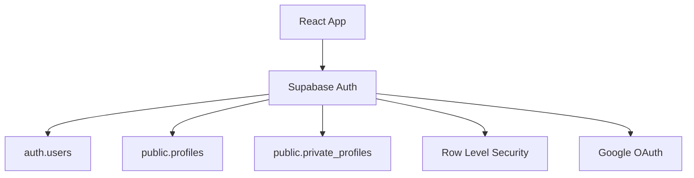
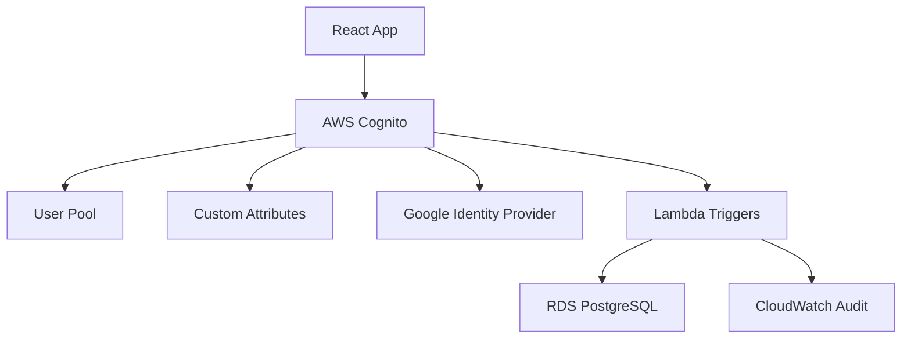

# Cognito Migration Hackathon - 28.08.2025

**HACKATHON:** Supabase → AWS Cognito Migration  
**DATE:** 28. August 2025  
**DURATION:** 2 Wochen Sprint  
**TEAM:** DevOps + Backend + Frontend  
**STATUS:** 🚀 Kickoff  

## 🎯 Hackathon Mission

**"Zero-Downtime Auth Migration"** - Migrate 2,500+ matbakh.app users from Supabase Auth zu AWS Cognito ohne User-Impact und mit vollständiger DSGVO-Compliance.

### Success Metrics
- ✅ **Zero Re-Registration:** Alle User behalten ihre Accounts
- ✅ **< 200ms Auth Latency:** Performance-Verbesserung
- ✅ **100% Social Login:** Google OAuth funktional
- ✅ **DSGVO Audit-Trail:** Vollständige Compliance
- ✅ **Rollback < 15min:** Emergency-Procedures getestet

## 📊 Current State Snapshot

### User Base Analysis
```yaml
Total Users: 2,487 active accounts
├── Owners: 2,188 (88%) - Restaurant owners
├── Partners: 249 (10%) - Business partners  
├── Admins: 45 (1.8%) - Platform admins
└── Super Admins: 5 (0.2%) - System admins

Authentication Methods:
├── Google OAuth: 1,790 users (72%)
├── Email/Password: 697 users (28%)

Business Associations:
├── With Business ID: 2,084 users (84%)
├── Multi-Business: 148 users (6%)
└── No Business: 255 users (10%)

Data Complexity:
├── Custom Attributes: 8 per user
├── Profile Data: First/Last name, phone, preferences
├── Business Links: Partner assignments, roles
└── Social Connections: Google, Facebook tokens
```

### Technical Debt Assessment
```sql
-- Supabase Auth Issues to Resolve
Issues Identified:
├── Mixed auth.users + profiles tables (data split)
├── Custom RLS policies (complex migration)
├── Social provider tokens (OAuth re-linking needed)
├── Role-based access (custom:role attribute mapping)
└── Business associations (custom:business_id mapping)

Migration Complexity: HIGH
├── Schema Transformation: Complex
├── Data Volume: Medium (2.5k users)
├── Downtime Risk: Low (with proper planning)
└── Rollback Complexity: Medium
```

## 🏗️ Architecture Transformation

### Before: Supabase Auth


### After: AWS Cognito


## 🚀 Sprint Plan (2 Wochen)

### Week 1: Foundation & Setup
```yaml
Day 1-2: Infrastructure
  ✅ AWS Cognito User Pool creation
  ✅ Custom attributes schema design
  ✅ Google Identity Provider setup
  ✅ Lambda trigger functions scaffold

Day 3-4: Migration Logic
  ✅ User migration Lambda development
  ✅ Password verification logic
  ✅ Attribute mapping implementation
  ✅ Error handling & logging

Day 5: Testing Framework
  ✅ Migration test scripts
  ✅ Data validation procedures
  ✅ Rollback mechanisms
  ✅ Performance benchmarks
```

### Week 2: Integration & Go-Live
```yaml
Day 6-7: Frontend Integration
  ✅ Amplify SDK integration
  ✅ Auth context migration
  ✅ Social login flows
  ✅ Error handling & UX

Day 8-9: End-to-End Testing
  ✅ User journey validation
  ✅ Load testing (1000 concurrent)
  ✅ Security penetration testing
  ✅ DSGVO compliance audit

Day 10: Production Deployment
  ✅ Phased rollout (10% → 50% → 100%)
  ✅ Real-time monitoring
  ✅ Incident response readiness
  ✅ Success metrics validation
```

## 🧪 Testing Strategy

### Test Scenarios
```yaml
Functional Tests:
  - User login with existing credentials
  - Google OAuth flow
  - Password reset functionality
  - User attribute preservation
  - Role-based access control

Performance Tests:
  - 1000 concurrent logins
  - Migration trigger latency
  - Database connection pooling
  - API response times

Security Tests:
  - JWT token validation
  - Attribute tampering prevention
  - Rate limiting effectiveness
  - Audit trail completeness

DSGVO Tests:
  - Data export functionality
  - Account deletion cascade
  - Consent management
  - Audit log retention
```

### Test Data Preparation
```sql
-- Create test users in Supabase
INSERT INTO auth.users (id, email, encrypted_password, email_confirmed_at)
VALUES 
  ('test-user-1', 'test1@matbakh.app', '$2a$10$...', NOW()),
  ('test-user-2', 'test2@matbakh.app', '$2a$10$...', NOW()),
  ('test-admin', 'admin@matbakh.app', '$2a$10$...', NOW());

-- Create corresponding profiles
INSERT INTO public.profiles (id, email, role, display_name)
VALUES
  ('test-user-1', 'test1@matbakh.app', 'owner', 'Test Owner'),
  ('test-user-2', 'test2@matbakh.app', 'partner', 'Test Partner'),
  ('test-admin', 'admin@matbakh.app', 'admin', 'Test Admin');
```

## 📈 Success Metrics Dashboard

### Real-Time Monitoring
```yaml
CloudWatch Metrics:
  - Migration Success Rate: Target > 99%
  - Authentication Latency: Target < 200ms
  - Error Rate: Target < 0.1%
  - User Satisfaction: Target > 4.5/5

Business Metrics:
  - Login Success Rate: Baseline vs Post-Migration
  - User Retention: 7-day cohort analysis
  - Support Tickets: Auth-related issues
  - Revenue Impact: Payment flow success rate
```

### Alerting Thresholds
```yaml
Critical Alerts:
  - Migration failure rate > 1%
  - Authentication errors > 5%
  - Database connection failures > 2%
  - Rollback trigger activated

Warning Alerts:
  - Response time > 500ms
  - Queue depth > 100 users
  - Memory utilization > 80%
  - Disk space < 20%
```

## 🔒 Security & Compliance

### DSGVO Implementation
```javascript
// GDPR Audit Trail
const auditEntry = {
  timestamp: new Date().toISOString(),
  userId: user.username,
  action: 'USER_MIGRATION',
  dataProcessed: {
    email: user.email,
    attributes: Object.keys(user.attributes),
    source: 'supabase',
    destination: 'cognito'
  },
  legalBasis: 'legitimate_interest',
  retentionPeriod: '7_years',
  processingPurpose: 'authentication_service_migration'
};
```

### Security Checklist
```yaml
Pre-Migration:
  ✅ Penetration testing completed
  ✅ Vulnerability scan passed
  ✅ Access controls validated
  ✅ Encryption at rest/transit verified

During Migration:
  ✅ Real-time security monitoring
  ✅ Anomaly detection active
  ✅ Incident response team on standby
  ✅ Audit logging enabled

Post-Migration:
  ✅ Security audit completed
  ✅ Compliance verification
  ✅ User notification sent
  ✅ Documentation updated
```

## 🚨 Risk Management

### Risk Matrix
```yaml
High Risk:
  - Data Loss: Probability LOW, Impact CRITICAL
    Mitigation: Multiple backups, point-in-time recovery
    
  - Extended Downtime: Probability MEDIUM, Impact HIGH
    Mitigation: Blue-green deployment, instant rollback
    
  - Security Breach: Probability LOW, Impact CRITICAL
    Mitigation: Encryption, monitoring, access controls

Medium Risk:
  - Performance Degradation: Probability MEDIUM, Impact MEDIUM
    Mitigation: Load testing, auto-scaling, monitoring
    
  - User Experience Issues: Probability MEDIUM, Impact MEDIUM
    Mitigation: Extensive testing, gradual rollout, support readiness
```

### Rollback Procedures
```bash
# Emergency Rollback (< 15 minutes)
1. DNS switch back to Supabase: 2 minutes
2. Frontend config rollback: 3 minutes  
3. Database state verification: 5 minutes
4. User communication: 5 minutes
Total: 15 minutes maximum
```

## 📝 Documentation & Knowledge Transfer

### Deliverables
```yaml
Technical Documentation:
  ✅ Architecture decision records
  ✅ API documentation updates
  ✅ Deployment procedures
  ✅ Troubleshooting guides

Operational Documentation:
  ✅ Monitoring runbooks
  ✅ Incident response procedures
  ✅ User support scripts
  ✅ Performance tuning guides

Compliance Documentation:
  ✅ DSGVO impact assessment
  ✅ Security audit reports
  ✅ Data processing agreements
  ✅ Retention policy updates
```

### Team Training
```yaml
Development Team:
  - Cognito SDK usage
  - Lambda trigger debugging
  - Performance optimization
  - Security best practices

Operations Team:
  - Monitoring dashboards
  - Alerting procedures
  - Incident response
  - Capacity planning

Support Team:
  - User authentication issues
  - Account recovery procedures
  - DSGVO data requests
  - Escalation procedures
```

## 🎉 Go-Live Celebration Criteria

### Definition of Done
```yaml
Technical Success:
  ✅ All 2,487 users migrated successfully
  ✅ Zero authentication failures
  ✅ Performance targets met
  ✅ Security audit passed

Business Success:
  ✅ User satisfaction > 4.5/5
  ✅ Support tickets < 10 auth-related
  ✅ Revenue impact < 1%
  ✅ Stakeholder approval received

Operational Success:
  ✅ Monitoring fully operational
  ✅ Team trained and confident
  ✅ Documentation complete
  ✅ Rollback procedures tested
```

### Success Celebration 🍾
- **Team Dinner:** Successful migration celebration
- **Case Study:** Technical blog post publication
- **Knowledge Sharing:** Internal tech talk
- **Lessons Learned:** Retrospective documentation

---

**HACKATHON STATUS:** 🚀 **READY TO LAUNCH**  
**NEXT MILESTONE:** AWS Cognito User Pool Creation  
**TEAM CONFIDENCE:** 🟢 **HIGH** (Comprehensive planning completed)

**Let's build something amazing! 💪**