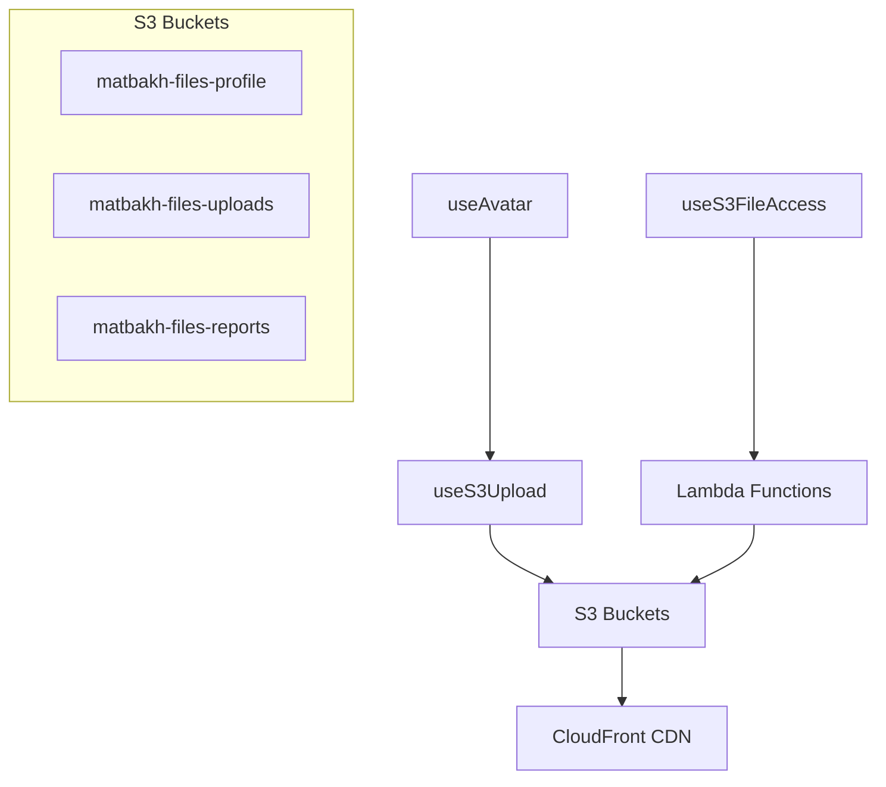

# S3 Hooks API Documentation

## Overview

This document provides comprehensive documentation for the S3 file management hooks used in the matbakh.app platform. These hooks provide a clean, type-safe interface for file uploads, avatar management, and secure file access.

## Architecture



## Hooks Overview

| Hook | Purpose | Key Features |
|------|---------|--------------|
| `useS3FileAccess` | Secure file URL generation | Presigned URLs, Caching, Batch operations |
| `useAvatar` | Avatar upload & management | Image optimization, Fallbacks, Progress tracking |
| `useS3Upload` | General file uploads | Multipart, Retry logic, Validation |

---

## useS3FileAccess Hook

### Purpose
Provides secure access to files stored in S3 buckets through presigned URLs and CDN access.

### Key Features
- **Secure URL Generation**: Creates time-limited presigned URLs for private files
- **CDN Integration**: Direct CloudFront URLs for public files
- **Intelligent Caching**: Automatic URL caching with expiry management
- **Batch Operations**: Efficient multiple URL generation
- **Auto-Refresh**: Automatic URL renewal before expiry

### Basic Usage

```typescript
import { useS3FileAccess } from '@/hooks/useS3FileAccess';

function FileViewer({ bucket, fileKey }) {
  const { 
    generateSecureUrl, 
    getCdnUrl, 
    isGenerating, 
    error 
  } = useS3FileAccess({
    autoRefresh: true,
    cacheUrls: true,
    refreshBuffer: 300 // 5 minutes before expiry
  });

  const handleViewFile = async () => {
    try {
      const result = await generateSecureUrl({
        bucket,
        key: fileKey,
        expiresIn: 3600, // 1 hour
        responseContentType: 'application/pdf'
      });
      
      window.open(result.url, '_blank');
    } catch (err) {
      console.error('Failed to generate secure URL:', err);
    }
  };

  return (
    <button 
      onClick={handleViewFile} 
      disabled={isGenerating}
    >
      {isGenerating ? 'Loading...' : 'View File'}
    </button>
  );
}
```

### Advanced Usage

```typescript
// Batch URL generation
const urls = await generateMultipleUrls([
  { bucket: 'matbakh-files-profile', key: 'avatars/user1.jpg' },
  { bucket: 'matbakh-files-profile', key: 'avatars/user2.jpg' },
  { bucket: 'matbakh-files-reports', key: 'report123.pdf' }
]);

// Download file with custom filename
await downloadFile(
  'matbakh-files-reports', 
  'reports/analysis.pdf', 
  'my-analysis.pdf'
);

// Preload file for faster access
await preloadFile('matbakh-files-profile', 'documents/contract.pdf');

// Check URL expiry
const timeLeft = getTimeUntilExpiry(urlResult); // seconds
const expired = isUrlExpired(urlResult);
```

### API Reference

#### Options
```typescript
interface UseS3FileAccessOptions {
  autoRefresh?: boolean;     // Auto-refresh expired URLs (default: true)
  refreshBuffer?: number;    // Seconds before expiry to refresh (default: 300)
  cacheUrls?: boolean;       // Enable URL caching (default: true)
}
```

#### Return Value
```typescript
interface UseS3FileAccessReturn {
  // URL Generation
  generateSecureUrl: (options: SecureFileUrlOptions) => Promise<SecureFileUrlResult>;
  getCdnUrl: (bucket: BucketType, key: string) => string;
  generateMultipleUrls: (requests: SecureFileUrlOptions[]) => Promise<SecureFileUrlResult[]>;
  
  // State
  isGenerating: boolean;
  error: Error | null;
  
  // Cache Management
  getCachedUrl: (bucket: BucketType, key: string) => SecureFileUrlResult | null;
  clearCache: () => void;
  clearExpiredUrls: () => void;
  
  // File Operations
  downloadFile: (bucket: BucketType, key: string, filename?: string) => Promise<void>;
  preloadFile: (bucket: BucketType, key: string) => Promise<void>;
  
  // Utilities
  isUrlExpired: (url: SecureFileUrlResult) => boolean;
  getTimeUntilExpiry: (url: SecureFileUrlResult) => number;
}
```

---

## useAvatar Hook

### Purpose
Specialized hook for avatar upload, management, and display with automatic optimization and fallback handling.

### Key Features
- **Image Optimization**: Automatic compression and resizing
- **Fallback System**: Default avatars for different entity types
- **Progress Tracking**: Real-time upload progress
- **Preview Support**: File preview before upload
- **Database Integration**: Automatic avatar URL updates

### Basic Usage

```typescript
import { useAvatar } from '@/hooks/useAvatar';

function UserProfile({ userId }) {
  const {
    avatarUrl,
    isUploading,
    uploadProgress,
    uploadAvatar,
    deleteAvatar,
    error
  } = useAvatar({
    userId,
    bucket: 'matbakh-files-profile',
    folder: 'avatars',
    onSuccess: (url) => console.log('Avatar uploaded:', url),
    onError: (err) => console.error('Upload failed:', err)
  });

  const handleFileSelect = async (file: File) => {
    try {
      const avatarUrl = await uploadAvatar(file, {
        maxWidth: 400,
        maxHeight: 400,
        quality: 0.85,
        format: 'image/jpeg'
      });
      console.log('New avatar URL:', avatarUrl);
    } catch (err) {
      console.error('Upload failed:', err);
    }
  };

  return (
    <div>
      
      
      {isUploading && (
        <div>
          Uploading: {uploadProgress}%
        </div>
      )}
      
      <input
        type="file"
        accept="image/*"
        onChange={(e) => e.target.files?.[0] && handleFileSelect(e.target.files[0])}
        disabled={isUploading}
      />
      
      <button onClick={deleteAvatar} disabled={isUploading}>
        Delete Avatar
      </button>
      
      {error && <div>Error: {error.message}</div>}
    </div>
  );
}
```

### Advanced Usage

```typescript
// Preview before upload
const { previewUrl, setPreviewFromFile, clearPreview } = useAvatar({ userId });

const handlePreview = async (file: File) => {
  await setPreviewFromFile(file);
};

// Custom optimization settings
const uploadResult = await uploadAvatar(file, {
  maxWidth: 800,
  maxHeight: 600,
  quality: 0.9,
  format: 'image/webp',
  enableCompression: true
});

// Partner avatar
const partnerAvatar = useAvatar({
  partnerId: 'partner123',
  fallbackUrl: '/images/company-logo.png'
});
```

### API Reference

#### Options
```typescript
interface UseAvatarOptions {
  userId?: string;           // User ID for user avatars
  partnerId?: string;        // Partner ID for partner avatars
  bucket?: BucketType;       // S3 bucket (default: 'matbakh-files-profile')
  folder?: string;           // Folder path (default: 'avatars')
  fallbackUrl?: string;      // Custom fallback URL
  onSuccess?: (avatarUrl: string) => void;
  onError?: (error: Error) => void;
}

interface AvatarUploadOptions {
  maxWidth?: number;         // Max width in pixels (default: 400)
  maxHeight?: number;        // Max height in pixels (default: 400)
  quality?: number;          // Compression quality 0-1 (default: 0.85)
  format?: 'image/jpeg' | 'image/png' | 'image/webp';
  enableCompression?: boolean; // Enable optimization (default: true)
}
```

#### Return Value
```typescript
interface UseAvatarReturn {
  // State
  avatarUrl: string | null;
  isLoading: boolean;
  isUploading: boolean;
  uploadProgress: number;
  error: Error | null;
  
  // Operations
  uploadAvatar: (file: File, options?: AvatarUploadOptions) => Promise<string>;
  deleteAvatar: () => Promise<void>;
  refreshAvatar: () => Promise<void>;
  
  // Preview
  previewUrl: string | null;
  setPreviewFromFile: (file: File) => Promise<void>;
  clearPreview: () => void;
}
```

---

## Error Handling

### Common Error Scenarios

```typescript
// Authentication errors
try {
  await generateSecureUrl({ bucket, key });
} catch (error) {
  if (error.message.includes('Authentication required')) {
    // Redirect to login
    router.push('/login');
  }
}

// File validation errors
try {
  await uploadAvatar(file);
} catch (error) {
  if (error.message.includes('File size exceeds')) {
    showToast('Please choose a smaller image (max 5MB)');
  } else if (error.message.includes('File type')) {
    showToast('Please choose a valid image file');
  }
}

// Network errors
try {
  await generateSecureUrl({ bucket, key });
} catch (error) {
  if (error.message.includes('network')) {
    showToast('Network error. Please check your connection.');
  }
}
```

### Error Recovery

```typescript
// Retry with exponential backoff
const retryWithBackoff = async (fn: () => Promise<any>, maxRetries = 3) => {
  for (let i = 0; i < maxRetries; i++) {
    try {
      return await fn();
    } catch (error) {
      if (i === maxRetries - 1) throw error;
      
      const delay = Math.pow(2, i) * 1000;
      await new Promise(resolve => setTimeout(resolve, delay));
    }
  }
};

// Usage
const result = await retryWithBackoff(() => 
  generateSecureUrl({ bucket, key })
);
```

---

## Performance Optimization

### Caching Strategy

```typescript
// Enable caching for frequently accessed files
const fileAccess = useS3FileAccess({
  cacheUrls: true,
  refreshBuffer: 300, // Refresh 5 minutes before expiry
  autoRefresh: true
});

// Preload critical files
useEffect(() => {
  const preloadCriticalFiles = async () => {
    await Promise.all([
      fileAccess.preloadFile('matbakh-files-profile', 'avatars/current-user.jpg'),
      fileAccess.preloadFile('matbakh-files-reports', 'latest-report.pdf')
    ]);
  };
  
  preloadCriticalFiles();
}, []);
```

### Batch Operations

```typescript
// Generate multiple URLs efficiently
const generateUserAvatars = async (userIds: string[]) => {
  const requests = userIds.map(id => ({
    bucket: 'matbakh-files-profile' as const,
    key: `avatars/${id}/avatar.jpg`
  }));
  
  const urls = await generateMultipleUrls(requests);
  return urls;
};
```

### Memory Management

```typescript
// Clean up expired URLs periodically
useEffect(() => {
  const cleanup = setInterval(() => {
    clearExpiredUrls();
  }, 5 * 60 * 1000); // Every 5 minutes
  
  return () => clearInterval(cleanup);
}, [clearExpiredUrls]);

// Clear preview URLs to prevent memory leaks
useEffect(() => {
  return () => {
    if (previewUrl) {
      URL.revokeObjectURL(previewUrl);
    }
  };
}, [previewUrl]);
```

---

## Security Considerations

### Access Control

```typescript
// URLs are automatically scoped to authenticated user
const secureUrl = await generateSecureUrl({
  bucket: 'matbakh-files-profile',
  key: 'private-document.pdf',
  expiresIn: 900 // 15 minutes max for sensitive files
});
```

### Content Type Validation

```typescript
// Force specific content type for security
const pdfUrl = await generateSecureUrl({
  bucket: 'matbakh-files-reports',
  key: 'report.pdf',
  responseContentType: 'application/pdf',
  responseContentDisposition: 'inline; filename="report.pdf"'
});
```

### File Upload Validation

```typescript
// Avatar validation is built-in
const uploadAvatar = async (file: File) => {
  // Automatically validates:
  // - File size (max 5MB)
  // - File type (images only)
  // - File name safety
  // - Image dimensions
  
  return await uploadAvatar(file);
};
```

---

## Testing

### Unit Test Examples

```typescript
// Mock the hooks for testing
jest.mock('@/hooks/useS3FileAccess');
jest.mock('@/hooks/useAvatar');

describe('FileViewer Component', () => {
  it('should generate secure URL on button click', async () => {
    const mockGenerateSecureUrl = jest.fn().mockResolvedValue({
      url: 'https://presigned-url.com',
      expiresAt: '2024-01-01T12:00:00Z',
      isPublic: false
    });
    
    (useS3FileAccess as jest.Mock).mockReturnValue({
      generateSecureUrl: mockGenerateSecureUrl,
      isGenerating: false,
      error: null
    });
    
    render(<FileViewer bucket="test-bucket" fileKey="test.pdf" />);
    
    fireEvent.click(screen.getByText('View File'));
    
    expect(mockGenerateSecureUrl).toHaveBeenCalledWith({
      bucket: 'test-bucket',
      key: 'test.pdf',
      expiresIn: 3600,
      responseContentType: 'application/pdf'
    });
  });
});
```

### Integration Test Examples

```typescript
describe('Avatar Upload Integration', () => {
  it('should upload and update avatar successfully', async () => {
    const file = new File(['test'], 'avatar.jpg', { type: 'image/jpeg' });
    
    const { result } = renderHook(() => useAvatar({ userId: 'test-user' }));
    
    await act(async () => {
      const avatarUrl = await result.current.uploadAvatar(file);
      expect(avatarUrl).toMatch(/^https:\/\/.*\.jpg$/);
    });
    
    expect(result.current.avatarUrl).toBeTruthy();
    expect(result.current.isUploading).toBe(false);
  });
});
```

---

## Migration Guide

### From Supabase Storage

```typescript
// Old Supabase approach
const { data } = await supabase.storage
  .from('avatars')
  .upload(`${userId}/avatar.jpg`, file);

// New S3 approach
const avatarUrl = await uploadAvatar(file, {
  maxWidth: 400,
  maxHeight: 400,
  quality: 0.85
});
```

### URL Generation Migration

```typescript
// Old approach
const { data } = await supabase.storage
  .from('bucket')
  .createSignedUrl('file.pdf', 3600);

// New approach
const result = await generateSecureUrl({
  bucket: 'matbakh-files-profile',
  key: 'file.pdf',
  expiresIn: 3600
});
```

---

## Troubleshooting

### Common Issues

1. **Authentication Errors**
   - Ensure user is logged in
   - Check token expiry
   - Verify API permissions

2. **Upload Failures**
   - Check file size limits
   - Validate file types
   - Verify network connectivity

3. **URL Generation Failures**
   - Check bucket permissions
   - Verify file exists
   - Check Lambda function status

4. **Cache Issues**
   - Clear cache manually: `clearCache()`
   - Check expiry times
   - Verify auto-refresh settings

### Debug Mode

```typescript
// Enable debug logging
const fileAccess = useS3FileAccess({
  // Add debug flag in development
  debug: process.env.NODE_ENV === 'development'
});
```

---

## Best Practices

1. **Always handle errors gracefully**
2. **Use appropriate expiry times for URLs**
3. **Enable caching for frequently accessed files**
4. **Preload critical files when possible**
5. **Clean up preview URLs to prevent memory leaks**
6. **Use batch operations for multiple files**
7. **Validate files before upload**
8. **Provide user feedback during operations**

---

## API Endpoints

The hooks interact with the following API endpoints:

- `POST /get-presigned-url` - Generate upload URLs
- `POST /get-file-access-url` - Generate secure access URLs
- `POST /get-multiple-file-access-urls` - Batch URL generation
- `GET /avatar/{type}/{id}` - Get avatar URL
- `PUT /avatar/{type}/{id}` - Update avatar URL
- `DELETE /avatar/{type}/{id}` - Delete avatar

---

## Version History

- **v1.0.0** - Initial S3 migration implementation
- **v1.1.0** - Added batch operations and caching
- **v1.2.0** - Enhanced error handling and retry logic
- **v1.3.0** - Added preview support and memory management