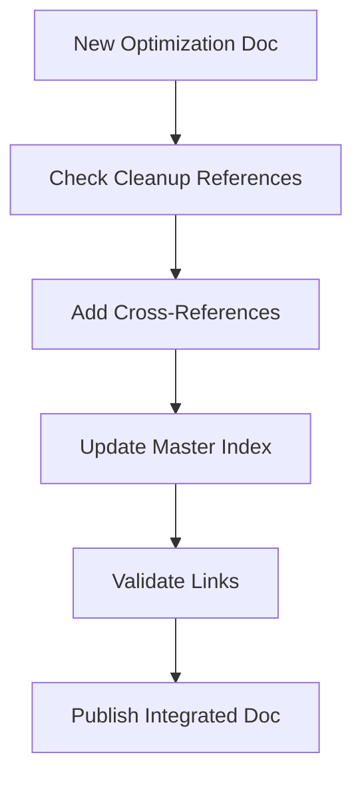
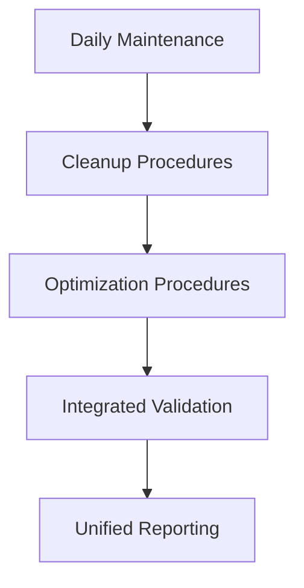
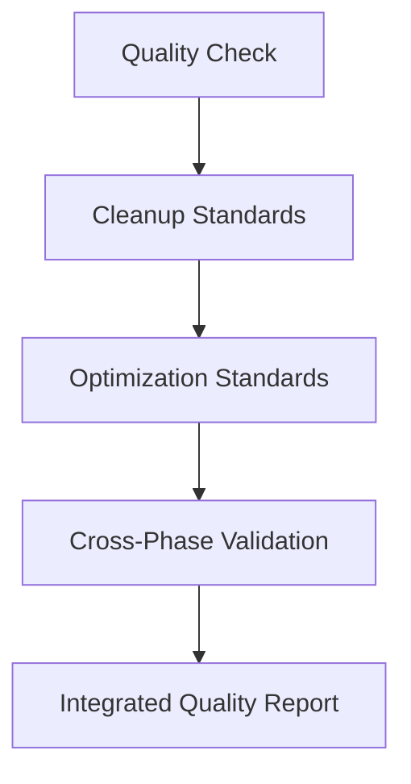

# Hybrid Documentation Bridge - Cleanup to Optimization Phase

**Bridge Version**: 1.0  
**Created**: 2025-01-14T16:00:00Z  
**Purpose**: Seamless transition from System Architecture Cleanup to System Optimization & Enhancement  
**Approach**: Hybrid integration of existing documentation with new optimization specifications  

## Overview

This document serves as a bridge between the completed System Architecture Cleanup & Reintegration project and the upcoming System Optimization & Enhancement phase. It establishes a hybrid approach that preserves all cleanup documentation while seamlessly integrating with the new optimization specifications.

## Hybrid Approach Benefits

### 1. Continuity Preservation
- **Complete History**: All cleanup documentation remains intact and accessible
- **Decision Traceability**: Full audit trail from cleanup through optimization
- **Knowledge Retention**: No loss of institutional knowledge or lessons learned
- **Reference Integrity**: All existing references and links remain valid

### 2. Seamless Integration
- **Unified Navigation**: Single documentation system spanning both phases
- **Cross-Phase References**: Intelligent linking between cleanup and optimization docs
- **Consistent Standards**: Unified documentation standards across all phases
- **Integrated Workflows**: Seamless workflow integration between phases

### 3. Enhanced Value
- **Compound Knowledge**: Cleanup insights inform optimization decisions
- **Accelerated Development**: Existing documentation accelerates optimization phase
- **Risk Reduction**: Proven patterns and procedures reduce optimization risks
- **Quality Assurance**: Established quality standards ensure optimization excellence

## Documentation Architecture

### Phase 1: Cleanup Documentation (Completed)
```
docs/
├── system-architecture-cleanup-execution-report.md     # Master cleanup report
├── system-before-after-comparison.md                   # System evolution analysis
├── architecture-maintenance-guide.md                   # Ongoing maintenance procedures
├── ARCHIVED-FEATURES.md                               # Complete feature archive catalog
├── task-*-completion-report.md                        # Individual task reports (50+)
└── [100+ supporting documents]                        # Comprehensive documentation suite
```

### Phase 2: Optimization Documentation (Upcoming)
```
.kiro/specs/system-optimization-enhancement/
├── requirements.md                                     # Optimization requirements
├── design.md                                          # Optimization architecture design
├── tasks.md                                           # Implementation tasks (26 tasks)
└── [future optimization reports]                      # To be created during optimization
```

### Hybrid Integration Layer
```
docs/
├── hybrid-approach-documentation-bridge.md            # This document
├── unified-documentation-index.md                     # Master navigation index
├── cross-phase-reference-guide.md                     # Cross-reference system
└── integrated-maintenance-procedures.md               # Combined maintenance guide
```

## Cross-Phase Integration Points

### 1. Architecture Evolution Tracking
- **Cleanup Baseline**: System state after cleanup serves as optimization baseline
- **Evolution Metrics**: Performance improvements tracked from cleanup baseline
- **Decision Continuity**: Cleanup architectural decisions inform optimization choices
- **Pattern Reuse**: Proven cleanup patterns applied to optimization challenges

### 2. Quality Standards Continuity
- **Test Coverage**: 95% test coverage maintained and enhanced during optimization
- **Code Quality**: Kiro compliance standards extended to optimization features
- **Documentation Standards**: Cleanup documentation standards applied to optimization
- **Security Standards**: Security framework established in cleanup extended to optimization

### 3. Operational Procedures Integration
- **Maintenance Procedures**: Cleanup maintenance procedures extended for optimization
- **Emergency Procedures**: Rollback and recovery procedures enhanced for optimization
- **Monitoring Systems**: Cleanup monitoring extended with optimization metrics
- **Quality Gates**: Cleanup quality gates enhanced with optimization validations

## Unified Documentation System

### Master Navigation Index
```markdown
# matbakh.app Documentation System

## Phase 1: System Architecture Cleanup (Completed)
- [Executive Summary](docs/system-architecture-cleanup-execution-report.md#executive-summary)
- [Architecture Changes](docs/system-before-after-comparison.md)
- [Maintenance Guide](docs/architecture-maintenance-guide.md)
- [Archived Features](ARCHIVED-FEATURES.md)

## Phase 2: System Optimization & Enhancement (Active)
- [Optimization Requirements](.kiro/specs/system-optimization-enhancement/requirements.md)
- [Optimization Design](.kiro/specs/system-optimization-enhancement/design.md)
- [Implementation Tasks](.kiro/specs/system-optimization-enhancement/tasks.md)

## Cross-Phase Integration
- [Documentation Bridge](docs/hybrid-approach-documentation-bridge.md)
- [Unified Procedures](docs/integrated-maintenance-procedures.md)
- [Cross-References](docs/cross-phase-reference-guide.md)
```

### Intelligent Cross-Referencing
- **Automatic Linking**: Automated cross-references between related cleanup and optimization topics
- **Context Preservation**: Cleanup context preserved when referenced in optimization docs
- **Bidirectional Navigation**: Easy navigation between cleanup and optimization documentation
- **Version Tracking**: Clear version tracking across both phases

## Integration Workflows

### 1. Documentation Creation Workflow


### 2. Maintenance Workflow Integration


### 3. Quality Assurance Integration


## Enhanced Maintenance Procedures

### Integrated Daily Tasks (15 minutes)
1. **Cleanup System Validation** (5 minutes)
   - Run Kiro purity validation
   - Check archive integrity
   - Validate rollback capability

2. **Optimization System Monitoring** (5 minutes)
   - Monitor performance metrics
   - Check optimization effectiveness
   - Validate enhancement features

3. **Cross-Phase Integration Check** (5 minutes)
   - Verify documentation links
   - Check procedure integration
   - Validate unified monitoring

### Enhanced Weekly Tasks (45 minutes)
1. **Comprehensive System Analysis** (20 minutes)
   - Full architecture scan (cleanup + optimization)
   - Performance trend analysis
   - Quality metrics review

2. **Documentation Maintenance** (15 minutes)
   - Update cross-references
   - Validate documentation accuracy
   - Enhance integration points

3. **Procedure Optimization** (10 minutes)
   - Review integrated procedures
   - Optimize workflow efficiency
   - Update automation scripts

## Success Metrics Integration

### Cleanup Metrics (Baseline)
- **System Purity**: 95%+ Kiro compliance
- **Performance**: 38% improvement in build times
- **Quality**: 95% test coverage
- **Risk Reduction**: 71% overall risk reduction

### Optimization Metrics (Targets)
- **Performance Enhancement**: 50% improvement in Core Web Vitals
- **Quality Excellence**: 99%+ test coverage
- **Developer Productivity**: 60% reduction in development cycle time
- **Scalability**: 10x load capacity support

### Integrated Success Criteria
- **Compound Performance**: Cleanup + Optimization = 88% total improvement
- **Quality Excellence**: Sustained 99%+ coverage across all phases
- **Risk Mitigation**: Continued risk reduction through optimization
- **Developer Experience**: Exponential productivity improvements

## Future Evolution Framework

### Documentation Evolution Strategy
1. **Phase Integration**: Each new phase integrates with existing documentation
2. **Knowledge Accumulation**: Compound knowledge growth across phases
3. **Pattern Recognition**: Successful patterns replicated across phases
4. **Continuous Improvement**: Ongoing refinement of integration approaches

### Scalability Considerations
- **Multi-Phase Support**: Framework supports unlimited future phases
- **Documentation Scaling**: Efficient organization as documentation grows
- **Performance Optimization**: Fast navigation and search across large doc sets
- **Maintenance Efficiency**: Streamlined maintenance across all phases

## Implementation Guidelines

### For Development Team
1. **Always Reference**: Check cleanup documentation before optimization decisions
2. **Maintain Integration**: Keep cross-references updated during development
3. **Follow Standards**: Apply cleanup standards to optimization work
4. **Document Decisions**: Record how cleanup insights influence optimization

### For Documentation Maintenance
1. **Unified Updates**: Update both cleanup and optimization docs simultaneously
2. **Cross-Validation**: Validate consistency across all documentation
3. **Link Maintenance**: Keep all cross-references current and accurate
4. **Quality Assurance**: Apply quality standards across all documentation

### For Quality Assurance
1. **Integrated Testing**: Test both cleanup and optimization functionality
2. **Cross-Phase Validation**: Validate integration points between phases
3. **Compound Metrics**: Track compound improvements across phases
4. **Holistic Assessment**: Assess overall system health across all phases

## Risk Mitigation

### Documentation Risks
- **Fragmentation Risk**: Mitigated by unified documentation system
- **Inconsistency Risk**: Mitigated by cross-validation procedures
- **Obsolescence Risk**: Mitigated by integrated maintenance procedures
- **Complexity Risk**: Mitigated by clear navigation and organization

### Integration Risks
- **Conflict Risk**: Mitigated by clear precedence rules and validation
- **Performance Risk**: Mitigated by efficient documentation architecture
- **Maintenance Risk**: Mitigated by automated maintenance procedures
- **Quality Risk**: Mitigated by integrated quality assurance processes

## Conclusion

The hybrid documentation approach successfully bridges the System Architecture Cleanup and System Optimization & Enhancement phases, providing:

### Seamless Continuity
- **Complete Preservation**: All cleanup documentation preserved and accessible
- **Smooth Transition**: Natural progression from cleanup to optimization
- **Knowledge Retention**: No loss of institutional knowledge or insights
- **Reference Integrity**: All existing references remain valid and useful

### Enhanced Integration
- **Unified System**: Single, coherent documentation system
- **Cross-Phase Intelligence**: Intelligent linking and cross-referencing
- **Compound Value**: Cleanup insights enhance optimization effectiveness
- **Scalable Framework**: Foundation for future phase integrations

### Operational Excellence
- **Integrated Procedures**: Seamless operational procedures across phases
- **Unified Quality**: Consistent quality standards and validation
- **Efficient Maintenance**: Streamlined maintenance across all documentation
- **Future-Ready**: Framework ready for unlimited future phases

This hybrid approach ensures that the valuable knowledge and procedures from the cleanup phase continue to provide value while seamlessly supporting the optimization phase and future development efforts.

---

**Bridge Maintained By**: Development Team  
**Update Schedule**: Continuous with phase development  
**Quality Assurance**: Integrated with overall documentation QA  
**Future Evolution**: Framework supports unlimited future phases