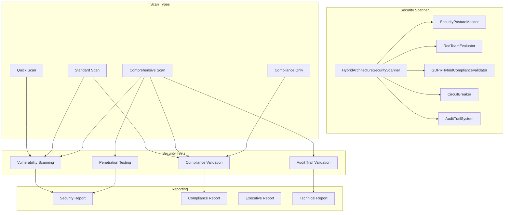

# Hybrid Architecture Security Scanning

## Overview

This document describes the automated security scanning system for the hybrid AI architecture, including both MCP routing and direct Bedrock access paths. The security scanner provides comprehensive vulnerability assessment, compliance validation, and penetration testing capabilities.

## Security Scanner Components

### 1. HybridArchitectureSecurityScanner

The main security scanner class that orchestrates all security testing activities:

- **Vulnerability Scanning**: Detects security vulnerabilities across all routing paths
- **Compliance Validation**: Ensures GDPR, EU data residency, and provider agreement compliance
- **Penetration Testing**: Automated security testing including injection attacks and bypass attempts
- **Audit Trail Validation**: Verifies integrity and tamper-proofing of audit logs
- **Circuit Breaker Security**: Validates security of failure handling mechanisms

### 2. Security Scan Types

#### Quick Scan (5-10 minutes)

- Basic vulnerability detection
- Essential compliance checks
- No penetration testing
- Summary reporting

#### Standard Scan (15-20 minutes)

- Comprehensive vulnerability scanning
- Full compliance validation
- Basic penetration testing
- Detailed reporting

#### Comprehensive Scan (30-45 minutes)

- Deep vulnerability analysis
- Advanced penetration testing
- Audit trail validation
- Executive reporting

## Security Testing Categories

### Authentication Security

- Weak authentication mechanism detection
- Authentication bypass vulnerability testing
- Session management security validation
- Multi-factor authentication verification

### Authorization Security

- Privilege escalation vulnerability detection
- Access control bypass testing
- Role manipulation security validation
- Permission boundary verification

### Data Protection Security

- Data encryption validation
- Data leakage vulnerability detection
- PII protection effectiveness testing
- GDPR compliance verification

### Network Security

- Network exposure vulnerability scanning
- TLS/SSL configuration validation
- Firewall rule verification
- Intrusion detection testing

### Hybrid Routing Security

- Route switching security validation
- Fallback mechanism security testing
- State synchronization security verification
- Cross-path vulnerability detection

## Compliance Validation

### GDPR Compliance

- Data processing compliance verification
- Consent management validation
- Data subject rights implementation
- Cross-border data transfer validation

### EU Data Residency

- Data location verification
- Cross-border transfer detection
- Regional compliance validation
- Data sovereignty verification

### Provider Agreement Compliance

- AWS Bedrock agreement compliance
- MCP provider compliance
- Third-party service compliance
- Contract violation detection

## Penetration Testing

### Injection Vulnerabilities

- SQL injection testing
- Prompt injection detection
- Command injection vulnerability scanning
- XSS vulnerability testing

### Authentication Bypass

- Token manipulation testing
- Session hijacking attempts
- Credential stuffing detection
- Authentication strength validation

### Authorization Bypass

- Privilege escalation testing
- Role manipulation attempts
- Access control bypass detection
- Permission boundary testing

## Usage

### Command Line Interface

```bash
# Quick security scan
npm run security:scan --scan-type quick

# Standard security scan with output
npm run security:scan --scan-type standard --output security-report.json

# Comprehensive scan with penetration testing
npm run security:scan --scan-type comprehensive --penetration-testing

# Compliance-only scan
npm run security:scan --compliance-only --output compliance-report.json

# Verbose output
npm run security:scan --verbose
```

### Programmatic Usage

```typescript
import { HybridArchitectureSecurityScanner } from "./src/lib/ai-orchestrator/security/hybrid-architecture-security-scanner";

const config = {
  scanDepth: "comprehensive",
  enablePenetrationTesting: true,
  enableComplianceValidation: true,
  enableVulnerabilityScanning: true,
  enableAuditTrailValidation: true,
  scanTimeout: 1800000, // 30 minutes
  reportFormat: "detailed",
  excludePatterns: ["**/node_modules/**"],
  includePatterns: ["**/*.ts", "**/*.js"],
  securityThresholds: {
    critical: 0,
    high: 2,
    medium: 10,
    low: 50,
  },
};

const scanner = new HybridArchitectureSecurityScanner(config);
const result = await scanner.performComprehensiveScan();

console.log(`Security Score: ${result.overallSecurityScore}/100`);
console.log(
  `Vulnerabilities: ${result.scanResults.mcpRouting.vulnerabilities.length}`
);
```

## Automated Security Scanning

### GitHub Actions Integration

The security scanner is integrated with GitHub Actions for automated scanning:

- **Pull Request Scans**: Quick security scan on every PR
- **Push Scans**: Standard security scan on main/develop branches
- **Daily Scans**: Comprehensive security scan with compliance validation
- **Manual Scans**: On-demand security scanning with configurable options

### Scan Triggers

1. **Code Changes**: Automatic scanning on code commits
2. **Scheduled Scans**: Daily comprehensive security validation
3. **Manual Triggers**: On-demand security assessment
4. **Release Gates**: Security validation before deployments

## Security Thresholds

### Vulnerability Severity Levels

- **Critical**: Immediate security risk requiring urgent attention
- **High**: Significant security risk requiring prompt resolution
- **Medium**: Moderate security risk requiring planned resolution
- **Low**: Minor security risk for future consideration

### Compliance Requirements

- **GDPR Compliance**: Must be 100% compliant
- **EU Data Residency**: All data must remain in EU regions
- **Provider Agreements**: All provider terms must be met
- **Audit Trail Integrity**: Must maintain 98%+ integrity

## Security Reporting

### Report Formats

1. **Summary Report**: High-level security status and key metrics
2. **Detailed Report**: Comprehensive findings with technical details
3. **Executive Report**: Business-focused security assessment
4. **Compliance Report**: Regulatory compliance status

### Report Contents

- **Executive Summary**: Overall security posture assessment
- **Vulnerability Analysis**: Detailed vulnerability findings
- **Compliance Status**: Regulatory compliance validation
- **Risk Assessment**: Security risk evaluation
- **Recommendations**: Actionable security improvements
- **Trend Analysis**: Security posture over time

## Security Metrics

### Key Performance Indicators

- **Overall Security Score**: 0-100 scale security assessment
- **Vulnerability Count**: Number of vulnerabilities by severity
- **Compliance Rate**: Percentage of compliance requirements met
- **Scan Coverage**: Percentage of codebase scanned
- **Resolution Time**: Average time to resolve vulnerabilities

### Monitoring and Alerting

- **Real-time Monitoring**: Continuous security posture monitoring
- **Automated Alerts**: Immediate notification of critical issues
- **Trend Analysis**: Security posture trends over time
- **Dashboard Integration**: Security metrics in operational dashboards

## Best Practices

### Security Scanning

1. **Regular Scanning**: Run security scans on every code change
2. **Comprehensive Testing**: Use comprehensive scans for releases
3. **Compliance Validation**: Validate compliance requirements regularly
4. **Penetration Testing**: Include penetration testing in security assessments

### Vulnerability Management

1. **Immediate Response**: Address critical vulnerabilities immediately
2. **Risk-Based Prioritization**: Prioritize vulnerabilities by risk level
3. **Continuous Monitoring**: Monitor for new vulnerabilities continuously
4. **Documentation**: Document all security findings and resolutions

### Compliance Management

1. **Regular Validation**: Validate compliance requirements regularly
2. **Audit Preparation**: Maintain audit-ready compliance documentation
3. **Continuous Improvement**: Continuously improve compliance posture
4. **Training**: Ensure team understands compliance requirements

## Troubleshooting

### Common Issues

1. **Scan Timeouts**: Increase scan timeout for comprehensive scans
2. **False Positives**: Configure exclusion patterns for known safe code
3. **Performance Impact**: Use quick scans for frequent testing
4. **Compliance Failures**: Review compliance requirements and implementation

### Error Resolution

1. **Configuration Errors**: Validate scan configuration parameters
2. **Network Issues**: Ensure network connectivity for external validations
3. **Permission Errors**: Verify required permissions for security scanning
4. **Resource Constraints**: Ensure adequate system resources for scanning

## Security Scanner Architecture



## Integration Points

### Existing Security Systems

- **Security Posture Monitor**: Real-time security monitoring
- **Red Team Evaluator**: Automated penetration testing
- **GDPR Compliance Validator**: Regulatory compliance validation
- **Circuit Breaker**: Failure handling security validation
- **Audit Trail System**: Security event logging and validation

### External Security Tools

- **ESLint Security Plugin**: Static code security analysis
- **npm audit**: Dependency vulnerability scanning
- **GitHub Security Advisories**: Known vulnerability database
- **OWASP ZAP**: Web application security testing

## Future Enhancements

### Planned Features

1. **AI-Powered Threat Detection**: Machine learning-based threat detection
2. **Behavioral Analysis**: User behavior anomaly detection
3. **Real-time Monitoring**: Continuous security monitoring
4. **Automated Remediation**: Automatic vulnerability fixing
5. **Advanced Reporting**: Enhanced security reporting capabilities

### Integration Roadmap

1. **SIEM Integration**: Security Information and Event Management
2. **Threat Intelligence**: External threat intelligence feeds
3. **Incident Response**: Automated incident response workflows
4. **Compliance Automation**: Automated compliance validation and reporting

## Conclusion

The hybrid architecture security scanning system provides comprehensive security validation for the AI routing infrastructure. By combining automated vulnerability scanning, compliance validation, and penetration testing, it ensures the security and compliance of both MCP and direct Bedrock routing paths.

Regular security scanning, combined with proper vulnerability management and compliance validation, maintains a strong security posture for the hybrid AI architecture.
