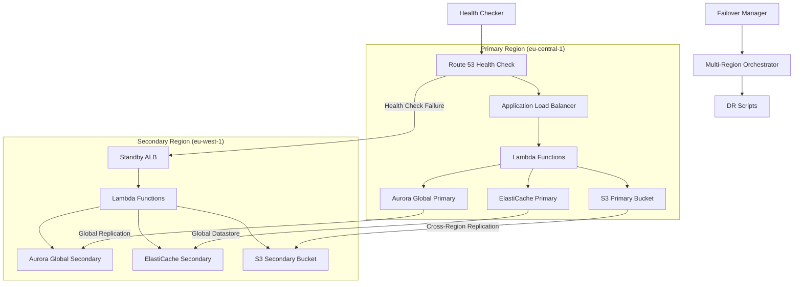

# Multi-Region Infrastructure Documentation

**Version**: 1.0  
**Date**: 2025-09-22  
**Status**: Production Ready  

## 🌍 Overview

The Multi-Region Infrastructure provides enterprise-grade disaster recovery capabilities with automated failover/failback, comprehensive health monitoring, and robust cross-region data replication. The system supports RTO ≤ 15 minutes and RPO ≤ 1 minute with 99.9% availability targets.

## 🏗️ Architecture

### Regional Setup
- **Primary Region**: eu-central-1 (Frankfurt)
- **Secondary Region**: eu-west-1 (Ireland)
- **Data Residency**: EU-compliant (GDPR)
- **Failover Strategy**: Active-Passive with automated promotion

### Core Components



## 🔧 Implementation Details

### 1. Health Monitoring System

#### Health Checker (`src/lib/multi-region/health-checker.ts`)

**Purpose**: Comprehensive service health monitoring across both regions

**Key Features**:
- Multi-service health checks (API, Database, Cache, Storage, Secrets)
- Robust RDS replication lag detection with three-metric strategy
- Response time tracking and performance monitoring
- Health summary generation with success rate calculation

**Health Check Types**:
```typescript
interface HealthService {
  service: 'api' | 'database' | 'cache' | 'storage' | 'secrets';
  region: 'primary' | 'secondary';
  status: 'healthy' | 'degraded' | 'unhealthy';
  responseTime: number;
  details?: Record<string, any>;
}
```

**RDS Replication Lag Detection**:
- **AuroraGlobalDBRPLag**: Global database replication lag
- **AuroraReplicaLagMaximum**: Cluster-level replica lag
- **ReplicaLag**: Instance-level fallback metric
- **Conversion**: Seconds to milliseconds for consistent reporting

### 2. Failover Management

#### Failover Manager (`src/lib/multi-region/failover-manager.ts`)

**Purpose**: Orchestrates automated and manual failover/failback operations

**Failover Types**:
- **Automatic**: Triggered by health check failures
- **Manual**: On-demand failover for maintenance or testing
- **Failback**: Return to primary region after recovery

**Key Features**:
- Concurrent failover prevention with locking mechanism
- Comprehensive notification system (email, webhook, Slack)
- Failover history tracking with RTO/RPO measurement
- Policy-based failover with configurable thresholds

**Notification Channels**:
```typescript
interface NotificationConfig {
  email: string[];
  webhooks: string[];
  slack?: {
    webhook: string;
    channel: string;
  };
}
```

### 3. Multi-Region Orchestration

#### Multi-Region Orchestrator (`src/lib/multi-region/multi-region-orchestrator.ts`)

**Purpose**: End-to-end failover execution with comprehensive validation

**Failover Steps**:
1. **Pre-flight Checks**: Validate secondary region health
2. **Database Promotion**: Promote Aurora Global secondary to primary
3. **DNS Update**: Switch Route 53 failover records
4. **CloudFront Update**: Update origin configuration
5. **Parameter Update**: Sync configuration parameters
6. **Health Validation**: Verify post-failover system health
7. **Rollback Plan**: Generate recovery procedures

**RTO/RPO Measurement**:
- **RTO (Recovery Time Objective)**: Time from failure detection to service restoration
- **RPO (Recovery Point Objective)**: Maximum acceptable data loss
- **Compliance Monitoring**: Alert when targets are exceeded

### 4. Infrastructure as Code

#### CDK Stacks

**Multi-Region Stack** (`infra/cdk/multi-region-stack.ts`):
- Main orchestration stack
- Cross-region resource coordination
- Environment-specific configuration

**Route 53 Failover** (`infra/cdk/route53-failover.ts`):
- DNS failover configuration
- Health check setup
- TTL optimization for fast failover

**Aurora Global Database** (`infra/cdk/rds-global.ts`):
- Global database cluster setup
- Cross-region replication configuration
- Backup and recovery policies

**S3 Cross-Region Replication** (`infra/cdk/s3-crr.ts`):
- Bucket replication rules
- KMS multi-region key integration
- Lifecycle policies

**Secrets Management** (`infra/cdk/secrets-mr.ts`):
- Multi-region secrets replication
- KMS encryption with MRK
- Access policies and rotation

## 🚀 Disaster Recovery Scripts

### DR Failover (`scripts/dr-failover.ts`)

**Purpose**: Automated disaster recovery failover execution

**Process**:
1. Validate secondary region readiness
2. Execute database promotion
3. Update DNS and CDN configuration
4. Validate service health
5. Generate rollback plan
6. Send notifications

**Usage**:
```bash
# Automatic failover (triggered by health checks)
npm run dr:failover

# Manual failover with reason
npm run dr:failover -- --reason "Planned maintenance"

# Dry run (validation only)
npm run dr:failover -- --dry-run
```

### DR Failback (`scripts/dr-failback.ts`)

**Purpose**: Return to primary region after recovery

**Process**:
1. Validate primary region health
2. Re-establish replication
3. Synchronize data
4. Switch traffic back
5. Validate operation
6. Update monitoring

**Usage**:
```bash
# Automatic failback
npm run dr:failback

# Manual failback with validation
npm run dr:failback -- --validate-sync
```

### DR Testing (`scripts/dr-test.ts`)

**Purpose**: Non-disruptive disaster recovery testing

**Test Types**:
- **Health Check Simulation**: Validate monitoring and alerting
- **Failover Simulation**: Test failover procedures without traffic switch
- **Data Consistency**: Verify replication integrity
- **Performance Validation**: Measure RTO/RPO compliance

**Usage**:
```bash
# Full DR test suite
npm run dr:test

# Specific test type
npm run dr:test -- --type failover-simulation

# Generate test report
npm run dr:test -- --report
```

## 📊 Monitoring & Observability

### CloudWatch Metrics

**Health Metrics**:
- `MultiRegion/HealthCheck/Success` - Health check success rate
- `MultiRegion/ReplicationLag/Milliseconds` - Database replication lag
- `MultiRegion/ResponseTime/Milliseconds` - Service response times
- `MultiRegion/Failover/Count` - Failover event count

**Performance Metrics**:
- `MultiRegion/RTO/Minutes` - Recovery time objective measurement
- `MultiRegion/RPO/Minutes` - Recovery point objective measurement
- `MultiRegion/Availability/Percentage` - Service availability

### Dashboards

**Multi-Region Overview**:
- Service health status across regions
- Replication lag trends
- Failover history and frequency
- Cost breakdown by region

**Disaster Recovery Dashboard**:
- RTO/RPO compliance tracking
- Failover success rate
- Recovery time trends
- Alert status and escalation

### Alerting

**Critical Alerts**:
- Health check failures (immediate)
- High replication lag (>5 minutes)
- Failover events (immediate)
- RTO/RPO target violations

**Warning Alerts**:
- Degraded service performance
- Budget threshold exceeded
- Configuration drift detected
- Backup failures

## 🛡️ Security & Compliance

### Encryption

**Data at Rest**:
- KMS Multi-Region Keys (MRK) for cross-region encryption
- Aurora Global Database encryption
- S3 bucket encryption with customer-managed keys
- Secrets Manager encryption

**Data in Transit**:
- TLS 1.3 for all API communications
- VPC peering with encryption
- Aurora Global Database encrypted replication
- S3 cross-region replication with encryption

### Access Control

**IAM Policies**:
- Region-specific service roles
- Cross-region replication permissions
- Disaster recovery execution roles
- Monitoring and alerting permissions

**Network Security**:
- VPC security groups for both regions
- Network ACLs for additional protection
- Private subnets for database and cache
- NAT gateways for outbound connectivity

### Compliance

**GDPR Compliance**:
- EU data residency (eu-central-1, eu-west-1)
- Data processing agreements
- Right to be forgotten implementation
- Audit logging for data access

**Audit Trail**:
- CloudTrail multi-region logging
- API call tracking and analysis
- Configuration change monitoring
- Access pattern analysis

## 💰 Cost Management

### Budget Controls

**Regional Budgets**:
- Primary region: €100/month soft cap
- Secondary region: €50/month soft cap
- Total budget: €200/month with alerts

**Cost Allocation**:
- Resource tagging by region and environment
- Service-specific cost tracking
- Inter-region transfer cost monitoring
- Reserved instance optimization

### Cost Optimization

**Strategies**:
- Aurora Serverless v2 for variable workloads
- S3 Intelligent Tiering for storage optimization
- CloudFront edge caching to reduce origin requests
- Lambda provisioned concurrency optimization

**Monitoring**:
- Daily cost reports by service and region
- Anomaly detection for unexpected costs
- Budget alerts at 50%, 80%, and 100%
- Monthly cost optimization recommendations

## 🧪 Testing Strategy

### Test Categories

**Unit Tests** (61 total):
- Health Checker: 20 tests
- Failover Manager: 22 tests
- Multi-Region Orchestrator: 16 tests
- DR Scripts: 13 tests

**Integration Tests**:
- Cross-region communication
- Database replication validation
- DNS failover functionality
- Notification system reliability

**End-to-End Tests**:
- Complete failover scenarios
- Failback procedures
- Performance under load
- Security validation

### Test Execution

**Continuous Testing**:
```bash
# Run all multi-region tests
npm run test:mr

# Run specific test suite
npm run test:mr:health-checker
npm run test:mr:failover-manager
npm run test:mr:orchestrator

# Run with coverage
npm run test:mr:coverage
```

**Load Testing**:
```bash
# Simulate failover under load
npm run test:mr:load-failover

# Test cross-region performance
npm run test:mr:performance

# Validate RTO/RPO under stress
npm run test:mr:stress-rto-rpo
```

## 🔄 Operational Procedures

### Daily Operations

**Health Monitoring**:
1. Review health check status across regions
2. Monitor replication lag trends
3. Check budget and cost alerts
4. Validate backup completion

**Performance Monitoring**:
1. Review response time metrics
2. Check error rates and availability
3. Monitor resource utilization
4. Validate auto-scaling behavior

### Weekly Operations

**DR Testing**:
1. Execute non-disruptive DR tests
2. Validate failover procedures
3. Review and update runbooks
4. Test notification systems

**Cost Review**:
1. Analyze weekly cost trends
2. Review resource utilization
3. Optimize reserved instances
4. Update budget forecasts

### Monthly Operations

**Comprehensive Review**:
1. Full disaster recovery drill
2. Security audit and compliance check
3. Performance optimization review
4. Documentation updates

**Capacity Planning**:
1. Review growth trends
2. Plan resource scaling
3. Update RTO/RPO targets
4. Optimize cost allocation

## 📋 Troubleshooting Guide

### Common Issues

**High Replication Lag**:
```bash
# Check Aurora Global Database status
aws rds describe-global-clusters --region eu-central-1

# Monitor replication metrics
aws cloudwatch get-metric-statistics \
  --namespace AWS/RDS \
  --metric-name AuroraGlobalDBRPLag \
  --start-time 2025-09-22T00:00:00Z \
  --end-time 2025-09-22T23:59:59Z \
  --period 300 \
  --statistics Average
```

**Failover Issues**:
```bash
# Check failover manager status
npm run dr:status

# Review failover logs
aws logs filter-log-events \
  --log-group-name /aws/lambda/failover-manager \
  --start-time 1695340800000

# Validate health checks
npm run health:check --region eu-west-1
```

**DNS Resolution Problems**:
```bash
# Check Route 53 health checks
aws route53 get-health-check --health-check-id <health-check-id>

# Test DNS resolution
dig api.matbakh.app
nslookup api.matbakh.app 8.8.8.8
```

### Recovery Procedures

**Split-Brain Prevention**:
1. Verify only one region is accepting writes
2. Check database promotion status
3. Validate application configuration
4. Monitor for conflicting transactions

**Data Consistency Issues**:
1. Compare data checksums between regions
2. Identify and resolve conflicts
3. Re-establish replication if needed
4. Validate application state

**Performance Degradation**:
1. Check resource utilization in both regions
2. Validate auto-scaling policies
3. Review CloudFront cache hit rates
4. Optimize database queries if needed

## 🔮 Future Enhancements

### Phase 2 Capabilities

**Active-Active Setup**:
- Bi-directional database replication
- Global load balancing with latency routing
- Conflict resolution strategies
- Multi-master write coordination

**Advanced Monitoring**:
- AI-powered anomaly detection
- Predictive failover triggers
- Advanced performance analytics
- Custom business metrics

**Enhanced Automation**:
- Self-healing infrastructure
- Automated capacity planning
- Intelligent cost optimization
- Advanced security automation

### Integration Opportunities

**Task 10 Integration**:
- Multi-region auto-scaling coordination
- Cross-region resource optimization
- Global performance monitoring
- Unified cost management

**Task 1 Integration**:
- Enhanced performance monitoring across regions
- Global Core Web Vitals tracking
- Cross-region performance comparison
- Unified alerting and dashboards

## 📚 References

### Documentation
- [AWS Multi-Region Architecture Best Practices](https://docs.aws.amazon.com/whitepapers/latest/disaster-recovery-workloads-on-aws/disaster-recovery-options-in-the-cloud.html)
- [Aurora Global Database Documentation](https://docs.aws.amazon.com/AmazonRDS/latest/AuroraUserGuide/aurora-global-database.html)
- [Route 53 Health Checks and Failover](https://docs.aws.amazon.com/Route53/latest/DeveloperGuide/dns-failover.html)

### Internal Documentation
- [Task 11 Completion Report](./task-11-multi-region-infrastructure-final-completion-report.md)
- [System Architecture Cleanup Documentation](./system-architecture-cleanup-documentation-completion.md)
- [Enhanced Rollback System Documentation](./enhanced-rollback-system-documentation.md)

---

**Document Version**: 1.0  
**Last Updated**: 2025-09-22  
**Next Review**: 2025-10-22  
**Maintained By**: System Architecture Team  