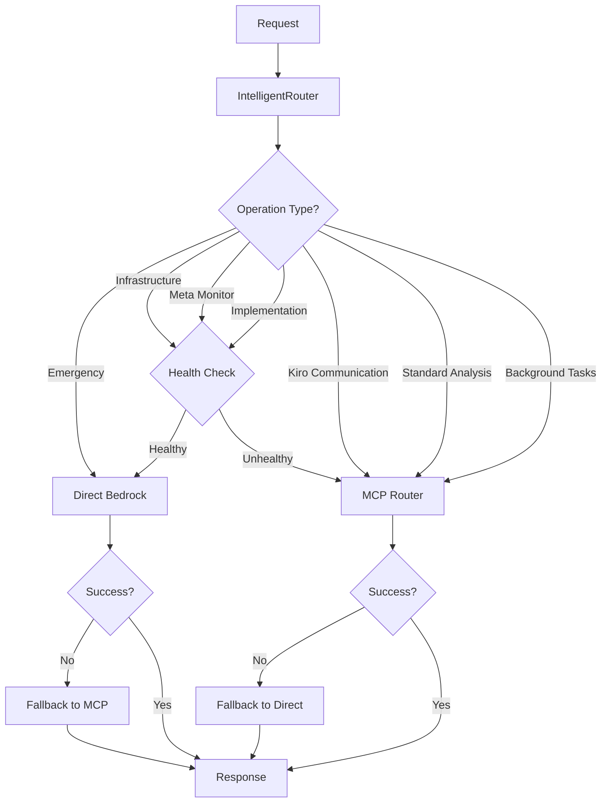

# Hybrid Routing - Comprehensive Operations Runbook

**Version**: 1.0.0  
**Created**: 2025-01-14  
**Status**: Production-Ready  
**Owner**: DevOps & AI Operations Team  
**Scope**: Complete operational procedures for Bedrock Activation Hybrid Routing

## Table of Contents

1. [Overview](#overview)
2. [System Architecture](#system-architecture)
3. [Daily Operations](#daily-operations)
4. [Monitoring & Alerting](#monitoring--alerting)
5. [Incident Response](#incident-response)
6. [Maintenance Procedures](#maintenance-procedures)
7. [Performance Management](#performance-management)
8. [Security Operations](#security-operations)
9. [Compliance Management](#compliance-management)
10. [Troubleshooting](#troubleshooting)
11. [Emergency Procedures](#emergency-procedures)
12. [Escalation Matrix](#escalation-matrix)

## Overview

This comprehensive runbook provides complete operational procedures for managing the Bedrock Activation Hybrid Routing system in production. The system enables AWS Bedrock as a secondary AI operator with intelligent routing between direct Bedrock access and MCP integration.

### System Components

| Component                 | Purpose                                     | Health Endpoint              | Logs Location                 |
| ------------------------- | ------------------------------------------- | ---------------------------- | ----------------------------- |
| **BedrockSupportManager** | Central orchestrator for support operations | `/health/bedrock-support`    | `/aws/ecs/bedrock-support`    |
| **IntelligentRouter**     | Routing decision engine                     | `/health/intelligent-router` | `/aws/ecs/intelligent-router` |
| **DirectBedrockClient**   | Direct AWS Bedrock access                   | `/health/direct-bedrock`     | `/aws/ecs/direct-bedrock`     |
| **MCPRouter**             | Enhanced MCP integration                    | `/health/mcp-router`         | `/aws/ecs/mcp-router`         |
| **HybridHealthMonitor**   | Real-time health monitoring                 | `/health/hybrid-monitor`     | `/aws/ecs/hybrid-monitor`     |

### Key Performance Indicators

| Metric             | Target  | Warning  | Critical  | Action                  |
| ------------------ | ------- | -------- | --------- | ----------------------- |
| System Health      | Healthy | Degraded | Unhealthy | Immediate investigation |
| Routing Efficiency | >80%    | <80%     | <70%      | Optimize routing config |
| Emergency Latency  | <5s     | >5s      | >10s      | Enable MCP fallback     |
| Critical Latency   | <10s    | >10s     | >15s      | Check Bedrock health    |
| MCP Latency        | <30s    | >30s     | >60s      | Restart MCP router      |
| Error Rate         | <1%     | >1%      | >5%       | Check logs, restart     |
| Cache Hit Rate     | >80%    | <80%     | <70%      | Optimize cache config   |

## System Architecture

### Routing Decision Flow



### Component Dependencies

- **BedrockSupportManager** depends on: IntelligentRouter, DirectBedrockClient, MCPRouter
- **IntelligentRouter** depends on: HybridHealthMonitor, Feature Flags
- **DirectBedrockClient** depends on: AWS Bedrock, KMS, Circuit Breaker
- **MCPRouter** depends on: MCP Service, Message Queue, Circuit Breaker
- **HybridHealthMonitor** depends on: All components, CloudWatch

## Daily Operations

### Morning Health Check (08:00 UTC)

**Duration**: 15 minutes  
**Frequency**: Daily  
**Owner**: On-call engineer

#### Step 1: System Health Verification (5 minutes)

```bash
# Check overall system health
curl -s https://api.matbakh.app/health/detailed | jq '.'

# Expected output: All components "healthy"
# If any component is not healthy, escalate immediately
```

#### Step 2: Metrics Review (5 minutes)

```bash
# Check key metrics from last 24 hours
aws cloudwatch get-metric-statistics \
  --namespace "HybridRouting" \
  --metric-name "RoutingEfficiency" \
  --start-time $(date -u -d '24 hours ago' +%Y-%m-%dT%H:%M:%S) \
  --end-time $(date -u +%Y-%m-%dT%H:%M:%S) \
  --period 3600 \
  --statistics Average

# Check for any critical alerts
aws cloudwatch describe-alarms --state-value ALARM
```

#### Step 3: Performance Validation (5 minutes)

```bash
# Test emergency operation latency
time curl -X POST https://api.matbakh.app/test/emergency-operation

# Test critical operation latency
time curl -X POST https://api.matbakh.app/test/critical-operation

# Test MCP operation latency
time curl -X POST https://api.matbakh.app/test/mcp-operation
```

#### Step 4: Documentation

Record findings in operations log:

```bash
# Create daily health report
cat > daily-health-$(date +%Y%m%d).md << EOF
# Daily Health Check - $(date +%Y-%m-%d)

## System Status
- Overall Health: [HEALTHY/DEGRADED/UNHEALTHY]
- Routing Efficiency: [X]%
- Emergency Latency: [X]s
- Critical Latency: [X]s
- MCP Latency: [X]s

## Issues Found
- [List any issues or "None"]

## Actions Taken
- [List actions or "None required"]

## Next Steps
- [List follow-up actions or "Continue monitoring"]
EOF
```

### Weekly Operations Review (Sunday 10:00 UTC)

**Duration**: 1 hour  
**Frequency**: Weekly  
**Owner**: Operations team lead

#### Performance Analysis (20 minutes)

1. Review weekly performance trends
2. Analyze routing efficiency patterns
3. Identify optimization opportunities
4. Update performance baselines

#### Capacity Planning (20 minutes)

1. Review resource utilization trends
2. Forecast capacity needs
3. Plan scaling activities
4. Update capacity alerts

#### Documentation Update (20 minutes)

1. Update runbooks with new findings
2. Document configuration changes
3. Update troubleshooting procedures
4. Review and update contact information

## Monitoring & Alerting

### Alert Categories

#### P0 - Critical (Immediate Response)

**Response Time**: 0-5 minutes  
**Escalation**: Page on-call immediately

- System completely down
- All routing paths failing
- Security breach detected
- Data corruption detected

**Actions**:

1. Acknowledge alert within 2 minutes
2. Execute emergency procedures
3. Notify incident commander
4. Begin incident response process

#### P1 - High (15 minute response)

**Response Time**: 15 minutes  
**Escalation**: Notify on-call engineer

- Single component failure with fallback active
- Performance degradation affecting users
- High error rate (>5%)
- Routing efficiency <70%

**Actions**:

1. Investigate root cause
2. Implement temporary mitigation
3. Monitor system stability
4. Plan permanent fix

#### P2 - Medium (1 hour response)

**Response Time**: 1 hour  
**Escalation**: Create ticket, notify team

- Performance below target but within SLA
- Non-critical component degraded
- Routing efficiency 70-80%
- Cache hit rate <80%

**Actions**:

1. Analyze trends and patterns
2. Plan optimization activities
3. Schedule maintenance if needed
4. Update monitoring thresholds

### CloudWatch Dashboards

#### 1. Hybrid Routing Overview

**URL**: https://console.aws.amazon.com/cloudwatch/dashboards/Hybrid-Routing-Overview

**Widgets**:

- System health status
- Routing efficiency trends
- Latency percentiles (P50, P95, P99)
- Error rate trends
- Component health matrix

#### 2. Performance Monitoring

**URL**: https://console.aws.amazon.com/cloudwatch/dashboards/Hybrid-Routing-Performance

**Widgets**:

- Response time distribution
- Throughput metrics
- Cache hit rates
- Resource utilization
- Cost tracking

#### 3. Security Monitoring

**URL**: https://console.aws.amazon.com/cloudwatch/dashboards/Hybrid-Routing-Security

**Widgets**:

- PII detection events
- GDPR compliance metrics
- Security posture score
- Audit trail completeness
- Threat detection alerts

## Incident Response

### Incident Classification

| Severity | Impact             | Response Time     | Escalation             |
| -------- | ------------------ | ----------------- | ---------------------- |
| P0       | Complete outage    | Immediate         | CTO, VP Engineering    |
| P1       | Degraded service   | 15 minutes        | Engineering Manager    |
| P2       | Performance issues | 1 hour            | Team Lead              |
| P3       | Minor issues       | Next business day | Individual contributor |

### Incident Response Process

#### Phase 1: Detection & Acknowledgment (0-5 minutes)

1. **Alert Received**

   - Acknowledge alert in PagerDuty
   - Join incident bridge call
   - Assess initial impact

2. **Initial Assessment**

   ```bash
   # Quick health check
   curl https://api.matbakh.app/health/detailed

   # Check active alerts
   aws cloudwatch describe-alarms --state-value ALARM

   # Review recent logs
   aws logs tail /aws/ecs/hybrid-routing --since 10m
   ```

3. **Incident Declaration**
   - Create incident in PagerDuty
   - Notify #ops-critical Slack channel
   - Assign incident commander

#### Phase 2: Investigation & Mitigation (5-30 minutes)

1. **Root Cause Analysis**

   ```bash
   # Analyze error patterns
   aws logs filter-log-events \
     --log-group-name "/aws/ecs/hybrid-routing" \
     --filter-pattern "ERROR" \
     --start-time $(date -u -d '30 minutes ago' +%s)000

   # Check component health
   for component in bedrock-support intelligent-router direct-bedrock mcp-router hybrid-monitor; do
     echo "Checking $component:"
     curl -s https://api.matbakh.app/health/component/$component | jq
   done
   ```

2. **Implement Mitigation**

   ```bash
   # Enable emergency mode if needed
   curl -X POST https://api.matbakh.app/admin/emergency/enable

   # Force MCP fallback if Bedrock issues
   curl -X POST https://api.matbakh.app/admin/routing/force-mcp

   # Restart services if needed
   aws ecs update-service \
     --cluster hybrid-routing-cluster \
     --service hybrid-routing-service \
     --force-new-deployment
   ```

#### Phase 3: Resolution & Validation (30-60 minutes)

1. **Verify Fix**

   ```bash
   # Run smoke tests
   npm run test:smoke:production

   # Validate metrics
   curl https://api.matbakh.app/health/detailed

   # Monitor for 15 minutes
   watch -n 30 'curl -s https://api.matbakh.app/health | jq .status'
   ```

2. **Communication**
   - Update incident status
   - Notify stakeholders
   - Update status page

#### Phase 4: Post-Incident (24-48 hours)

1. **Post-Mortem**

   - Document timeline
   - Identify root cause
   - Create action items
   - Schedule follow-up

2. **Prevention**
   - Update monitoring
   - Improve alerting
   - Update runbooks
   - Implement fixes

## Maintenance Procedures

### Scheduled Maintenance

#### Weekly Maintenance (Sunday 02:00-04:00 UTC)

**Duration**: 2 hours  
**Impact**: Minimal (fallback routing active)

##### Pre-Maintenance Checklist

- [ ] Notify stakeholders 48 hours in advance
- [ ] Verify backup systems operational
- [ ] Create maintenance window in PagerDuty
- [ ] Enable maintenance mode banner
- [ ] Take system snapshot

##### Maintenance Tasks

1. **System Updates** (30 minutes)

   ```bash
   # Update dependencies
   npm audit fix

   # Rebuild and deploy
   npm run build:production
   npm run deploy:production
   ```

2. **Log Management** (20 minutes)

   ```bash
   # Archive old logs
   aws logs create-export-task \
     --log-group-name "/aws/ecs/hybrid-routing" \
     --from $(date -d '7 days ago' +%s)000 \
     --to $(date -d '1 day ago' +%s)000 \
     --destination hybrid-routing-logs-archive
   ```

3. **Performance Optimization** (30 minutes)

   - Review slow operations
   - Optimize cache configurations
   - Update routing thresholds
   - Clear stale cache entries

4. **Security Updates** (30 minutes)

   - Review security posture
   - Update security configurations
   - Rotate credentials if needed
   - Update compliance settings

5. **Health Verification** (10 minutes)

   ```bash
   # Comprehensive health check
   curl https://api.matbakh.app/health/detailed

   # Run smoke tests
   npm run test:smoke:production
   ```

##### Post-Maintenance Verification

```bash
# Verify all components healthy
curl https://api.matbakh.app/health/detailed | jq '.components | to_entries[] | select(.value.status != "healthy")'

# Monitor for 30 minutes
watch -n 60 'curl -s https://api.matbakh.app/health | jq .status'
```

### Emergency Maintenance

#### Immediate Response Procedures

1. **Assessment** (5 minutes)

   - Evaluate severity and impact
   - Determine if emergency maintenance needed
   - Get approval from incident commander

2. **Preparation** (10 minutes)

   ```bash
   # Enable maintenance mode
   curl -X POST https://api.matbakh.app/admin/maintenance/enable

   # Notify stakeholders
   # Create emergency change request
   ```

3. **Execution** (Variable)

   - Implement fix with minimal impact
   - Monitor system continuously
   - Validate each step

4. **Validation** (15 minutes)

   ```bash
   # Comprehensive testing
   npm run test:smoke:production
   npm run test:integration:production

   # Disable maintenance mode
   curl -X POST https://api.matbakh.app/admin/maintenance/disable
   ```

## Performance Management

### Performance Monitoring

#### Key Metrics

1. **Latency Metrics**

   - Emergency operations: Target <5s, SLA <10s
   - Critical operations: Target <10s, SLA <15s
   - Standard operations: Target <30s, SLA <60s

2. **Throughput Metrics**

   - Requests per second
   - Operations per minute
   - Concurrent operations

3. **Quality Metrics**
   - Routing efficiency: Target >80%
   - Cache hit rate: Target >80%
   - Error rate: Target <1%

#### Performance Optimization

1. **Daily Performance Review**

   ```bash
   # Check P95 latency trends
   aws cloudwatch get-metric-statistics \
     --namespace "HybridRouting/Performance" \
     --metric-name "P95Latency" \
     --start-time $(date -u -d '24 hours ago' +%Y-%m-%dT%H:%M:%S) \
     --end-time $(date -u +%Y-%m-%dT%H:%M:%S) \
     --period 3600 \
     --statistics Average
   ```

2. **Weekly Optimization**

   - Analyze performance trends
   - Identify bottlenecks
   - Optimize configurations
   - Update performance baselines

3. **Monthly Capacity Planning**
   - Review resource utilization
   - Forecast capacity needs
   - Plan scaling activities
   - Update capacity alerts

### Cache Management

#### Cache Optimization

1. **Daily Cache Review**

   ```bash
   # Check cache hit rates
   curl https://api.matbakh.app/admin/cache/stats

   # Optimize cache configuration if hit rate <80%
   curl -X POST https://api.matbakh.app/admin/cache/optimize
   ```

2. **Cache Maintenance**

   ```bash
   # Clear stale entries
   curl -X POST https://api.matbakh.app/admin/cache/cleanup

   # Warm up frequently accessed data
   curl -X POST https://api.matbakh.app/admin/cache/warmup
   ```

## Security Operations

### Security Monitoring

#### Daily Security Checks

1. **PII Detection Review**

   ```bash
   # Check PII detection events
   aws logs filter-log-events \
     --log-group-name "/aws/ecs/hybrid-routing" \
     --filter-pattern "PII_DETECTED" \
     --start-time $(date -u -d '24 hours ago' +%s)000
   ```

2. **Security Posture Assessment**

   ```bash
   # Get security posture score
   curl https://api.matbakh.app/admin/security/posture

   # Review security alerts
   curl https://api.matbakh.app/admin/security/alerts
   ```

3. **Audit Trail Verification**

   ```bash
   # Verify audit trail completeness
   curl https://api.matbakh.app/admin/audit/verify

   # Check for any audit gaps
   curl https://api.matbakh.app/admin/audit/gaps
   ```

#### Security Incident Response

1. **Security Alert Received**

   - Acknowledge alert immediately
   - Assess threat level
   - Implement containment measures

2. **Investigation**

   ```bash
   # Review security logs
   aws logs filter-log-events \
     --log-group-name "/aws/ecs/hybrid-routing" \
     --filter-pattern "SECURITY" \
     --start-time $(date -u -d '1 hour ago' +%s)000

   # Check for unauthorized access
   curl https://api.matbakh.app/admin/security/access-log
   ```

3. **Containment**

   ```bash
   # Enable security lockdown if needed
   curl -X POST https://api.matbakh.app/admin/security/lockdown

   # Block suspicious IPs
   curl -X POST https://api.matbakh.app/admin/security/block-ip \
     -d '{"ip": "suspicious.ip.address"}'
   ```

## Compliance Management

### GDPR Compliance

#### Daily Compliance Checks

1. **Data Processing Verification**

   ```bash
   # Check GDPR compliance status
   curl https://api.matbakh.app/admin/compliance/gdpr/status

   # Verify EU data residency
   curl https://api.matbakh.app/admin/compliance/gdpr/residency
   ```

2. **Consent Management**

   ```bash
   # Review consent status
   curl https://api.matbakh.app/admin/compliance/gdpr/consent

   # Check for consent violations
   curl https://api.matbakh.app/admin/compliance/gdpr/violations
   ```

#### Compliance Reporting

1. **Weekly Compliance Report**

   ```bash
   # Generate compliance report
   curl https://api.matbakh.app/admin/compliance/report/weekly

   # Export for audit
   curl https://api.matbakh.app/admin/compliance/export
   ```

2. **Audit Preparation**
   - Collect compliance evidence
   - Document data processing activities
   - Prepare audit responses
   - Update compliance documentation

## Troubleshooting

### Common Issues

#### Issue 1: High Latency on Direct Bedrock Path

**Symptoms**:

- Direct Bedrock operations >10s
- Automatic fallback to MCP active
- Performance alerts triggered

**Investigation**:

```bash
# Check Bedrock service health
aws bedrock-runtime invoke-model \
  --model-id anthropic.claude-3-sonnet-20240229-v1:0 \
  --body '{"anthropic_version":"bedrock-2023-05-31","max_tokens":10,"messages":[{"role":"user","content":"test"}]}' \
  --region eu-central-1 \
  output.json

# Check network latency
ping bedrock-runtime.eu-central-1.amazonaws.com

# Review recent Bedrock logs
aws logs filter-log-events \
  --log-group-name "/aws/ecs/direct-bedrock" \
  --filter-pattern "LATENCY" \
  --start-time $(date -u -d '30 minutes ago' +%s)000
```

**Resolution**:

1. If AWS Bedrock issue: Enable MCP fallback, monitor AWS status
2. If network issue: Check VPC configuration, contact AWS support
3. If application issue: Restart direct Bedrock client, review configuration

#### Issue 2: Poor Routing Efficiency

**Symptoms**:

- Routing efficiency <70%
- Suboptimal routing decisions
- Increased fallback usage

**Investigation**:

```bash
# Analyze routing decisions
aws logs filter-log-events \
  --log-group-name "/aws/ecs/intelligent-router" \
  --filter-pattern "ROUTING_DECISION" \
  --start-time $(date -u -d '1 hour ago' +%s)000

# Check component health accuracy
curl https://api.matbakh.app/health/detailed
```

**Resolution**:

```bash
# Update routing thresholds
curl -X POST https://api.matbakh.app/admin/routing/config \
  -H "Content-Type: application/json" \
  -d '{
    "directBedrockLatencyThreshold": 8000,
    "mcpLatencyThreshold": 25000,
    "fallbackAggressiveness": 0.7
  }'

# Restart intelligent router
aws ecs update-service \
  --cluster hybrid-routing-cluster \
  --service intelligent-router-service \
  --force-new-deployment
```

#### Issue 3: High Error Rate

**Symptoms**:

- Error rate >5%
- Multiple failed operations
- User complaints

**Investigation**:

```bash
# Analyze error patterns
aws logs filter-log-events \
  --log-group-name "/aws/ecs/hybrid-routing" \
  --filter-pattern "ERROR" \
  --start-time $(date -u -d '15 minutes ago' +%s)000 \
  | jq '.events[].message' \
  | sort | uniq -c | sort -rn
```

**Resolution**:

1. Timeout errors: Increase timeout values
2. Authentication errors: Check IAM roles and permissions
3. Throttling errors: Implement backoff and retry logic
4. Validation errors: Review input data and validation rules

## Emergency Procedures

### Emergency Response Team

| Role               | Primary            | Secondary           | Contact           |
| ------------------ | ------------------ | ------------------- | ----------------- |
| Incident Commander | On-call Engineer   | Engineering Manager | PagerDuty         |
| Technical Lead     | AI Operations Lead | Senior Engineer     | Slack #ops-ai     |
| Communications     | DevOps Lead        | Product Manager     | Slack #ops-devops |
| Executive          | VP Engineering     | CTO                 | Phone (P0 only)   |

### Emergency Procedures

#### Complete System Failure

1. **Immediate Actions** (0-5 minutes)

   ```bash
   # Verify outage
   curl -v https://api.matbakh.app/health

   # Check infrastructure
   aws ecs describe-services \
     --cluster hybrid-routing-cluster \
     --services hybrid-routing-service

   # Activate incident response
   # Create PagerDuty incident
   # Notify #ops-critical
   ```

2. **Recovery Actions** (5-15 minutes)

   ```bash
   # Restart all services
   aws ecs update-service \
     --cluster hybrid-routing-cluster \
     --service hybrid-routing-service \
     --force-new-deployment

   # Reset circuit breakers
   curl -X POST https://api.matbakh.app/admin/circuit-breaker/reset

   # Enable emergency mode
   curl -X POST https://api.matbakh.app/admin/emergency/enable
   ```

#### Security Breach

1. **Immediate Containment** (0-2 minutes)

   ```bash
   # Enable security lockdown
   curl -X POST https://api.matbakh.app/admin/security/lockdown

   # Disable external access
   curl -X POST https://api.matbakh.app/admin/security/disable-external
   ```

2. **Investigation** (2-30 minutes)

   - Analyze security logs
   - Identify breach scope
   - Document evidence
   - Notify security team

3. **Recovery** (30+ minutes)
   - Patch security vulnerabilities
   - Reset compromised credentials
   - Restore secure operations
   - Conduct security review

## Escalation Matrix

### Contact Information

#### Primary Contacts

| Role                | Name              | Phone     | Email               | Slack           |
| ------------------- | ----------------- | --------- | ------------------- | --------------- |
| On-Call Engineer    | [Current On-Call] | PagerDuty | oncall@matbakh.app  | @oncall         |
| AI Operations Lead  | [Name]            | [Phone]   | ai-ops@matbakh.app  | @ai-ops-lead    |
| DevOps Lead         | [Name]            | [Phone]   | devops@matbakh.app  | @devops-lead    |
| Engineering Manager | [Name]            | [Phone]   | eng-mgr@matbakh.app | @eng-manager    |
| VP Engineering      | [Name]            | [Phone]   | vp-eng@matbakh.app  | @vp-engineering |
| CTO                 | [Name]            | [Phone]   | cto@matbakh.app     | @cto            |

#### Escalation Triggers

| Severity | Trigger                          | Response Time     | Escalation             |
| -------- | -------------------------------- | ----------------- | ---------------------- |
| P0       | System down >5 minutes           | Immediate         | CTO, VP Engineering    |
| P1       | Performance degraded >30 minutes | 15 minutes        | Engineering Manager    |
| P2       | Issues not resolved in 2 hours   | 1 hour            | Team Lead              |
| P3       | Non-critical issues              | Next business day | Individual contributor |

### Communication Channels

#### Slack Channels

- **#ops-critical**: P0 incidents and critical alerts
- **#ops-ai**: AI operations and hybrid routing issues
- **#ops-devops**: Infrastructure and deployment issues
- **#engineering**: General engineering discussions
- **#incidents**: Incident coordination and updates

#### External Communications

- **PagerDuty**: https://matbakh.pagerduty.com
- **Status Page**: https://status.matbakh.app
- **AWS Support**: Enterprise support case system
- **Vendor Support**: Direct vendor contact for critical issues

---

## Appendix

### Useful Commands Reference

```bash
# Health Checks
curl https://api.matbakh.app/health
curl https://api.matbakh.app/health/detailed
curl https://api.matbakh.app/health/component/{component}

# Emergency Actions
curl -X POST https://api.matbakh.app/admin/emergency/enable
curl -X POST https://api.matbakh.app/admin/routing/force-mcp
curl -X POST https://api.matbakh.app/admin/circuit-breaker/reset

# Monitoring
aws logs tail /aws/ecs/hybrid-routing --follow --since 10m
aws cloudwatch describe-alarms --state-value ALARM
aws ecs describe-services --cluster hybrid-routing-cluster

# Deployment
npm run deploy:production
aws ecs update-service --cluster hybrid-routing-cluster --service hybrid-routing-service --force-new-deployment
```

### Links and Resources

- [CloudWatch Dashboard](https://console.aws.amazon.com/cloudwatch/dashboards/Hybrid-Routing-Overview)
- [PagerDuty](https://matbakh.pagerduty.com)
- [AWS Console](https://console.aws.amazon.com)
- [Slack Workspace](https://matbakh.slack.com)
- [Documentation Repository](https://github.com/matbakh/docs)

---

**Document Control**

- **Version**: 1.0.0
- **Created**: 2025-01-14
- **Last Updated**: 2025-01-14
- **Next Review**: 2025-02-14
- **Owner**: DevOps & AI Operations Team
- **Approved By**: [Engineering Manager], [DevOps Lead]
