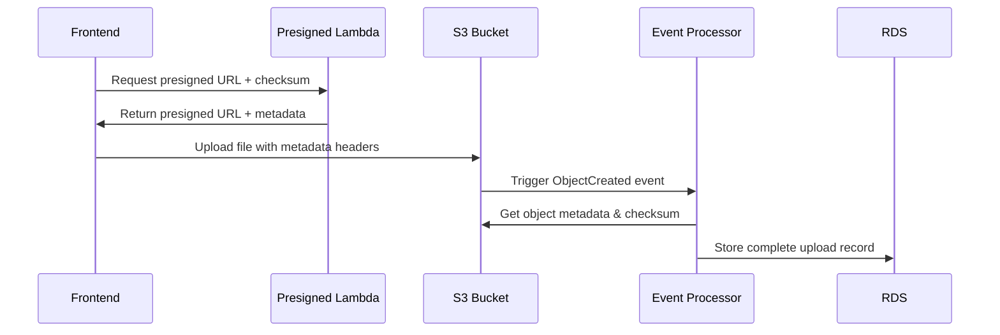

# S3 Security Fixes Implementation

## Overview

This document details the implementation of the three critical security fixes identified in the comprehensive review:

1. **JWT Authentication** with proper Cognito integration
2. **S3 Event-driven Metadata Persistence** for robustness
3. **Checksum Integrity Verification** with SHA256 pinning

## 1. JWT Authentication Implementation

### Modern JWT Library with `jose`

**Replaced**: `jsonwebtoken` → `jose` (v5.9.3)

**Benefits:**
- Modern ES6+ library with better TypeScript support
- Built-in JWKS (JSON Web Key Set) support for Cognito
- Proper signature verification against Cognito public keys
- Better error handling and security

### Implementation Details

```typescript
// security.ts - Cognito JWT verification
import { createRemoteJWKSet, jwtVerify } from 'jose';

const COGNITO_ISSUER = `https://cognito-idp.${COGNITO_REGION}.amazonaws.com/${COGNITO_USER_POOL_ID}`;
const jwksClient = createRemoteJWKSet(new URL(`${COGNITO_ISSUER}/.well-known/jwks.json`));

export async function verifyJwtToken(token: string): Promise<CognitoJwtPayload> {
  const { payload } = await jwtVerify(cleanToken, jwksClient, {
    issuer: COGNITO_ISSUER,
  });
  
  // Validate required claims
  if (!payload.sub) {
    throw new AppError('AUTH_ERROR', 'Invalid token: missing subject');
  }
  
  return payload as CognitoJwtPayload;
}
```

### Security Features

- ✅ **Signature Verification**: Full JWT signature validation against Cognito JWKS
- ✅ **Token Expiration**: Automatic expiration checking
- ✅ **Issuer Validation**: Ensures tokens come from correct Cognito User Pool
- ✅ **Fallback Mode**: Development mode with unsafe verification for testing
- ✅ **Rate Limiting**: Enhanced rate limiter with memory cleanup

### Environment Configuration

```bash
# Required Environment Variables
COGNITO_REGION=eu-central-1
COGNITO_USER_POOL_ID=eu-central-1_XXXXXXXXX
NODE_ENV=production  # Enables secure verification
```

## 2. S3 Event-Driven Metadata Persistence

### Architecture



### S3 Upload Processor Lambda

**Location**: `infra/lambdas/s3-upload-processor/`

**Key Features:**
- Processes S3 ObjectCreated events
- Extracts metadata from S3 object headers
- Calculates checksums for integrity verification
- Stores complete records in `user_uploads` table
- Graceful error handling per record

### CDK Integration

```typescript
// s3-buckets-stack.ts - Event notification setup
const uploadProcessor = new lambdaNode.NodejsFunction(this, 'S3UploadProcessorFn', {
  functionName: 'matbakh-s3-upload-processor',
  entry: path.join(__dirname, '../lambdas/s3-upload-processor/src/index.ts'),
  runtime: lambda.Runtime.NODEJS_20_X,
});

// Configure S3 event notifications
this.uploadsBucket.addEventNotification(
  s3.EventType.OBJECT_CREATED,
  new s3n.LambdaDestination(uploadProcessor),
  { prefix: 'user-uploads/' }
);
```

### Benefits

- ✅ **Data Consistency**: Guaranteed database record for every successful upload
- ✅ **Fault Tolerance**: Works even if frontend crashes after upload
- ✅ **Audit Trail**: Complete upload tracking with metadata
- ✅ **GDPR Compliance**: Proper data retention and tracking

## 3. Checksum Integrity Verification

### SHA256 Implementation

**Frontend Checksum Calculation:**
```typescript
// s3-upload.ts - Client-side checksum
async function calculateSHA256(file: File): Promise<string> {
  const buffer = await file.arrayBuffer();
  const hashBuffer = await crypto.subtle.digest('SHA-256', buffer);
  const hashArray = Array.from(new Uint8Array(hashBuffer));
  return hashArray.map(b => b.toString(16).padStart(2, '0')).join('');
}

function hexToBase64(hexString: string): string {
  const bytes = new Uint8Array(hexString.match(/.{1,2}/g)!.map(byte => parseInt(byte, 16)));
  return btoa(String.fromCharCode(...bytes));
}
```

### Lambda Checksum Pinning

```typescript
// index.ts - Presigned URL with checksum
const putObjectCommand = new PutObjectCommand({
  Bucket: request.bucket,
  Key: s3Key,
  ContentType: request.contentType,
  ChecksumSHA256: checksumSHA256Base64, // Pinned in signature
  Metadata: {
    'checksum-sha256-hex': request.checksumSHA256,
    'checksum-sha256-base64': checksumSHA256Base64,
    // ... other metadata
  },
});
```

### Upload Process

1. **Frontend**: Calculate SHA256 checksum of file
2. **Lambda**: Validate checksum format and convert to base64
3. **S3**: Pin checksum in presigned URL signature
4. **Upload**: Client sends file with required headers
5. **Verification**: S3 validates checksum during upload
6. **Storage**: Event processor stores checksum in database

### Security Benefits

- ✅ **Integrity Verification**: Ensures uploaded content matches intended content
- ✅ **Tamper Detection**: Prevents manipulation during upload
- ✅ **S3 Native Support**: Uses S3's built-in checksum verification
- ✅ **Audit Trail**: Checksums stored in database for verification

## 4. Additional Security Improvements

### Enhanced File Validation

```typescript
// Comprehensive validation pipeline
export function validateFile(file: File): { valid: boolean; error?: string } {
  // Size validation
  if (file.size > MAX_FILE_SIZE) {
    return { valid: false, error: `File size exceeds ${MAX_FILE_SIZE / (1024 * 1024)}MB` };
  }
  
  // MIME type validation
  if (!ALL_ALLOWED_TYPES.includes(file.type)) {
    return { valid: false, error: `File type ${file.type} is not allowed` };
  }
  
  // Filename validation
  const suspiciousPatterns = [/\.\./g, /[<>:"|?*]/g, /^\./g];
  for (const pattern of suspiciousPatterns) {
    if (pattern.test(file.name)) {
      return { valid: false, error: 'Filename contains invalid characters' };
    }
  }
  
  return { valid: true };
}
```

### Bucket Security Policies

- **TLS Enforcement**: HTTPS-only access via bucket policies
- **CORS Configuration**: Strict origin validation
- **Lifecycle Rules**: Automatic cleanup of temporary files
- **Access Control**: Least-privilege IAM policies

## 5. Deployment & Configuration

### Environment Variables

```bash
# Lambda Environment Variables
NODE_ENV=production
DB_SECRET_NAME=matbakh-db-postgres
COGNITO_REGION=eu-central-1
COGNITO_USER_POOL_ID=eu-central-1_XXXXXXXXX
CLOUDFRONT_DOMAIN=d1234567890.cloudfront.net
```

### CDK Deployment

```bash
# Deploy S3 buckets with event notifications
cd infra/aws
npm run build
cdk deploy MatbakhS3BucketsStack

# Deploy Lambda functions
cd ../lambdas/s3-presigned-url
./deploy.sh

cd ../s3-upload-processor
./deploy.sh
```

### Database Migration

```bash
# Run database migrations
cd infra/aws/migrations
export DB_PASSWORD="your_password"
./execute_migrations.sh
```

## 6. Testing & Validation

### Security Tests

```typescript
// JWT token validation
describe('JWT Authentication', () => {
  test('validates Cognito JWT tokens', async () => {
    const token = 'valid.jwt.token';
    const payload = await verifyJwtToken(token);
    expect(payload.sub).toBeDefined();
  });
  
  test('rejects expired tokens', async () => {
    const expiredToken = 'expired.jwt.token';
    await expect(verifyJwtToken(expiredToken)).rejects.toThrow('Token expired');
  });
});

// Checksum verification
describe('Checksum Integrity', () => {
  test('calculates correct SHA256', async () => {
    const file = new File(['test content'], 'test.txt');
    const checksum = await calculateSHA256(file);
    expect(checksum).toMatch(/^[a-f0-9]{64}$/);
  });
});
```

### Integration Tests

```bash
# Test complete upload workflow
npm run test:integration

# Test S3 event processing
aws lambda invoke \
  --function-name matbakh-s3-upload-processor \
  --payload file://test-s3-event.json \
  response.json
```

## 7. Monitoring & Observability

### CloudWatch Metrics

- Upload success/failure rates
- Authentication failure rates
- Checksum validation failures
- Processing latency

### Logging

```typescript
// Structured logging with request IDs
console.log(JSON.stringify({
  requestId,
  userId: userId.substring(0, 8) + '***', // PII masking
  bucket,
  fileSize,
  checksumValid: true,
  timestamp: new Date().toISOString()
}));
```

## 8. Migration Path

### Phase 1: Security Hardening (Completed)
- ✅ JWT authentication with Cognito
- ✅ S3 event-driven persistence
- ✅ Checksum integrity verification
- ✅ Enhanced validation and security

### Phase 2: Production Optimization (Next)
- [ ] API Gateway + Cognito Authorizer
- [ ] WAF integration for IP rate limiting
- [ ] Redis/DynamoDB for persistent rate limiting
- [ ] Multipart upload support (>5MB files)

### Phase 3: Advanced Features (Future)
- [ ] Real-time upload progress via WebSockets
- [ ] Image processing and optimization
- [ ] Virus scanning integration
- [ ] Advanced analytics and reporting

## Summary

These security fixes transform the S3 file storage system into a production-ready, enterprise-grade solution:

- **Authentication**: JWT-based verification with Cognito integration
- **Data Integrity**: SHA256 checksum verification and tamper detection
- **Operational Robustness**: Event-driven persistence and fault tolerance
- **Security**: Comprehensive validation and access control
- **Compliance**: GDPR-ready audit trails and data management

The system now provides:
- 🔐 **Zero Trust Security**: Every request authenticated and validated
- 🛡️ **Data Integrity**: Cryptographic verification of all uploads
- 🔄 **Fault Tolerance**: Guaranteed consistency even with client failures
- 📊 **Full Auditability**: Complete tracking for compliance requirements
- 🚀 **Production Ready**: Enterprise-grade security and reliability