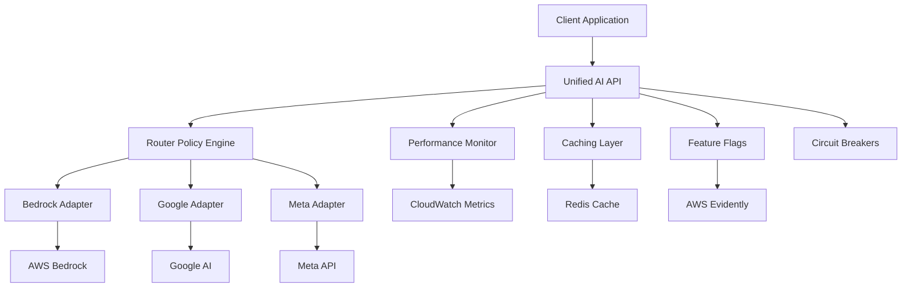

# Unified AI API - Enterprise-Grade Multi-Provider Integration

## Overview

The Unified AI API provides a single, intelligent interface for accessing multiple AI providers (Bedrock, Google, Meta) with automatic routing, fallback handling, caching, and comprehensive monitoring. This enterprise-grade solution ensures high availability, cost optimization, and seamless provider management.

## Architecture



## Key Features

### 🔄 Intelligent Provider Routing

- **Cost-Optimized**: Routes to the most cost-effective provider
- **Latency-Optimized**: Routes to the fastest provider
- **Round-Robin**: Distributes load evenly across providers
- **Capability-Based**: Routes based on required features (tools, vision, etc.)

### 🛡️ Resilience & Reliability

- **Circuit Breakers**: Automatic failure detection and recovery
- **Fallback Strategy**: Seamless provider switching on failures
- **Retry Logic**: Configurable retry with exponential backoff
- **Health Monitoring**: Real-time provider health tracking

### ⚡ Performance Optimization

- **Response Caching**: Intelligent caching with TTL management
- **Request Deduplication**: Prevents duplicate requests
- **Streaming Support**: Real-time response streaming (future)
- **Connection Pooling**: Efficient resource utilization

### 📊 Monitoring & Analytics

- **Real-time Metrics**: Request count, latency, success rates
- **Cost Tracking**: Per-request and aggregate cost analysis
- **Provider Analytics**: Performance comparison across providers
- **Custom Dashboards**: CloudWatch integration with alerts

### 🚩 Feature Management

- **A/B Testing**: Gradual rollout of new providers/models
- **Feature Flags**: Runtime configuration without deployment
- **Canary Releases**: Safe deployment of new features
- **Traffic Splitting**: Controlled traffic distribution

## Quick Start

### Installation

```bash
npm install
```

### Basic Usage

```typescript
import { createUnifiedAiApi } from "./lib/ai-orchestrator/unified-ai-api";

// Create API instance
const aiApi = createUnifiedAiApi({
  fallbackStrategy: "cost-optimized",
  enableCaching: true,
  enableMonitoring: true,
});

// Generate response
const response = await aiApi.generateResponse({
  prompt: "Explain quantum computing",
  context: {
    domain: "general",
    locale: "de-DE",
    budgetTier: "standard",
  },
});

console.log(response.text);
```

### React Hook Usage

```typescript
import { useUnifiedAi } from "./hooks/useUnifiedAi";

function MyComponent() {
  const { generateResponse, isLoading, response, error } = useUnifiedAi({
    enableAutoRetry: true,
    maxRetries: 3,
  });

  const handleSubmit = async () => {
    await generateResponse({
      prompt: "Generate a recipe for pasta",
      context: { domain: "culinary" },
    });
  };

  return (
    <div>
      <button onClick={handleSubmit} disabled={isLoading}>
        {isLoading ? "Generating..." : "Generate Recipe"}
      </button>
      {response && <div>{response.text}</div>}
      {error && <div>Error: {error.message}</div>}
    </div>
  );
}
```

## Configuration

### Environment Variables

```bash
# AWS Configuration
AWS_REGION=eu-central-1
AWS_ACCESS_KEY_ID=your-access-key
AWS_SECRET_ACCESS_KEY=your-secret-key

# Google AI Configuration
GOOGLE_AI_API_KEY=your-google-api-key

# Meta AI Configuration
META_API_ENDPOINT=https://api.meta.com/v1
META_API_KEY=your-meta-api-key

# Feature Flags
EVIDENTLY_PROJECT=matbakh-ai-unified-api

# Monitoring
CLOUDWATCH_NAMESPACE=MatbakhApp/AI/UnifiedAPI
```

### Configuration Options

```typescript
interface UnifiedAiApiConfig {
  providers: {
    bedrock: {
      region: string;
      models: string[];
    };
    google: {
      apiKey: string;
      models: string[];
    };
    meta: {
      endpoint?: string;
      apiKey?: string;
      models: string[];
    };
  };
  fallbackStrategy: "round-robin" | "cost-optimized" | "latency-optimized";
  enableCaching: boolean;
  enableMonitoring: boolean;
  enableFeatureFlags: boolean;
  maxRetries: number;
  timeoutMs: number;
}
```

## Provider Capabilities

### AWS Bedrock

- **Models**: Claude 3.5 Sonnet, Claude 3 Haiku, Llama 3.2
- **Features**: Tool calling, JSON mode, vision, streaming
- **Context**: Up to 200K tokens
- **Strengths**: High quality, reliable, comprehensive features

### Google AI

- **Models**: Gemini 1.5 Pro, Gemini 1.5 Flash
- **Features**: Tool calling, JSON mode, vision, large context
- **Context**: Up to 1M tokens
- **Strengths**: Large context window, multilingual

### Meta AI

- **Models**: Llama 3.2 90B, Llama 3.2 11B
- **Features**: Text generation, basic JSON
- **Context**: Up to 128K tokens
- **Strengths**: Cost-effective, open source

## API Reference

### UnifiedAiApi Class

#### Methods

##### `generateResponse(request: AiRequest): Promise<AiResponse>`

Generate AI response with intelligent provider selection.

**Parameters:**

- `request.prompt`: The input prompt
- `request.context`: Request context (domain, locale, budget, etc.)
- `request.tools`: Optional tool specifications
- `request.streaming`: Enable streaming response

**Returns:** Promise resolving to AiResponse with provider info, text, metrics

##### `testProvider(provider: Provider): Promise<boolean>`

Test connectivity to a specific provider.

##### `resetCircuitBreaker(provider: Provider): void`

Reset circuit breaker for a provider.

##### `setProviderEnabled(provider: Provider, enabled: boolean): Promise<void>`

Enable or disable a specific provider.

##### `getProviderHealth(): Promise<ProviderHealth[]>`

Get current health status of all providers.

##### `getMetrics(): UnifiedApiMetrics`

Get current API metrics and statistics.

### React Hooks

#### `useUnifiedAi(options?: UseUnifiedAiOptions)`

Main hook for AI operations with state management.

**Returns:**

- `generateResponse`: Function to generate AI responses
- `isLoading`: Loading state
- `response`: Latest response
- `error`: Error state
- `metrics`: Current metrics
- `providerHealth`: Provider health status

#### `useProviderManagement()`

Hook for provider-specific operations.

**Returns:**

- `getProviderModels`: Get available models for a provider
- `testAllProviders`: Test connectivity to all providers
- `resetAllCircuitBreakers`: Reset all circuit breakers

#### `useAiMetrics(refreshInterval?: number)`

Hook for real-time metrics monitoring.

**Returns:**

- `metrics`: Current API metrics
- `health`: Provider health status
- `isLoading`: Loading state
- `refreshMetrics`: Manual refresh function

## Deployment

### Development

```bash
# Install dependencies
npm install

# Run tests
npm test

# Start development server
npm run dev
```

### Production

```bash
# Deploy infrastructure and API
npx tsx scripts/deploy-unified-ai-api.ts deploy production

# Check deployment status
aws cloudformation describe-stacks --stack-name UnifiedAiApiStack

# Monitor metrics
aws cloudwatch get-metric-statistics --namespace MatbakhApp/AI/UnifiedAPI
```

### Rollback

```bash
# Rollback deployment
npx tsx scripts/deploy-unified-ai-api.ts rollback production
```

## Monitoring & Observability

### CloudWatch Metrics

- **RequestCount**: Total number of requests
- **SuccessRate**: Percentage of successful requests
- **AverageLatency**: Average response time
- **CostPerRequest**: Average cost per request
- **CacheHitRate**: Cache effectiveness
- **ProviderDistribution**: Request distribution across providers

### Dashboards

The deployment creates CloudWatch dashboards with:

- Request volume and success rates
- Latency percentiles (P50, P95, P99)
- Cost analysis and trends
- Provider health and distribution
- Circuit breaker states

### Alerts

Production deployments include alerts for:

- High error rate (>5%)
- High latency (>5 seconds)
- Provider failures
- Budget thresholds

## Security

### Authentication & Authorization

- AWS IAM roles for Bedrock access
- API key management for external providers
- Request signing and validation
- Rate limiting and abuse protection

### Data Protection

- Encryption in transit and at rest
- PII detection and redaction
- Audit logging for compliance
- GDPR-compliant data handling

### Network Security

- VPC endpoints for AWS services
- Private subnets for sensitive operations
- Security groups and NACLs
- WAF protection for public endpoints

## Cost Optimization

### Strategies

- **Provider Selection**: Automatic routing to cost-effective providers
- **Caching**: Reduce redundant API calls
- **Request Optimization**: Minimize token usage
- **Budget Controls**: Hard limits and soft warnings

### Cost Tracking

- Real-time cost monitoring
- Per-request cost attribution
- Provider cost comparison
- Budget alerts and controls

## Troubleshooting

### Common Issues

#### Provider Connection Failures

```bash
# Test provider connectivity
npx tsx -e "
import { getUnifiedAiApi } from './src/lib/ai-orchestrator/unified-ai-api';
const api = getUnifiedAiApi();
api.testProvider('bedrock').then(console.log);
"
```

#### High Latency

- Check provider health status
- Review circuit breaker states
- Analyze CloudWatch metrics
- Consider provider routing strategy

#### Cache Issues

- Verify Redis connectivity
- Check cache hit rates
- Review TTL settings
- Monitor cache memory usage

#### Circuit Breaker Tripping

```typescript
// Reset circuit breaker
const api = getUnifiedAiApi();
api.resetCircuitBreaker("bedrock");
```

### Debug Mode

Enable debug logging:

```bash
export DEBUG=unified-ai:*
npm start
```

### Health Checks

```bash
# Check API health
curl https://your-api-endpoint/health

# Check provider status
curl https://your-api-endpoint/providers/health
```

## Performance Tuning

### Optimization Tips

1. **Enable Caching**: Reduces API calls and improves response times
2. **Use Appropriate Models**: Balance quality vs. cost/latency
3. **Optimize Prompts**: Shorter prompts reduce costs and latency
4. **Configure Timeouts**: Set appropriate timeouts for your use case
5. **Monitor Metrics**: Use dashboards to identify bottlenecks

### Scaling Considerations

- **Horizontal Scaling**: Deploy multiple API instances
- **Load Balancing**: Distribute requests across instances
- **Database Scaling**: Scale cache and monitoring databases
- **Provider Limits**: Monitor and respect provider rate limits

## Migration Guide

### From Single Provider

1. Update imports to use UnifiedAiApi
2. Replace direct provider calls with generateResponse
3. Update error handling for new response format
4. Configure provider preferences
5. Test with fallback scenarios

### Configuration Migration

```typescript
// Before (single provider)
const bedrock = new BedrockAdapter();
const response = await bedrock.generateResponse(request);

// After (unified API)
const api = createUnifiedAiApi();
const response = await api.generateResponse(request);
```

## Contributing

### Development Setup

1. Clone repository
2. Install dependencies: `npm install`
3. Set up environment variables
4. Run tests: `npm test`
5. Start development server: `npm run dev`

### Testing

- Unit tests: `npm test`
- Integration tests: `npm run test:integration`
- E2E tests: `npm run test:e2e`
- Performance tests: `npm run test:performance`

### Code Style

- TypeScript strict mode
- ESLint configuration
- Prettier formatting
- Comprehensive JSDoc comments

## Roadmap

### Upcoming Features

- [ ] Streaming response support
- [ ] Custom model fine-tuning
- [ ] Advanced prompt templates
- [ ] Multi-modal input support
- [ ] Batch processing capabilities
- [ ] GraphQL API interface

### Performance Improvements

- [ ] Request batching
- [ ] Predictive caching
- [ ] Edge deployment
- [ ] WebAssembly optimizations

### Monitoring Enhancements

- [ ] Custom metrics
- [ ] Advanced alerting
- [ ] Performance profiling
- [ ] Cost optimization recommendations

## Support

### Documentation

- [API Reference](./api-reference.md)
- [Deployment Guide](./deployment-guide.md)
- [Troubleshooting](./troubleshooting.md)

### Community

- GitHub Issues: Report bugs and feature requests
- Discussions: Ask questions and share ideas
- Wiki: Community-maintained documentation

### Enterprise Support

- Priority support channels
- Custom deployment assistance
- Performance optimization consulting
- Training and onboarding

---

**Version**: 1.0.0  
**Last Updated**: 2025-01-14  
**License**: MIT
