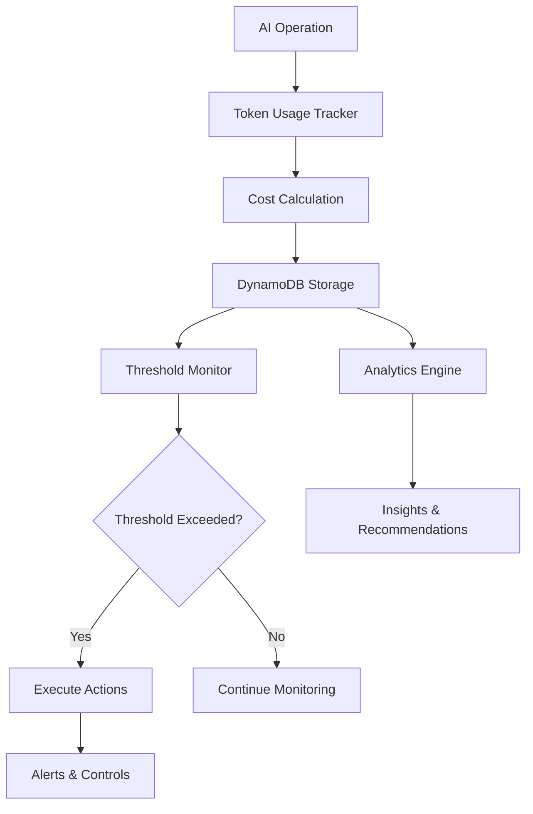

# Cost Management System - Complete Documentation

## 🎯 Overview

The Cost Management System is a comprehensive, enterprise-grade solution for monitoring, controlling, and optimizing AI costs in the Bedrock AI Core. It provides intelligent cost tracking, threshold monitoring, usage analytics, and automatic cost controls to prevent budget overruns while maintaining service quality.

## 🏗️ Architecture

### Core Components

1. **Token Usage Tracker** (`token-usage-tracker.ts`)
   - Real-time token usage tracking
   - Cost calculation with latest pricing
   - Usage analytics and projections
   - Data export capabilities

2. **Cost Threshold Monitor** (`cost-threshold-monitor.ts`)
   - Flexible threshold configuration
   - Real-time breach detection
   - Multi-channel alerting (email, SMS, webhook)
   - Escalation management

3. **Usage Analytics Engine** (`usage-analytics-engine.ts`)
   - Pattern recognition and analysis
   - Optimization recommendations
   - Business intelligence reporting
   - Industry benchmarking

4. **Automatic Cost Control** (`automatic-cost-control.ts`)
   - Intelligent throttling and degradation
   - Emergency shutdown capabilities
   - Rule-based automation
   - Graceful service degradation

### Data Flow



## 📊 Features

### 1. Token Usage Tracking

**Capabilities:**
- Real-time token counting for all AI operations
- Accurate cost calculation with latest pricing
- Support for multiple models (Claude 3.5 Sonnet, Haiku, Opus)
- Cache hit rate tracking
- Request-level granularity

**Key Metrics:**
- Input/output token counts
- Cost per request
- Model usage distribution
- Operation type breakdown
- Cache efficiency

**Code Example:**
```typescript
import { trackTokenUsage } from './token-usage-tracker';

const usage = await trackTokenUsage({
  requestId: 'req-123',
  userId: 'user-456',
  operation: 'vc_analysis',
  modelId: 'claude-3-5-sonnet',
  inputTokens: 1500,
  outputTokens: 800,
  totalTokens: 2300
});

console.log(`Cost: $${usage.cost.toFixed(4)}`);
```

### 2. Cost Threshold Monitoring

**Threshold Types:**
- **Absolute**: Fixed dollar amounts
- **Percentage**: Relative to previous periods
- **Trend**: Rate of change detection

**Alert Actions:**
- Email notifications
- SMS alerts
- Webhook calls
- Service throttling
- Emergency shutdown

**Configuration Example:**
```typescript
import { createCostThreshold } from './cost-threshold-monitor';

const threshold = await createCostThreshold({
  userId: 'user-123',
  name: 'Daily Cost Limit',
  amount: 25.00,
  period: 'day',
  type: 'absolute',
  actions: [
    {
      type: 'email',
      target: 'user@example.com'
    },
    {
      type: 'throttle',
      target: 'system',
      delay: 5 // minutes
    }
  ],
  enabled: true
});
```

### 3. Usage Analytics Engine

**Analytics Capabilities:**
- Usage pattern detection (steady, growing, declining, spiky, seasonal)
- Cost optimization recommendations
- Business intelligence reporting
- Industry benchmarking
- Predictive cost modeling

**Pattern Detection:**
- **Steady**: Consistent usage patterns
- **Growing**: Increasing usage trends
- **Declining**: Decreasing usage trends
- **Spiky**: High variability in usage
- **Seasonal**: Weekly/monthly patterns

**Optimization Insights:**
- Model switching recommendations
- Prompt optimization suggestions
- Caching opportunities
- Batching recommendations
- Usage timing optimization

### 4. Automatic Cost Control

**Control Mechanisms:**
- **Throttling**: Rate limiting based on cost
- **Degradation**: Graceful service reduction
- **Queuing**: Delay non-critical operations
- **Rejection**: Block expensive operations
- **Shutdown**: Emergency service halt

**Degradation Levels:**
1. **Light Throttling**: Reduce request rate, maintain quality
2. **Moderate Throttling**: Switch to cheaper models
3. **Severe Throttling**: Cache-only responses

**Rule Configuration:**
```typescript
import { initializeAutoControl } from './automatic-cost-control';

const config = await initializeAutoControl('user-123', {
  enabled: true,
  rules: [
    {
      id: 'daily_limit',
      name: 'Daily Cost Limit',
      trigger: {
        type: 'cost_threshold',
        value: 50,
        period: 'day',
        comparison: 'absolute'
      },
      action: {
        type: 'throttle',
        parameters: { maxRequestsPerMinute: 10 },
        duration: 60,
        reversible: true
      },
      conditions: [],
      priority: 1,
      enabled: true
    }
  ]
});
```

## 🗄️ Database Schema

### DynamoDB Tables

1. **bedrock_token_usage**
   - Primary Key: `request_id`
   - GSI: `user_id` + `date`
   - Stores individual token usage records

2. **bedrock_token_analytics**
   - Primary Key: `analytics_key` (user_id:date)
   - Stores aggregated daily analytics

3. **bedrock_cost_thresholds**
   - Primary Key: `threshold_id`
   - GSI: `user_id`
   - User-defined cost thresholds

4. **bedrock_threshold_breaches**
   - Primary Key: `breach_id`
   - GSI: `threshold_id`
   - Threshold breach records

5. **bedrock_alerting_config**
   - Primary Key: `user_id`
   - User alert preferences

6. **bedrock_usage_patterns**
   - Primary Key: `user_id`
   - TTL enabled (7 days)
   - Cached usage pattern analysis

7. **bedrock_analytics_cache**
   - Primary Key: `cache_key`
   - TTL enabled (24 hours)
   - Analytics result caching

8. **bedrock_benchmarks**
   - Primary Key: `industry` + `user_tier`
   - Industry benchmark data

9. **bedrock_auto_control_config**
   - Primary Key: `user_id`
   - Auto control configuration

10. **bedrock_control_actions**
    - Primary Key: `action_id`
    - GSI: `user_id`
    - Control action history

11. **bedrock_cost_monitoring**
    - Primary Key: `monitoring_key`
    - Real-time monitoring data

## 🔧 API Reference

### Token Usage Tracker

```typescript
// Track token usage
trackTokenUsage(usage: TokenUsage): Promise<TokenUsage>

// Calculate cost
calculateTokenCost(modelId: string, inputTokens: number, outputTokens: number): number

// Get analytics
getTokenAnalytics(userId: string, days: number): Promise<TokenAnalytics>

// Generate recommendations
generateOptimizationRecommendations(userId: string, analytics: TokenAnalytics): Promise<OptimizationRecommendation[]>

// Get cost projection
getCostProjection(userId: string, projectionDays: number): Promise<CostProjection>

// Export usage data
exportTokenUsageData(userId: string, startDate: string, endDate: string, format: 'json' | 'csv'): Promise<string>
```

### Cost Threshold Monitor

```typescript
// Create threshold
createCostThreshold(threshold: CostThreshold): Promise<CostThreshold>

// Get user thresholds
getCostThresholds(userId: string): Promise<CostThreshold[]>

// Monitor all thresholds
monitorAllThresholds(): Promise<void>
```

### Usage Analytics Engine

```typescript
// Analyze usage patterns
analyzeUsagePatterns(userId: string, days: number): Promise<UsagePattern>

// Generate optimization insights
generateCostOptimizationInsights(userId: string): Promise<CostOptimizationInsight[]>

// Generate business intelligence
generateBusinessIntelligence(userId: string, period: string): Promise<BusinessIntelligence>

// Get benchmark data
getBenchmarkData(industry: string, userTier: string): Promise<BenchmarkData>
```

### Automatic Cost Control

```typescript
// Initialize auto control
initializeAutoControl(userId: string, customConfig?: Partial<AutoControlConfig>): Promise<AutoControlConfig>

// Get configuration
getAutoControlConfig(userId: string): Promise<AutoControlConfig | null>

// Execute auto controls
executeAutoControls(userId: string, currentCost: number, period: string): Promise<ControlAction[]>

// Reverse control action
reverseControlAction(actionId: string): Promise<void>

// Check active controls
hasActiveCostControls(userId: string): Promise<ActiveControlsStatus>
```

## 📈 Pricing Model

### Token Costs (per 1000 tokens)

| Model | Input Cost | Output Cost |
|-------|------------|-------------|
| Claude 3.5 Sonnet | $0.003 | $0.015 |
| Claude 3 Haiku | $0.00025 | $0.00125 |
| Claude 3 Opus | $0.015 | $0.075 |

### Cost Calculation Example

```typescript
// Example: 1000 input tokens, 500 output tokens with Claude 3.5 Sonnet
const inputCost = (1000 / 1000) * 0.003 = $0.003
const outputCost = (500 / 1000) * 0.015 = $0.0075
const totalCost = $0.0105
```

## 🚨 Alerting & Notifications

### Alert Channels

1. **Email Alerts**
   - Via AWS SES
   - Customizable templates
   - Rich HTML formatting

2. **SMS Alerts**
   - Via AWS SNS
   - Concise text messages
   - Emergency notifications

3. **Webhook Alerts**
   - HTTP POST to custom endpoints
   - JSON payload with full context
   - Integration with external systems

### Alert Types

- **Warning**: Approaching threshold (80%)
- **Critical**: Threshold exceeded
- **Emergency**: Emergency shutdown triggered
- **Resolution**: Threshold no longer exceeded

### Sample Alert Email

```
Subject: Cost Alert: Daily Limit - 125% over threshold

Cost Threshold Breach Alert

Threshold: Daily Cost Limit
Current Cost: $31.25
Threshold: $25.00
Breach: 25.0% over threshold
Period: day
Time: 2025-01-09T14:30:00Z

Actions Taken:
- Service throttling enabled
- Request rate limited to 10/minute

Please review your AI usage and consider implementing additional cost controls.

Matbakh AI Cost Management System
```

## 🔄 Monitoring & Observability

### CloudWatch Metrics

- `TokenUsage/TotalTokens`
- `TokenUsage/TotalCost`
- `TokenUsage/RequestCount`
- `CostControl/ThresholdBreaches`
- `CostControl/ActiveThrottles`
- `Analytics/PatternDetections`

### CloudWatch Logs

- Structured JSON logging
- Request/response tracking
- Error logging with context
- Performance metrics

### Audit Trail

All cost management operations are logged with:
- Actor information
- Resource details
- Action context
- Timestamp
- Success/failure status

## 🛡️ Security & Compliance

### Data Protection

- **PII Redaction**: Automatic detection and redaction
- **Encryption**: At-rest and in-transit encryption
- **Access Control**: IAM-based permissions
- **Audit Logging**: Comprehensive audit trails

### GDPR Compliance

- **Data Minimization**: Only necessary data collected
- **Retention Policies**: Automatic data cleanup
- **Right to Deletion**: User data removal capabilities
- **Consent Tracking**: User consent management

### Security Features

- **Least Privilege**: Minimal required permissions
- **Network Security**: VPC isolation where applicable
- **Input Validation**: All inputs validated and sanitized
- **Rate Limiting**: Protection against abuse

## 🚀 Deployment

### Prerequisites

- AWS CLI configured
- Node.js 20+ installed
- Appropriate IAM permissions
- DynamoDB and Lambda access

### Deployment Steps

1. **Run Deployment Script**
   ```bash
   ./deploy-cost-management.sh
   ```

2. **Verify Deployment**
   ```bash
   aws lambda invoke --function-name bedrock-cost-management --payload '{"action":"health_check"}' response.json
   ```

3. **Configure Alerts**
   - Subscribe to SNS topic
   - Configure SES email identity
   - Set up webhook endpoints

### Environment Variables

```bash
AWS_REGION=eu-central-1
COST_ALERT_SNS_TOPIC=arn:aws:sns:eu-central-1:123456789012:bedrock-cost-alerts
EMERGENCY_ALERT_SNS_TOPIC=arn:aws:sns:eu-central-1:123456789012:bedrock-cost-alerts
```

## 📊 Usage Examples

### Basic Cost Tracking

```typescript
import { trackTokenUsage, getTokenAnalytics } from './token-usage-tracker';

// Track a request
const usage = await trackTokenUsage({
  requestId: 'req-001',
  userId: 'user-123',
  operation: 'vc_analysis',
  modelId: 'claude-3-5-sonnet',
  inputTokens: 2000,
  outputTokens: 1000,
  totalTokens: 3000
});

// Get weekly analytics
const analytics = await getTokenAnalytics('user-123', 7);
console.log(`Weekly cost: $${analytics.totalCost.toFixed(2)}`);
console.log(`Cache hit rate: ${(analytics.efficiency.cacheHitRate * 100).toFixed(1)}%`);
```

### Setting Up Cost Thresholds

```typescript
import { createCostThreshold } from './cost-threshold-monitor';

// Daily cost threshold with email alert
await createCostThreshold({
  userId: 'user-123',
  name: 'Daily Budget Alert',
  amount: 20.00,
  period: 'day',
  type: 'absolute',
  actions: [
    {
      type: 'email',
      target: 'user@example.com'
    }
  ],
  enabled: true
});

// Weekly growth threshold with throttling
await createCostThreshold({
  userId: 'user-123',
  name: 'Weekly Growth Control',
  amount: 50, // 50% increase
  period: 'week',
  type: 'percentage',
  comparison: 'previous_period',
  actions: [
    {
      type: 'throttle',
      target: 'system',
      delay: 10
    }
  ],
  enabled: true
});
```

### Getting Optimization Insights

```typescript
import { generateCostOptimizationInsights } from './usage-analytics-engine';

const insights = await generateCostOptimizationInsights('user-123');

insights.forEach(insight => {
  console.log(`${insight.title} (${insight.priority})`);
  console.log(`Potential savings: $${insight.impact.costSavings.toFixed(2)}`);
  console.log(`Implementation: ${insight.implementation.difficulty}`);
  console.log('---');
});
```

### Configuring Auto Controls

```typescript
import { initializeAutoControl } from './automatic-cost-control';

const config = await initializeAutoControl('user-123', {
  enabled: true,
  emergencySettings: {
    enabled: true,
    maxDailyCost: 100,
    maxHourlyCost: 10,
    shutdownThreshold: 150,
    notificationContacts: ['admin@example.com'],
    autoRestore: true,
    restoreAfterHours: 24
  },
  gracefulDegradation: {
    enabled: true,
    levels: [
      {
        level: 1,
        name: 'Light Throttling',
        costThreshold: 25,
        restrictions: {
          maxRequestsPerMinute: 20,
          allowedModels: ['claude-3-5-sonnet', 'claude-3-haiku'],
          allowedOperations: ['vc_analysis', 'content_generation'],
          maxTokensPerRequest: 4000,
          cacheOnly: false
        }
      }
    ],
    fallbackModel: 'claude-3-haiku',
    cacheFirst: true,
    queueNonCritical: true
  }
});
```

## 🔍 Troubleshooting

### Common Issues

1. **High Token Costs**
   - Check model usage distribution
   - Review prompt efficiency
   - Implement caching strategies
   - Consider model switching

2. **Threshold Alerts Not Working**
   - Verify SNS topic subscriptions
   - Check SES email identity verification
   - Review IAM permissions
   - Validate threshold configuration

3. **Analytics Not Updating**
   - Check DynamoDB table status
   - Verify EventBridge rule is enabled
   - Review Lambda function logs
   - Confirm data is being tracked

4. **Auto Controls Not Triggering**
   - Verify auto control configuration
   - Check rule conditions and triggers
   - Review cost calculation accuracy
   - Validate threshold values

### Debug Commands

```bash
# Check Lambda function logs
aws logs tail /aws/lambda/bedrock-cost-management --follow

# Test threshold monitoring
aws lambda invoke --function-name bedrock-cost-management \
  --payload '{"action":"monitor_thresholds"}' response.json

# Check DynamoDB table status
aws dynamodb describe-table --table-name bedrock_token_usage

# List active cost controls
aws lambda invoke --function-name bedrock-cost-management \
  --payload '{"action":"get_active_controls","userId":"user-123"}' response.json
```

## 📚 Best Practices

### Cost Optimization

1. **Use Appropriate Models**
   - Claude 3 Haiku for simple tasks
   - Claude 3.5 Sonnet for complex analysis
   - Claude 3 Opus only when necessary

2. **Implement Caching**
   - Cache repeated queries
   - Use response hashing
   - Implement cache warming

3. **Optimize Prompts**
   - Remove unnecessary verbosity
   - Use structured outputs
   - Implement prompt templates

4. **Monitor Usage Patterns**
   - Regular analytics review
   - Pattern-based optimization
   - Proactive threshold adjustment

### Threshold Management

1. **Start Conservative**
   - Begin with lower thresholds
   - Gradually increase based on usage
   - Monitor for false positives

2. **Use Multiple Levels**
   - Warning thresholds (80% of limit)
   - Critical thresholds (100% of limit)
   - Emergency thresholds (150% of limit)

3. **Consider Time Periods**
   - Hourly for spike detection
   - Daily for regular monitoring
   - Weekly/monthly for trend analysis

### Alert Configuration

1. **Avoid Alert Fatigue**
   - Use appropriate severity levels
   - Implement quiet hours
   - Group related alerts

2. **Ensure Reliability**
   - Multiple notification channels
   - Escalation procedures
   - Fallback mechanisms

3. **Include Context**
   - Current vs. threshold values
   - Trend information
   - Recommended actions

## 🔮 Future Enhancements

### Planned Features

1. **Advanced Analytics**
   - Machine learning-based predictions
   - Anomaly detection
   - Seasonal adjustment algorithms

2. **Enhanced Controls**
   - Dynamic threshold adjustment
   - Predictive throttling
   - Smart model selection

3. **Integration Improvements**
   - Slack/Teams notifications
   - Grafana dashboards
   - API rate limiting integration

4. **Cost Optimization**
   - Automatic prompt optimization
   - Smart caching strategies
   - Usage pattern learning

### Roadmap

- **Q1 2025**: Advanced pattern recognition
- **Q2 2025**: Predictive cost modeling
- **Q3 2025**: ML-based optimization
- **Q4 2025**: Full automation suite

## 📞 Support

For issues or questions regarding the Cost Management System:

1. **Check Documentation**: Review this guide and API documentation
2. **Review Logs**: Check CloudWatch logs for error details
3. **Verify Configuration**: Ensure all settings are correct
4. **Test Components**: Use health check endpoints
5. **Contact Support**: Reach out to the development team

---

**Cost Management System v1.0**  
*Enterprise-grade AI cost control for Bedrock AI Core*  
*Deployed: January 2025*