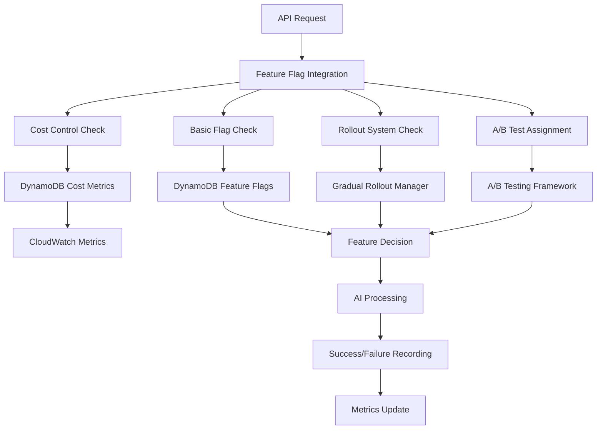

# Bedrock AI Feature Flag System

## Overview

The Bedrock AI Feature Flag System provides comprehensive control over AI features with advanced capabilities including gradual rollouts, A/B testing, cost control, and emergency shutdown procedures. This system ensures safe, controlled deployment of AI features while maintaining cost efficiency and system reliability.

## Architecture



## Core Components

### 1. Feature Flag Manager (`feature-flag-manager.ts`)

Central management system for feature flags with database integration and caching.

**Key Features:**
- Database-backed feature flags with caching
- A/B test configuration integration
- Emergency shutdown capabilities
- Rollout percentage management

**Usage:**
```typescript
import { featureFlagManager, BedrockFeatureFlags } from './feature-flag-manager';

// Check if feature is enabled
const result = await featureFlagManager.isFeatureEnabled('vc_bedrock_live', userContext);

// Convenience function for Bedrock
const bedrockEnabled = await BedrockFeatureFlags.isBedrockEnabled(userContext);
```

### 2. Cost Control System (`cost-control-feature-flags.ts`)

Monitors and controls AI costs with automatic feature disabling based on thresholds.

**Key Features:**
- Real-time cost tracking
- Configurable cost thresholds
- Automatic feature throttling/disabling
- CloudWatch metrics integration

**Usage:**
```typescript
import { costControlManager } from './cost-control-feature-flags';

// Check if request should be allowed
const costCheck = await costControlManager.shouldAllowRequest(
  'vc_analysis',
  0.05,
  userContext
);

// Record actual cost
await costControlManager.recordRequestCost(
  'vc_analysis',
  1500, // tokens
  0.08, // cost in USD
  userContext
);
```

### 3. A/B Testing Framework (`ab-testing-framework.ts`)

Comprehensive A/B testing system for different AI approaches and configurations.

**Key Features:**
- Experiment creation and management
- User variant assignment with consistent hashing
- Event tracking and statistical analysis
- Automatic experiment conclusion

**Usage:**
```typescript
import { abTestingFramework, BedrockABTests } from './ab-testing-framework';

// Create model comparison test
const experimentId = await BedrockABTests.createModelComparisonTest(
  'Claude vs Gemini',
  'Compare response quality between AI models',
  ['claude-3.5-sonnet', 'gemini-pro'],
  { claude: 50, gemini: 50 }
);

// Get user's variant
const assignment = await abTestingFramework.getUserVariant(experimentId, userContext);

// Record metrics
await BedrockABTests.recordResponseQuality(
  experimentId,
  userContext,
  qualityScore,
  responseTime,
  cost
);
```

### 4. Gradual Rollout System (`gradual-rollout-system.ts`)

Sophisticated rollout management with multiple strategies and health monitoring.

**Key Features:**
- Percentage-based rollouts with automatic increments
- Geographic and demographic targeting
- Canary deployments with promotion criteria
- Health check integration with automatic rollback

**Usage:**
```typescript
import { gradualRolloutSystem } from './gradual-rollout-system';

// Create rollout strategy
await gradualRolloutSystem.createRolloutStrategy({
  strategy_name: 'bedrock_gradual_rollout',
  feature_flag: 'vc_bedrock_live',
  rollout_type: 'percentage',
  configuration: {
    percentage: 10,
    increment_percentage: 10,
    increment_interval_hours: 24
  },
  health_checks: [
    {
      check_name: 'error_rate_check',
      check_type: 'error_rate',
      threshold: 5,
      comparison: 'less_than',
      window_minutes: 60,
      enabled: true
    }
  ],
  rollback_conditions: [],
  created_by: 'system'
});

// Check if user should receive feature
const rolloutResult = await gradualRolloutSystem.shouldUserReceiveFeature(
  'vc_bedrock_live',
  userContext
);
```

### 5. Feature Flag Integration (`feature-flag-integration.ts`)

Unified interface that orchestrates all feature flag systems.

**Key Features:**
- Single decision point for all feature checks
- Comprehensive logging and metrics
- Error handling with fail-open strategy
- Emergency shutdown coordination

**Usage:**
```typescript
import { BedrockFeatureIntegration } from './feature-flag-integration';

// Main decision function
const decision = await BedrockFeatureIntegration.shouldEnableBedrock(requestContext);

if (decision.enabled) {
  // Process with AI
  const response = await processWithAI(request, decision.variant);
  
  // Record success
  await BedrockFeatureIntegration.recordAISuccess(
    requestContext,
    responseTime,
    actualCost,
    qualityScore
  );
} else {
  // Handle disabled feature
  console.log(`Feature disabled: ${decision.reason}`);
}
```

## Database Schema

### Feature Flags Table (`bedrock-feature-flags`)
```json
{
  "flag_name": "vc_bedrock_live",
  "enabled": true,
  "value": "true",
  "description": "Enable Bedrock AI analysis",
  "rollout_percentage": 50,
  "ab_test_config": {
    "test_name": "claude_vs_gemini",
    "variants": [...],
    "traffic_split": {"claude": 50, "gemini": 50},
    "active": true
  },
  "cost_threshold": 100,
  "emergency_shutdown": false,
  "updated_by": "admin",
  "updated_at": "2025-01-09T10:00:00Z"
}
```

### Cost Metrics Table (`bedrock-cost-metrics`)
```json
{
  "date": "2025-01-09",
  "request_type": "vc_analysis",
  "daily_cost": 45.67,
  "total_requests": 1250,
  "total_tokens": 125000,
  "last_updated": "2025-01-09T10:00:00Z"
}
```

### A/B Test Experiments Table (`bedrock-ab-experiments`)
```json
{
  "experiment_id": "exp_1704801600_abc123",
  "name": "Claude vs Gemini Comparison",
  "feature_flag": "ai_model_selection",
  "variants": [
    {
      "name": "claude",
      "description": "Claude 3.5 Sonnet",
      "config": {"model": "claude-3.5-sonnet"},
      "weight": 50
    }
  ],
  "traffic_allocation": {"claude": 50, "gemini": 50},
  "success_metrics": [
    {
      "metric_name": "response_quality",
      "metric_type": "numeric",
      "primary": true,
      "target_improvement": 10
    }
  ],
  "status": "active",
  "confidence_level": 0.95
}
```

## API Endpoints

### Health Check
```http
GET /health
```
Returns comprehensive health status including feature flag systems.

### Feature Flag Status
```http
GET /feature-flags/status?flag=vc_bedrock_live
```
Returns detailed status of a specific feature flag.

### Emergency Shutdown
```http
POST /emergency-shutdown
Content-Type: application/json

{
  "reason": "Critical system error detected",
  "shutdown_by": "admin"
}
```

## Configuration

### Environment Variables
```bash
# DynamoDB Tables
FEATURE_FLAGS_TABLE=bedrock-feature-flags
COST_METRICS_TABLE=bedrock-cost-metrics
COST_THRESHOLDS_TABLE=bedrock-cost-thresholds
COST_ALERTS_TABLE=bedrock-cost-alerts
AB_EXPERIMENTS_TABLE=bedrock-ab-experiments
AB_ASSIGNMENTS_TABLE=bedrock-ab-assignments
AB_EVENTS_TABLE=bedrock-ab-events
AB_RESULTS_TABLE=bedrock-ab-results

# AWS Region
AWS_REGION=eu-central-1
```

### Feature Flag Examples

#### Basic Feature Flag
```json
{
  "flag_name": "vc_bedrock_live",
  "enabled": true,
  "value": "true",
  "description": "Enable Bedrock AI analysis",
  "rollout_percentage": 100
}
```

#### A/B Test Configuration
```json
{
  "flag_name": "ai_model_selection",
  "enabled": true,
  "ab_test_config": {
    "test_name": "claude_vs_gemini",
    "variants": [
      {"name": "claude", "config": {"model": "claude-3.5-sonnet"}},
      {"name": "gemini", "config": {"model": "gemini-pro"}}
    ],
    "traffic_split": {"claude": 50, "gemini": 50},
    "active": true
  }
}
```

#### Cost Control Configuration
```json
{
  "flag_name": "vc_bedrock_live",
  "enabled": true,
  "cost_threshold": 100,
  "emergency_shutdown": false
}
```

## Deployment

### 1. Deploy Infrastructure
```bash
./deploy-feature-flags.sh
```

This script:
- Creates all required DynamoDB tables
- Seeds initial feature flags
- Updates Lambda permissions
- Creates CloudWatch alarms

### 2. Verify Deployment
```bash
# Test health endpoint
curl https://your-api-gateway-url/health

# Check feature flag status
curl https://your-api-gateway-url/feature-flags/status?flag=vc_bedrock_live
```

## Monitoring and Alerting

### CloudWatch Metrics
- `BedrockAI/Costs/RequestCost` - Cost per request
- `BedrockAI/Costs/TokenUsage` - Token usage per request
- `BedrockAI/Operations/ErrorRate` - Error rate percentage
- `BedrockAI/Operations/ResponseTime` - Response time in milliseconds

### CloudWatch Alarms
- `BedrockAI-DailyCostHigh` - Daily cost exceeds $50
- `BedrockAI-HighErrorRate` - Error rate above 10%

### Cost Control Thresholds
- **Daily Throttle**: $100 - Reduces rollout percentage by 50%
- **Daily Emergency**: $500 - Complete shutdown of all AI features

## Best Practices

### 1. Feature Flag Naming
- Use descriptive names: `vc_bedrock_live`, `ai_model_selection`
- Include component prefix: `vc_`, `dashboard_`, `auth_`
- Use snake_case for consistency

### 2. Rollout Strategy
- Start with 5-10% rollout for new features
- Increment by 10-25% every 24-48 hours
- Monitor error rates and costs closely
- Have rollback procedures ready

### 3. A/B Testing
- Define clear success metrics before starting
- Ensure statistical significance (95% confidence)
- Run tests for sufficient duration (minimum 1 week)
- Document hypotheses and results

### 4. Cost Management
- Set conservative thresholds initially
- Monitor daily and monthly trends
- Implement alerts at 80% of limits
- Review and adjust thresholds regularly

### 5. Emergency Procedures
- Document emergency shutdown procedures
- Test emergency shutdown in staging
- Have communication plan for outages
- Monitor system health continuously

## Troubleshooting

### Common Issues

#### Feature Flag Not Working
1. Check DynamoDB table exists and has correct permissions
2. Verify Lambda environment variables are set
3. Check CloudWatch logs for errors
4. Validate feature flag configuration

#### Cost Control Not Triggering
1. Verify cost metrics are being recorded
2. Check CloudWatch metrics namespace
3. Validate threshold configurations
4. Review DynamoDB cost tables

#### A/B Test Assignment Issues
1. Check user ID consistency
2. Verify traffic split percentages sum to 100
3. Review experiment status (active/inactive)
4. Check assignment table for user records

### Debug Commands
```bash
# Check DynamoDB tables
aws dynamodb list-tables --region eu-central-1

# View feature flag
aws dynamodb get-item \
  --table-name bedrock-feature-flags \
  --key '{"flag_name":{"S":"vc_bedrock_live"}}'

# Check Lambda logs
aws logs tail /aws/lambda/bedrock-ai-agent --follow

# View CloudWatch metrics
aws cloudwatch get-metric-statistics \
  --namespace "BedrockAI/Costs" \
  --metric-name "RequestCost" \
  --start-time 2025-01-08T00:00:00Z \
  --end-time 2025-01-09T00:00:00Z \
  --period 3600 \
  --statistics Sum
```

## Security Considerations

### Access Control
- Feature flag tables use IAM for access control
- Lambda function has minimal required permissions
- Emergency shutdown requires admin authentication
- Audit logs track all flag changes

### Data Privacy
- User context data is not stored permanently
- A/B test assignments use hashed user IDs
- Cost metrics are aggregated, not per-user
- PII is automatically redacted from logs

### Operational Security
- Emergency shutdown can be triggered manually
- Automatic rollback on health check failures
- Cost limits prevent runaway expenses
- All operations are logged and monitored

## Performance Considerations

### Caching Strategy
- Feature flags cached for 5 minutes
- Cache invalidation on flag updates
- Local cache per Lambda instance
- Fallback to database on cache miss

### Database Optimization
- DynamoDB on-demand billing for cost efficiency
- Global secondary indexes for query optimization
- TTL for automatic cleanup of old records
- Batch operations for bulk updates

### Response Time Targets
- Feature flag decision: < 50ms
- Cost control check: < 100ms
- A/B test assignment: < 25ms
- Overall decision: < 200ms

## Future Enhancements

### Planned Features
- Web UI for feature flag management
- Advanced statistical analysis for A/B tests
- Machine learning-based rollout optimization
- Integration with external monitoring systems
- Multi-region feature flag synchronization

### Roadmap
- **Q1 2025**: Web dashboard and advanced analytics
- **Q2 2025**: ML-powered rollout optimization
- **Q3 2025**: Multi-region deployment support
- **Q4 2025**: Advanced experimentation platform

## Support and Documentation

### Additional Resources
- [AWS DynamoDB Documentation](https://docs.aws.amazon.com/dynamodb/)
- [AWS CloudWatch Documentation](https://docs.aws.amazon.com/cloudwatch/)
- [Feature Flag Best Practices](https://martinfowler.com/articles/feature-toggles.html)
- [A/B Testing Guide](https://www.optimizely.com/optimization-glossary/ab-testing/)

### Getting Help
- Check CloudWatch logs for error details
- Review this documentation for configuration
- Test in staging environment first
- Contact the development team for support

---

**Last Updated**: January 9, 2025  
**Version**: 1.0.0  
**Maintainer**: Bedrock AI Team