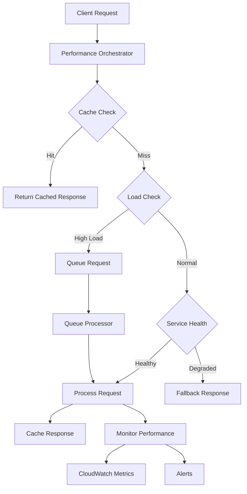

# Bedrock AI Performance & Reliability System

## Overview

The Performance & Reliability System provides comprehensive monitoring, queuing, caching, and graceful degradation capabilities for the Bedrock AI Core. This system ensures high availability, optimal performance, and cost-effective operation of AI services.

## Architecture



## Components

### 1. Performance Monitoring (`performance-monitoring.ts`)

**Purpose**: Real-time monitoring of AI request performance with alerting

**Key Features**:
- Response time tracking (30-second target)
- Success/failure rate monitoring
- Token usage tracking
- CloudWatch metrics integration
- SNS alerting for threshold breaches

**Metrics Tracked**:
- `ResponseTime`: Request processing duration
- `RequestCount`: Total requests (success/failure)
- `TokenUsage`: AI model token consumption
- `CacheHitRate`: Cache effectiveness
- `ErrorCount`: Failures by error type

**Alert Thresholds**:
- Response Time Warning: 25 seconds
- Response Time Critical: 30 seconds
- Error Rate Warning: 5%
- Error Rate Critical: 10%
- Queue Depth Warning: 50 requests
- Queue Depth Critical: 100 requests

### 2. Request Queue System (`request-queue-system.ts`)

**Purpose**: Intelligent request queuing for high-load scenarios

**Key Features**:
- Priority-based queuing (low, normal, high, critical)
- Automatic retry with exponential backoff
- Request timeout handling
- Queue size limits (500 requests max)
- Concurrent processing limits (10 requests max)

**Queue Priorities**:
- **Critical**: System maintenance, emergency requests
- **High**: Premium users, retry requests
- **Normal**: Standard user requests
- **Low**: Background processing, analytics

**DynamoDB Schema**:
```json
{
  "requestId": "string (PK)",
  "operation": "string",
  "priority": "string",
  "payload": "object",
  "userId": "string",
  "timestamp": "number",
  "retryCount": "number",
  "maxRetries": "number",
  "timeoutMs": "number",
  "status": "queued|processing|completed|failed|timeout",
  "priorityScore": "number (GSI)",
  "ttl": "number"
}
```

### 3. Response Cache System (`response-cache-system.ts`)

**Purpose**: Intelligent caching with 24-hour TTL to reduce costs and improve performance

**Key Features**:
- Payload normalization for consistent cache keys
- Persona-specific caching
- Automatic TTL management
- Cache invalidation by operation
- Compression for large responses
- Cache warmup for common requests

**Cacheable Operations**:
- `vc-analysis`: Visibility check analysis
- `content-generation`: AI-generated content
- `business-framework`: Business analysis frameworks
- `persona-detection`: User persona identification

**Cache Key Generation**:
```typescript
cacheKey = `${operation}:${sha256(normalizedPayload + userId + personaType)}`
```

**DynamoDB Schema**:
```json
{
  "cacheKey": "string (PK)",
  "operation": "string (GSI)",
  "requestHash": "string",
  "response": "object",
  "metadata": {
    "tokenCount": "number",
    "processingTime": "number",
    "timestamp": "number",
    "userId": "string",
    "personaType": "string"
  },
  "ttl": "number",
  "hitCount": "number",
  "lastAccessed": "number"
}
```

### 4. Graceful Degradation (`graceful-degradation.ts`)

**Purpose**: Maintain service availability during AI service failures

**Key Features**:
- Circuit breaker pattern (5 consecutive failures)
- Multiple fallback strategies
- Persona-specific fallback customization
- Service health monitoring
- Automatic recovery detection

**Fallback Strategies** (in order):
1. **Cached Response**: Return similar cached result
2. **Template Response**: Use predefined templates
3. **Simplified Response**: Basic functionality only
4. **Error Response**: Graceful error with support info

**Degradation Levels**:
- **None**: Full service availability
- **Partial**: Some features degraded, fallbacks active
- **Full**: Circuit breaker open, template responses only

### 5. Performance Orchestrator (`performance-reliability-orchestrator.ts`)

**Purpose**: Unified interface coordinating all performance systems

**Key Features**:
- Request lifecycle management
- System health monitoring
- Configuration management
- Graceful shutdown handling

## Configuration

### Environment Variables

```bash
# Core Settings
ENABLE_PERFORMANCE_MONITORING=true
ENABLE_REQUEST_QUEUING=true
ENABLE_RESPONSE_CACHING=true
ENABLE_GRACEFUL_DEGRADATION=true

# Performance Thresholds
MAX_RESPONSE_TIME_MS=30000
QUEUE_THRESHOLD=50
CACHE_DEFAULT_TTL_HOURS=24

# Queue Configuration
MAX_QUEUE_SIZE=500
MAX_CONCURRENT_REQUESTS=10
DEFAULT_TIMEOUT_MS=45000
MAX_RETRIES=3

# Degradation Settings
MAX_FAILURE_RATE=0.1
FAILURE_WINDOW_MS=300000
CIRCUIT_BREAKER_THRESHOLD=5

# Cache Settings
ENABLE_CACHE_COMPRESSION=true
MAX_CACHE_SIZE=10000

# AWS Resources
BEDROCK_QUEUE_TABLE=matbakh-bedrock-ai-request-queue-production
BEDROCK_CACHE_TABLE=matbakh-bedrock-ai-response-cache-production
BEDROCK_ALERT_TOPIC_ARN=arn:aws:sns:eu-central-1:...:matbakh-bedrock-ai-performance-alerts-production
```

## Usage Examples

### Basic Request Processing

```typescript
import { performanceReliabilityOrchestrator } from './performance-reliability-orchestrator';

// Initialize system
await performanceReliabilityOrchestrator.initialize();

// Process request with full reliability features
const result = await performanceReliabilityOrchestrator.processRequest(
  'req-123',
  'vc-analysis',
  { businessName: 'Test Restaurant', location: 'Munich' },
  async (payload) => {
    // Your AI processing logic here
    return await processWithBedrock(payload);
  },
  {
    userId: 'user-456',
    personaType: 'Der Profi',
    priority: 'high',
    timeoutMs: 25000
  }
);

console.log('Success:', result.success);
console.log('From Cache:', result.metadata.fromCache);
console.log('Processing Time:', result.metadata.processingTime);
```

### Manual Cache Management

```typescript
import { responseCache } from './response-cache-system';

// Cache a response
await responseCache.cacheResponse(
  'vc-analysis',
  { businessName: 'Restaurant' },
  { score: 85, recommendations: ['Update photos'] },
  { processingTime: 5000, tokenCount: 150 },
  24 // TTL in hours
);

// Get cached response
const cached = await responseCache.getCachedResponse(
  'vc-analysis',
  { businessName: 'Restaurant' }
);

// Invalidate cache
await responseCache.invalidateCache('vc-analysis', 'user-123');
```

### Queue Management

```typescript
import { requestQueue } from './request-queue-system';

// Start queue processing
requestQueue.startProcessing(async (request) => {
  return await processRequest(request.payload);
});

// Enqueue high-priority request
await requestQueue.enqueueRequest(
  'urgent-req-1',
  'content-generation',
  { type: 'emergency-post' },
  'critical',
  'user-123'
);

// Get queue statistics
const stats = await requestQueue.getQueueStats();
console.log('Queued requests:', stats.queued);
console.log('Processing:', stats.processing);
```

### Health Monitoring

```typescript
import { performanceReliabilityOrchestrator } from './performance-reliability-orchestrator';

// Get system health
const health = performanceReliabilityOrchestrator.getSystemHealth();
console.log('Overall health:', health.overall); // 'healthy' | 'degraded' | 'unhealthy'
console.log('Performance:', health.performance);
console.log('Queue stats:', health.queue);
console.log('Cache stats:', health.cache);
console.log('Degradation:', health.degradation);
```

## Deployment

### 1. Deploy Infrastructure

```bash
# Deploy DynamoDB tables, CloudWatch alarms, SNS topics
./deploy-performance-reliability.sh

# Source environment variables
source performance-reliability.env
```

### 2. Update Lambda Function

```typescript
// In your Lambda handler
import { performanceReliabilityOrchestrator } from './performance-reliability-orchestrator';

export const handler = async (event, context) => {
  // Initialize on cold start
  await performanceReliabilityOrchestrator.initialize();
  
  // Process request with reliability features
  const result = await performanceReliabilityOrchestrator.processRequest(
    context.awsRequestId,
    event.operation,
    event.payload,
    processWithAI
  );
  
  return {
    statusCode: result.success ? 200 : 500,
    body: JSON.stringify(result)
  };
};
```

### 3. Configure Alerts

```bash
# Subscribe to SNS alerts
aws sns subscribe \
  --topic-arn $BEDROCK_ALERT_TOPIC_ARN \
  --protocol email \
  --notification-endpoint your-email@example.com
```

## Monitoring & Observability

### CloudWatch Dashboard

The deployment creates a comprehensive dashboard with:
- Response time trends by operation
- Success/failure rates
- Cache hit rates
- Token usage patterns
- DynamoDB capacity utilization

### Key Metrics to Monitor

1. **Response Time**: Should stay below 30 seconds
2. **Error Rate**: Should stay below 5%
3. **Cache Hit Rate**: Should be above 30%
4. **Queue Depth**: Should stay below 50
5. **Token Usage**: Monitor for cost control

### Alerts Configuration

- **Critical Response Time**: > 30 seconds
- **High Error Rate**: > 10% failures
- **High Queue Depth**: > 100 requests
- **Low Cache Hit Rate**: < 30%

## Cost Optimization

### DynamoDB Costs
- **Queue Table**: ~$5-10/month (with auto-scaling)
- **Cache Table**: ~$10-20/month (higher read capacity)
- **Metrics Table**: ~$5/month (with TTL cleanup)

### CloudWatch Costs
- **Custom Metrics**: ~$0.30 per metric per month
- **Alarms**: ~$0.10 per alarm per month
- **Dashboard**: Free (up to 3 dashboards)

### Cost Reduction Strategies
1. Enable DynamoDB auto-scaling
2. Use appropriate TTL values
3. Implement cache compression
4. Monitor and adjust queue sizes
5. Use reserved capacity for predictable workloads

## Troubleshooting

### High Response Times
1. Check CloudWatch metrics for bottlenecks
2. Verify Bedrock service health
3. Increase concurrent request limits
4. Enable request queuing

### Low Cache Hit Rates
1. Review cache key generation logic
2. Check TTL settings
3. Verify payload normalization
4. Monitor cache invalidation patterns

### Queue Backlog
1. Increase concurrent processing limits
2. Check for stuck requests
3. Review retry logic
4. Scale processing capacity

### Circuit Breaker Activation
1. Check error logs for root cause
2. Verify external service health
3. Review failure thresholds
4. Manual circuit breaker reset if needed

## Testing

### Unit Tests
```bash
cd infra/lambdas/bedrock-agent
npm test -- --testPathPattern=performance-reliability
```

### Integration Tests
```bash
# Test with real AWS resources
npm run test:integration
```

### Load Testing
```bash
# Simulate high load scenarios
npm run test:load
```

## Security Considerations

### IAM Permissions
- Minimal required permissions for DynamoDB operations
- CloudWatch metrics publishing
- SNS alert publishing
- No cross-account access

### Data Protection
- All cached data encrypted at rest
- PII detection and redaction
- Automatic TTL for data cleanup
- Audit logging for compliance

### Network Security
- VPC endpoints for DynamoDB access
- Encrypted SNS topics
- CloudWatch logs encryption

## Future Enhancements

### Planned Features
1. **Multi-Region Support**: Cross-region failover
2. **Advanced Analytics**: ML-based performance prediction
3. **Auto-Scaling**: Dynamic capacity adjustment
4. **Custom Metrics**: Business-specific KPIs
5. **Integration APIs**: Third-party monitoring tools

### Roadmap
- **Q1 2025**: Multi-region deployment
- **Q2 2025**: Advanced analytics dashboard
- **Q3 2025**: Auto-scaling implementation
- **Q4 2025**: Custom metrics framework

## Support

### Documentation
- [AWS DynamoDB Best Practices](https://docs.aws.amazon.com/amazondynamodb/latest/developerguide/best-practices.html)
- [CloudWatch Custom Metrics](https://docs.aws.amazon.com/AmazonCloudWatch/latest/monitoring/publishingMetrics.html)
- [SNS Best Practices](https://docs.aws.amazon.com/sns/latest/dg/sns-best-practices.html)

### Contact
- **Technical Issues**: Create GitHub issue
- **Performance Questions**: performance@matbakh.app
- **Emergency Support**: alerts@matbakh.app

---

**Last Updated**: January 2025  
**Version**: 1.0.0  
**Status**: Production Ready